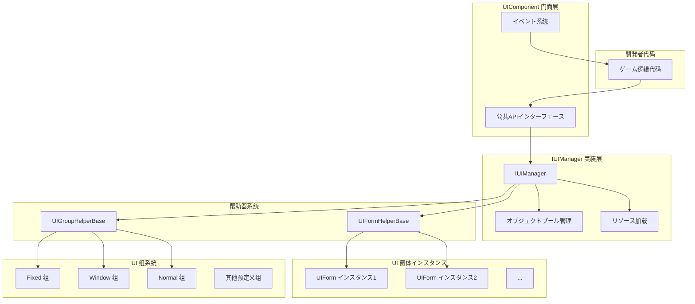
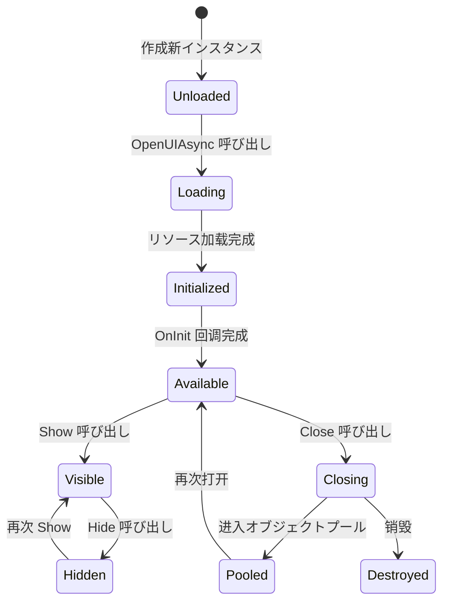
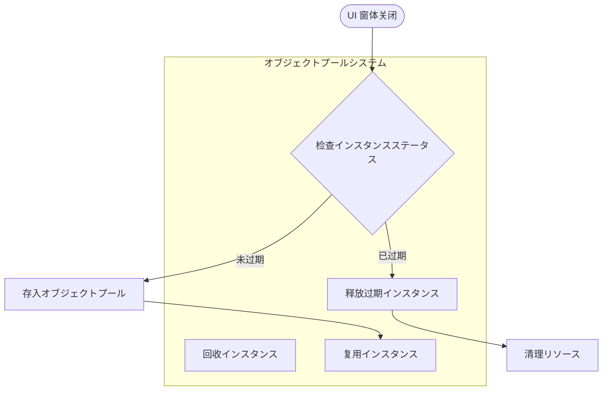
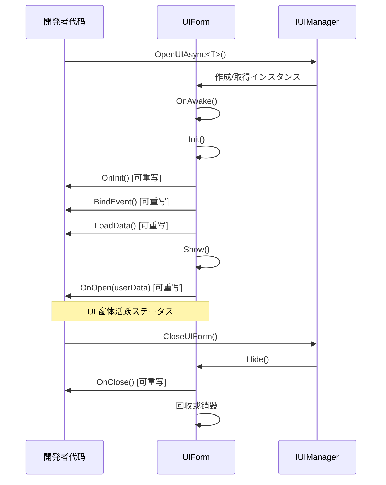

# UI コンポーネント

UI コンポーネント（UIComponent）是 GameFrameX フレームワーク中负责管理和操作 UI 窗体的コアコンポーネント。它作为 UI 系统的门面（Facade），封装了底层 `IUIManager` 的复杂実装，为開発者提供简洁易用的 API インターフェース。

## 概要

UIComponent は Unity コンポーネント（を継承 GameFrameworkComponent），在整个ゲーム生命周期中负责 UI 窗体的加载、显示、隐藏、关闭以及回收等全部管理工作。它采用オブジェクトプール模式来管理 UI 窗体インスタンス，有效减少频繁作成销毁带来的性能开销。

UIComponent サポート多种 UI 渲染方案，包括 Unity 原生的 UGUI 以及第三方 UI フレームワーク FairyGUI。を通じて预定义的 18 个 UI 组（UIGroup），可能実装精确的层级控制和遮挡关系管理。

**コア機能：**
- 异步加载和打开 UI 窗体
- 多种方法关闭 UI 窗体（直接关闭、延迟关闭、组关闭）
- UI 窗体オブジェクトプール管理
- UI 组层级控制
- 显示/隐藏动画サポート
- 完整的イベント系统

> UIComponent 是 UI 系统的コアエントリーポイント，详细的 API メソッド説明お願いします参阅 [UIComponent API 参考](./5-api-reference.ui-component)。

## 架构

UIComponent 采用门面模式（Facade Pattern）设计，将复杂的 UI 管理逻辑封装在内部，仅暴露简洁的 API 供開発者使用。



**架构説明：**

1. **门面层（UIComponent）**：提供统一的公共 API，包括打开、关闭、取得 UI 窗体，管理 UI 组等メソッド。同时负责イベント的分发。

2. **実装层（IUIManager）**：处理具体的业务逻辑，包括 UI 窗体的加载、缓存、显示/隐藏ステータス管理等。

3. **オブジェクトプール管理**：使用 IObjectPoolManager 管理 UI 窗体インスタンス的复用，サポート自动回收和过期释放。

4. **帮助器层**：包括 UIFormHelperBase（负责 UI 窗体インスタンス的作成和销毁）和 UIGroupHelperBase（负责 UI 组的作成和管理）。

5. **UI 窗体层**：实际的 UI 窗体インスタンス，を継承 UIForm 基クラス。

6. **UI 组层**：に使用组织和管理具有相同层级プロパティ的 UI 窗体。

## コアコンセプト

### UI 窗体（UIForm）

UI 窗体是 UI 系统管理的最小单位。每个 UI 窗体都を継承 `UIForm` 基クラス，実装了 `IUIForm` インターフェース。UI 窗体具有以下ステータス：

- **Available（可用）**：窗体已完成初期化，可能被显示
- **Visible（可见）**：窗体当前正在显示
- **FromPool（来自池）**：窗体インスタンス是否从オブジェクトプール取得



### UI 组系统

UI 组（UIGroup）に使用组织具有相似显示层级特性的 UI 窗体。每个 UI 组都有一个深度值（Depth），深度值越大，层级越高（越靠前显示）。

**预定义的 18 个 UI 组：**

| UI 组名称 | 深度值 | 用途説明 |
|----------|--------|----------|
| Hidden | 40 | 隐藏层，に使用临时存放 |
| Background | 35 | 背景层 |
| Scene | 30 | シーン层 |
| World | 27 | 世界层（如 3D シーン中的 UI） |
| Battle | 25 | 战斗层 |
| Hud | 22 | 头顶信息层 |
| Map | 20 | 地图层 |
| Floor | 15 | 底层 |
| Normal | 10 | 常规层 |
| Fixed | 0 | 固定层 |
| Window | -10 | 窗口层 |
| Tip | -15 | ヒント层 |
| Guide | -20 | 引导层 |
| BlackBoard | -22 | 黑板层 |
| Dialogue | -23 | 对话层 |
| Loading | -25 | 加载层 |
| Notify | -30 | 通知层 |
| System | -35 | 系统层（最高优先级） |

> 更多关于 UI 组的详细信息，お願いします参阅 [UI 组层级](./7-ui-group-hierarchy) 文档。

### オブジェクトプール管理

UIComponent 内置了强大的オブジェクトプール管理系统，主要包含以下参数：

- **InstanceCapacity**：オブジェクトプール容量，默认 16
- **InstanceExpireTime**：对象过期时间（秒），默认 60 秒
- **InstanceAutoReleaseInterval**：自动释放间隔（秒），默认 60 秒
- **RecycleInterval**：回收间隔（秒），默认 60 秒
- **EnableAutoReleaseUIForm**：是否启用自动释放，默认开启



## 打开 UI 窗体

### 基本用法

使用 `OpenAsync<T>()` メソッド可能异步打开一个 UI 窗体：

```csharp
// 打开全屏 UI
var mainMenuForm = await UIComponent.Instance.OpenFullScreenAsync<MainMenuForm>();

// 打开非全屏 UI
var settingsForm = await UIComponent.Instance.OpenAsync<SettingsForm>(false);

// 带用户数据打开
var dialogData = new DialogData { Title = "确认", Message = "是否确认？" };
var confirmForm = await UIComponent.Instance.OpenAsync<ConfirmForm>(false, dialogData);
```

> 更多打开 UI 的 API メソッド，お願いします参阅 [UIComponent API 参考 - Open メソッド](./5-api-reference.ui-component#open-メソッド)。

### 使用 UI 组プロパティ

可能を通じて `[OptionUIGroup]` 特性为 UI 窗体指定所属的 UI 组：

```csharp
[OptionUIGroup(UIGroupNameConstants.Window)]
public class MyWindowForm : UIForm
{
    // 窗口内容
}
```

## 关闭 UI 窗体

### 关闭单个 UI

```csharp
// を通じてインスタンス关闭
var form = UIComponent.Instance.GetLoaded<SettingsForm>();
UIComponent.Instance.CloseUIForm(form);

// を通じてクラス型关闭（关闭第一个匹配的）
UIComponent.Instance.CloseUIForm<SettingsForm>();

// を通じて序列编号关闭
UIComponent.Instance.CloseUIForm(serialId);
```

### 关闭多个 UI

```csharp
// 关闭所有已加载的 UI
UIComponent.Instance.CloseAllLoadedUIForms();

// 关闭指定 UI 组的所有 UI
UIComponent.Instance.CloseUIGroup(UIGroupNameConstants.Window);

// 关闭所有正在加载的 UI
UIComponent.Instance.CloseAllLoadingUIForms();
```

## 取得 UI 窗体

### 查询已加载的 UI

```csharp
// 取得单个 UI（按クラス型）
var form = UIComponent.Instance.GetLoaded<MainMenuForm>();

// 取得所有符合クラス型的 UI
var forms = UIComponent.Instance.GetLoadedList<DialogForm>();

// 取得已加载且正在显示的 UI
var visibleForm = UIComponent.Instance.GetLoadedAndShowing<AlertForm>();

// 判断指定 UI 是否正在显示
bool isShowing = UIComponent.Instance.HasLoadedAndShowing("AlertForm");
```

### 取得所有 UI

```csharp
// 取得所有已加载的 UI
var allForms = UIComponent.Instance.GetAllLoadedUIForms();

// 取得所有正在加载的 UI 的序列编号
var loadingIds = UIComponent.Instance.GetAllLoadingUIFormSerialIds();
```

## 管理 UI 组

### 添加自定义 UI 组

```csharp
// 添加新的 UI 组
bool success = UIComponent.Instance.AddUIGroup("CustomGroup", 5);
```

### 查询 UI 组

```csharp
// 检查 UI 组是否存在
bool exists = UIComponent.Instance.HasUIGroup("Window");

// 取得 UI 组
var group = UIComponent.Instance.GetUIGroup("Window");

// 取得所有 UI 组
var allGroups = UIComponent.Instance.GetAllUIGroups();

// 取得 UI 组数量
int count = UIComponent.Instance.UIGroupCount;
```

## 設定选项

UIComponent 提供します丰富的配置选项，可能を通じて Inspector 面板或代码进行設定：

| 配置项 | クラス型 | 默认值 | 説明 |
|--------|------|--------|------|
| EnableAutoReleaseUIForm | bool | true | 是否启用自动释放 UI |
| EnableCloseUIFormCompleteEvent | bool | true | 是否在关闭 UI 时触发完成イベント |
| IsEnableUIShowAnimation | bool | false | 是否启用 UI 显示动画 |
| IsEnableUIHideAnimation | bool | false | 是否启用 UI 隐藏动画 |
| InstanceAutoReleaseInterval | float | 60f | UI インスタンス自动释放间隔（秒） |
| InstanceCapacity | int | 16 | UI インスタンスオブジェクトプール容量 |
| InstanceExpireTime | float | 60f | UI インスタンス过期时间（秒） |
| RecycleInterval | int | 60 | UI 回收间隔（秒） |
| UGUIRoot | Transform | null | UGUI 根节点 |
| FairyGUIRoot | Transform | null | FairyGUI 根节点 |

### 代码配置示例

```csharp
// 禁用自动释放
UIComponent.Instance.EnableAutoReleaseUIForm = false;

// 設定オブジェクトプール容量
UIComponent.Instance.InstanceCapacity = 32;

// 設定インスタンス过期时间
UIComponent.Instance.InstanceExpireTime = 120f;

// 設定回收间隔
UIComponent.Instance.RecycleInterval = 30;
```

## UI 窗体生命周期

UI 窗体具有完整的生命周期，開発者可能を通じて重写相应メソッド来响应ステータス变化：



### 可重写的メソッド

在自定义 UIForm 中，可能重写以下メソッド来处理生命周期イベント：

| メソッド | 呼び出し时机 | 用途 |
|------|----------|------|
| `OnAwake()` | インスタンス作成后、初期化前 | 执行 Awake 逻辑 |
| `OnInit()` | UI 窗体首次初期化时 | 初期化 UI コンポーネント |
| `BindEvent()` | 初期化时 | 绑定イベント监听 |
| `LoadData()` | 初期化时 | 加载数据 |
| `OnOpen(object userData)` | UI 窗体打开时 | 处理打开逻辑 |
| `OnClose(bool isShutdown, object userData)` | UI 窗体关闭时 | 处理关闭逻辑 |
| `OnPause()` | UI 被遮挡时 | 处理暂停逻辑 |
| `OnResume()` | UI 恢复显示时 | 处理恢复逻辑 |
| `OnUpdate(float elapseSeconds, float realElapseSeconds)` | 每帧更新 | 执行更新逻辑 |
| `UpdateLocalization()` | 语言变更时 | 更新本地化文本 |

## イベント系统

UIComponent 提供します完善的イベント系统，に使用监听 UI 窗体的ステータス变化：

### 可订阅的イベント

| イベント名称 | 説明 | イベント参数 |
|----------|------|----------|
| `OpenUIFormSuccess` | UI 窗体打开成功 | OpenUIFormSuccessEventArgs |
| `OpenUIFormFailure` | UI 窗体打开失败 | OpenUIFormFailureEventArgs |
| `CloseUIFormComplete` | UI 窗体关闭完成 | CloseUIFormCompleteEventArgs |

### イベント使用示例

```csharp
// 订阅打开成功イベント
UIComponent.Instance.OpenUIFormSuccess += OnOpenSuccess;

private void OnOpenSuccess(object sender, OpenUIFormSuccessEventArgs e)
{
    Debug.Log($"UI 打开成功: {e.UIFormAssetName}");
}

// 订阅关闭完成イベント
UIComponent.Instance.CloseUIFormComplete += OnCloseComplete;

private void OnCloseComplete(object sender, CloseUIFormCompleteEventArgs e)
{
    Debug.Log($"UI 关闭完成: {e.UIFormSerialId}");
}
```

> イベント系统的詳細説明お願いします参阅 [イベント系统](./6-event-system) 文档。

## 関連リンク

- [UIComponent API 参考](./5-api-reference.ui-component) - 完整的 API メソッド説明
- [UI 窗体](./4-core-concepts.ui-form) - UIForm 基クラス详解
- [UI 组系统](./4-core-concepts.ui-group) - UI 组管理详解
- [オブジェクトプール管理](./4-core-concepts.object-pool) - オブジェクトプール机制详解
- [UI 组层级](./7-ui-group-hierarchy) - UI 组层级詳細説明
- [UI プロパティ](./8-configuration.attributes) - UI 関連特性説明
