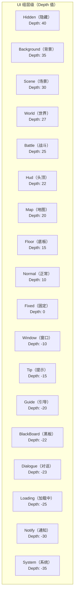

# UI プロパティ

このドキュメント介绍 GameFrameX UI 系统中用于設定 UI 窗体和コンポーネント的各种特性（Attribute）およびシリアライズプロパティ。

## 概要

GameFrameX UI 系统提供します丰富的プロパティ設定机制，允许開発者通过特性（Attribute）和シリアライズフィールド来設定 UI 窗体的行为。主な含みます以下几个方面的設定：

1. **UI 設定プロパティ** - 定義 UI リソース的位置和ロード方法
2. **UI 组プロパティ** - 将 UI 分配到不同的层级组
3. **动画プロパティ** - 設定 UI 的显示和隐藏动画
4. **UIComponent 全局プロパティ** - 控制 UI 系统的整体行为
5. **UIForm 窗体プロパティ** - 控制单个窗体的行为

## UI 設定特性 (Attributes)

### OptionUIConfigAttribute

用于标记 UI 設定的特性类，サポート FairyGUI 和 UGUI 两种 UI フレームワーク。通过指定パッケージ名或路径，実装 UI リソース的自动定位和ロード。

```csharp
[OptionUIConfigAttribute(packageName: "MainPackage", path: "UI/Prefabs/MainForm")]
public class MainForm : UIForm
{
    // ...
}
```

> Source: [OptionUIConfigAttribute.cs](https://github.com/GameFrameX/com.gameframex.unity.ui/blob/main/Runtime/Attribute/OptionUIConfigAttribute.cs#L42-L108)

**プロパティ説明：**

| プロパティ | タイプ | 説明 |
|------|------|------|
| `PackageName` | string | FairyGUI 使用的パッケージ名，用于定位 FairyGUI 的 UI リソースパッケージ |
| `Path` | string | UGUI 使用的リソースパス，用于定位 UGUI 的 UI 预制体或リソース |
| `IsResource` | bool | 是否为リソースパス。若为 true，则 Path 为リソースパス；若为 false，则 Path 为 UI 预制体路径 |

**コンストラクタ：**

```csharp
// 方式1：指定包名和路径
public OptionUIConfigAttribute(string packageName = null, string path = null)

// 方式2：指定是否为资源路径
public OptionUIConfigAttribute(bool isResource = false)
```

---

### OptionUIGroupAttribute

用于为类指定 UI オプション分组的特性。只能应用于类，分组名称不能为空。

```csharp
[OptionUIGroupAttribute("Dialog")]
public class DialogForm : UIForm
{
    // ...
}
```

> Source: [OptionUIGroupAttribute.cs](https://github.com/GameFrameX/com.gameframex.unity.ui/blob/main/Runtime/Attribute/OptionUIGroupAttribute.cs#L42-L73)

**プロパティ説明：**

| プロパティ | タイプ | 説明 |
|------|------|------|
| `GroupName` | string | 分组名称，用于将 UI 分配到特定的 UI 组 |

---

### OptionUIShowAnimationAttribute

用于指定 UI 打开时再生的动画特性。〜できます应用于类，指定动画名称和是否启用动画。

```csharp
// 启用名为 "FadeIn" 的显示动画
[OptionUIShowAnimationAttribute("FadeIn")]
public class MainForm : UIForm
{
    // ...
}

// 禁用显示动画
[OptionUIShowAnimationAttribute(false)]
public class TipForm : UIForm
{
    // ...
}
```

> Source: [OptionUIShowAnimationAttribute.cs](https://github.com/GameFrameX/com.gameframex.unity.ui/blob/main/Runtime/Attribute/OptionUIShowAnimationAttribute.cs#L42-L94)

**プロパティ説明：**

| プロパティ | タイプ | 説明 |
|------|------|------|
| `AnimationName` | string | 动画名称，指定要再生的动画名称 |
| `Enable` | bool | 是否启用动画，デフォルト为 true |

**コンストラクタ：**

```csharp
public OptionUIShowAnimationAttribute(string animationName, bool enable = true)
public OptionUIShowAnimationAttribute(bool enable = true)
```

---

### OptionUIHideAnimationAttribute

用于指定 UI 閉じる时再生的动画特性。〜できます应用于类，指定动画名称和是否启用动画。

```csharp
// 启用名为 "FadeOut" 的隐藏动画
[OptionUIHideAnimationAttribute("FadeOut")]
public class MainForm : UIForm
{
    // ...
}

// 禁用隐藏动画
[OptionUIHideAnimationAttribute(false)]
public class TipForm : UIForm
{
    // ...
}
```

> Source: [OptionUIHideAnimationAttribute.cs](https://github.com/GameFrameX/com.gameframex.unity.ui/blob/main/Runtime/Attribute/OptionUIHideAnimationAttribute.cs#L42-L94)

**プロパティ説明：**

| プロパティ | タイプ | 説明 |
|------|------|------|
| `AnimationName` | string | 动画名称，指定要再生的动画名称 |
| `Enable` | bool | 是否启用动画，デフォルト为 true |

---

## UIComponent 全局プロパティ

UIComponent 是 UI 系统的コアコンポーネント，提供全局的 UI 設定オプション。这些プロパティ通过 Unity 的 SerializeField 特性在 Inspector パネル中可见可設定。

> Source: [UIComponent.cs](https://github.com/GameFrameX/com.gameframex.unity.ui/blob/main/Runtime/UIComponent.cs#L48-L226)

### イベント控制プロパティ

| プロパティ | タイプ | デフォルト值 | 説明 |
|------|------|--------|------|
| `EnableOpenUIFormSuccessEvent` | bool | true | 是否启用打开界面成功イベント。启用后，当界面打开成功时会トリガー相应イベント |
| `EnableOpenUIFormFailureEvent` | bool | true | 是否启用打开界面失敗イベント。启用后，当界面打开失敗时会トリガー相应イベント |
| `EnableCloseUIFormCompleteEvent` | bool | true | 是否启用閉じる界面完成イベント。启用后，当界面閉じる完成时会トリガー相应イベント |

### 对象池プロパティ

| プロパティ | タイプ | デフォルト值 | 説明 |
|------|------|--------|------|
| `EnableAutoReleaseUIForm` | bool | true | 是否启用自动回收界面。禁用后，閉じる界面时不会自动解放リソース |
| `InstanceAutoReleaseInterval` | float | 60f | 界面インスタンス对象池自动解放可解放对象的间隔秒数 |
| `InstanceCapacity` | int | 16 | 界面インスタンス对象池的容量，池中最多可缓存的界面インスタンス数量 |
| `InstanceExpireTime` | float | 60f | 界面インスタンス对象池对象过期秒数，界面閉じる后在此时间内可被复用 |
| `RecycleInterval` | int | 60 | 界面回收间隔时间（秒） |

### 动画プロパティ

| プロパティ | タイプ | デフォルト值 | 説明 |
|------|------|--------|------|
| `IsEnableUIShowAnimation` | bool | false | 是否启用 UI 显示动画 |
| `IsEnableUIHideAnimation` | bool | false | 是否启用 UI 隐藏动画 |

### 根节点プロパティ

| プロパティ | タイプ | 説明 |
|------|------|------|
| `UGUIRoot` | Transform | UGUI 根节点 |
| `FairyGUIRoot` | Transform | FairyGUI 根节点 |

### 辅助器プロパティ

| プロパティ | タイプ | 説明 |
|------|------|------|
| `UIFormHelperTypeName` | string | UI 表单帮助器タイプ名 |
| `CustomUIFormHelper` | UIFormHelperBase | 自定義 UI 表单帮助器 |
| `UIGroupHelperTypeName` | string | UI 组帮助器タイプ名 |
| `CustomUIGroupHelper` | UIGroupHelperBase | 自定義 UI 组帮助器 |

### UI 组設定

| プロパティ | タイプ | 説明 |
|------|------|------|
| `UIGroups` | UIGroup[] | UI 组数组，デフォルトパッケージ含 18 个预定義组 |

---

## UIForm 窗体プロパティ

UIForm 是所有 UI 窗体的基底クラス，パッケージ含窗体ランタイム的各种ステータスプロパティ。

> Source: [UIForm.cs](https://github.com/GameFrameX/com.gameframex.unity.ui/blob/main/Runtime/UIForm.cs#L47-L856)

### ステータスプロパティ（ランタイム）

| プロパティ | タイプ | 説明 |
|------|------|------|
| `Available` | bool | 界面是否可用 |
| `Visible` | bool | 界面是否可见 |
| `SerialId` | int | 界面序列编号 |
| `Name` | string | 界面名称 |
| `FullName` | string | 界面完全な名称（パッケージ含名前空間） |
| `UIFormAssetName` | string | 界面リソース名称 |
| `AssetPath` | string | 界面リソースパス |
| `IsAwake` | bool | 界面是否已唤醒 |
| `IsFromPool` | bool | 界面是否来自对象池 |
| `IsDisposed` | bool | 界面是否已被破棄 |

### 行为控制プロパティ

| プロパティ | タイプ | デフォルト值 | 説明 |
|------|------|--------|------|
| `IsDisableRecycling` | bool | false | 是否禁用回收，禁用回收的界面不会被回收 |
| `IsDisableClosing` | bool | false | 是否禁用閉じる，禁用閉じる的界面不会被閉じる |
| `IsCenter` | bool | false | 是否开启コンポーネント居中，コンポーネント生成后デフォルト父コンポーネント居中 |
| `PauseCoveredUIForm` | bool | true | 是否暂停被覆盖的界面 |
| `RecycleInterval` | int | - | 界面回收间隔，单位：秒 |

### 动画プロパティ

| プロパティ | タイプ | 説明 |
|------|------|------|
| `EnableShowAnimation` | bool | 是否启用显示动画 |
| `ShowAnimationName` | string | 显示动画名称 |
| `EnableHideAnimation` | bool | 是否启用隐藏动画 |
| `HideAnimationName` | string | 隐藏动画名称 |

### 层级プロパティ

| プロパティ | タイプ | 説明 |
|------|------|------|
| `DepthInUIGroup` | int | 界面在界面组中的深度 |
| `UIGroup` | IUIGroup | 界面所属的界面组 |

---

## UI 组层级常量

GameFrameX UI 系统预定義了 18 个 UI 组，每个组有对应的深度值（Depth）和名称（Name）。



> Source: [UIGroupConstants.cs](https://github.com/GameFrameX/com.gameframex.unity.ui/blob/main/Runtime/UIGroupConstants.cs#L38-L202)

**UI 组深度説明：**
- 深度值越大，UI 越靠前显示（遮挡关系）
- 预定義组的深度从 40 到 -35，覆盖了游戏中各种 UI シーン
- Depth 值越大表示越靠近屏幕外（最上层），负值表示越靠近屏幕内（最下层）

---

## 使用例

### 完全な設定例

以下例表示了如何在自定義 UI 窗体类上使用各种特性：

```csharp
using GameFrameX.UI.Runtime;

// UI 配置特性：指定 FairyGUI 包名和 UGUI 路径
// UI 组特性：将此窗体分配到 Window 组
[OptionUIConfigAttribute(packageName: "GameUI", path = "UI/Forms/MainMenu")]
[OptionUIGroupAttribute("Window")]
// 显示动画特性：使用 "FadeIn" 动画，启用状态
[OptionUIShowAnimationAttribute("FadeIn", true)]
// 隐藏动画特性：使用 "FadeOut" 动画，启用状态
[OptionUIHideAnimationAttribute("FadeOut", true)]
public class MainMenuForm : UIForm
{
    protected override void OnOpen(object userData)
    {
        base.OnOpen(userData);
        // 界面打开逻辑
    }
    
    protected override void OnClose(bool isShutdown, object userData)
    {
        // 界面关闭逻辑
        base.OnClose(isShutdown, userData);
    }
}
```

### 通过コード动态設定プロパティ

除了使用特性外，也〜できます在ランタイム动态設定 UI 窗体的プロパティ：

```csharp
// 打开 UI 时传递用户数据，在 UIForm 的 OnOpen 中处理
GameEntry.UI.OpenUIForm<MainMenuForm>(userData: new MainMenuData 
{ 
    EnableShowAnimation = true,
    ShowAnimationName = "CustomFadeIn"
});

// 在 UIForm 中动态设置动画
public class CustomForm : UIForm
{
    public override void OnOpen(object userData)
    {
        if (userData is MainMenuData data)
        {
            EnableShowAnimation = data.EnableShowAnimation;
            ShowAnimationName = data.ShowAnimationName;
        }
    }
}
```

---

## 関連リンク

- [エディタ設定](./8-configuration.editor) - UI 系统在 Unity エディタ中的設定メソッド
- [UI コンポーネント](./4-core-concepts.ui-component) - UIComponent コンポーネント的詳細説明
- [UI 窗体](./4-core-concepts.ui-form) - UIForm 窗体的詳細説明
- [UI 组系统](./4-core-concepts.ui-group) - UI 组系统的詳細説明
- [イベント系统](./6-event-system) - UI イベント系统
