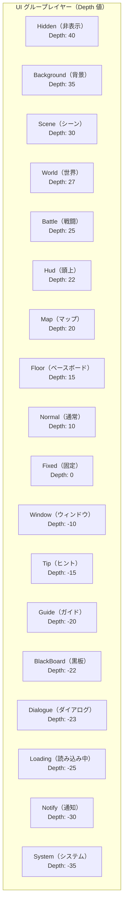

# UI プロパティ

このドキュメントでは、GameFrameX UI システムで UI フォームとコンポーネントを設定するために使用される各種属性（Attribute）とシリアライズプロパティについて説明します。

## 概要

GameFrameX UI システムは、豐富なプロパティ設定機構を提供し、開発者は属性（Attribute）とシリアライズフィールドを通じて UI フォームの動作を設定できます。主に以下の側面の設定を含みます：

1. **UI 設定属性** - UI リソースの位置と読み込み方法を定義
2. **UI グループ属性** - UI を異なるレイヤーグループに分配
3. **アニメーション属性** - UI の表示と非表示アニメーションを設定
4. **UIComponent グローバル属性** - UI システムの全体動作を制御
5. **UIForm フォーム属性** - 単一フォームの動作を制御

## UI 設定属性 (Attributes)

### OptionUIConfigAttribute

UI 設定をマークするための属性クラスであり、FairyGUI と UGUI の2つの UI フレームワークをサポートします。パッケ名またはパスを指定することで、UI リソースの自動位置決と読み込みを実現します。

```csharp
[OptionUIConfigAttribute(packageName: "MainPackage", path: "UI/Prefabs/MainForm")]
public class MainForm : UIForm
{
    // ...
}
```

> Source: [OptionUIConfigAttribute.cs](https://github.com/GameFrameX/com.gameframex.unity.ui/blob/main/Runtime/Attribute/OptionUIConfigAttribute.cs#L42-L108)

**プロパティ説明：**

| プロパティ | タイプ | 説明 |
|------|------|------|
| `PackageName` | string | FairyGUI が使用するパッケ名，FairyGUI の UI リソースパックを位置決定するために使用 |
| `Path` | string | UGUI が使用するリソースパス，UGUI の UI プレハブまたはリソースを位置決定するために使用 |
| `IsResource` | bool | リソースパスかどうか。true の場合 Path はリソースパス；false の場合 Path は UI プレハブパス |

**コンストラクタ：**

```csharp
// 方法1：パッケ名とパスを指定
public OptionUIConfigAttribute(string packageName = null, string path = null)

// 方法2：リソースパスかどうかを指定
public OptionUIConfigAttribute(bool isResource = false)
```

---

### OptionUIGroupAttribute

クラスに UI オプショングループを指定するための属性です。クラスにのみ適用でき、グループ名は空にできません。

```csharp
[OptionUIGroupAttribute("Dialog")]
public class DialogForm : UIForm
{
    // ...
}
```

> Source: [OptionUIGroupAttribute.cs](https://github.com/GameFrameX/com.gameframex.unity.ui/blob/main/Runtime/Attribute/OptionUIGroupAttribute.cs#L42-L73)

**プロパティ説明：**

| プロパティ | タイプ | 説明 |
|------|------|------|
| `GroupName` | string | グループ名，UI を特定の UI グループに分配するために使用 |

---

### OptionUIShowAnimationAttribute

UI を開く時に再生するアニメーションを指定する属性です。クラスに適用でき、アニメーション名とアニメーションを有効にするかどうかを指定できます。

```csharp
// "FadeIn" という表示アニメーションを有効にする
[OptionUIShowAnimationAttribute("FadeIn")]
public class MainForm : UIForm
{
    // ...
}

// 表示アニメーションを無効にする
[OptionUIShowAnimationAttribute(false)]
public class TipForm : UIForm
{
    // ...
}
```

> Source: [OptionUIShowAnimationAttribute.cs](https://github.com/GameFrameX/com.gameframex.unity.ui/blob/main/Runtime/Attribute/OptionUIShowAnimationAttribute.cs#L42-L94)

**プロパティ説明：**

| プロパティ | タイプ | 説明 |
|------|------|------|
| `AnimationName` | string | アニメーション名，再生するアニメーションの名前を指定 |
| `Enable` | bool | アニメーションを有効にするか，默认は true |

**コンストラクタ：**

```csharp
public OptionUIShowAnimationAttribute(string animationName, bool enable = true)
public OptionUIShowAnimationAttribute(bool enable = true)
```

---

### OptionUIHideAnimationAttribute

UI を閉じる時に再生するアニメーションを指定する属性です。クラスに適用でき、アニメーション名とアニメーションを有効にするかどうかを指定できます。

```csharp
// "FadeOut" という非表示アニメーションを有効にする
[OptionUIHideAnimationAttribute("FadeOut")]
public class MainForm : UIForm
{
    // ...
}

// 非表示アニメーションを無効にする
[OptionUIHideAnimationAttribute(false)]
public class TipForm : UIForm
{
    // ...
}
```

> Source: [OptionUIHideAnimationAttribute.cs](https://github.com/GameFrameX/com.gameframex.unity.ui/blob/main/Runtime/Attribute/OptionUIHideAnimationAttribute.cs#L42-L94)

**プロパティ説明：**

| プロパティ | タイプ | 説明 |
|------|------|------|
| `AnimationName` | string | アニメーション名，再生するアニメーションの名前を指定 |
| `Enable` | bool | アニメーションを有効にするか，默认は true |

---

## UIComponent グローバルプロパティ

UIComponent は UI システムのコアコンポーネントであり、グローバルの UI 設定オプションを提供します。これらのプロパティは Unity の SerializeField 属性を通じて Inspector パネルで表示·設定できます。

> Source: [UIComponent.cs](https://github.com/GameFrameX/com.gameframex.unity.ui/blob/main/Runtime/UIComponent.cs#L48-L226)

### イベント制御プロパティ

| プロパティ | タイプ | デフォルト値 | 説明 |
|------|------|--------|------|
| `EnableOpenUIFormSuccessEvent` | bool | true | 画面を開く成功イベントを有効にするか。有効にすると、画面が正常に開かれた時に相应のイベントが発生 |
| `EnableOpenUIFormFailureEvent` | bool | true | 画面を開く失敗イベントを有効にするか。有効にすると、画面が開くに失敗した時に相应のイベントが発生 |
| `EnableCloseUIFormCompleteEvent` | bool | true | 画面を閉じる完了イベントを有効にするか。有効にすると、画面が閉じるが完了した時に相应のイベントが発生 |

### オブジェクトプールプロパティ

| プロパティ | タイプ | デフォルト値 | 説明 |
|------|------|--------|------|
| `EnableAutoReleaseUIForm` | bool | true | 自動回收画面を有効にするか。無効にすると、画面を閉じる時にリソースが自動的に解放されない |
| `InstanceAutoReleaseInterval` | float | 60f | 画面インスタンスオブジェクトプールがリリース可能なオブジェクトを自動解放する間隔秒数 |
| `InstanceCapacity` | int | 16 | 画面インスタンスオブジェクトプールの容量，プールにキャッシュできる画面インスタンスの最大数 |
| `InstanceExpireTime` | float | 60f | 画面インスタンスオブジェクトプールオブジェクトの过期秒数，画面を閉じた後この時間内に再利用が可能 |
| `RecycleInterval` | int | 60 | 画面回收間隔時間（秒） |

### アニメーショ プロパティ

| プロパティ | タイプ | デフォルト値 | 説明 |
|------|------|--------|------|
| `IsEnableUIShowAnimation` | bool | false | UI 表示アニメーションを有効にするか |
| `IsEnableUIHideAnimation` | bool | false | UI 非表示アニメーションを有効にするか |

### ルートノードプロパティ

| プロパティ | タイプ | 説明 |
|------|------|------|
| `UGUIRoot` | Transform | UGUI ルートノード |
| `FairyGUIRoot` | Transform | FairyGUI ルートノード |

### ヘルパープロパティ

| プロパティ | タイプ | 説明 |
|------|------|------|
| `UIFormHelperTypeName` | string | UI フォームヘルパーのタイプ名 |
| `CustomUIFormHelper` | UIFormHelperBase | カスタム UI フォームヘルパー |
| `UIGroupHelperTypeName` | string | UI グループヘルパーのタイプ名 |
| `CustomUIGroupHelper` | UIGroupHelperBase | カスタム UI グループヘルパー |

### UI グループ設定

| プロパティ | タイプ | 説明 |
|------|------|------|
| `UIGroups` | UIGroup[] | UI グループ配列、デフォルトで18個の事前定義グループを含む |

---

## UIForm フォームプロパティ

UIForm はすべての UI フォームの基本クラスであり、フォーム実行時の各种状態プロパティを含みます。

> Source: [UIForm.cs](https://github.com/GameFrameX/com.gameframex.unity.ui/blob/main/Runtime/UIForm.cs#L47-L856)

### 状態プロパティ（実行時）

| プロパティ | タイプ | 説明 |
|------|------|------|
| `Available` | bool | 画面が利用可能かどうか |
| `Visible` | bool | 画面が表示されているかどうか |
| `SerialId` | int | 画面シリアル番号 |
| `Name` | string | 画面名 |
| `FullName` | string | 画面の完全名（名前空間を含む） |
| `UIFormAssetName` | string | 画面リソース名 |
| `AssetPath` | string | 画面リソースパス |
| `IsAwake` | bool | 画面が既に起床しているか |
| `IsFromPool` | bool | 画面がオブジェクトプールから来ているか |
| `IsDisposed` | bool | 画面が既に破棄されているか |

### 動作制御プロパティ

| プロパティ | タイプ | デフォルト値 | 説明 |
|------|------|--------|------|
| `IsDisableRecycling` | bool | false | 回收を無効にするか，回收を無効にした画面は回收されない |
| `IsDisableClosing` | bool | false | 閉じることを無効にするか，閉じることを無効にした画面は閉じられない |
| `IsCenter` | bool | false | コンポーネントを中央に配置するかを有効にするか，コンポーネント生成後デフォルトで親コンポーネントを中央に配置 |
| `PauseCoveredUIForm` | bool | true | 覆われた画面を一時停止するか |
| `RecycleInterval` | int | - | 画面回收間隔，単位：秒 |

### アニメーショ プロパティ

| プロパティ | タイプ | 説明 |
|------|------|------|
| `EnableShowAnimation` | bool | 表示アニメーションを有効にするか |
| `ShowAnimationName` | string | 表示アニメーション名 |
| `EnableHideAnimation` | bool | 非表示アニメーションを有効にするか |
| `HideAnimationName` | string | 非表示アニメーション名 |

### レイヤープロパティ

| プロパティ | タイプ | 説明 |
|------|------|------|
| `DepthInUIGroup` | int | 画面が画面グループ内の深度 |
| `UIGroup` | IUIGroup | 画面が属する画面グループ |

---

## UI グループレイヤー定数

GameFrameX UI システムは18個の UI グループを事前定義しており、各グループには対応する深度値（Depth）と名前（Name）があります。



> Source: [UIGroupConstants.cs](https://github.com/GameFrameX/com.gameframex.unity.ui/blob/main/Runtime/UIGroupConstants.cs#L38-L202)

**UI グループ深度説明：**
- 深度値が大きいほど、UI がより前面に表示されます（覆い関係）
- 事前定義グループの深度は 40 から -35 までであり、ゲームの各种 UI シーンをカバー
- Depth 値が大きいほど画面外に近い（最上位）、負値は画面内に近い（最下位）

---

## 使用例

### 完全な設定例

以下の例は、カスタム UI フォームクラスで各種属性を使用する方法を示しています：

```csharp
using GameFrameX.UI.Runtime;

// UI 設定属性：FairyGUI パッケ名と UGUI パスを指定
// UI グループ属性：このフォームを Window グループに分配
[OptionUIConfigAttribute(packageName: "GameUI", path = "UI/Forms/MainMenu")]
[OptionUIGroupAttribute("Window")]
// 表示アニメーション属性："FadeIn" アニメーションを使用し、有効状態
[OptionUIShowAnimationAttribute("FadeIn", true)]
// 非表示アニメーション属性："FadeOut" アニメーションを使用し、有効状態
[OptionUIHideAnimationAttribute("FadeOut", true)]
public class MainMenuForm : UIForm
{
    protected override void OnOpen(object userData)
    {
        base.OnOpen(userData);
        // 画面を開くロジック
    }
    
    protected override void OnClose(bool isShutdown, object userData)
    {
        // 画面を閉じるロジック
        base.OnClose(isShutdown, userData);
    }
}
```

### コードで動的にプロパティを設定

属性の使用 외에도、実行時に動的に UI フォームのプロパティを設定できます：

```csharp
// UI を開く時にユーザーデータを渡す，UIForm の OnOpen で処理
GameEntry.UI.OpenUIForm<MainMenuForm>(userData: new MainMenuData 
{ 
    EnableShowAnimation = true,
    ShowAnimationName = "CustomFadeIn"
});

// UIForm でアニメーションを動的に設定
public class CustomForm : UIForm
{
    public override void OnOpen(object userData)
    {
        if (userData is MainMenuData data)
        {
            EnableShowAnimation = data.EnableShowAnimation;
            ShowAnimationName = data.ShowAnimationName;
        }
    }
}
```

---

## 関連リンク

- [エディタ設定](./8-configuration.editor) - UI システムの Unity エディタでの設定方法
- [UI コンポーネント](./4-core-concepts.ui-component) - UIComponent コンポーネントの詳細な説明
- [UI フォーム](./4-core-concepts.ui-form) - UIForm フォームの詳細な説明
- [UI グループシステム](./4-core-concepts.ui-group) - UI グループシステムの詳細な説明
- [イベントシステム](./6-event-system) - UI イベントシステム