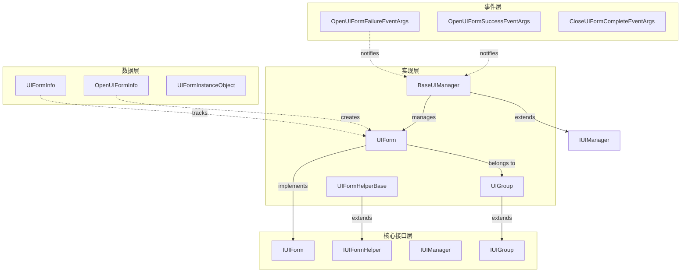
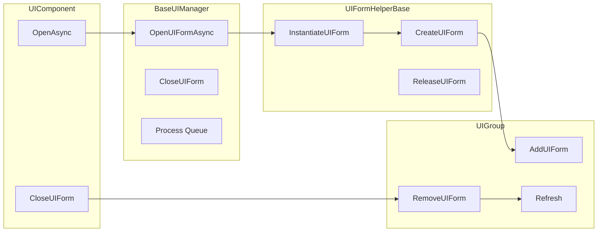
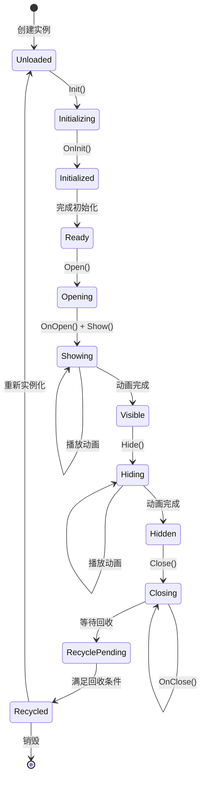
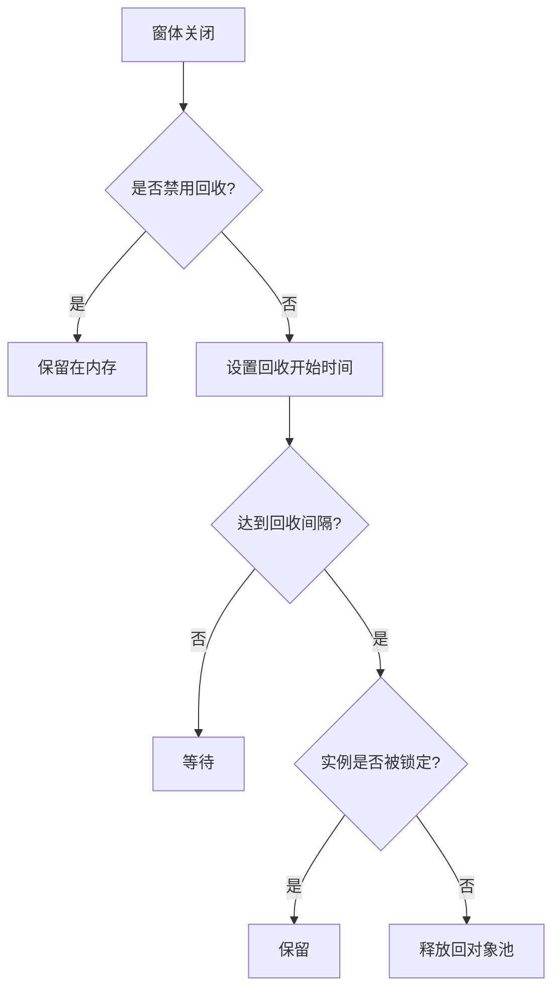

# UI 窗体

UI 窗体是 GameFrameX UI 系统的コア基本单元，代表游戏或应用程序中的一个独立 UI 界面（屏幕、ウィンドウ、パネル）。每个 UI 窗体都は可管理的实体，具备完全な的ライフサイクル管理、显示/隐藏动画サポート、对象池回收等機能。

## 概要

UI 窗体（UI Form）是 GameFrameX UI フレームワーク中最基本的界面管理单元。它継承自 Unity 的 `MonoBehaviour`，同時に実装 `IUIForm` インターフェース，提供します完全な的界面ライフサイクル管理能力。

**コア機能：**
- 非同期ロード与インスタンス化
- 显示/隐藏动画サポート
- 对象池回收机制
- UI 组（UIGroup）管理
- 深度（Z-order）控制
- イベント購読机制

**設計意图：** UI 窗体采用テンプレートメソッドパターン，让開発者〜できます通过オーバーライド基底クラスメソッド来実装自定義逻辑，同時に保持フレームワーク的可拡張性。对象池机制〜できます显著提高 UI 界面频繁打开/閉じるシーン下的性能。

## アーキテクチャ



**アーキテクチャ説明：**
- **コアインターフェース層**：定義 UI 窗体的抽象契约，含みます `IUIForm`、`IUIFormHelper`、`IUIManager`、`IUIGroup`
- **実装層**：提供具体的機能実装，含みます `UIForm`、`UIFormHelperBase`、`BaseUIManager`、`UIGroup`
- **数据层**：用于存储和管理 UI 窗体相关数据的情報类
- **イベント层**：基于イベント的通知系统，用于解耦モジュール间的通信

### UI 窗体与相关コンポーネント的关系



## コアコンセプト

### 窗体ライフサイクル

UI 窗体具有完全な的ライフサイクル，理解する各个フェーズ对于正确使用フレームワーク至关重要な：



**ライフサイクルフェーズ説明：**

| フェーズ | メソッド | 説明 |
|------|------|------|
| 初期化 | `Init()` | 窗体インスタンス化后首次呼び出し，初期化基本プロパティ |
| 唤醒 | `OnAwake()` | Unity Awake コールバック，初期化イベント購読器 |
| 视图初期化 | `InitView()` | 初期化 UI 视图コンポーネント |
| 打开 | `OnOpen()` | 窗体被打开时呼び出し，可用于数据ロード |
| 显示 | `Show()` | 显示窗体并再生动画 |
| 隐藏 | `Hide()` | 隐藏窗体并再生动画 |
| 閉じる | `OnClose()` | 窗体被閉じる时呼び出し |
| 回收 | `OnRecycle()` | 窗体进入回收池前呼び出し |
| 破棄 | `Dispose()` | 窗体完全破棄前呼び出し |

### 窗体ステータス

UI 窗体具有多个ステータスプロパティ，用于控制其行为：

| ステータス | プロパティ | 説明 |
|------|------|------|
| 可用 | `Available` | 窗体是否已初期化并可用 |
| 可见 | `Visible` | 窗体是否〜中显示 |
| 禁用回收 | `IsDisableRecycling` | 禁用后窗体不会被回收 |
| 禁用閉じる | `IsDisableClosing` | 禁用后窗体无法被閉じる |
| 可回收 | `IsCanRecycle` | 当前是否〜できます回收 |

### 显示/隐藏动画

UI 窗体サポート显示和隐藏动画：

```csharp
// 启用显示动画
uiForm.EnableShowAnimation = true;
uiForm.ShowAnimationName = "FadeIn";

// 启用隐藏动画
uiForm.EnableHideAnimation = true;
uiForm.HideAnimationName = "FadeOut";
```

> Source: [UIForm.cs](https://github.com/GameFrameX/com.gameframex.unity.ui/blob/main/Runtime/UIForm.cs#L195-L240)

### 对象池回收机制

GameFrameX 実装了对象池机制来最適化 UI 窗体的性能：



回收机制的关键設定：
- `RecycleInterval`: 回收间隔（秒），デフォルト 60 秒
- `IsDisableRecycling`: 是否禁用回收
- `InstanceCapacity`: 对象池容量

> Source: [BaseUIManager.cs](https://github.com/GameFrameX/com.gameframex.unity.ui/blob/main/Runtime/BaseUIManager.cs#L64-L83)

## 使用例

### 作成自定義 UI 窗体

継承 `UIForm` 基底クラス作成自定義 UI 窗体：

```csharp
using GameFrameX.UI.Runtime;
using UnityEngine;
using UnityEngine.UI;

public class MainMenuForm : UIForm
{
    [SerializeField] private Button _startButton;
    [SerializeField] private Button _settingsButton;
    [SerializeField] private Button _quitButton;

    protected override void InitView()
    {
        base.InitView();
        
        // 初始化视图组件
        _startButton.onClick.AddListener(OnStartButtonClick);
        _settingsButton.onClick.AddListener(OnSettingsButtonClick);
        _quitButton.onClick.AddListener(OnQuitButtonClick);
    }

    public override void OnOpen(object userData)
    {
        base.OnOpen(userData);
        
        // 接收打开时传入的数据
        if (userData is MainMenuData data)
        {
            Debug.Log($"打开主菜单: {data.PlayerName}");
        }
    }

    public override void OnClose(bool isShutdown, object userData)
    {
        // 清理资源
        _startButton.onClick.RemoveAllListeners();
        base.OnClose(isShutdown, userData);
    }

    private void OnStartButtonClick()
    {
        Debug.Log("点击开始按钮");
    }

    private void OnSettingsButtonClick()
    {
        Debug.Log("点击设置按钮");
    }

    private void OnQuitButtonClick()
    {
        Debug.Log("点击退出按钮");
        Application.Quit();
    }
}
```

> Source: [UIForm.cs](https://github.com/GameFrameX/com.gameframex.unity.ui/blob/main/Runtime/UIForm.cs#L47-L855)

### 打开 UI 窗体

通过 UIComponent 打开 UI 窗体：

```csharp
// 异步打开窗体
var mainMenu = await UIComponent.Instance.OpenAsync<MainMenuForm>();

// 传递用户数据
var menuData = new MainMenuData { PlayerName = "Player1" };
var mainMenu = await UIComponent.Instance.OpenAsync<MainMenuForm>(menuData);

// 打开全屏窗体
var fullScreenForm = await UIComponent.Instance.OpenFullScreenAsync<FullScreenForm>();

// 打开时暂停被覆盖的窗体
var pausedForm = await UIComponent.Instance.OpenUIFormAsync<DialogForm>(true, userData);
```

> Source: [UIComponent.Open.cs](https://github.com/GameFrameX/com.gameframex.unity.ui/blob/main/Runtime/UIComponent.Open.cs#L135-L191)

### 閉じる UI 窗体

```csharp
// 通过窗体实例关闭
UIComponent.Instance.CloseUIForm(mainMenuForm);

// 通过序列编号关闭
UIComponent.Instance.CloseUIForm(serialId: 1);

// 关闭时传递数据
UIComponent.Instance.CloseUIForm(mainMenuForm, closeData);

// 立即回收（跳过回收队列）
UIComponent.Instance.CloseUIForm(mainMenuForm, isNowRecycle: true);

// 关闭指定类型的所有窗体
UIComponent.Instance.CloseUIForm<MainMenuForm>(userData: null);
```

> Source: [BaseUIManager.Close.cs](https://github.com/GameFrameX/com.gameframex.unity.ui/blob/main/Runtime/BaseUIManager.Close.cs#L161-L223)

### 窗体イベント処理

```csharp
// 订阅窗体打开成功事件
UIComponent.Instance.OpenUIFormSuccess += OnOpenSuccess;

// 订阅窗体打开失败事件
UIComponent.Instance.OpenUIFormFailure += OnOpenFailure;

// 订阅窗体关闭完成事件
UIComponent.Instance.CloseUIFormComplete += OnCloseComplete;

private void OnOpenSuccess(object sender, OpenUIFormSuccessEventArgs e)
{
    Debug.Log($"窗体打开成功: {e.UIForm.SerialId}, {e.UIForm.UIFormAssetName}");
}

private void OnOpenFailure(object sender, OpenUIFormFailureEventArgs e)
{
    Debug.LogError($"窗体打开失败: {e.UIFormAssetName}, 错误: {e.ErrorMessage}");
}

private void OnCloseComplete(object sender, CloseUIFormCompleteEventArgs e)
{
    Debug.Log($"窗体关闭完成: {e.UIFormSerialId}");
}
```

> Source: [BaseUIManager.Open.cs](https://github.com/GameFrameX/com.gameframex.unity.ui/blob/main/Runtime/BaseUIManager.Open.cs#L50-L68)

### イベント購読与取消購読

UIForm 提供します自动的イベント購読管理机制：

```csharp
public class MyUIForm : UIForm
{
    // 在窗体启用时订阅事件
    protected override void OnEventSubscribe()
    {
        // 订阅游戏事件
        GameEntry.Event.Subscribe(PlayerDeadEventArgs.EventId, OnPlayerDead);
        GameEntry.Event.Subscribe(LevelCompleteEventArgs.EventId, OnLevelComplete);
    }

    // 在窗体禁用时取消订阅
    protected override void OnEventUnSubscribe()
    {
        // 取消订阅游戏事件
        GameEntry.Event.Unsubscribe(PlayerDeadEventArgs.EventId, OnPlayerDead);
        GameEntry.Event.Unsubscribe(LevelCompleteEventArgs.EventId, OnLevelComplete);
    }

    private void OnPlayerDead(object sender, GameEventArgs e)
    {
        Debug.Log("玩家死亡");
    }

    private void OnLevelComplete(object sender, GameEventArgs e)
    {
        Debug.Log("关卡完成");
    }
}
```

> Source: [UIForm.cs](https://github.com/GameFrameX/com.gameframex.unity.ui/blob/main/Runtime/UIForm.cs#L507-L525)

### 窗体激活（重新聚焦）

将窗体重新置于最前：

```csharp
// 激活窗体（重新聚焦）
UIComponent.Instance.RefocusUIForm(uiForm);

// 激活并传递数据
UIComponent.Instance.RefocusUIForm(uiForm, userData);
```

> Source: [BaseUIManager.Open.cs](https://github.com/GameFrameX/com.gameframex.unity.ui/blob/main/Runtime/BaseUIManager.Open.cs#L137-L156)

### 取得已ロード的窗体

```csharp
// 通过类型获取
var form = UIComponent.Instance.GetLoaded<MainMenuForm>();

// 获取所有已加载的指定类型窗体
var forms = UIComponent.Instance.GetLoadedList<DialogForm>();

// 获取已加载且正在显示的窗体
var showingForm = UIComponent.Instance.GetLoadedAndShowing<MainMenuForm>();

// 获取所有已加载的窗体
var allForms = UIComponent.Instance.GetAllLoadedUIForms();
```

> Source: [UIComponent.Get.cs](https://github.com/GameFrameX/com.gameframex.unity.ui/blob/main/Runtime/UIComponent.Get.cs)

## API リファレンス

### IUIForm インターフェース

> See [IUIForm API リファレンス](./5-api-reference.iuiform) for full details

### UIForm 基底クラス

> See [UIForm API リファレンス](./5-api-reference.ui-form) for full details

### IUIManager インターフェース

> See [IUIManager API リファレンス](./5-api-reference.iuimanager) for full details

## 設定オプション

在 Unity エディタ中，〜できます通过 Inspector パネル設定 UI 窗体的プロパティ：

| プロパティ | タイプ | デフォルト值 | 説明 |
|------|------|--------|------|
| IsDisableRecycling | bool | false | 是否禁用回收 |
| IsDisableClosing | bool | false | 是否禁用閉じる |
| IsCenter | bool | false | 是否居中显示 |
| EnableShowAnimation | bool | false | 是否启用显示动画 |
| ShowAnimationName | string | (空) | 显示动画名称 |
| EnableHideAnimation | bool | false | 是否启用隐藏动画 |
| HideAnimationName | string | (空) | 隐藏动画名称 |

> Source: [UIFormInspector.cs](https://github.com/GameFrameX/com.gameframex.unity.ui/blob/main/Editor/UIFormInspector.cs#L61-L89)

## 関連リンク

- [UI コンポーネント](./4-core-concepts.ui-component) - UI コンポーネント的完全な概要
- [UI 组系统](./4-core-concepts.ui-group) - UI 组的组织和管理
- [对象池管理](./4-core-concepts.object-pool) - 对象池机制详解
- [UI コンポーネント API](./5-api-reference.ui-component) - UIComponent 完全な API
- [IUIManager API](./5-api-reference.iuimanager) - 界面マネージャー API
- [IUIGroup API](./5-api-reference.iuigroup) - 界面组 API
- [イベント系统](./6-event-system) - イベント系统详解
- [UI 组层级](./7-ui-group-hierarchy) - UI 组层级管理
