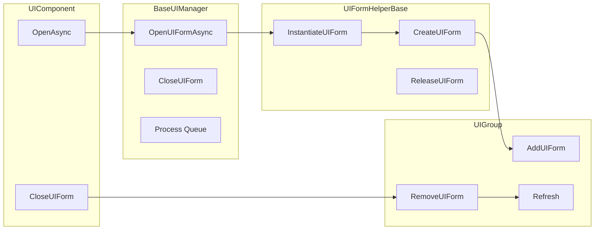
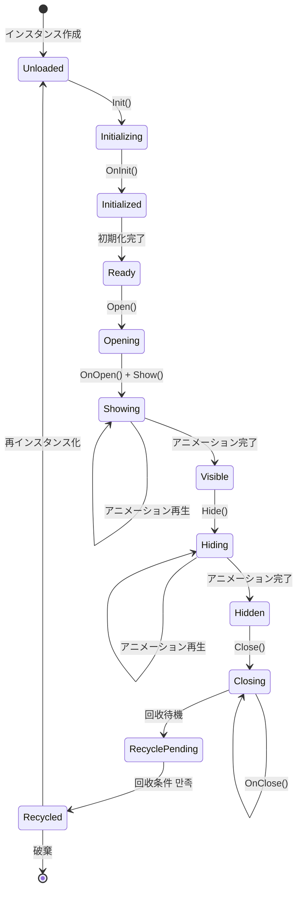
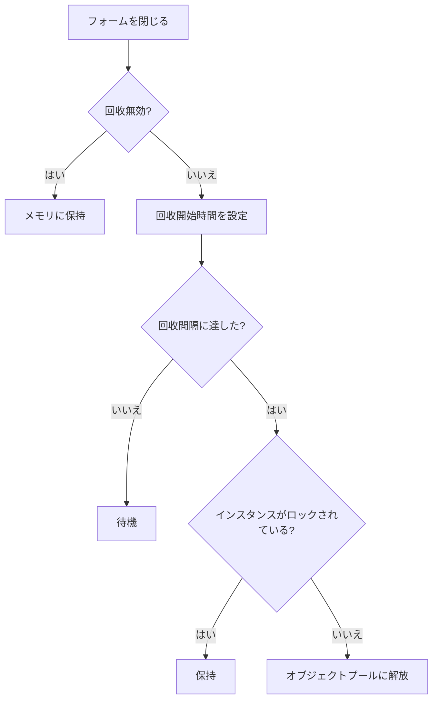

# UI フォーム

UI フォームは、GameFrameX UI システムのコア基本ユニットであり、ゲームまたはアプリケーションの独立した UI 画面（画面、ウィンドウ、パネル）を表します。各 UI フォームは 管理可能な实体であり、完全なライフサイクル管理、表示/非表示アニメーションサポート、オブジェクトプール回收などの機能を具备します。

## 概要

UI フォーム（UI Form）は、GameFrameX UI フレームワークにおいて最も基本的な画面管理ユニットです。Unity の `MonoBehaviour` を継承し、`IUIForm` インターフェースを実装し、完全な画面ライフサイクル管理能力を提供します。

**コア機能：**
- 非同期読み込みとインスタンス化
- 表示/非表示アニメーションサポート
- オブジェクトプール回收メカニズム
- UI グループ（UIGroup）管理
- 深度（Z-order）制御
- イベント購読メカニズム

**設計意図：** UI フォームはテンプレートメソッドパターンを采用し、開発者が基本クラスをオーバーライドしてカスタムロジックを実装できるようにしながら、フレームワークの拡張性を維持します。オブジェクトプールメカニズムにより、UI 画面が频繁に開く/閉じるシーンでのパフォーマンスを大幅に向上できます。

## アーキテクチャ


**アーキテクチャ説明：**
- **コアインターフェース層**：UI フォームの抽象契約を定義し、`IUIForm`、`IUIFormHelper`、`IUIManager`、`IUIGroup` を含む
- **実装層**：`UIForm`、`UIFormHelperBase`、`BaseUIManager`、`UIGroup` を含む具体的な機能実装を提供
- **データ層**：UI フォーム関連データの情報クラスを保存・管理するために使用
- **イベント層**：イベントベースの通知システムであり、モジュール間の通信を疎結合にするために使用

### UI フォームと関連コンポーネントの関係



## コアコンセプト

### フォームライフサイクル

UI フォームは完全なライフサイクルを持ち、各段階を理解することはフレームワークを正しく使用する上で重要です：



**ライフサイクル段階説明：**

| 段階 | メソッド | 説明 |
|------|------|------|
| 初期化 | `Init()` | フォームインスタンス化後初めて呼び出され、基本プロパティを初期化 |
| 起床 | `OnAwake()` | Unity Awake コールバック、イベント購読を初期化 |
| ビュー初期化 | `InitView()` | UI ビューコンポーネントを初期化 |
| 開く | `OnOpen()` | フォームが開かれた時に呼び出され、データの読み込みに使用可能 |
| 表示 | `Show()` | フォームを表示してアニメーションを再生 |
| 非表示 | `Hide()` | フォームを非表示にしてアニメーションを再生 |
| 閉じる | `OnClose()` | フォームが閉じられた時に呼び出され |
| 回收 | `OnRecycle()` | フォームが回收池に入る前に呼び出され |
| 破棄 | `Dispose()` | フォームが完全に破棄される前に呼び出され |

### フォーム状態

UI フォームには動作を制御する複数の状態プロパティがあります：

| 状態 | プロパティ | 説明 |
|------|------|------|
| 可用 | `Available` | フォームが初期化され利用可能な状態か |
| 表示 | `Visible` | フォームが現在表示されているか |
| 回收無効 | `IsDisableRecycling` | 無効にするとフォームは回收されない |
| 閉じる無効 | `IsDisableClosing` | 無効にするとフォームは閉じられない |
| 回收可能 | `IsCanRecycle` | 現時点で回收可能かどうか |

### 表示/非表示アニメーション

UI フォームは表示と非表示アニメーションをサポートします：

```csharp
// 表示アニメーションを有効にする
uiForm.EnableShowAnimation = true;
uiForm.ShowAnimationName = "FadeIn";

// 非表示アニメーションを有効にする
uiForm.EnableHideAnimation = true;
uiForm.HideAnimationName = "FadeOut";
```

> Source: [UIForm.cs](https://github.com/GameFrameX/com.gameframex.unity.ui/blob/main/Runtime/UIForm.cs#L195-L240)

### オブジェクトプール回收メカニズム

GameFrameX は UI フォームのパフォーマンスを最適化するためにオブジェクトプールメカニズムを実装しています：



回收メカニズムの主要設定：
- `RecycleInterval`：回收間隔（秒）、デフォルト 60 秒
- `IsDisableRecycling`：回收を無効にするかどうか
- `InstanceCapacity`：オブジェクトプール容量

> Source: [BaseUIManager.cs](https://github.com/GameFrameX/com.gameframex.unity.ui/blob/main/Runtime/BaseUIManager.cs#L64-L83)

## 使用例

### カスタム UI フォームの作成

`UIForm` 基本クラスを継承してカスタム UI フォームを作成：

```csharp
using GameFrameX.UI.Runtime;
using UnityEngine;
using UnityEngine.UI;

public class MainMenuForm : UIForm
{
    [SerializeField] private Button _startButton;
    [SerializeField] private Button _settingsButton;
    [SerializeField] private Button _quitButton;

    protected override void InitView()
    {
        base.InitView();
        
        // ビュークコンポーネントを初期化
        _startButton.onClick.AddListener(OnStartButtonClick);
        _settingsButton.onClick.AddListener(OnSettingsButtonClick);
        _quitButton.onClick.AddListener(OnQuitButtonClick);
    }

    public override void OnOpen(object userData)
    {
        base.OnOpen(userData);
        
        // 開いた時に渡されたデータを受け取る
        if (userData is MainMenuData data)
        {
            Debug.Log($"メインメニューを開く: {data.PlayerName}");
        }
    }

    public override void OnClose(bool isShutdown, object userData)
    {
        // リソースをクリーンアップ
        _startButton.onClick.RemoveAllListeners();
        base.OnClose(isShutdown, userData);
    }

    private void OnStartButtonClick()
    {
        Debug.Log("開始ボタンをクリック");
    }

    private void OnSettingsButtonClick()
    {
        Debug.Log("設定ボタンをクリック");
    }

    private void OnQuitButtonClick()
    {
        Debug.Log("終了ボタンをクリック");
        Application.Quit();
    }
}
```

> Source: [UIForm.cs](https://github.com/GameFrameX/com.gameframex.unity.ui/blob/main/Runtime/UIForm.cs#L47-L855)

### UI フォームを開く

UIComponent を通じて UI フォームを開きます：

```csharp
// 非同期でフォームを開く
var mainMenu = await UIComponent.Instance.OpenAsync<MainMenuForm>();

// ユーザーデータを渡す
var menuData = new MainMenuData { PlayerName = "Player1" };
var mainMenu = await UIComponent.Instance.OpenAsync<MainMenuForm>(menuData);

// 全画面フォームを開く
var fullScreenForm = await UIComponent.Instance.OpenFullScreenAsync<FullScreenForm>();

// 開く時に覆われたフォームを一時停止
var pausedForm = await UIComponent.Instance.OpenUIFormAsync<DialogForm>(true, userData);
```

> Source: [UIComponent.Open.cs](https://github.com/GameFrameX/com.gameframex.unity.ui/blob/main/Runtime/UIComponent.Open.cs#L135-L191)

### UI フォームを閉じる

```csharp
// フォームインスタンスで閉じる
UIComponent.Instance.CloseUIForm(mainMenuForm);

// シリアル番号で閉じる
UIComponent.Instance.CloseUIForm(serialId: 1);

// 閉じる時にデータを渡す
UIComponent.Instance.CloseUIForm(mainMenuForm, closeData);

// 即座に回收（回收キューをスキップ）
UIComponent.Instance.CloseUIForm(mainMenuForm, isNowRecycle: true);

// 指定タイプすべてのフォームを閉じる
UIComponent.Instance.CloseUIForm<MainMenuForm>(userData: null);
```

> Source: [BaseUIManager.Close.cs](https://github.com/GameFrameX/com.gameframex.unity.ui/blob/main/Runtime/BaseUIManager.Close.cs#L161-L223)

### フォームイベント処理

```csharp
// フォームを開く成功イベントを購読
UIComponent.Instance.OpenUIFormSuccess += OnOpenSuccess;

// フォームを開く失敗イベントを購読
UIComponent.Instance.OpenUIFormFailure += OnOpenFailure;

// フォームを閉じる完了イベントを購読
UIComponent.Instance.CloseUIFormComplete += OnCloseComplete;

private void OnOpenSuccess(object sender, OpenUIFormSuccessEventArgs e)
{
    Debug.Log($"フォームを開く成功: {e.UIForm.SerialId}, {e.UIForm.UIFormAssetName}");
}

private void OnOpenFailure(object sender, OpenUIFormFailureEventArgs e)
{
    Debug.LogError($"フォームを開く失敗: {e.UIFormAssetName}, エラー: {e.ErrorMessage}");
}

private void OnCloseComplete(object sender, CloseUIFormCompleteEventArgs e)
{
    Debug.Log($"フォームを閉じる完了: {e.UIFormSerialId}");
}
```

> Source: [BaseUIManager.Open.cs](https://github.com/GameFrameX/com.gameframex.unity.ui/blob/main/Runtime/BaseUIManager.Open.cs#L50-L68)

### イベントの購読と購読解除

UIForm は自動のイベント購読管理メカニズムを提供します：

```csharp
public class MyUIForm : UIForm
{
    // フォームが有効な時にイベントを購読
    protected override void OnEventSubscribe()
    {
        // ゲームイベントを購読
        GameEntry.Event.Subscribe(PlayerDeadEventArgs.EventId, OnPlayerDead);
        GameEntry.Event.Subscribe(LevelCompleteEventArgs.EventId, OnLevelComplete);
    }

    // フォームが無効な時に購読解除
    protected override void OnEventUnSubscribe()
    {
        // ゲームイベントの購読を解除
        GameEntry.Event.Unsubscribe(PlayerDeadEventArgs.EventId, OnPlayerDead);
        GameEntry.Event.Unsubscribe(LevelCompleteEventArgs.EventId, OnLevelComplete);
    }

    private void OnPlayerDead(object sender, GameEventArgs e)
    {
        Debug.Log("プレイヤーが死亡");
    }

    private void OnLevelComplete(object sender, GameEventArgs e)
    {
        Debug.Log("レベル完了");
    }
}
```

> Source: [UIForm.cs](https://github.com/GameFrameX/com.gameframex.unity.ui/blob/main/Runtime/UIForm.cs#L507-L525)

### フォームのアクティブ化（再フォーカス）

フォームを最前面に再配置：

```csharp
// フォームをアクティブ化（再フォーカス）
UIComponent.Instance.RefocusUIForm(uiForm);

// アクティブ化してからデータを渡す
UIComponent.Instance.RefocusUIForm(uiForm, userData);
```

> Source: [BaseUIManager.Open.cs](https://github.com/GameFrameX/com.gameframex.unity.ui/blob/main/Runtime/BaseUIManager.Open.cs#L137-L156)

### 読み込み済みのフォームを取得

```csharp
// タイプで取得
var form = UIComponent.Instance.GetLoaded<MainMenuForm>();

// 指定タイプすべての読み込み済みフォームを取得
var forms = UIComponent.Instance.GetLoadedList<DialogForm>();

// 読み込み済み且つ表示中のフォームを取得
var showingForm = UIComponent.Instance.GetLoadedAndShowing<MainMenuForm>();

// すべての読み込み済みフォームを取得
var allForms = UIComponent.Instance.GetAllLoadedUIForms();
```

> Source: [UIComponent.Get.cs](https://github.com/GameFrameX/com.gameframex.unity.ui/blob/main/Runtime/UIComponent.Get.cs)

## API リファレンス

### IUIForm インターフェース

> 完全な詳細については [IUIForm API リファレンス](./5-api-reference.iuiform) を参照してください

### UIForm 基本クラス

> 完全な詳細については [UIForm API リファレンス](./5-api-reference.ui-form) を参照してください

### IUIManager インターフェース

> 完全な詳細については [IUIManager API リファレンス](./5-api-reference.iuimanager) を参照してください

## 設定オプション

Unity エディタでは、Inspector パネルを通じて UI フォームのプロパティを設定できます：

| プロパティ | タイプ | デフォルト値 | 説明 |
|------|------|--------|------|
| IsDisableRecycling | bool | false | 回收を無効にするか |
| IsDisableClosing | bool | false | 閉じることを無効にするか |
| IsCenter | bool | false | 中央に表示するか |
| EnableShowAnimation | bool | false | 表示アニメーションを有効にするか |
| ShowAnimationName | string | (空) | 表示アニメーション名 |
| EnableHideAnimation | bool | false | 非表示アニメーションを有効にするか |
| HideAnimationName | string | (空) | 非表示アニメーション名 |

> Source: [UIFormInspector.cs](https://github.com/GameFrameX/com.gameframex.unity.ui/blob/main/Editor/UIFormInspector.cs#L61-L89)

## 関連リンク

- [UI コンポーネント](./4-core-concepts.ui-component) - UI コンポーネントの完全な概要
- [UI グループシステム](./4-core-concepts.ui-group) - UI グループの組織と管理
- [オブジェクトプール管理](./4-core-concepts.object-pool) - オブジェクトプールメカニズムの詳細な説明
- [UI コンポーネント API](./5-api-reference.ui-component) - UIComponent 完全な API
- [IUIManager API](./5-api-reference.iuimanager) - 画面管理器 API
- [IUIGroup API](./5-api-reference.iuigroup) - 画面グループ API
- [イベントシステム](./6-event-system) - イベントシステムの詳細な説明
- [UI グループレイヤー](./7-ui-group-hierarchy) - UI グループレイヤー管理