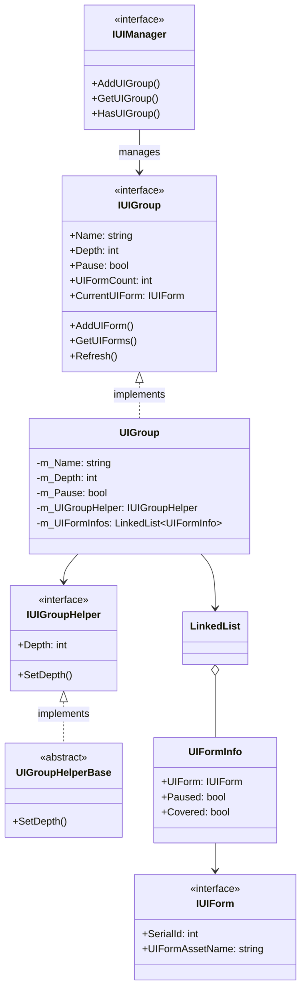
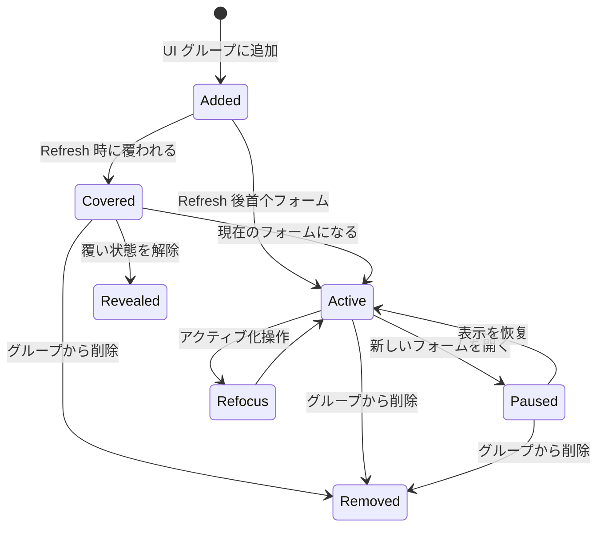
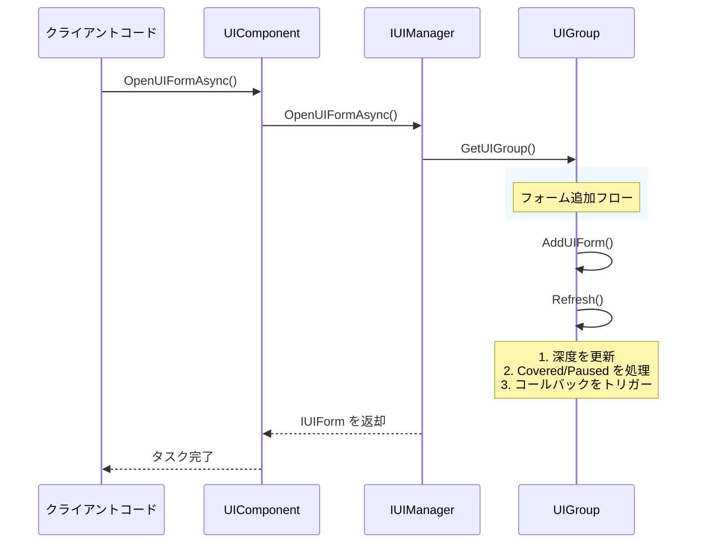
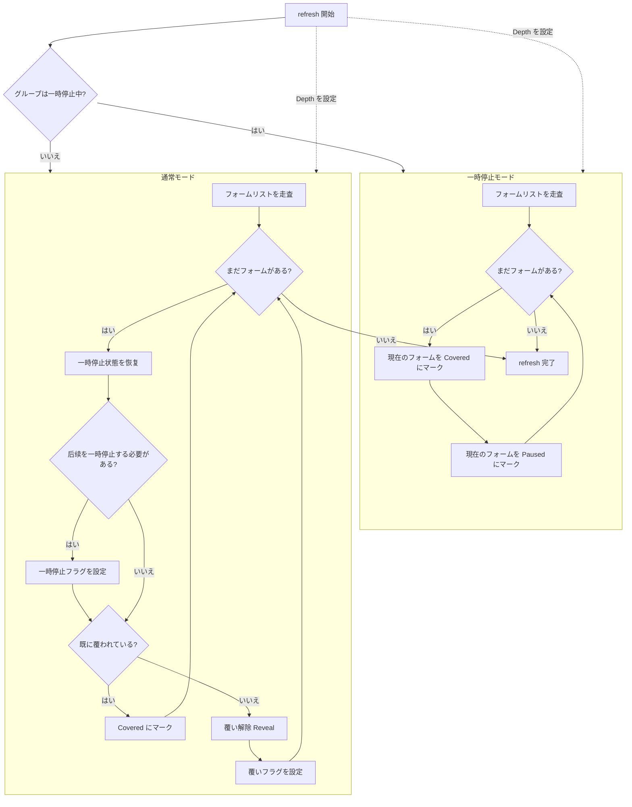

# UI グループシステム

UI グループシステムは、GameFrameX UI フレームワークのコア组成部分であり、UI フォームの表示レイヤー関係を管理·組織するために使用されます。UI グループシステムを通じて、開発者は UI フォームの優先度管理、覆い制御、一時停止·恢复などの機能を容易に実現できます。

## 概要

UI グループシステム（UI Group System）は、同じ表示優先度を持つ UI フォームの集合を管理するために使用されます。各 UI グループには以下のコア特性があります：

- **深度管理**：各グループには固有の深度値（Depth）があり、深度が大きいほど前面に表示
- **一時停止制御**：グループ全体の UI フォーム更新を一時停止可能
- **覆いメカニズム**：UI フォーム間の覆い関係を自動的に処理
- **アクティブ化管理**：指定フォームを最前面に配置（アクティブ化）をサポート

この設計は、ゲームエンジンで一般的なレイヤー管理方法を借鉴しており、グループ化管理を通じて背景レイヤー、シーンレイヤー、戦闘 UI、ポップアップウィンドウ、ヒント情報など、異なるタイプと優先度の UI 画面を明確に組織できます。

> UI グループシステムは UI フォームシステムと紧密に統合されており、IUIManager はすべての UI グループを管理し、各 UI グループは所属する UI フォームを管理します。

## アーキテクチャ設計



UI グループシステムのアーキテクチャは階層型設計を採用しています：

- **IUIManager 層**：すべての UI グループを管理し、グループの增删改查インターフェースを提供
- **IUIGroup 層**：UI グループのコアインターフェースを定義し、グループ名、深度、一時停止状態などのプロパティを含む
- **UIGroup 実装層**：LinkedList データ構造を使用して UI フォーム集合を効率的に管理
- **IUIGroupHelper 層**：UI グループの視覚的表現を処理（Transform 深度設定など）

## コアコンセプト

### 深度（Depth）

深度は UI グループのコアプロパティであり、グループの表示優先度を決定します。深度値が大きいほど、UI グループはより前面に表示されます。システムは標準グループの深度値を事前定義しており、開発者は新しいグループと深度をカスタム定義することもできます。

深度値の設計は以下の原則に従います：
- 背景タイプ UI は高い深度を使用（40-30）
- シーンと戦闘 UI は中程度の深度を使用（30-20）
- 通常と固定 UI は基本深度を使用（10-0）
- ポップアップウィンドウとヒントタイプは負の深度を使用（-10 以下）

### 一時停止（Pause）

UI グループが一時停止状態に設定されると、グループ内のすべての UI フォームの `OnUpdate` メソッドは呼び出されなくなりますが、フォームは仍然表示されます。これは实用的な機能であり 예를 들어 ローディング画面を表示する際に他の UI の更新を一時停止してパフォーマンスリソースを節約できます。

### 覆い（Covered）

新しいフォームが開かれると、古いフォームは自動的に「覆い」状態にマークされます。システムは `Refresh()` メソッドを通じてこの状態を自動的に管理し、ユーザーが常に最新に開かれたフォーム能看到하도록します。覆い状態は UI フォームの `OnCover` コールバックをトリガーし、開発者はここで関連する視覚効果を処理できます。

### アクティブ化（Refocus）

アクティブ化操作は指定された UI フォームをグループの最前面に移動し、それを現在アクティブなフォームにします。これは、既に開かれているフォームを最前面に配置する必要がある場合に非常に便利です（例如后台から設定パネルを恢复する場合）。

## 事前定義 UI グループ

フレームワークは事前定義の UI グループ定数一式を提供し、開発者は直接使用できます：

```csharp
// 事前定義 UI グループ定数
UIGroupConstants.Hidden       // 非表示レイヤー (深度: 40)
UIGroupConstants.Background   // 背景レイヤー (深度: 35)
UIGroupConstants.Scene        // シーンレイヤー (深度: 30)
UIGroupConstants.World        // 世界レイヤー (深度: 27)
UIGroupConstants.Battle       // 戦闘レイヤー (深度: 25)
UIGroupConstants.Hud          // HUDレイヤー (深度: 22)
UIGroupConstants.Map          // マップレイヤー (深度: 20)
UIGroupConstants.Floor        // ベースボードレイヤー (深度: 15)
UIGroupConstants.Normal       // 通常レイヤー (深度: 10)
UIGroupConstants.Fixed        // 固定レイヤー (深度: 0)
UIGroupConstants.Window       // ウィンドウレイヤー (深度: -10)
UIGroupConstants.Tip          // ヒントレイヤー (深度: -15)
UIGroupConstants.Guide        // ガイドレイヤー (深度: -20)
UIGroupConstants.BlackBoard   // 黒板レイヤー (深度: -22)
UIGroupConstants.Dialogue     // ダイアログレイヤー (深度: -23)
UIGroupConstants.Loading      // ローディングレイヤー (深度: -25)
UIGroupConstants.Notify       // 通知レイヤー (深度: -30)
UIGroupConstants.System       // システムレイヤー (深度: -35)
```

> Source: [UIGroupConstants.cs](https://github.com/GameFrameX/com.gameframex.unity.ui/blob/main/Runtime/UIGroupConstants.cs#L38-L202)

```csharp
// 事前定義 UI グループ名定数
UIGroupNameConstants.Hidden       // "Hidden"
UIGroupNameConstants.Background  // "Background"
UIGroupNameConstants.Scene        // "Scene"
// ... その他の定数
```

> Source: [UIGroupNameConstants.cs](https://github.com/GameFrameX/com.gameframex.unity.ui/blob/main/Runtime/UIGroupNameConstants.cs#L38-L202)

## フォーム状態遷移

UI フォームはグループ内で異なる状態遷移を経験します。これらの状態を理解することは UI グループシステムを正しく使用する上で重要です：



### 状態説明

| 状態 | 説明 | トリガーコールバック |
|------|------|----------|
| **Active** | アクティブ状態、現在表示中のフォーム | OnResume, OnRefocus |
| **Covered** | 他のフォームに覆われている | OnCover |
| **Paused** | 一時停止状態、更新されないが可視 | OnPause |
| **Removed** | グループから既に削除済み | OnClose |

## コアフロー

### UI フォームを開きグループに追加



### UI グループ refresh フロー

refresh は UI グループのコア逻論であり、グループ内のすべてのフォームの正しい状態を维护します：



## 使用例

### カスタム UI グループの作成

UIComponent を使用してカスタム UI グループを作成：

```csharp
public class GameEntry : MonoBehaviour
{
    public UIComponent UIComp;
    
    void Start()
    {
        // カスタム UI グループを作成、深度は 5
        UIComp.AddUIGroup("CustomGroup", 5);
        
        // または事前定義グループを使用
        UIComp.AddUIGroup(UIGroupNameConstants.Window, -10);
    }
}
```

> Source: [UIComponent.IUIGroup.cs](https://github.com/GameFrameX/com.gameframex.unity.ui/blob/main/Runtime/UIComponent.IUIGroup.cs#L100-L147)

### UI グループにアクセス

UIComponent を通じて UI グループにアクセスして管理：

```csharp
public class UIManagerExample : MonoBehaviour
{
    public UIComponent UIComp;
    
    public void ManageGroups()
    {
        // グループが存在するかをチェック
        if (UIComp.HasUIGroup("Window"))
        {
            // グループを取得
            IUIGroup group = UIComp.GetUIGroup("Window");
            
            // 現在表示中のフォームを取得
            IUIForm currentForm = group.CurrentUIForm;
            
            // グループ内のフォーム数を取得
            int count = group.UIFormCount;
            
            // すべてのフォームを取得
            IUIForm[] allForms = group.GetAllUIForms();
            
            // グループ深度を設定
            group.Depth = 10;
            
            // グループを一時停止/恢复
            group.Pause = false;
            
            // 指定フォームをアクティブ化
            group.RefocusUIForm(someUIForm, null);
        }
    }
}
```

### 事前定義グループ定数を使用してフォームを開く

```csharp
public class UIFormOpener : MonoBehaviour
{
    public UIComponent UIComp;
    
    public async void OpenDialog()
    {
        // ダイアログをダイアログレイヤーに開く
        IUIForm dialog = await UIComp.OpenUIFormAsync<DialogForm>(
            "Assets/Prefabs/UI/Dialog.prefab",
            UIGroupNameConstants.Dialogue,
            true,  // 覆われたフォームを一時停止
            null   // ユーザーデータ
        );
    }
    
    public async void OpenTip()
    {
        // ヒントをヒントレイヤーに開く（他のフォームを一時停止しない）
        IUIForm tip = await UIComp.OpenUIFormAsync<TipForm>(
            "Assets/Prefs/UI/Tip.prefab",
            UIGroupNameConstants.Tip,
            false,
            "これはヒントです"
        );
    }
}
```

### 整个 UI グループを閉じる

指定グループ内のすべての UI フォームを閉じる：

```csharp
public class UIGroupCloser : MonoBehaviour
{
    public UIComponent UIComp;
    
    public void CloseAllDialogs()
    {
        // ダイアロググループのすべてのフォームを閉じる
        UIComp.CloseUIGroup(UIGroupNameConstants.Dialogue, null);
    }
    
    public void CloseAllWindows()
    {
        // ウィンドウグループを閉じる
        if (UIComp.HasUIGroup(UIGroupNameConstants.Window))
        {
            UIComp.GetUIGroup(UIGroupNameConstants.Window);
            UIComp.CloseUIGroup(UIGroupNameConstants.Window, "user_close_all");
        }
    }
}
```

> Source: [BaseUIManager.UIGroup.cs](https://github.com/GameFrameX/com.gameframex.unity.ui/blob/main/Runtime/BaseUIManager.UIGroup.cs#L150-L176)

## IUIGroup インターフェースリファレンス

完全なメソッドシグネチャと説明：

### プロパティ

| プロパティ | タイプ | 説明 |
|------|------|------|
| Name | string | UI グループ名を取得 |
| Depth | int | UI グループの深度を取得または設定 |
| Pause | bool | UI グループが一時停止中かどうかを取得または設定 |
| UIFormCount | int | UI グループ内のフォーム数を取得 |
| CurrentUIForm | IUIForm | 現在表示中のフォームを取得 |
| Helper | IUIGroupHelper | UI グループヘルパーを取得 |

### メソッド

#### `HasUIForm(int serialId): bool`

グループ内に指定シリアル番号のフォームが存在するかをチェック。

**パラメータ：**
- `serialId` (int): UI フォームのシリアル番号

**返却：** 存在するかどうか

---

#### `HasUIForm(string uiFormAssetName): bool`

グループ内に指定リソース名のフォームが存在するかをチェック。

**パラメータ：**
- `uiFormAssetName` (string): UI フォームのリソース名

**返却：** 存在するかどうか

---

#### `GetUIForm(int serialId): IUIForm`

シリアル番号に基づいてフォームを取得。

**パラメータ：**
- `serialId` (int): UI フォームのシリアル番号

**返却：** UI フォームインスタンス、存在しない場合は null

---

#### `GetUIForms(string uiFormAssetName): IUIForm[]`

リソース名に基づいてすべての匹配するフォームを取得。

**パラメータ：**
- `uiFormAssetName` (string): UI フォームのリソース名

**返却：** UI フォーム配列

---

#### `GetAllUIForms(): IUIForm[]`

グループ内のすべてのフォームを取得。

**返却：** すべての UI フォーム配列

---

#### `AddUIForm(IUIForm uiForm): void`

グループにフォームを追加。

**パラメータ：**
- `uiForm` (IUIForm): 追加する UI フォーム

---

#### `Refresh(): void`

UI グループのステータスを refresh し、すべてのフォームの覆いと一時停止ステータスを更新。

---

## IUIManager の UI グループメソッド

IUIManager は完全な UI グループ管理インターフェースを提供します：

| メソッド | 説明 |
|------|------|
| `HasUIGroup(string)` | グループが存在するかをチェック |
| `GetUIGroup(string)` | 指定グループを取得 |
| `GetAllUIGroups()` | すべてのグループを取得 |
| `AddUIGroup(string, IUIGroupHelper)` | 新規グループを追加 |
| `AddUIGroup(string, int, IUIGroupHelper)` | 指定深度でグループを追加 |
| `CloseUIGroup(string, object)` | グループ内のすべてのフォームを閉じる |

> 完全な IUIManager インターフェース定義は [API リファレンスドキュメント](./5-api-reference.iuimanager) を参照してください

## 関連リンク

- [UI コンポーネント](./4-core-concepts.ui-component) - UI コンポーネントの基礎
- [UI フォーム](./4-core-concepts.ui-form) - UI フォームシステム
- [API リファレンス - IUIGroup](./5-api-reference.iuigroup) - IUIGroup 完全インターフェースドキュメント
- [API リファレンス - IUIManager](./5-api-reference.iuimanager) - IUIManager 完全インターフェースドキュメント
- [UI グループレイヤー](./7-ui-group-hierarchy) - UI グループレイヤーの詳細な説明