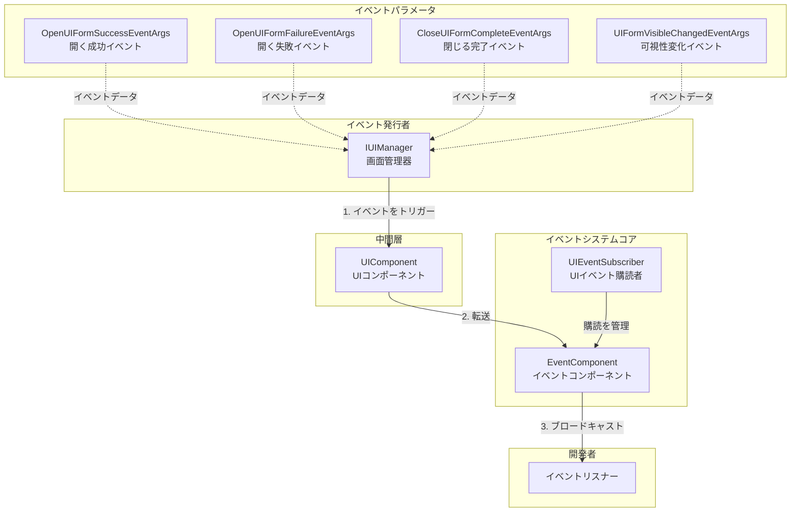
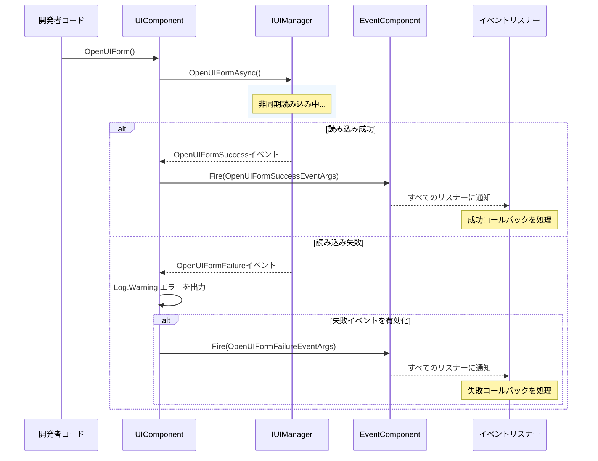
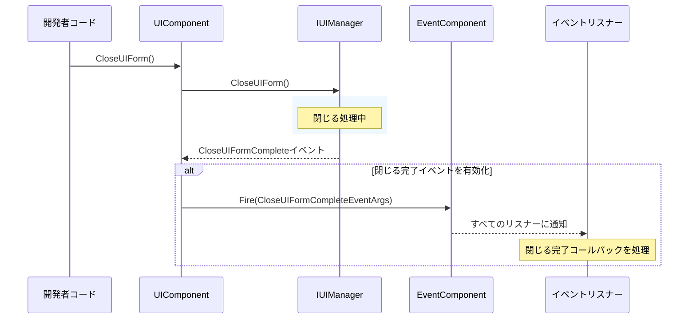

# イベントシステム

GameFrameX.UI モジュールのイベントシステムは、UI 画面的各种な状態変化を監視するために使用されます。このドキュメントでは、UI モジュールのイベントメカニズム、イベントタイプ、およびこれらのイベントの使用方法について詳しく説明します。

## 概要

UI モジュールのイベントシステムはオブザーバーパターンを基に設計されており、開発者が UI 画面の重要な状態変化を購読できます。主に以下の機能が含まれています：

- **画面を開くイベント**：画面を開く成功または失敗を監視
- **画面を閉じるイベント**：画面を閉じる完了を監視
- **画面可视性変化**：画面の表示/非表示状態変化を監視
- **統一イベント購読**：UIEventSubscriber を通じてイベント購読を统一管理

イベントシステムは GameFrameX のコアイベントコンポーネント（EventComponent）と統合されており、グローバルイベントブロードキャストをサポートします。

> 詳細なイベントコンポーネント API は [EventComponent](https://github.com/GameFrameX/com.gameframex.unity.event/blob/main/Runtime/EventComponent.cs) ドキュメントを参照してください。

## アーキテクチャ



**アーキテクチャ説明：**

1. **IUIManager** は UI 管理器のコアインターフェースであり、UI 画面の読み込み、表示、非表示などの操作を担当し、操作完了後に相应のイベントをトリガーします
2. **UIComponent** は Unity レベルの UI コンポーネントであり、IUIManager のイベントを購読し、オプションでグローバルの EventComponent に転送します
3. **EventComponent** は GameFrameX のコアイベントコンポーネントであり、グローバルのイベント登録と配布を担当します
4. **UIEventSubscriber** はユーティリティクラスであり、開発者が UI イベント購読をより便利に管理でき、オーナー（Owner）に基づいて一括で購読解除をサポートします
5. **EventArgs** は各种イベントパラメータクラスであり、イベント関連のビジネスデータをカプセル化します

## コアイベントタイプ

UI モジュールは以下のようにコアイベントタイプを定義しており、すべてのイベントパラメータクラスは `GameEventArgs` を継承しています：

### 1. OpenUIFormSuccessEventArgs - 画面を開く成功イベント

UI 画面が正常に開かれた時にトリガーされます。

```csharp
> Source: [Runtime/EventArgs/OpenUIFormSuccessEventArgs.cs](https://github.com/GameFrameX/com.gameframex.unity.ui/blob/main/Runtime/EventArgs/OpenUIFormSuccessEventArgs.cs#L42-L143)

public sealed class OpenUIFormSuccessEventArgs : GameEventArgs
{
    // イベントID
    public static readonly string EventId = typeof(OpenUIFormSuccessEventArgs).FullName;
    
    // 開いた成功した画面を取得
    public UIForm UIForm { get; private set; }
    
    // 読み込み継続時間（秒）を取得
    public float Duration { get; private set; }
    
    // ユーザー定義データを取得
    public object UserData { get; private set; }
    
    // イベントインスタンスを作成
    public static OpenUIFormSuccessEventArgs Create(IUIForm uiForm, float duration, object userData);
}
```

### 2. OpenUIFormFailureEventArgs - 画面を開く失敗イベント

UI 画面を開くのに失敗した時にトリガーされます。

```csharp
> Source: [Runtime/EventArgs/OpenUIFormFailureEventArgs.cs](https://github.com/GameFrameX/com.gameframex.unity.ui/blob/main/Runtime/EventArgs/OpenUIFormFailureEventArgs.cs#L42-L172)

public sealed class OpenUIFormFailureEventArgs : GameEventArgs
{
    // イベントID
    public static readonly string EventId = typeof(OpenUIFormFailureEventArgs).FullName;
    
    // 画面シリアル番号を取得
    public int SerialId { get; private set; }
    
    // 画面リソース名を取得
    public string UIFormAssetName { get; private set; }
    
    // 覆われた画面を一時停止するかを取得
    public bool PauseCoveredUIForm { get; private set; }
    
    // エラーメッセージを取得
    public string ErrorMessage { get; private set; }
    
    // ユーザー定義データを取得
    public object UserData { get; private set; }
    
    // イベントインスタンスを作成
    public static OpenUIFormFailureEventArgs Create(int serialId, string uiFormAssetName, bool pauseCoveredUIForm, string errorMessage, object userData);
}
```

### 3. CloseUIFormCompleteEventArgs - 画面を閉じる完了イベント

UI 画面を閉じる完了時にトリガーされます。

```csharp
> Source: [Runtime/EventArgs/CloseUIFormCompleteEventArgs.cs](https://github.com/GameFrameX/com.gameframex.unity.ui/blob/main/Runtime/EventArgs/CloseUIFormCompleteEventArgs.cs#L43-L158)

public sealed class CloseUIFormCompleteEventArgs : GameEventArgs
{
    // イベントID
    public static readonly string EventId = typeof(CloseUIFormCompleteEventArgs).FullName;
    
    // 画面シリアル番号を取得
    public int SerialId { get; private set; }
    
    // 画面リソース名を取得
    public string UIFormAssetName { get; private set; }
    
    // 画面が属する画面グループを取得
    public IUIGroup UIGroup { get; private set; }
    
    // ユーザー定義データを取得
    public object UserData { get; private set; }
    
    // イベントインスタンスを作成
    public static CloseUIFormCompleteEventArgs Create(int serialId, string uiFormAssetName, IUIGroup uiGroup, object userData);
}
```

### 4. UIFormVisibleChangedEventArgs - 画面可视性変化イベント

UI 画面の可视性状態が変化した時にトリガーされます。

```csharp
> Source: [Runtime/EventArgs/UIFormVisibleChangedEventArgs.cs](https://github.com/GameFrameX/com.gameframex.unity.ui/blob/main/Runtime/EventArgs/UIFormVisibleChangedEventArgs.cs#L42-L143)

public sealed class UIFormVisibleChangedEventArgs : GameEventArgs
{
    // イベントID
    public static readonly string EventId = typeof(UIFormVisibleChangedEventArgs).FullName;
    
    // アクティブ状態が変化した画面を取得
    public IUIForm UIForm { get; private set; }
    
    // 画面が表示されているかどうかを取得
    public bool Visible { get; private set; }
    
    // ユーザー定義データを取得
    public object UserData { get; private set; }
    
    // イベントインスタンスを作成
    public static UIFormVisibleChangedEventArgs Create(IUIForm uiForm, bool visible, object userData = null);
}
```

## IUIManager イベント定義

IUIManager インターフェースは以下のようにイベントを定義しており、UIComponent はこれらのイベントを購読します：

```csharp
> Source: [Runtime/UI/IUIManager.cs](https://github.com/GameFrameX/com.gameframex.unity.ui/blob/main/Runtime/UI/IUIManager.cs#L109-L142)

public interface IUIManager
{
    /// <summary>
    /// 画面を開く成功イベント
    /// </summary>
    event EventHandler<OpenUIFormSuccessEventArgs> OpenUIFormSuccess;

    /// <summary>
    /// 画面を開く失敗イベント
    /// </summary>
    event EventHandler<OpenUIFormFailureEventArgs> OpenUIFormFailure;

    /// <summary>
    /// 画面を閉じる完了イベント
    /// </summary>
    event EventHandler<CloseUIFormCompleteEventArgs> CloseUIFormComplete;
}
```

## イベント購読方法

### 方法1：UIComponent を通じて購読

UIComponent は初期化時に IUIManager のイベントを購読し、設定に基づいてグローバル EventComponent に転送するかを决定します：

```csharp
> Source: [Runtime/UIComponent.cs](https://github.com/GameFrameX/com.gameframex.unity.ui/blob/main/Runtime/UIComponent.cs#L430-L460)

private void OnAwake(object sender)
{
    m_UIManager = GameFrameworkEntry.GetModule<IUIManager>();
    
    if (m_EnableOpenUIFormSuccessEvent)
    {
        m_UIManager.OpenUIFormSuccess += OnOpenUIFormSuccess;
    }
    
    m_UIManager.OpenUIFormFailure += OnOpenUIFormFailure;
    
    if (m_EnableCloseUIFormCompleteEvent)
    {
        m_UIManager.CloseUIFormComplete += OnCloseUIFormComplete;
    }
}

private void OnOpenUIFormSuccess(object sender, OpenUIFormSuccessEventArgs e)
{
    m_EventComponent.Fire(this, e);
}

private void OnOpenUIFormFailure(object sender, OpenUIFormFailureEventArgs e)
{
    Log.Warning("Open UI form failure, asset name '{0}', pause covered UI form '{1}', error message '{2}'.", 
        e.UIFormAssetName, e.PauseCoveredUIForm, e.ErrorMessage);
    if (m_EnableOpenUIFormFailureEvent)
    {
        m_EventComponent.Fire(this, e);
    }
}

private void OnCloseUIFormComplete(object sender, CloseUIFormCompleteEventArgs e)
{
    m_EventComponent.Fire(this, e);
}
```

### 方法2：UIEventSubscriber を通じて購読

UIEventSubscriber は 便大利なイベント購読管理クラスであり、オーナー（Owner）に基づいて一括で購読を管理をサポートします：

```csharp
> Source: [Runtime/UIEventSubscriber.cs](https://github.com/GameFrameX/com.gameframex.unity.ui/blob/main/Runtime/UIEventSubscriber.cs#L44-L218)

public sealed class UIEventSubscriber : IReference
{
    // オーナーを取得または設定
    public object Owner { get; private set; }
    
    // チェックしてイベントを購読
    public void CheckSubscribe(string id, EventHandler<GameEventArgs> handler);
    
    // イベント購読を解除
    public void UnSubscribe(string id, EventHandler<GameEventArgs> handler);
    
    // イベントをトリガー
    public void Fire(string id, GameEventArgs e);
    
    // すべての購読を解除
    public void UnSubscribeAll(List<string> ignoreList = null);
    
    // イベント購読者を作成
    public static UIEventSubscriber Create(object owner);
    
    // イベント購読者をクリア
    public void Clear();
}
```

## 使用例

### 例1：画面を開く成功イベントを監視

```csharp
using GameFrameX.UI.Runtime;
using GameFrameX.Event.Runtime;
using GameFrameX.Runtime;

public class UIMainMenuForm : MonoBehaviour
{
    private void Start()
    {
        // 開く成功イベントを購読
        var eventComponent = GameEntry.GetComponent<EventComponent>();
        eventComponent.Subscribe(OpenUIFormSuccessEventArgs.EventId, OnOpenUIFormSuccess);
    }
    
    private void OnOpenUIFormSuccess(object sender, GameEventArgs e)
    {
        var args = (OpenUIFormSuccessEventArgs)e;
        Debug.Log($"画面を開く成功: {args.UIForm.Name}, 読み込み時間: {args.Duration}秒");
    }
    
    private void OnDestroy()
    {
        // 購読解除
        var eventComponent = GameEntry.GetComponent<EventComponent>();
        eventComponent.Unsubscribe(OpenUIFormSuccessEventArgs.EventId, OnOpenUIFormSuccess);
    }
}
```

### 例2：画面を開く失敗イベントを監視

```csharp
using GameFrameX.UI.Runtime;
using GameFrameX.Event.Runtime;
using GameFrameX.Runtime;

public class UILoadFailedHandler : MonoBehaviour
{
    private void Start()
    {
        var eventComponent = GameEntry.GetComponent<EventComponent>();
        eventComponent.Subscribe(OpenUIFormFailureEventArgs.EventId, OnOpenUIFormFailure);
    }
    
    private void OnOpenUIFormFailure(object sender, GameEventArgs e)
    {
        var args = (OpenUIFormFailureEventArgs)e;
        Debug.LogError($"画面を開く失敗: {args.UIFormAssetName}, エラーメッセージ: {args.ErrorMessage}");
    }
    
    private void OnDestroy()
    {
        var eventComponent = GameEntry.GetComponent<EventComponent>();
        eventComponent.Unsubscribe(OpenUIFormFailureEventArgs.EventId, OnOpenUIFormFailure);
    }
}
```

### 例3：UIEventSubscriber を使用して購読を管理

```csharp
using GameFrameX.UI.Runtime;
using GameFrameX.Event.Runtime;
using GameFrameX.Runtime;
using GameFrameX.ObjectPool;

public class UIGamePanel : MonoBehaviour
{
    private UIEventSubscriber _eventSubscriber;
    
    private void Awake()
    {
        // イベント購読者を作成、this をオーナーとして渡す
        _eventSubscriber = UIEventSubscriber.Create(this);
        
        // 複数のイベントを購読
        _eventSubscriber.CheckSubscribe(OpenUIFormSuccessEventArgs.EventId, OnOpenUIFormSuccess);
        _eventSubscriber.CheckSubscribe(CloseUIFormCompleteEventArgs.EventId, OnCloseUIFormComplete);
    }
    
    private void OnOpenUIFormSuccess(object sender, GameEventArgs e)
    {
        var args = (OpenUIFormSuccessEventArgs)e;
        Debug.Log($"画面が開かれました: {args.UIForm.Name}");
    }
    
    private void OnCloseUIFormComplete(object sender, GameEventArgs e)
    {
        var args = (CloseUIFormCompleteEventArgs)e;
        Debug.Log($"画面が閉じられました: {args.UIFormAssetName}");
    }
    
    private void OnDestroy()
    {
        // 一括ですべての購読を解除
        if (_eventSubscriber != null)
        {
            _eventSubscriber.UnSubscribeAll();
            ReferencePool.Release(_eventSubscriber);
        }
    }
}
```

### 例4：UIEventSubscriber を使用して特定のイベント購読を解除

```csharp
using GameFrameX.UI.Runtime;
using GameFrameX.Event.Runtime;
using GameFrameX.Runtime;
using GameFrameX.ObjectPool;
using System.Collections.Generic;

public class UIPermanentPanel : MonoBehaviour
{
    private UIEventSubscriber _eventSubscriber;
    private List<string> _ignoredEvents = new List<string> { CloseUIFormCompleteEventArgs.EventId };
    
    private void Awake()
    {
        _eventSubscriber = UIEventSubscriber.Create(this);
        _eventSubscriber.CheckSubscribe(OpenUIFormSuccessEventArgs.EventId, OnOpenUIFormSuccess);
        _eventSubscriber.CheckSubscribe(OpenUIFormFailureEventArgs.EventId, OnOpenUIFormFailure);
        _eventSubscriber.CheckSubscribe(CloseUIFormCompleteEventArgs.EventId, OnCloseUIFormComplete);
    }
    
    private void OnOpenUIFormSuccess(object sender, GameEventArgs e) { /* ... */ }
    private void OnOpenUIFormFailure(object sender, GameEventArgs e) { /* ... */ }
    private void OnCloseUIFormComplete(object sender, GameEventArgs e) { /* ... */ }
    
    private void OnDestroy()
    {
        // CloseUIFormComplete 以外のすべての購読を解除
        _eventSubscriber.UnSubscribeAll(_ignoredEvents);
        ReferencePool.Release(_eventSubscriber);
    }
}
```

## イベントフロー

### 画面を開くイベントフロー



### 画面を閉じるイベントフロー



## イベント設定

UIComponent はイベント動作を制御するために以下のシリアライズフィールドを提供します：

```csharp
> Source: [Runtime/UIComponent.cs](https://github.com/GameFrameX/com.gameframex.unity.ui/blob/main/Runtime/UIComponent.cs#L62-L86)

[SerializeField] private bool m_EnableOpenUIFormSuccessEvent = true;    // 開く成功イベントを有効化
[SerializeField] private bool m_EnableOpenUIFormFailureEvent = true;     // 開く失敗イベントを有効化
[SerializeField] private bool m_EnableCloseUIFormCompleteEvent = true;   // 閉じる完了イベントを有効化

[SerializeField] private bool m_IsEnableUIShowAnimation = false;          // 表示アニメーションを有効化
[SerializeField] private bool m_IsEnableUIHideAnimation = false;        // 非表示アニメーションを有効化
```

| 設定項目 | タイプ | デフォルト値 | 説明 |
|--------|------|--------|------|
| m_EnableOpenUIFormSuccessEvent | bool | true | 開く成功イベントをトリガーするか |
| m_EnableOpenUIFormFailureEvent | bool | true | 開く失敗イベントをトリガーするか |
| m_EnableCloseUIFormCompleteEvent | bool | true | 閉じる完了イベントをトリガーするか |
| m_IsEnableUIShowAnimation | bool | false | 画面表示アニメーションを有効にするか |
| m_IsEnableUIHideAnimation | bool | false | 画面非表示アニメーションを有効にするか |

## 注意事項

1. **イベント購読メモリ管理**：MonoBehaviour の `OnDestroy` メソッドで必ずイベント購読を解除し、メモリリークとnull参照例外を避ける
2. **イベントパラメータ再利用**：すべての EventArgs クラスは ReferencePool を使用してオブジェクトプール管理され、作成後は使用完了時に自動的に回收されるため、手動で解放する必要はありません
3. **イベント順序**：イベントトリガー順序は：OpenUIFormFailure/OpenUIFormSuccess → 他のビジネスロジック、開発者は必要に応じて適切な購読ポイントを選択する必要があります
4. **跨シーンイベント**：EventComponent を通じて購読したイベントはグローバルであり、画面が閉じられた後も手動で購読を解除する必要があります

## 関連リンク

- [UI コンポーネント](./4-core-concepts.ui-component) - UI コンポーネントのコア機能
- [UI フォーム](./4-core-concepts.ui-form) - UI フォームの基本コンセプト
- [UI グループシステム](./4-core-concepts.ui-group) - UI グループ管理
- [IUIManager インターフェース](./5-api-reference.iuimanager) - 完全な IUIManager API リファレンス
- [GameFrameX Event モジュール](https://github.com/GameFrameX/com.gameframex.unity.event) - コアイベントコンポーネント