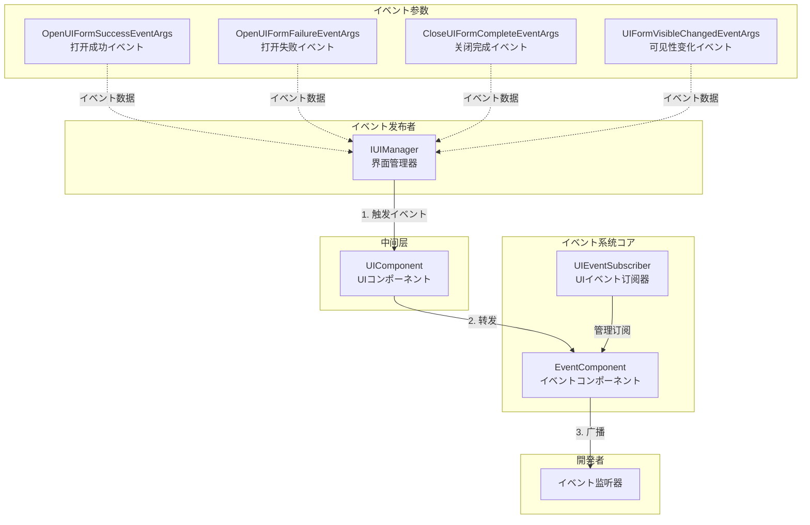
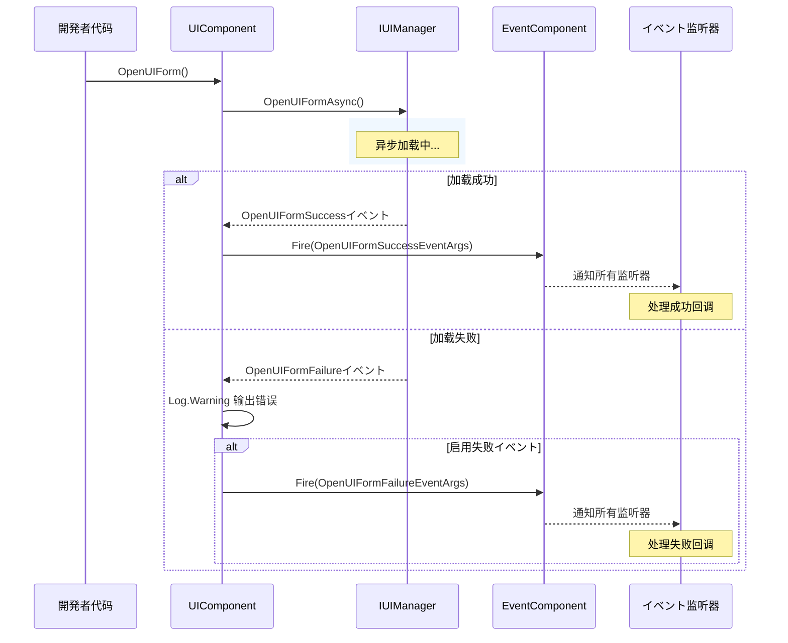
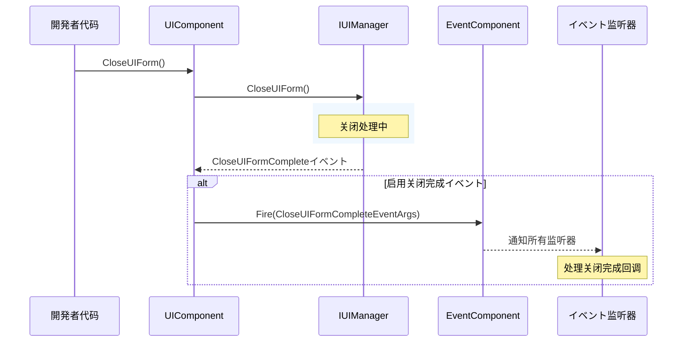

# イベント系统

GameFrameX.UI 模块提供します完善的イベント系统，に使用监听 UI 界面的各种ステータス变化。本文档详细介绍 UI 模块的イベント机制、イベントクラス型以及如何使用这些イベント。

## 概要

UI 模块的イベント系统基づく观察者模式设计，允许開発者订阅 UI 界面的关键ステータス变化。主要包含以下能力：

- **界面打开イベント**：监听界面打开成功或失败
- **界面关闭イベント**：监听界面关闭完成
- **界面可见性变化**：监听界面显示/隐藏ステータス变化
- **统一イベント订阅**：を通じて UIEventSubscriber 统一管理イベント订阅

イベント系统与 GameFrameX 的コアイベントコンポーネント（EventComponent）集成，サポート全局イベント广播。

> 详细的イベントコンポーネント API お願いします参考 [EventComponent](https://github.com/GameFrameX/com.gameframex.unity.event/blob/main/Runtime/EventComponent.cs) 文档。

## 架构



**架构説明：**

1. **IUIManager** 是 UI 管理器的コアインターフェース，负责 UI 界面的加载、显示、隐藏等操作，并在操作完成后触发相应イベント
2. **UIComponent** 是 Unity 层面的 UI コンポーネント，订阅 IUIManager 的イベント并可选择性地转发给全局的 EventComponent
3. **EventComponent** 是 GameFrameX 的コアイベントコンポーネント，负责全局イベント的注册和分发
4. **UIEventSubscriber** は工具クラス，帮助開発者更方便地管理 UI イベント订阅，サポート按所有者（Owner）批量取消订阅
5. **EventArgs** 是各种イベント参数クラス，封装了イベント関連的业务数据

## コアイベントクラス型

UI 模块定义了以下コアイベントクラス型，所有イベント参数クラス都を継承 `GameEventArgs`：

### 1. OpenUIFormSuccessEventArgs - 界面打开成功イベント

当 UI 界面成功打开时触发。

```csharp
> Source: [Runtime/EventArgs/OpenUIFormSuccessEventArgs.cs](https://github.com/GameFrameX/com.gameframex.unity.ui/blob/main/Runtime/EventArgs/OpenUIFormSuccessEventArgs.cs#L42-L143)

public sealed class OpenUIFormSuccessEventArgs : GameEventArgs
{
    // イベントID
    public static readonly string EventId = typeof(OpenUIFormSuccessEventArgs).FullName;
    
    // 取得打开成功的界面
    public UIForm UIForm { get; private set; }
    
    // 取得加载持续时间（秒）
    public float Duration { get; private set; }
    
    // 取得用户自定义数据
    public object UserData { get; private set; }
    
    // 作成イベントインスタンス
    public static OpenUIFormSuccessEventArgs Create(IUIForm uiForm, float duration, object userData);
}
```

### 2. OpenUIFormFailureEventArgs - 界面打开失败イベント

当 UI 界面打开失败时触发。

```csharp
> Source: [Runtime/EventArgs/OpenUIFormFailureEventArgs.cs](https://github.com/GameFrameX/com.gameframex.unity.ui/blob/main/Runtime/EventArgs/OpenUIFormFailureEventArgs.cs#L42-L172)

public sealed class OpenUIFormFailureEventArgs : GameEventArgs
{
    // イベントID
    public static readonly string EventId = typeof(OpenUIFormFailureEventArgs).FullName;
    
    // 取得界面序列编号
    public int SerialId { get; private set; }
    
    // 取得界面リソース名称
    public string UIFormAssetName { get; private set; }
    
    // 取得是否暂停被覆盖的界面
    public bool PauseCoveredUIForm { get; private set; }
    
    // 取得错误信息
    public string ErrorMessage { get; private set; }
    
    // 取得用户自定义数据
    public object UserData { get; private set; }
    
    // 作成イベントインスタンス
    public static OpenUIFormFailureEventArgs Create(int serialId, string uiFormAssetName, bool pauseCoveredUIForm, string errorMessage, object userData);
}
```

### 3. CloseUIFormCompleteEventArgs - 界面关闭完成イベント

当 UI 界面关闭完成时触发。

```csharp
> Source: [Runtime/EventArgs/CloseUIFormCompleteEventArgs.cs](https://github.com/GameFrameX/com.gameframex.unity.ui/blob/main/Runtime/EventArgs/CloseUIFormCompleteEventArgs.cs#L43-L158)

public sealed class CloseUIFormCompleteEventArgs : GameEventArgs
{
    // イベントID
    public static readonly string EventId = typeof(CloseUIFormCompleteEventArgs).FullName;
    
    // 取得界面序列编号
    public int SerialId { get; private set; }
    
    // 取得界面リソース名称
    public string UIFormAssetName { get; private set; }
    
    // 取得界面所属的界面组
    public IUIGroup UIGroup { get; private set; }
    
    // 取得用户自定义数据
    public object UserData { get; private set; }
    
    // 作成イベントインスタンス
    public static CloseUIFormCompleteEventArgs Create(int serialId, string uiFormAssetName, IUIGroup uiGroup, object userData);
}
```

### 4. UIFormVisibleChangedEventArgs - 界面可见性变化イベント

当 UI 界面的可见性ステータス发生变化时触发。

```csharp
> Source: [Runtime/EventArgs/UIFormVisibleChangedEventArgs.cs](https://github.com/GameFrameX/com.gameframex.unity.ui/blob/main/Runtime/EventArgs/UIFormVisibleChangedEventArgs.cs#L42-L143)

public sealed class UIFormVisibleChangedEventArgs : GameEventArgs
{
    // イベントID
    public static readonly string EventId = typeof(UIFormVisibleChangedEventArgs).FullName;
    
    // 取得激活ステータス变化的界面
    public IUIForm UIForm { get; private set; }
    
    // 取得界面是否可见
    public bool Visible { get; private set; }
    
    // 取得用户自定义数据
    public object UserData { get; private set; }
    
    // 作成イベントインスタンス
    public static UIFormVisibleChangedEventArgs Create(IUIForm uiForm, bool visible, object userData = null);
}
```

## IUIManager イベント定义

IUIManager インターフェース定义了以下イベント，UIComponent 会订阅这些イベント：

```csharp
> Source: [Runtime/UI/IUIManager.cs](https://github.com/GameFrameX/com.gameframex.unity.ui/blob/main/Runtime/UI/IUIManager.cs#L109-L142)

public interface IUIManager
{
    /// <summary>
    /// 打开界面成功イベント
    /// </summary>
    event EventHandler<OpenUIFormSuccessEventArgs> OpenUIFormSuccess;

    /// <summary>
    /// 打开界面失败イベント
    /// </summary>
    event EventHandler<OpenUIFormFailureEventArgs> OpenUIFormFailure;

    /// <summary>
    /// 关闭界面完成イベント
    /// </summary>
    event EventHandler<CloseUIFormCompleteEventArgs> CloseUIFormComplete;
}
```

## イベント订阅方法

### メソッド一：を通じて UIComponent 订阅

UIComponent 在初期化时会订阅 IUIManager 的イベント，并を通じて配置决定是否转发给全局 EventComponent：

```csharp
> Source: [Runtime/UIComponent.cs](https://github.com/GameFrameX/com.gameframex.unity.ui/blob/main/Runtime/UIComponent.cs#L430-L460)

private void OnAwake(object sender)
{
    m_UIManager = GameFrameworkEntry.GetModule<IUIManager>();
    
    if (m_EnableOpenUIFormSuccessEvent)
    {
        m_UIManager.OpenUIFormSuccess += OnOpenUIFormSuccess;
    }
    
    m_UIManager.OpenUIFormFailure += OnOpenUIFormFailure;
    
    if (m_EnableCloseUIFormCompleteEvent)
    {
        m_UIManager.CloseUIFormComplete += OnCloseUIFormComplete;
    }
}

private void OnOpenUIFormSuccess(object sender, OpenUIFormSuccessEventArgs e)
{
    m_EventComponent.Fire(this, e);
}

private void OnOpenUIFormFailure(object sender, OpenUIFormFailureEventArgs e)
{
    Log.Warning("Open UI form failure, asset name '{0}', pause covered UI form '{1}', error message '{2}'.", 
        e.UIFormAssetName, e.PauseCoveredUIForm, e.ErrorMessage);
    if (m_EnableOpenUIFormFailureEvent)
    {
        m_EventComponent.Fire(this, e);
    }
}

private void OnCloseUIFormComplete(object sender, CloseUIFormCompleteEventArgs e)
{
    m_EventComponent.Fire(this, e);
}
```

### メソッド二：を通じて UIEventSubscriber 订阅

UIEventSubscriber は便捷的イベント订阅管理クラス，サポート按所有者（Owner）批量管理订阅：

```csharp
> Source: [Runtime/UIEventSubscriber.cs](https://github.com/GameFrameX/com.gameframex.unity.ui/blob/main/Runtime/UIEventSubscriber.cs#L44-L218)

public sealed class UIEventSubscriber : IReference
{
    // 取得或設定持有者
    public object Owner { get; private set; }
    
    // 检查并订阅イベント
    public void CheckSubscribe(string id, EventHandler<GameEventArgs> handler);
    
    // 取消订阅イベント
    public void UnSubscribe(string id, EventHandler<GameEventArgs> handler);
    
    // 触发イベント
    public void Fire(string id, GameEventArgs e);
    
    // 取消所有订阅
    public void UnSubscribeAll(List<string> ignoreList = null);
    
    // 作成イベント订阅器
    public static UIEventSubscriber Create(object owner);
    
    // 清理イベント订阅器
    public void Clear();
}
```

## 使用例

### 例一：监听界面打开成功イベント

```csharp
using GameFrameX.UI.Runtime;
using GameFrameX.Event.Runtime;
using GameFrameX.Runtime;

public class UIMainMenuForm : MonoBehaviour
{
    private void Start()
    {
        // 订阅打开成功イベント
        var eventComponent = GameEntry.GetComponent<EventComponent>();
        eventComponent.Subscribe(OpenUIFormSuccessEventArgs.EventId, OnOpenUIFormSuccess);
    }
    
    private void OnOpenUIFormSuccess(object sender, GameEventArgs e)
    {
        var args = (OpenUIFormSuccessEventArgs)e;
        Debug.Log($"界面打开成功: {args.UIForm.Name}, 加载耗时: {args.Duration}秒");
    }
    
    private void OnDestroy()
    {
        // 取消订阅
        var eventComponent = GameEntry.GetComponent<EventComponent>();
        eventComponent.Unsubscribe(OpenUIFormSuccessEventArgs.EventId, OnOpenUIFormSuccess);
    }
}
```

### 例二：监听界面打开失败イベント

```csharp
using GameFrameX.UI.Runtime;
using GameFrameX.Event.Runtime;
using GameFrameX.Runtime;

public class UILoadFailedHandler : MonoBehaviour
{
    private void Start()
    {
        var eventComponent = GameEntry.GetComponent<EventComponent>();
        eventComponent.Subscribe(OpenUIFormFailureEventArgs.EventId, OnOpenUIFormFailure);
    }
    
    private void OnOpenUIFormFailure(object sender, GameEventArgs e)
    {
        var args = (OpenUIFormFailureEventArgs)e;
        Debug.LogError($"界面打开失败: {args.UIFormAssetName}, 错误信息: {args.ErrorMessage}");
    }
    
    private void OnDestroy()
    {
        var eventComponent = GameEntry.GetComponent<EventComponent>();
        eventComponent.Unsubscribe(OpenUIFormFailureEventArgs.EventId, OnOpenUIFormFailure);
    }
}
```

### 例三：使用 UIEventSubscriber 管理订阅

```csharp
using GameFrameX.UI.Runtime;
using GameFrameX.Event.Runtime;
using GameFrameX.Runtime;
using GameFrameX.ObjectPool;

public class UIGamePanel : MonoBehaviour
{
    private UIEventSubscriber _eventSubscriber;
    
    private void Awake()
    {
        // 作成イベント订阅器，传入 this 作为所有者
        _eventSubscriber = UIEventSubscriber.Create(this);
        
        // 订阅多个イベント
        _eventSubscriber.CheckSubscribe(OpenUIFormSuccessEventArgs.EventId, OnOpenUIFormSuccess);
        _eventSubscriber.CheckSubscribe(CloseUIFormCompleteEventArgs.EventId, OnCloseUIFormComplete);
    }
    
    private void OnOpenUIFormSuccess(object sender, GameEventArgs e)
    {
        var args = (OpenUIFormSuccessEventArgs)e;
        Debug.Log($"界面已打开: {args.UIForm.Name}");
    }
    
    private void OnCloseUIFormComplete(object sender, GameEventArgs e)
    {
        var args = (CloseUIFormCompleteEventArgs)e;
        Debug.Log($"界面已关闭: {args.UIFormAssetName}");
    }
    
    private void OnDestroy()
    {
        // 批量取消所有订阅
        if (_eventSubscriber != null)
        {
            _eventSubscriber.UnSubscribeAll();
            ReferencePool.Release(_eventSubscriber);
        }
    }
}
```

### 例四：使用 UIEventSubscriber 取消特定イベント订阅

```csharp
using GameFrameX.UI.Runtime;
using GameFrameX.Event.Runtime;
using GameFrameX.Runtime;
using GameFrameX.ObjectPool;
using System.Collections.Generic;

public class UIPermanentPanel : MonoBehaviour
{
    private UIEventSubscriber _eventSubscriber;
    private List<string> _ignoredEvents = new List<string> { CloseUIFormCompleteEventArgs.EventId };
    
    private void Awake()
    {
        _eventSubscriber = UIEventSubscriber.Create(this);
        _eventSubscriber.CheckSubscribe(OpenUIFormSuccessEventArgs.EventId, OnOpenUIFormSuccess);
        _eventSubscriber.CheckSubscribe(OpenUIFormFailureEventArgs.EventId, OnOpenUIFormFailure);
        _eventSubscriber.CheckSubscribe(CloseUIFormCompleteEventArgs.EventId, OnCloseUIFormComplete);
    }
    
    private void OnOpenUIFormSuccess(object sender, GameEventArgs e) { /* ... */ }
    private void OnOpenUIFormFailure(object sender, GameEventArgs e) { /* ... */ }
    private void OnCloseUIFormComplete(object sender, GameEventArgs e) { /* ... */ }
    
    private void OnDestroy()
    {
        // 取消除 CloseUIFormComplete 之外的所有订阅
        _eventSubscriber.UnSubscribeAll(_ignoredEvents);
        ReferencePool.Release(_eventSubscriber);
    }
}
```

## イベントフロー

### 界面打开イベントフロー



### 界面关闭イベントフロー



## イベント配置

UIComponent 提供します以下序列化字段に使用控制イベント行为：

```csharp
> Source: [Runtime/UIComponent.cs](https://github.com/GameFrameX/com.gameframex.unity.ui/blob/main/Runtime/UIComponent.cs#L62-L86)

[SerializeField] private bool m_EnableOpenUIFormSuccessEvent = true;    // 启用打开成功イベント
[SerializeField] private bool m_EnableOpenUIFormFailureEvent = true;     // 启用打开失败イベント
[SerializeField] private bool m_EnableCloseUIFormCompleteEvent = true;   // 启用关闭完成イベント

[SerializeField] private bool m_IsEnableUIShowAnimation = false;          // 启用显示动画
[SerializeField] private bool m_IsEnableUIHideAnimation = false;        // 启用隐藏动画
```

| 配置项 | クラス型 | 默认值 | 説明 |
|--------|------|--------|------|
| m_EnableOpenUIFormSuccessEvent | bool | true | 是否触发打开成功イベント |
| m_EnableOpenUIFormFailureEvent | bool | true | 是否触发打开失败イベント |
| m_EnableCloseUIFormCompleteEvent | bool | true | 是否触发关闭完成イベント |
| m_IsEnableUIShowAnimation | bool | false | 是否启用界面显示动画 |
| m_IsEnableUIHideAnimation | bool | false | 是否启用界面隐藏动画 |

## 注意事项

1. **イベント订阅内存管理**：在 MonoBehaviour 的 `OnDestroy` メソッド中务必取消イベント订阅，避免内存泄漏和空引用異常
2. **イベント参数复用**：所有 EventArgs クラス都使用 ReferencePool 进行オブジェクトプール管理，作成后使用完毕会自动回收，无需手动释放
3. **イベント顺序**：イベント触发顺序为：OpenUIFormFailure/OpenUIFormSuccess → 其他业务逻辑，開発者应に基づいて必要选择合适的订阅点
4. **跨シーンイベント**：を通じて EventComponent 订阅的イベント是全局的，即使界面关闭后也必要手动取消订阅

## 関連リンク

- [UI コンポーネント](./4-core-concepts.ui-component) - UI コンポーネント的コア機能
- [UI 窗体](./4-core-concepts.ui-form) - UI 窗体的基本概念
- [UI 组系统](./4-core-concepts.ui-group) - UI 组管理
- [IUIManager インターフェース](./5-api-reference.iuimanager) - 完整的 IUIManager API 参考
- [GameFrameX Event 模块](https://github.com/GameFrameX/com.gameframex.unity.event) - コアイベントコンポーネント
