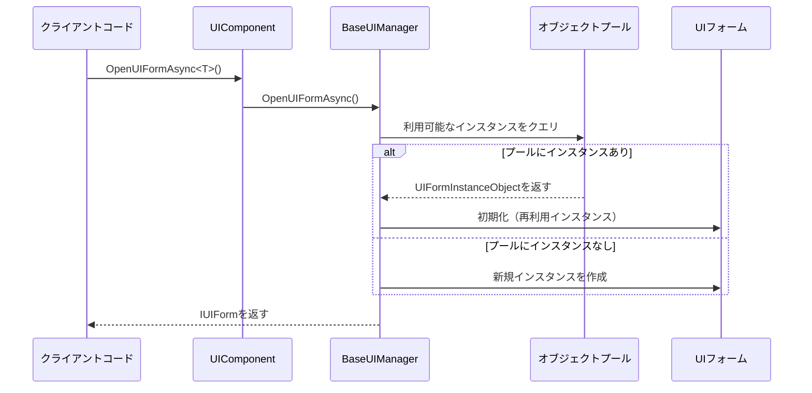
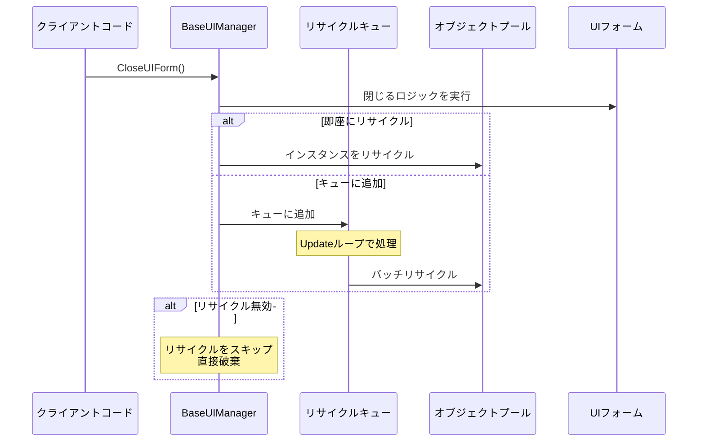
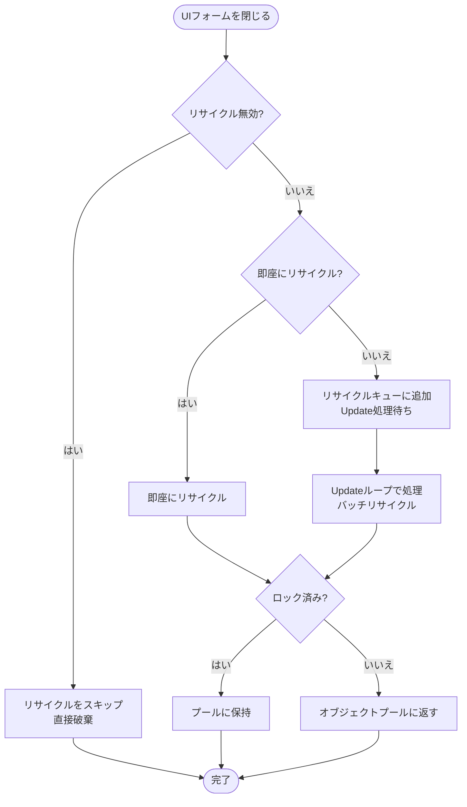

# オブジェクトプール管理

オブジェクトプール管理は、GameFrameX UIシステムにおけるUIフォームインスタンスの作成と破棄を最適化するコアメカニズムです。オブジェクトプールを通じて、システムが閉じられたUIフォームインスタンスを再利用し、頻繁なインスタンス化によるパフォーマンスオーバーヘッドを回避できます。

## 概要

ゲームやアプリケーションでは、UIフォームを開く・閉じるは非常に頻繁な操作です。従来の方法では、フォームを開くたびに新しいインスタンスを作成し、閉じるときに破棄していましたが、これにより以下が発生します：

- **メモリの断片化**：頻繁なオブジェクトの作成と破棄がメモリ断片化を引き起こす
- **GC的压力**：大量の一時オブジェクトがガベージコレクションの頻度を高める
- **読み込み遅延**：UIプレハブのインスタンス化には時間がかかり、ユーザー体験に影響する

オブジェクトプールは这些问题を解決します：

- **インスタンスの再利用**：閉じられたUIフォームは破棄されず、オブジェクトプールに回收・格納される
- **オンデマンド配分**：プールからインスタンスを取得する際、利用可能なインスタンスがあれば直接再利用し、なければ新しいインスタンスを作成
- **自動管理**：オブジェクトプールは期限切れインスタンスの自動解放と容量管理をサポート

### コアコンセプト

| コンセプト | 説明 |
|---------|------|
| **オブジェクトプール** | 再利用可能なUIフォームインスタンスを格納するコンテナ |
| **リサイクル** | 閉じられたUIフォームインスタンスをオブジェクトプールに返す |
| **リリース** | 期限切れまたは余分なインスタンスをプールから完全に削除 |
| **ロック** | ロックされたインスタンスはプールによって自動解放されない |
| **優先度** | 容量不足時に保持するインスタンスを決定するために使用される |

## アーキテクチャ

```mermaid
flowchart TD
    subgraph UIComponent["UIComponent"]
        A1[UIComponent] --> A2[IUIManager]
    end

    subgraph BaseUIManager["BaseUIManager"]
        B1[IObjectPoolManager] --> B2[IObjectPool&lt;UIFormInstanceObject&gt;]
        B2 --> B3[UIFormInstanceObject Pool<br/>"UI Instance Pool"]
    end

    subgraph PoolObjects["プールオブジェクト"]
        C1[UIFormInstanceObject 1]
        C2[UIFormInstanceObject 2]
        C3[UIFormInstanceObject N]
    end

    subgraph UIForms["UIフォーム"]
        D1[UIフォーム インスタンス1]
        D2[UIフォーム インスタンス2]
        D3[UIフォーム インスタンスN]
    end

    A2 --> B1
    B2 --- C1
    B2 --- C2
    B2 --- C3
    C1 --- D1
    C2 --- D2
    C3 --- D3
```

### コンポーネントの説明

| コンポーネント | 責任 |
|------------|------|
| **UIComponent** | UIコンポーネントのエントリーポイント、オブジェクトプールマネージャ設定の初期化を担当 |
| **BaseUIManager** | コアUIマネージャ、オブジェクトプールの作成と操作を管理 |
| **IObjectPoolManager** | 外部オブジェクトプールマネージャインターフェース（GameFrameX.ObjectPoolパッケージより） |
| **IObjectPool\<UIFormInstanceObject\>** | UIフォームインスタンス専用のオブジェクトプール |
| **UIFormInstanceObject** | UIフォームインスタンスをラップするラッパークラス、リソースハンドルなどの情報を含む |

### オブジェクトプールタイプ

システムは`CreateMultiSpawnObjectPool`メソッドを使用してマルチスポーンオブジェクトプールを作成します，这意味着：

- 同じタイプのUIフォームの複数のインスタンスを同時に存在させられる
- 各インスタンスは独立して自らのライフサイクルを管理する
- インスタンスレベルのロックと優先度の設定をサポート

> Source: [BaseUIManager.cs#L268](https://github.com/GameFrameX/com.gameframex.unity.ui/blob/main/Runtime/BaseUIManager.cs#L268)

## コアフロー

### UIフォームを開くフロー



### UIフォームをリサイクルするフロー



### リサイクル判定フロー



## 設定オプション

オブジェクトプールパラメータはUIComponentで設定でき、これらの設定は`Start()`メソッドでUIマネージャに適用されます。

| 設定 | タイプ | デフォルト | 説明 |
|------|------|---------|------|
| `InstanceAutoReleaseInterval` | float | 60f | オブジェクトプール自動解放間隔（秒） |
| `InstanceCapacity` | int | 16 | オブジェクトプール容量、キャッシュ可能なインスタンスの最大数 |
| `InstanceExpireTime` | float | 60f | インスタンス期限切れ時間（秒）；この時間を超えた未使用インスタンスは解放される |
| `RecycleInterval` | int | 60 | リサイクル間隔（秒）；リサイクルキューの処理速度を制御 |
| `EnableAutoReleaseUIForm` | bool | true | UIフォームの自動解放を有効にするかどうか |

> Source: [UIComponent.cs#L113-L141](https://github.com/GameFrameX/com.gameframex.unity.ui/blob/main/Runtime/UIComponent.cs#L113-L141)

### IUIManagerインターフェース 통한設定

```csharp
// UIコンポーネントを取得
var uiComponent = GameEntry.GetComponent<UIComponent>();

// オブジェクトプールパラメータを設定
uiComponent.InstanceAutoReleaseInterval = 30f;  // 30秒自動解放
uiComponent.InstanceCapacity = 32;               // 容量を32に変更
uiComponent.InstanceExpireTime = 30f;             // 30秒期限切れ
uiComponent.RecycleInterval = 30;                // 30秒リサイクル間隔
```

### 実行時動的設定

```csharp
// UIフォームを取得
IUIForm uiForm = await uiComponent.OpenUIFormAsync<MainForm>("UI/MainForm");

// インスタンスロックを設定（解放を防止）
uiComponent.SetUIFormInstanceLocked(uiForm.Handle, true);

// インスタンス優先度を設定（値が大きいほど優先的に保持）
uiComponent.SetUIFormInstancePriority(uiForm.Handle, 100);
```

> Source: [BaseUIManager.Open.cs#L164-L182](https://github.com/GameFrameX/com.gameframex.unity.ui/blob/main/Runtime/BaseUIManager.Open.cs#L164-L182)

## UIフォームのリサイクル制御

各UIフォームは独立してリサイクルを許可するかを制御できます。

### UIFormプロパティ

| プロパティ | タイプ | 説明 |
|----------|------|------|
| `IsDisableRecycling` | bool | リサイクルを無効にするかどうか。リサイクルが無効化されたUIフォームは、閉じられた時にオブジェクトプールに保存されず、直接破棄される |
| `IsDisableClosing` | bool | 閉じることを無効にするかどうか。閉じることを無効化されたUIフォームは閉じられない |
| `IsCanRecycle` | bool | リサイクル可能かどうか（読み取り専用）、他のプロパティから計算される |
| `ReleaseStartTime` | DateTime | リサイクル開始時間、リサイクル条件が満たされたかを判断するために使用 |
| `RecycleInterval` | int | このUIフォームのリサイクル間隔（秒） |

> Source: [IUIForm.cs#L84-L114](https://github.com/GameFrameX/com.gameframex.unity.ui/blob/main/Runtime/UI/IUIForm.cs#L84-L114)

### 使用例

UIフォームスクリプトでリサイクル挙動を制御：

```csharp
public class MyUIForm : UIForm
{
    protected override void OnInit()
    {
        // このフォームのリサイクル機能を無効化
        // 閉じた後、直接破棄され、オブジェクトプールに保存されない
        IsDisableRecycling = true;

        // または閉じる機能を無効化
        // IsDisableClosing = true;
    }

    protected override void OnRecycle()
    {
        // フォームがリサイクルされる時に実行されるロジック
        // ここで状態を保存またはリソースをクリーンアップできる
        base.OnRecycle();
    }
}
```

> Source: [UIForm.cs#L56](https://github.com/GameFrameX/com.gameframex.unity.ui/blob/main/Runtime/UIForm.cs#L56)
> Source: [UIForm.cs#L625-L629](https://github.com/GameFrameX/com.gameframex.unity.ui/blob/main/Runtime/UIForm.cs#L625-L629)

## UIFormInstanceObject

`UIFormInstanceObject`はオブジェクトプールに格納されるラッパーオブジェクトであり、UIフォームインスタンスとその関連リソースをラップします。

```csharp
public sealed class UIFormInstanceObject : ObjectBase
{
    private object m_UIFormAsset = null;           // UIアセットオブジェクト
    private string m_UIFormAssetPath = null;        // UIアセットパス
    private string m_UIFormAssetName = null;        // UIアセット名
    private IUIFormHelper m_UIFormHelper = null;    // UIヘルパー
    private object m_AssetHandle = null;           // アセットハンドル

    protected override void Release(bool isShutdown)
    {
        // 解放時、ヘルパーを呼び出してUIリソースをリサイクル
        m_UIFormHelper.ReleaseUIForm(m_UIFormAsset, Target, m_AssetHandle,
            m_UIFormAssetPath, m_UIFormAssetName);
    }
}
```

> Source: [BaseUIManager.UIFormInstanceObject.cs#L41-L104](https://github.com/GameFrameX/com.gameframex.unity.ui/blob/main/Runtime/BaseUIManager.UIFormInstanceObject.cs#L41-L104)

## ベストプラクティス

### 1. 適切に容量を設定する

同時に表示するUIフォームの数に基づいて容量を設定：

```csharp
// 同時に最大10種類の異なるUIフォームを表示する場合
uiComponent.InstanceCapacity = 20; // 少し余裕を持たせる
```

### 2. 自動解放間隔を調整する

UI使用頻度に基づいて調整：

```csharp
// 頻繁に入れ替わるUI：短い間隔
uiComponent.InstanceAutoReleaseInterval = 30f;
uiComponent.InstanceExpireTime = 30f;

// あまり頻繁に変更されないUI：長い間隔
uiComponent.InstanceAutoReleaseInterval = 300f;
uiComponent.InstanceExpireTime = 300f;
```

### 3. 重要なインスタンスをロックする

メモリに常駐させる必要があるUIフォームをロック：

```csharp
// 設定フォームを開き、ロックする
var settingsForm = await uiComponent.OpenUIFormAsync<SettingsForm>("UI/Settings");
uiComponent.SetUIFormInstanceLocked(settingsForm.Handle, true);
```

### 4. 頻繁に破棄するUIではリサイクルを無効にする

頻繁に開いて閉じるが再利用が必要ないUIでは、リサイクルを無効化：

```csharp
public class PopupTipForm : UIForm
{
    protected override void OnInit()
    {
        // ポップアップスタイルのUIは毎回新しいコンテンツがあるため、リサイクルを無効化
        IsDisableRecycling = true;
    }
}
```

## 関連リンク

- [UIコンポーネント](./4-core-concepts.ui-component)
- [UIフォーム](./4-core-concepts.ui-form)
- [UIグループシステム](./4-core-concepts.ui-group)
- [IUIManager APIリファレンス](./5-api-reference.iuimanager)
- [UIForm APIリファレンス](./5-api-reference.ui-form)
- [イベントシステム](./6-event-system)