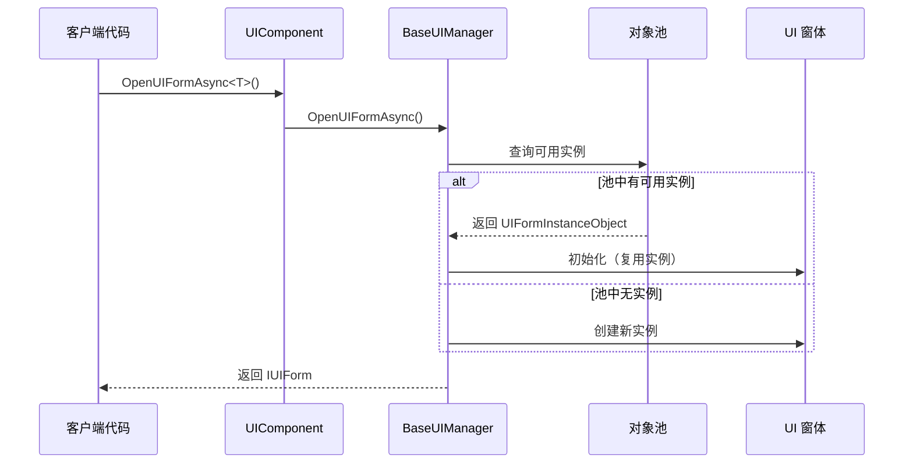
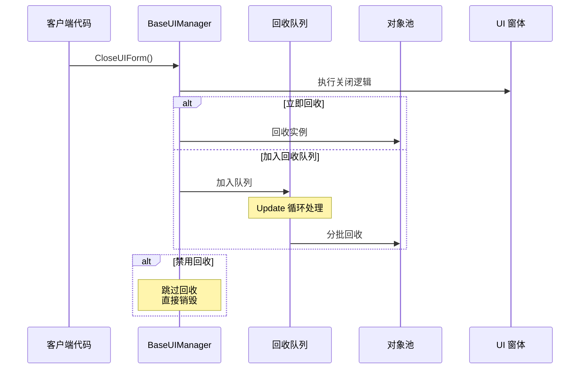
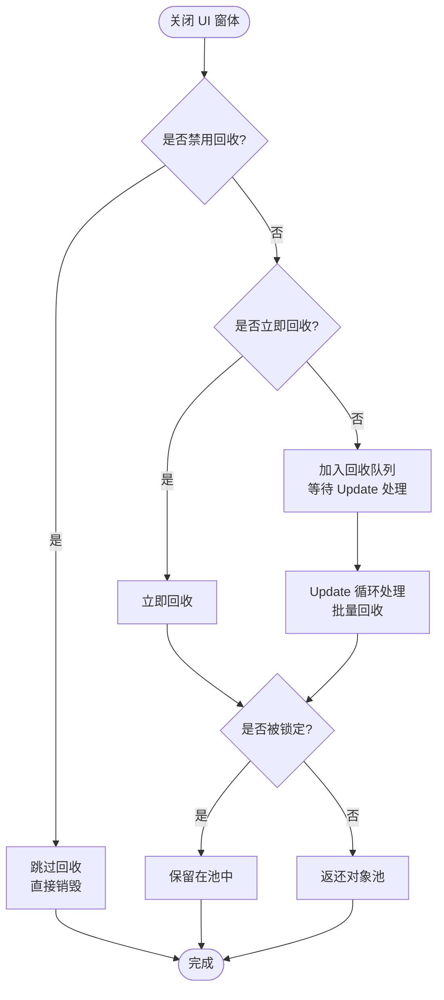

# 对象池管理

对象池管理是 GameFrameX UI 系统中用于最適化 UI 窗体インスタンス作成和破棄的コア机制。通过对象池，系统〜できます重复使用已閉じる的 UI 窗体インスタンス，避免频繁的インスタンス化带来的性能开销。

## 概要

在游戏或应用中，UI 窗体的打开和閉じる是非常频繁的操作。传统的做法是每次打开时作成新インスタンス，閉じる时破棄インスタンス，这种方法会导致：

- **内存碎片化**：频繁的对象作成和破棄会导致内存碎片
- **GC 压力**：大量临时对象会增加垃圾回收的频率
- **ロード延迟**：インスタンス化 UI 预制体〜する必要があります时间，影响ユーザー体验

对象池通过以下方法解决这些問題：

- **インスタンス复用**：閉じる的 UI 窗体不会被破棄，而是回收并存入池中
- **按需分配**：从池中取得インスタンス时，もし池中有可用インスタンス则直接复用，没有才作成新インスタンス
- **自动管理**：对象池サポート自动解放过期インスタンス和容量管理

### コアコンセプト

| コンセプト | 説明 |
|------|------|
| **对象池 (Object Pool)** | 存储可复用 UI 窗体インスタンス的容器 |
| **回收 (Recycle)** | 将閉じる的 UI 窗体インスタンス返还给对象池 |
| **解放 (Release)** | 从池中彻底移除过期或多余的インスタンス |
| **锁定 (Locked)** | 被锁定的インスタンス不会被池自动解放 |
| **优先级 (Priority)** | 用于确定在容量不足时优先保留哪些インスタンス |

## アーキテクチャ

```mermaid
flowchart TD
    subgraph UIComponent["UIComponent"]
        A1[UIComponent] --> A2[IUIManager]
    end

    subgraph BaseUIManager["BaseUIManager"]
        B1[IObjectPoolManager] --> B2[IObjectPool&lt;UIFormInstanceObject&gt;]
        B2 --> B3[UIFormInstanceObject Pool<br/>"UI Instance Pool"]
    end

    subgraph PoolObjects["池对象"]
        C1[UIFormInstanceObject 1]
        C2[UIFormInstanceObject 2]
        C3[UIFormInstanceObject N]
    end

    subgraph UIForms["UI 窗体"]
        D1[UI 窗体实例 1]
        D2[UI 窗体实例 2]
        D3[UI 窗体实例 N]
    end

    A2 --> B1
    B2 --- C1
    B2 --- C2
    B2 --- C3
    C1 --- D1
    C2 --- D2
    C3 --- D3
```

### コンポーネント説明

| コンポーネント | 职责 |
|------|------|
| **UIComponent** | UI コンポーネント入口，负责初期化对象池マネージャー設定 |
| **BaseUIManager** | UI マネージャーコア，管理对象池的作成和操作 |
| **IObjectPoolManager** | 外部对象池マネージャーインターフェース（来自 GameFrameX.ObjectPool パッケージ） |
| **IObjectPool\<UIFormInstanceObject\>** | UI 窗体インスタンス专用对象池 |
| **UIFormInstanceObject** | カプセル化 UI 窗体インスタンス的パッケージ装类，パッケージ含リソース句柄等情報 |

### 对象池タイプ

系统使用 `CreateMultiSpawnObjectPool` メソッド作成多生成对象池，这意味着：

- 同一タイプ的 UI 窗体〜できます同時に存在多个インスタンス
- 每个インスタンス独立管理自己的ライフサイクル
- サポート設定インスタンス级别的锁定和优先级

> Source: [BaseUIManager.cs#L268](https://github.com/GameFrameX/com.gameframex.unity.ui/blob/main/Runtime/BaseUIManager.cs#L268)

## コアフロー

### UI 窗体打开フロー



### UI 窗体回收フロー



### 回收决策フロー



## 設定オプション

在 UIComponent 中〜できます設定对象池的各项パラメータ，这些設定会在 `Start()` メソッド中应用到 UI マネージャー。

| 設定项 | タイプ | デフォルト值 | 説明 |
|--------|------|--------|------|
| `InstanceAutoReleaseInterval` | float | 60f | 对象池自动解放可解放对象的间隔秒数 |
| `InstanceCapacity` | int | 16 | 对象池的容量，表示最多缓存多少个インスタンス |
| `InstanceExpireTime` | float | 60f | 对象过期时间（秒），超过此时间的未使用インスタンス会被解放 |
| `RecycleInterval` | int | 60 | 回收间隔秒数，控制从回收队列処理的速度 |
| `EnableAutoReleaseUIForm` | bool | true | 是否启用 UI 自动解放 |

> Source: [UIComponent.cs#L113-L141](https://github.com/GameFrameX/com.gameframex.unity.ui/blob/main/Runtime/UIComponent.cs#L113-L141)

### 通过 IUIManager インターフェース設定

```csharp
// 获取 UI 组件
var uiComponent = GameEntry.GetComponent<UIComponent>();

// 配置对象池参数
uiComponent.InstanceAutoReleaseInterval = 30f;  // 30秒自动释放
uiComponent.InstanceCapacity = 32;               // 容量改为 32
uiComponent.InstanceExpireTime = 30f;             // 30秒过期
uiComponent.RecycleInterval = 30;                // 30秒回收间隔
```

### ランタイム动态設定

```csharp
// 获取 UI 管理器
IUIForm uiForm = await uiComponent.OpenUIFormAsync<MainForm>("UI/MainForm");

// 设置实例锁定（防止被释放）
uiComponent.SetUIFormInstanceLocked(uiForm.Handle, true);

// 设置实例优先级（数值越高越优先保留）
uiComponent.SetUIFormInstancePriority(uiForm.Handle, 100);
```

> Source: [BaseUIManager.Open.cs#L164-L182](https://github.com/GameFrameX/com.gameframex.unity.ui/blob/main/Runtime/BaseUIManager.Open.cs#L164-L182)

## UI 窗体回收控制

每个 UI 窗体都〜できます独立控制是否允许回收。

### UIForm プロパティ

| プロパティ | タイプ | 説明 |
|------|------|------|
| `IsDisableRecycling` | bool | 是否禁用回收。禁用的 UI 窗体閉じる后会被直接破棄，不会存入对象池 |
| `IsDisableClosing` | bool | 是否禁用閉じる。禁用的 UI 窗体无法被閉じる |
| `IsCanRecycle` | bool | 是否〜できます回收（只读），由其他プロパティ综合计算得出 |
| `ReleaseStartTime` | DateTime | 回收开始时间，用于判断是否已达到回收条件 |
| `RecycleInterval` | int | 该 UI 窗体的回收间隔（秒） |

> Source: [IUIForm.cs#L84-L114](https://github.com/GameFrameX/com.gameframex.unity.ui/blob/main/Runtime/UI/IUIForm.cs#L84-L114)

### 使用例

在 UI 窗体脚本中控制回收行为：

```csharp
public class MyUIForm : UIForm
{
    protected override void OnInit()
    {
        // 禁用此窗体的回收功能
        // 关闭后会被直接销毁，不会存入对象池
        IsDisableRecycling = true;
        
        // 或者禁用关闭功能
        // IsDisableClosing = true;
    }
    
    protected override void OnRecycle()
    {
        // 当窗体被回收时执行的逻辑
        // 可以在这里保存状态或清理资源
        base.OnRecycle();
    }
}
```

> Source: [UIForm.cs#L56](https://github.com/GameFrameX/com.gameframex.unity.ui/blob/main/Runtime/UIForm.cs#L56)
> Source: [UIForm.cs#L625-L629](https://github.com/GameFrameX/com.gameframex.unity.ui/blob/main/Runtime/UIForm.cs#L625-L629)

## UIFormInstanceObject

`UIFormInstanceObject` 是存储在对象池中的パッケージ装对象，カプセル化了 UI 窗体インスタンス及其相关リソース。

```csharp
public sealed class UIFormInstanceObject : ObjectBase
{
    private object m_UIFormAsset = null;           // UI 资源对象
    private string m_UIFormAssetPath = null;        // UI 资源路径
    private string m_UIFormAssetName = null;        // UI 资源名称
    private IUIFormHelper m_UIFormHelper = null;    // UI 辅助器
    private object m_AssetHandle = null;           // 资源句柄
    
    protected override void Release(bool isShutdown)
    {
        // 释放时调用辅助器回收 UI 资源
        m_UIFormHelper.ReleaseUIForm(m_UIFormAsset, Target, m_AssetHandle, 
            m_UIFormAssetPath, m_UIFormAssetName);
    }
}
```

> Source: [BaseUIManager.UIFormInstanceObject.cs#L41-L104](https://github.com/GameFrameX/com.gameframex.unity.ui/blob/main/Runtime/BaseUIManager.UIFormInstanceObject.cs#L41-L104)

## ベストプラクティス

### 1. 合理設定容量

根据同時に显示的 UI 窗体数量設定容量：

```csharp
// 如果同时最多显示 10 个不同类型的 UI 窗体
uiComponent.InstanceCapacity = 20; // 留一些余量
```

### 2. 调整自动解放间隔

根据 UI 使用频率调整：

```csharp
// 频繁切换的 UI：较短的间隔
uiComponent.InstanceAutoReleaseInterval = 30f;
uiComponent.InstanceExpireTime = 30f;

// 较少切换的 UI：较长的间隔
uiComponent.InstanceAutoReleaseInterval = 300f;
uiComponent.InstanceExpireTime = 300f;
```

### 3. 锁定重要なインスタンス

对于〜する必要があります常驻内存的 UI 窗体，锁定它们：

```csharp
// 打开设置界面并锁定
var settingsForm = await uiComponent.OpenUIFormAsync<SettingsForm>("UI/Settings");
uiComponent.SetUIFormInstanceLocked(settingsForm.Handle, true);
```

### 4. 禁用频繁破棄的 UI 回收

对于某些频繁打开閉じる但不〜する必要があります复用的 UI，〜できます禁用回收：

```csharp
public class PopupTipForm : UIForm
{
    protected override void OnInit()
    {
        // 弹窗类 UI 每次都是新内容，禁用回收
        IsDisableRecycling = true;
    }
}
```

## 関連リンク

- [UI コンポーネント](./4-core-concepts.ui-component)
- [UI 窗体](./4-core-concepts.ui-form)
- [UI 组系统](./4-core-concepts.ui-group)
- [IUIManager API リファレンス](./5-api-reference.iuimanager)
- [UIForm API リファレンス](./5-api-reference.ui-form)
- [イベント系统](./6-event-system)
