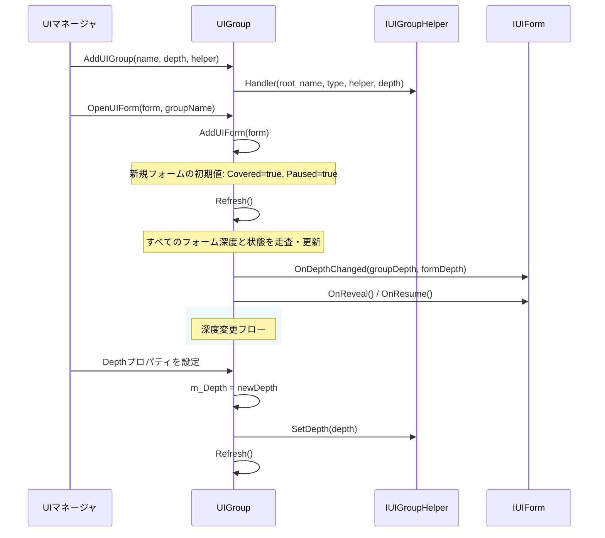
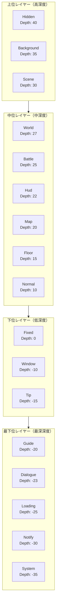

# UIグループレイヤー

UIグループレイヤーは、GameFrameX UIシステムにおいて異なるUIフォームの表示レイヤー関係を管理するコアメカニズムです。深度（Depth）値の設定を通じて、システムは以下のことができる：

- 多様なUIグループ間の覆い関係を精密に制御
- グループ内のフォーム也表示順序を制御
- UIフォームが期待されるレイヤー順序でレンダリングされインタラクティブであることを確保

## 概要

複雑なゲームやアプリケーションでは、UIフォームはしばしばレイヤーで管理される必要があります。例えば、背景フォームは最下位レイヤーに配置し、ポップアップのヒントやシステムアナウンスは最上位レイヤーに表示する必要があります。GameFrameX UIシステムは「グループ」概念を導入し、深度プロパティと組み合わせることで、UIフォームレイヤーの詳細な制御を実現します。

UIグループレイヤーシステムには2レベルの深度制御が含まれます：

- **グループレベル深度**：異なるUIグループ間の表示順序を制御；深度値が大きいグループが前面に表示
- **グループ内フォーム深度**：同じグループ内の各种フォームの表示順序を制御

この二重レイヤー設計により、異なるUIタイプの全体的なレイヤー関係と、同じタイプのUI内の特定のフォーム表示順序の柔軟な調整の両方を確保します。

### コア設計思想

1. **深度値レイヤー化**：整数深度値を使用してレイヤーを表現し、より柔軟なスペース配分のために負の深度をサポート
2. **事前定義グループタイプ**：背景からシステムポップアップまで、完全なレイヤーシステムをカバーする一般的なUIグループタイプを提供
3. **動的調整**：実行時でのグループ深度の動的変更をサポートし、関連するすべてのフォーム表示レイヤーをリアルタイムで更新
4. **自動更新**：深度変更後に自動で更新メカニズムをトリガーし、すべてのフォームが正しく応答することを確保

## アーキテクチャ設計

### コアコンポーネント関係


### レイヤーデータフロー



### 深度値レイヤー図



## 事前定義UIグループ

GameFrameX UIシステムは、ゲーム開発における一般的なUIシナリオをカバーする18個の事前定義UIグループタイプを提供します。これらの事前定義グループは深度値で高い順に配列されています：

| グループ名 | 深度値 | 用途説明 |
|-----------|-------------|-------------------|
| Hidden | 40 | 非表示フォーム、画面表示されていないフォームの一時保管用 |
| Background | 35 | 背景フォーム、ゲームメインメニュー背景、画面背景など |
| Scene | 30 | シーンフォーム、ゲームシーンに関連するUI |
| World | 27 | 世界フォーム、世界空間内のUI要素 |
| Battle | 25 | 戦闘フォーム、戦闘関連のHUDと情報表示 |
| Hud | 22 | 頭上表示、体重バーや名前などのキャラクター頭上情報 |
| Map | 20 | マップフォーム、ミニマップや大陸マップなど |
| Floor | 15 | 下層フォーム、最下位レイヤーの装飾用UI |
| Normal | 10 | 通常フォーム、標準的なゲーム内UI |
| Fixed | 0 | 固定フォーム、画面に固定されたUI |
| Window | -10 | ウィンドウフォーム、ポップアップウィンドウやダイアログなど |
| Tip | -15 | ヒントフォーム、軽量なヒント情報 |
| Guide | -20 | ガイドフォーム、新規ユーザーガイド関連のUI |
| BlackBoard | -22 | 黒板フォーム、教示や説明型のUI |
| Dialogue | -23 | ダイアログフォーム、ダイアログツリーやNPC会話など |
| Loading | -25 | ローディングフォーム、画面読み込み中 |
| Notify | -30 | 通知フォーム、システム通知やアナウンス |
| System | -35 | システムフォーム、最高優先度のシステムレベルポップアップ |

> Source: [UIGroupConstants.cs](https://github.com/GameFrameX/com.gameframex.unity.ui/blob/main/Runtime/UIGroupConstants.cs#L41-L201)

### 事前定義グループの使い方

```csharp
// 事前定義グループ定数を使用してUIグループを作成
var uiGroupHelper = new DefaultUIGroupHelper();
uiManager.AddUIGroup(UIGroupConstants.Normal.Name, UIGroupConstants.Normal.Depth, uiGroupHelper);

// またはグループ名定数を使用
uiManager.AddUIGroup(UIGroupNameConstants.Normal, 10, uiGroupHelper);
```

> Source: [BaseUIManager.UIGroup.cs](https://github.com/GameFrameX/com.gameframex.unity.ui/blob/main/Runtime/BaseUIManager.UIGroup.cs#L136-L148)

## コアメカニズム

### グループ深度管理

各UIグループは、自らの全体的なUIレイヤーでの位置を示す整数型の`Depth`プロパティを維持します。深度値が変更されると、システムは自動的に以下を実行します：

1. `IUIGroupHelper.SetDepth()`メソッドを呼び出し、ヘルパーにレンダリングレイヤーの更新を通知
2. `Refresh()`メソッドを呼び出し、グループ内のすべてのフォーム深度を更新
3. 各フォームの`OnDepthChanged`コールバックをトリガーし、フォーム深度が変更されたことを通知

```csharp
// UIGroup.cs内のDepthプロパティ実装
public int Depth
{
    get { return m_Depth; }
    set
    {
        if (m_Depth == value)
        {
            return;
        }

        m_Depth = value;
        m_UIGroupHelper.SetDepth(m_Depth);  // ヘルパーに通知
        Refresh();  // グループ内のフォームを更新
    }
}
```

> Source: [UIGroup.cs](https://github.com/GameFrameX/com.gameframex.unity.ui/blob/main/Runtime/UI/UIGroup.cs#L106-L120)

### グループ内フォーム深度

同じUIグループ内で、新しく開かれたフォームはデフォルトでリスト先頭（`AddFirst`）に追加されます。这意味着最後に開かれたフォームが前面に表示されます。各フォームのグループ内深度はLinkedList内の位置によって決定されます；リスト先頭のフォームが最大深度値を持ち、順序通りに小さくなります。

```csharp
// グループに新規フォームを追加
public void AddUIForm(IUIForm uiForm)
{
    m_UIFormInfos.AddFirst(UIFormInfo.Create(uiForm));
}
```

> Source: [UIGroup.cs](https://github.com/GameFrameX/com.gameframex.unity.ui/blob/main/Runtime/UI/UIGroup.cs#L439-L442)

### Refreshメカニズム

`Refresh()`メソッドはUIグループレイヤー管理の中核であり、以下の责務を担当します：

1. **フォーム深度を更新**：グループ内のすべてのフォームを走査し、各フォームの`DepthInUIGroup`を計算して更新
2. **Covered状態を処理**：フォームの表示順序に基づいて`Covered`状態を設定し、対応するコールバックをトリガー
3. **Paused状態を処理**：グループの`Pause`プロパティとフォームの`PauseCoveredUIForm`プロパティに基づいて、フォームの一時停止状態を管理

```csharp
public void Refresh()
{
    LinkedListNode<UIFormInfo> current = m_UIFormInfos.First;
    bool pause = m_Pause;
    bool cover = false;
    int depth = UIFormCount;

    while (current != null)
    {
        // 深度を更新
        info.UIForm.OnDepthChanged(Depth, depth--);

        // Coveredとpauseロジックを処理
        // ...
    }
}
```

> Source: [UIGroup.cs](https://github.com/GameFrameX/com.gameframex.unity.ui/blob/main/Runtime/UI/UIGroup.cs#L520-L577)

### フォーム状態変更

UIグループ内のフォームには以下の状態があります：

| 状態 | 説明 | トリガーされるコールバック |
|-------|-------------|-------------------|
| Active | アクティブ状態、完全表示されインタラクティブ | - |
| Covered | 覆われた状態、他のフォームに遮られている | `OnCover()` / `OnReveal()` |
| Paused | 一時停止状態、入力を受け付けない | `OnPause()` / `OnResume()` |

新しいフォームが開かれると、元の最前面フォームはCovered（覆われた）状態になり、Paused（一時停止）状態になる可能性があります（`PauseCoveredUIForm`プロパティに依存）。

## 使用例

### カスタム深度でUIグループを作成

```csharp
// カスタム深度でUIグループを作成
public class GameUIInitializer
{
    private IUIManager uiManager;

    public void Initialize()
    {
        // 高優先度グループを作成（前面に表示）
        var dialogHelper = new DialogUIGroupHelper();
        uiManager.AddUIGroup("Dialog", 100, dialogHelper);

        // 通常グループを作成
        var normalHelper = new NormalUIGroupHelper();
        uiManager.AddUIGroup("Normal", 50, normalHelper);

        // 背景グループを作成
        var bgHelper = new BackgroundUIGroupHelper();
        uiManager.AddUIGroup("Background", 10, bgHelper);
    }
}
```

> Source: [BaseUIManager.UIGroup.cs](https://github.com/GameFrameX/com.gameframex.unity.ui/blob/main/Runtime/BaseUIManager.UIGroup.cs#L136-L148)

### グループ深度を動的に調整

```csharp
// 実行時にUIグループ深度を調整
public class UIGroupDepthChanger
{
    private IUIManager uiManager;

    public void PromoteGroup(string groupName)
    {
        var group = uiManager.GetUIGroup(groupName);
        if (group != null)
        {
            // グループ深度を増加させてより前面に表示
            group.Depth += 10;
        }
    }

    public void DemoteGroup(string groupName)
    {
        var group = uiManager.GetUIGroup(groupName);
        if (group != null)
        {
            // グループ深度を減少させてより奥に表示
            group.Depth -= 10;
        }
    }
}
```

### カスタムUIグループヘルパーを実装

```csharp
// カスタムUIグループヘルパー
public class CustomUIGroupHelper : UIGroupHelperBase
{
    private Canvas m_Canvas;
    private int m_Depth;

    public override int Depth
    {
        get => m_Depth;
        protected set => m_Depth = value;
    }

    public override void SetDepth(int depth)
    {
        m_Depth = depth;
        if (m_Canvas != null)
        {
            // グループ深度に基づいてCanvasの描画順序を設定
            m_Canvas.sortingOrder = depth;
        }
    }

    public override IUIGroupHelper Handler(Transform root, string groupName,
        string uiGroupHelperTypeName, IUIGroupHelper customUIGroupHelper, int depth = 0)
    {
        base.Handler(root, groupName, uiGroupHelperTypeName, customUIGroupHelper, depth);

        m_Canvas = root.GetComponent<Canvas>();
        if (m_Canvas == null)
        {
            m_Canvas = root.gameObject.AddComponent<Canvas>();
        }
        m_Canvas.renderMode = RenderMode.ScreenSpaceCamera;
        m_Canvas.sortingOrder = depth;

        return this;
    }
}
```

> Source: [UIGroupHelperBase.cs](https://github.com/GameFrameX/com.gameframex.unity.ui/blob/main/Runtime/UIGroupHelperBase.cs#L41-L77)

## ベストプラクティス

### 1. 深度範囲を合理的に計画する

事前定義グループの深度分布に従ってカスタムグループ深度を計画することをお勧めします：

- **高優先度エリア（30以上）**：画面背景や全画面UI用
- **中優先度エリア（10-25）**：ゲームHUDや情報パネル用
- **通常エリア（-5～10）**：通常のポップアップウィンドウ用
- **低優先度エリア（-30～-10）**：ヒントやガイド型UI用

### 2. 深度競合を避ける

システムは任意の整数深度値を許可しますが、将来の機能拡張のためにスペースを確保するために、ある間隔（例えば10の間隔）を持つ深度値を使用することをお勧めします。

### 3. PauseCoveredUIFormプロパティを適切に使用する

更新を維持し続ける必要があるUI（カウントダウン、リアルタイムデータなど）では、`PauseCoveredUIForm = false`を設定して、覆われても更新が続くことを確保：

```csharp
// フォームを開く時に設定
uiManager.OpenUIForm<MyForm>("MyForm", "Dialog", userData: null, pauseCoveredUIForm: false);
```

### 4. 事前定義グループを正しく使用する

`UIGroupConstants`で定義された事前定義グループを使用するよう心がけましょう；他のモジュールと一貫したレイヤー規則を維持し、カスタムグループの数を減らすことができます。

## APIリファレンス

### IUIGroupインターフェース

```csharp
public interface IUIGroup
{
    // フォームグループ名を取得
    string Name { get; }

    // フォームグループ深度を取得または設定
    int Depth { get; set; }

    // フォームグループが一時停止中かどうかを取得または設定
    bool Pause { get; set; }

    // フォームグループ内のフォーム数を取得
    int UIFormCount { get; }

    // 現在のフォームを取得（グループ内の最前面フォーム）
    IUIForm CurrentUIForm { get; }

    // フォームグループヘルパーを取得
    IUIGroupHelper Helper { get; }

    // フォームが存在するかをチェック
    bool HasUIForm(int serialId);
    bool HasUIForm(string uiFormAssetName);

    // フォームを取得
    IUIForm GetUIForm(int serialId);
    IUIForm GetUIForm(string uiFormAssetName);
    IUIForm[] GetUIForms(string uiFormAssetName);
    IUIForm[] GetAllUIForms();

    // フォームグループを更新
    void Refresh();
}
```

> Source: [IUIGroup.cs](https://github.com/GameFrameX/com.gameframex.unity.ui/blob/main/Runtime/UI/IUIGroup.cs#L42-L197)

### IUIGroupHelperインターフェース

```csharp
public interface IUIGroupHelper
{
    // フォームグループ深度を取得または設定
    int Depth { get; }

    // フォームグループ深度を設定
    void SetDepth(int depth);

    // フォームグループを作成
    IUIGroupHelper Handler(Transform root, string groupName,
        string uiGroupHelperTypeName, IUIGroupHelper customUIGroupHelper, int depth = 0);
}
```

> Source: [IUIGroupHelper.cs](https://github.com/GameFrameX/com.gameframex.unity.ui/blob/main/Runtime/UI/IUIGroupHelper.cs#L40-L72)

### UIGroupDefineクラス

```csharp
public sealed class UIGroupDefine
{
    // フォームグループ深度
    public readonly int Depth;

    // フォームグループ名
    public readonly string Name;

    public UIGroupDefine(int depth, string name);
}
```

> Source: [UIGroupDefine.cs](https://github.com/GameFrameX/com.gameframex.unity.ui/blob/main/Runtime/UIGroupDefine.cs#L39-L75)

## 関連リンク

- [UIコンポーネント](./4-core-concepts.ui-component) - UIコンポーネントの基本概念
- [UIフォーム](./4-core-concepts.ui-form) - UIフォームの詳細説明
- [UIグループシステム](./4-core-concepts.ui-group) - UIグループシステムのコアコンセプト
- [IUIManager API](./5-api-reference.iuimanager) - UIマネージャインターフェース documentation
- [IUIGroup API](./5-api-reference.iuigroup) - UIグループインターフェース documentation
- [イベントシステム](./6-event-system) - UIイベントシステム