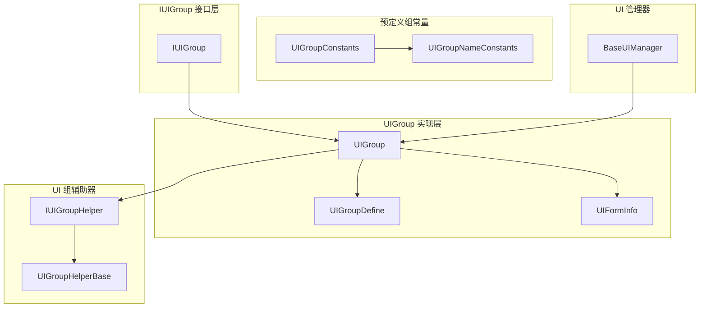
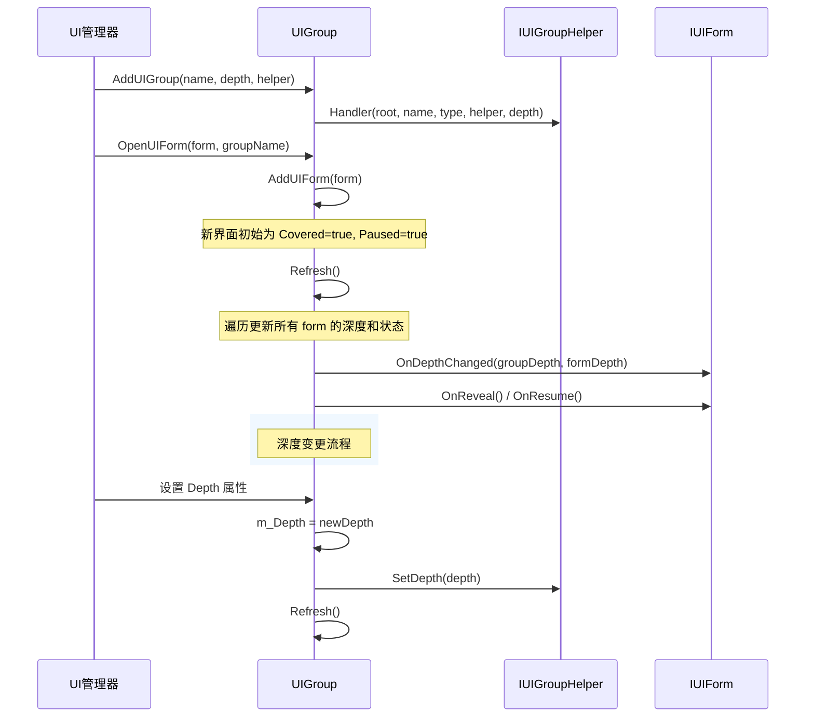
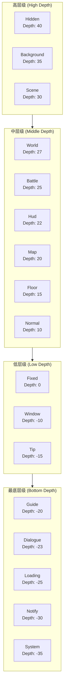

# UI 组层级

UI 组层级（UI Group Hierarchy）是 GameFrameX UI 系统中用于管理不同 UI 界面显示层次关系的コア机制。通过深度（Depth）值的設定，系统能够精确控制各个 UI 组および组内界面的前后遮挡关系，確認してください UI 界面按照预期的层级顺序进行渲染和交互。

## 概要

在複雑的游戏或应用程序中，UI 界面通常〜する必要があります分层管理。例えば，背景界面〜すべき位于最底层，而弹出的ヒント框或系统公告〜すべき显示在最顶层。GameFrameX UI 系统通过引入「组」的コンセプト，结合深度（Depth）プロパティ，実装了对 UI 界面层级的精细控制。

UI 组层级系统パッケージ含两个层次的深度控制：

- **组级别深度（Group Depth）**：控制不同 UI 组之间的显示顺序，深度值越大的组越靠前显示
- **组内深度（Form Depth in Group）**：控制同一组内各个界面之间的显示顺序

这种双层設計既保证了不同タイプ UI 的整体层级关系，又允许在同タイプ UI 中柔軟调整具体界面的显示顺序。

### コア設計理念

1. **深度值分层**：使用整数深度值表示层级，サポート负数深度，允许更柔軟的空间分配
2. **预定義组タイプ**：提供常用的 UI 组タイプ，涵盖从背景到系统弹窗的完全な层级体系
3. **动态调整**：サポート在ランタイム动态変更组深度，实时アップデート所有关联界面的显示层级
4. **自动刷新**：深度变更后自动トリガー刷新机制，確認してください所有界面正确响应

## アーキテクチャ設計

### コアコンポーネント关系



### 层级数据流



### 深度值层级示意图



## 预定義 UI 组

GameFrameX UI 系统提供します 18 个预定義的 UI 组タイプ，涵盖了游戏开发中常见的 UI シーン。这些预定義组按照深度值从高到低排列：

| 组名称 | 深度值 | 用途説明 |
|--------|--------|----------|
| Hidden | 40 | 隐藏界面，用于临时存储不显示的界面 |
| Background | 35 | 背景界面，如游戏主界面背景、シーン背景等 |
| Scene | 30 | シーン界面，与游戏シーン相关的 UI |
| World | 27 | 世界界面，世界空间内的 UI 元素 |
| Battle | 25 | 战斗界面，战斗相关的 HUD 和情報显示 |
| Hud | 22 | 头顶显示，角色头顶的血条、名称等情報 |
| Map | 20 | 地图界面，小地图、大地图等 |
| Floor | 15 | 底板界面，位于底层的装饰性 UI |
| Normal | 10 | 普通界面，常规的游戏内 UI |
| Fixed | 0 | 固定界面，固定在屏幕上的 UI |
| Window | -10 | ウィンドウ界面，弹出ウィンドウ、对话框等 |
| Tip | -15 | ヒント界面，轻量级ヒント情報 |
| Guide | -20 | 引导界面，新手引导相关 UI |
| BlackBoard | -22 | 黑板界面，教学、説明类 UI |
| Dialogue | -23 | 对话界面，对话树、NPC 对话等 |
| Loading | -25 | ロード界面，ロード画面 |
| Notify | -30 | 通知界面，系统通知、公告 |
| System | -35 | 系统界面，最高优先级的系统级弹窗 |

> Source: [UIGroupConstants.cs](https://github.com/GameFrameX/com.gameframex.unity.ui/blob/main/Runtime/UIGroupConstants.cs#L41-L201)

### 使用预定義组

```csharp
// 使用预定义组常量创建 UI 组
var uiGroupHelper = new DefaultUIGroupHelper();
uiManager.AddUIGroup(UIGroupConstants.Normal.Name, UIGroupConstants.Normal.Depth, uiGroupHelper);

// 或者使用组名称常量
uiManager.AddUIGroup(UIGroupNameConstants.Normal, 10, uiGroupHelper);
```

> Source: [BaseUIManager.UIGroup.cs](https://github.com/GameFrameX/com.gameframex.unity.ui/blob/main/Runtime/BaseUIManager.UIGroup.cs#L136-L148)

## コア机制

### 组深度管理

每个 UI 组都维护一个整数タイプ的 `Depth` プロパティ，表示该组在整体 UI 层级中的位置。当深度值发生改变时，系统会自动完成以下操作：

1. 呼び出し `IUIGroupHelper.SetDepth()` メソッド通知辅助器アップデート渲染层级
2. 呼び出し `Refresh()` メソッド刷新组内所有界面的深度情報
3. トリガー各界面 `OnDepthChanged` コールバック，通知界面深度已变更

```csharp
// UIGroup.cs 中的 Depth 属性实现
public int Depth
{
    get { return m_Depth; }
    set
    {
        if (m_Depth == value)
        {
            return;
        }

        m_Depth = value;
        m_UIGroupHelper.SetDepth(m_Depth);  // 通知辅助器
        Refresh();  // 刷新组内界面
    }
}
```

> Source: [UIGroup.cs](https://github.com/GameFrameX/com.gameframex.unity.ui/blob/main/Runtime/UI/UIGroup.cs#L106-L120)

### 组内界面深度

在同一 UI 组内，新打开的界面デフォルト追加到列表头部（`AddFirst`），这意味着最後に打开的界面会显示在最前面。每个界面在组内的深度由其在链表中的位置决定，链表头部的深度值最大，依次递减。

```csharp
// 添加新界面到组
public void AddUIForm(IUIForm uiForm)
{
    m_UIFormInfos.AddFirst(UIFormInfo.Create(uiForm));
}
```

> Source: [UIGroup.cs](https://github.com/GameFrameX/com.gameframex.unity.ui/blob/main/Runtime/UI/UIGroup.cs#L439-L442)

### 刷新机制

`Refresh()` メソッド是 UI 组层级管理的コア，它负责：

1. **アップデート界面深度**：遍历组内所有界面，计算并アップデート每个界面的 `DepthInUIGroup`
2. **処理覆盖ステータス**：根据界面的显示顺序，設定 `Covered` ステータス并トリガー相应コールバック
3. **処理暂停ステータス**：根据组的 `Pause` プロパティ和界面的 `PauseCoveredUIForm` プロパティ，管理界面的暂停ステータス

```csharp
public void Refresh()
{
    LinkedListNode<UIFormInfo> current = m_UIFormInfos.First;
    bool pause = m_Pause;
    bool cover = false;
    int depth = UIFormCount;

    while (current != null)
    {
        // 更新深度
        info.UIForm.OnDepthChanged(Depth, depth--);

        // 处理覆盖和暂停逻辑
        // ...
    }
}
```

> Source: [UIGroup.cs](https://github.com/GameFrameX/com.gameframex.unity.ui/blob/main/Runtime/UI/UIGroup.cs#L520-L577)

### 界面ステータス变化

UI 组内的界面有以下几种ステータス：

| ステータス | 説明 | トリガーコールバック |
|------|------|----------|
| Active | 活动ステータス，完全可见且可交互 | - |
| Covered | 被覆盖ステータス，被其他界面遮挡 | `OnCover()` / `OnReveal()` |
| Paused | 暂停ステータス，不再受信输入 | `OnPause()` / `OnResume()` |

当新界面打开时，原来的顶层界面会被遮挡（Covered）并〜の可能性があります暂停（Paused，取决于 `PauseCoveredUIForm` プロパティ）。

## 使用例

### 作成自定義深度的 UI 组

```csharp
// 创建自定义深度的 UI 组
public class GameUIInitializer
{
    private IUIManager uiManager;

    public void Initialize()
    {
        // 创建高优先级组（显示在最前面）
        var dialogHelper = new DialogUIGroupHelper();
        uiManager.AddUIGroup("Dialog", 100, dialogHelper);

        // 创建普通组
        var normalHelper = new NormalUIGroupHelper();
        uiManager.AddUIGroup("Normal", 50, normalHelper);

        // 创建背景组
        var bgHelper = new BackgroundUIGroupHelper();
        uiManager.AddUIGroup("Background", 10, bgHelper);
    }
}
```

> Source: [BaseUIManager.UIGroup.cs](https://github.com/GameFrameX/com.gameframex.unity.ui/blob/main/Runtime/BaseUIManager.UIGroup.cs#L136-L148)

### 动态调整组深度

```csharp
// 运行时调整 UI 组深度
public class UIGroupDepthChanger
{
    private IUIManager uiManager;

    public void PromoteGroup(string groupName)
    {
        var group = uiManager.GetUIGroup(groupName);
        if (group != null)
        {
            // 将组深度提高，使其显示在更前面
            group.Depth += 10;
        }
    }

    public void DemoteGroup(string groupName)
    {
        var group = uiManager.GetUIGroup(groupName);
        if (group != null)
        {
            // 将组深度降低，使其显示在更后面
            group.Depth -= 10;
        }
    }
}
```

### 実装自定義 UI 组辅助器

```csharp
// 自定义 UI 组辅助器
public class CustomUIGroupHelper : UIGroupHelperBase
{
    private Canvas m_Canvas;
    private int m_Depth;

    public override int Depth
    {
        get => m_Depth;
        protected set => m_Depth = value;
    }

    public override void SetDepth(int depth)
    {
        m_Depth = depth;
        if (m_Canvas != null)
        {
            // 根据组深度设置 Canvas 渲染顺序
            m_Canvas.sortingOrder = depth;
        }
    }

    public override IUIGroupHelper Handler(Transform root, string groupName, 
        string uiGroupHelperTypeName, IUIGroupHelper customUIGroupHelper, int depth = 0)
    {
        base.Handler(root, groupName, uiGroupHelperTypeName, customUIGroupHelper, depth);
        
        m_Canvas = root.GetComponent<Canvas>();
        if (m_Canvas == null)
        {
            m_Canvas = root.gameObject.AddComponent<Canvas>();
        }
        m_Canvas.renderMode = RenderMode.ScreenSpaceCamera;
        m_Canvas.sortingOrder = depth;
        
        return this;
    }
}
```

> Source: [UIGroupHelperBase.cs](https://github.com/GameFrameX/com.gameframex.unity.ui/blob/main/Runtime/UIGroupHelperBase.cs#L41-L77)

## ベストプラクティス

### 1. 合理规划深度区间

お勧め按照预定義组的深度分布来规划自定義组的深度：

- **高优先级区域（30+）**：用于シーン背景、全屏 UI
- **中优先级区域（10-25）**：用于游戏 HUD、情報パネル
- **普通区域（-5 to 10）**：用于普通弹出ウィンドウ
- **低优先级区域（-30 to -10）**：用于ヒント、引导类 UI

### 2. 避免深度冲突

虽然系统允许任意整数深度值，但お勧め使用一定间隔的深度值（如间隔 10），为未来的機能拡張预留空间。

### 3. 利用 PauseCoveredUIForm プロパティ

对于〜する必要があります保持アップデート的 UI（如倒计时、实时数据），〜すべき設定 `PauseCoveredUIForm = false`，確認してくださいつまり使被遮挡也能继续アップデート：

```csharp
// 在打开界面时设置
uiManager.OpenUIForm<MyForm>("MyForm", "Dialog", userData: null, pauseCoveredUIForm: false);
```

### 4. 正确使用预定義组

尽量使用 `UIGroupConstants` 中定義的预定義组，这样〜できます与其他モジュール保持一致的层级约定，减少自定義组的数量。

## API リファレンス

### IUIGroup インターフェース

```csharp
public interface IUIGroup
{
    // 获取界面组名称
    string Name { get; }

    // 获取或设置界面组深度
    int Depth { get; set; }

    // 获取或设置界面组是否暂停
    bool Pause { get; set; }

    // 获取界面组中界面数量
    int UIFormCount { get; }

    // 获取当前界面（组内最前面的界面）
    IUIForm CurrentUIForm { get; }

    // 获取界面组辅助器
    IUIGroupHelper Helper { get; }

    // 检查界面是否存在
    bool HasUIForm(int serialId);
    bool HasUIForm(string uiFormAssetName);

    // 获取界面
    IUIForm GetUIForm(int serialId);
    IUIForm GetUIForm(string uiFormAssetName);
    IUIForm[] GetUIForms(string uiFormAssetName);
    IUIForm[] GetAllUIForms();

    // 刷新界面组
    void Refresh();
}
```

> Source: [IUIGroup.cs](https://github.com/GameFrameX/com.gameframex.unity.ui/blob/main/Runtime/UI/IUIGroup.cs#L42-L197)

### IUIGroupHelper インターフェース

```csharp
public interface IUIGroupHelper
{
    // 获取或设置界面组深度
    int Depth { get; }

    // 设置界面组深度
    void SetDepth(int depth);

    // 创建界面组
    IUIGroupHelper Handler(Transform root, string groupName, 
        string uiGroupHelperTypeName, IUIGroupHelper customUIGroupHelper, int depth = 0);
}
```

> Source: [IUIGroupHelper.cs](https://github.com/GameFrameX/com.gameframex.unity.ui/blob/main/Runtime/UI/IUIGroupHelper.cs#L40-L72)

### UIGroupDefine 类

```csharp
public sealed class UIGroupDefine
{
    // 界面组深度
    public readonly int Depth;

    // 界面组名称
    public readonly string Name;

    public UIGroupDefine(int depth, string name);
}
```

> Source: [UIGroupDefine.cs](https://github.com/GameFrameX/com.gameframex.unity.ui/blob/main/Runtime/UIGroupDefine.cs#L39-L75)

## 関連リンク

- [UI コンポーネント](./4-core-concepts.ui-component) - UI コンポーネント基本コンセプト
- [UI 窗体](./4-core-concepts.ui-form) - UI 窗体詳細説明
- [UI 组系统](./4-core-concepts.ui-group) - UI 组系统コアコンセプト
- [IUIManager API](./5-api-reference.iuimanager) - UI マネージャーインターフェースドキュメント
- [IUIGroup API](./5-api-reference.iuigroup) - UI 组インターフェースドキュメント
- [イベント系统](./6-event-system) - UI イベント系统
