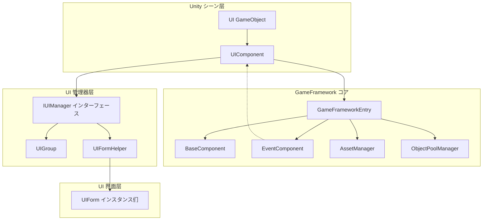
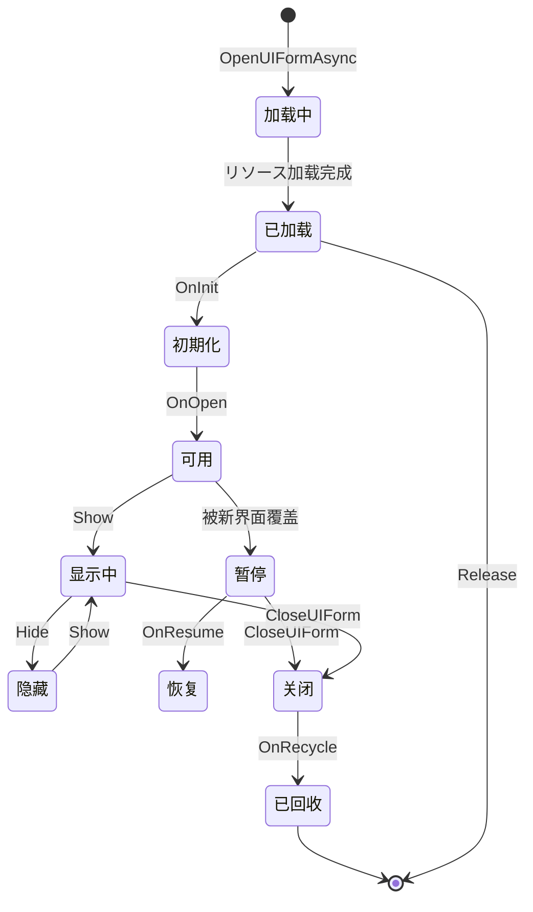

# UIComponent

UIComponent 是 GameFrameX フレームワーク中的コアUIコンポーネント，を継承 GameFrameworkComponent，に使用管理ゲーム中的所有UI界面。它作为IUIManagerインターフェース的门面クラス，提供します简洁的API来执行UI的打开、关闭、取得等操作，同时サポートUGUI和FairyGUI两种UI系统。

## 概要

UIComponent 是 Unity ゲームシーン中的コアコンポーネント，负责整个UI系统的管理和调度。作为ゲームフレームワーク的コアコンポーネント之一，它封装了底层的IUIManager実装，提供します更加易用的APIインターフェース。

**主要機能：**
- UI界面的异步打开与关闭
- UI界面的查询与取得
- UI组（UIGroup）的管理
- UIオブジェクトプール配置
- UIイベント系统
- UI显示/隐藏动画控制

## 架构

UIComponent 在整体架构中扮演着门面（Facade）角色，封装了底层的IUIManager実装。



## プロパティ

### 根节点プロパティ

| プロパティ | クラス型 | 説明 |
|------|------|------|
| `UGUIRoot` | Transform | 取得UGUI根节点变换コンポーネント |
| `FairyGUIRoot` | Transform | 取得FairyGUI根节点变换コンポーネント |

### 自动回收配置

| プロパティ | クラス型 | 默认值 | 説明 |
|------|------|--------|------|
| `EnableAutoReleaseUIForm` | bool | true | 是否启用自动回收界面 |
| `InstanceAutoReleaseInterval` | float | 60f | 界面インスタンスオブジェクトプール自动释放可释放对象的间隔秒数 |
| `InstanceCapacity` | int | 16 | 界面インスタンスオブジェクトプール的容量 |
| `InstanceExpireTime` | float | 60f | 界面インスタンスオブジェクトプール对象过期秒数 |
| `RecycleInterval` | int | 60 | 界面回收间隔秒数 |

### 动画配置

| プロパティ | クラス型 | 默认值 | 説明 |
|------|------|--------|------|
| `IsEnableUIShowAnimation` | bool | false | 是否启用UI显示动画 |
| `IsEnableUIHideAnimation` | bool | false | 是否启用UI隐藏动画 |

### UI组数量

| プロパティ | クラス型 | 説明 |
|------|------|------|
| `UIGroupCount` | int | 取得界面组数量 |

## API 参考

### 打开界面

#### `OpenAsync<T>(object userData = null, bool isFullScreen = false): Task<T>`

异步打开界面，基づく泛型クラス型自动解析UIリソース路径。

**所属ファイル：** [Runtime/UIComponent.Open.cs](https://github.com/GameFrameX/com.gameframex.unity.ui/blob/main/Runtime/UIComponent.Open.cs#L167-L191)

```csharp
// 使用示例
var mainMenuForm = await this.OpenAsync<MainMenuUIForm>();
var settingsForm = await this.OpenAsync<SettingsUIForm>(userData, true);
```

**泛型参数：**
- `T`: UI的具体クラス型，必須実装 IUIForm インターフェース

**参数：**
- `userData` (object): 传递给UI的用户数据
- `isFullScreen` (bool): 是否全屏显示

**返回：** `Task<T>` - 打开的UI界面インスタンス

---

#### `OpenAsync<T>(string uiFormAssetPath, bool pauseCoveredUIForm, object userData = null, bool isFullScreen = false): Task<T>`

异步打开界面，指定リソース路径和是否暂停被覆盖的界面。

**所属ファイル：** [Runtime/UIComponent.Open.cs](https://github.com/GameFrameX/com.gameframex.unity.ui/blob/main/Runtime/UIComponent.Open.cs#L152-L155)

```csharp
// 使用示例
var form = await this.OpenAsync<MainMenuUIForm>("Assets/UI/MainMenu.prefab", true);
```

**参数：**
- `uiFormAssetPath` (string): UIリソース路径
- `pauseCoveredUIForm` (bool): 是否暂停被覆盖的界面
- `userData` (object): 传递给UI的用户数据
- `isFullScreen` (bool): 是否全屏显示

---

#### `OpenFullScreenAsync<T>(object userData = null): Task<T>`

异步打开全屏UI。

**所属ファイル：** [Runtime/UIComponent.Open.cs](https://github.com/GameFrameX/com.gameframex.unity.ui/blob/main/Runtime/UIComponent.Open.cs#L63-L68)

```csharp
var dialog = await this.OpenFullScreenAsync<DialogUIForm>(userData);
```

---

#### `OpenUIAsync(string uiFormAssetPath, Type uiFormType, bool pauseCoveredUIForm, object userData = null, bool isFullScreen = false): Task<IUIForm>`

使用Typeクラス型异步打开UI。

**所属ファイル：** [Runtime/UIComponent.Open.cs](https://github.com/GameFrameX/com.gameframex.unity.ui/blob/main/Runtime/UIComponent.Open.cs#L83-L86)

---

### 关闭界面

#### `CloseUIForm(int serialId, bool isNowRecycle = false): void`

に基づいて序列编号关闭界面。

**所属ファイル：** [Runtime/UIComponent.Close.cs](https://github.com/GameFrameX/com.gameframex.unity.ui/blob/main/Runtime/UIComponent.Close.cs#L43-L46)

```csharp
// 使用示例
this.CloseUIForm(serialId);
this.CloseUIForm(serialId, true); // 立即回收
```

**参数：**
- `serialId` (int): 要关闭界面的序列编号
- `isNowRecycle` (bool): 是否立即回收界面，默认false

---

#### `CloseUIForm(IUIForm uiForm, bool isNowRecycle = false): void`

に基づいてUIインスタンス关闭界面。

**所属ファイル：** [Runtime/UIComponent.Close.cs](https://github.com/GameFrameX/com.gameframex.unity.ui/blob/main/Runtime/UIComponent.Close.cs#L72-L75)

---

#### `CloseUIForm<T>(object userData = null, bool isNowRecycle = false): void where T : IUIForm`

に基づいてクラス型关闭界面。

**所属ファイル：** [Runtime/UIComponent.Close.cs](https://github.com/GameFrameX/com.gameframex.unity.ui/blob/main/Runtime/UIComponent.Close.cs#L89-L92)

---

#### `CloseAllLoadedUIForms(bool isNowRecycle = false): void`

关闭所有已加载的界面。

**所属ファイル：** [Runtime/UIComponent.Close.cs](https://github.com/GameFrameX/com.gameframex.unity.ui/blob/main/Runtime/UIComponent.Close.cs#L131-L134)

---

#### `CloseAllLoadingUIForms(): void`

关闭所有正在加载的界面。

**所属ファイル：** [Runtime/UIComponent.Close.cs](https://github.com/GameFrameX/com.gameframex.unity.ui/blob/main/Runtime/UIComponent.Close.cs#L171-L174)

---

#### `ReleaseAllLoadedUIForms(bool isNowRecycle = false, object userData = null): void`

释放所有已加载的界面。

**所属ファイル：** [Runtime/UIComponent.Close.cs](https://github.com/GameFrameX/com.gameframex.unity.ui/blob/main/Runtime/UIComponent.Close.cs#L145-L148)

---

#### `CloseUIGroup(string uiGroupName, object userData = null): void`

关闭指定UI组的所有界面。

**所属ファイル：** [Runtime/UIComponent.Close.cs](https://github.com/GameFrameX/com.gameframex.unity.ui/blob/main/Runtime/UIComponent.Close.cs#L118-L121)

---

### 取得界面

#### `GetUIForm(int serialId): IUIForm`

に基づいて序列编号取得界面。

**所属ファイル：** [Runtime/UIComponent.Get.cs](https://github.com/GameFrameX/com.gameframex.unity.ui/blob/main/Runtime/UIComponent.Get.cs#L47-L50)

```csharp
var form = this.GetUIForm(serialId);
```

---

#### `GetUIForm(string uiFormAssetName): IUIForm`

に基づいてリソース名称取得界面。

**所属ファイル：** [Runtime/UIComponent.Get.cs](https://github.com/GameFrameX/com.gameframex.unity.ui/blob/main/Runtime/UIComponent.Get.cs#L61-L64)

---

#### `GetUIForms(string uiFormAssetName): IUIForm[]`

取得所有指定リソース名称的界面数组。

**所属ファイル：** [Runtime/UIComponent.Get.cs](https://github.com/GameFrameX/com.gameframex.unity.ui/blob/main/Runtime/UIComponent.Get.cs#L75-L85)

---

#### `GetLoaded<T>(): T where T : class, IUIForm`

に基づいてクラス型取得已加载的界面，返回第一个匹配的インスタンス。

**所属ファイル：** [Runtime/UIComponent.Get.cs](https://github.com/GameFrameX/com.gameframex.unity.ui/blob/main/Runtime/UIComponent.Get.cs#L238-L251)

```csharp
var mainMenu = this.GetLoaded<MainMenuUIForm>();
```

---

#### `GetLoadedList<T>(): List<T> where T : class, IUIForm`

取得指定クラス型的所有已加载界面列表。

**所属ファイル：** [Runtime/UIComponent.Get.cs](https://github.com/GameFrameX/com.gameframex.unity.ui/blob/main/Runtime/UIComponent.Get.cs#L120-L134)

---

#### `GetLoadedAndShowing<T>(): T where T : class, IUIForm`

取得已加载且正在显示的UI。

**所属ファイル：** [Runtime/UIComponent.Get.cs](https://github.com/GameFrameX/com.gameframex.unity.ui/blob/main/Runtime/UIComponent.Get.cs#L168-L181)

---

#### `GetAllLoadedUIForms(): IUIForm[]`

取得所有已加载的界面。

**所属ファイル：** [Runtime/UIComponent.Get.cs](https://github.com/GameFrameX/com.gameframex.unity.ui/blob/main/Runtime/UIComponent.Get.cs#L261-L271)

---

#### `GetAllLoadingUIFormSerialIds(): int[]`

取得所有正在加载界面的序列编号。

**所属ファイル：** [Runtime/UIComponent.Get.cs](https://github.com/GameFrameX/com.gameframex.unity.ui/blob/main/Runtime/UIComponent.Get.cs#L305-L308)

---

### 查询ステータス

#### `HasUIForm(int serialId): bool`

检查是否存在指定序列编号的界面。

**所属ファイル：** [Runtime/UIComponent.cs](https://github.com/GameFrameX/com.gameframex.unity.ui/blob/main/Runtime/UIComponent.cs#L542-L545)

---

#### `HasUIForm(string uiFormAssetName): bool`

检查是否存在指定リソース名称的界面。

**所属ファイル：** [Runtime/UIComponent.cs](https://github.com/GameFrameX/com.gameframex.unity.ui/blob/main/Runtime/UIComponent.cs#L556-L559)

---

#### `IsLoadingUIForm(int serialId): bool`

检查界面是否正在加载（按序列编号）。

**所属ファイル：** [Runtime/UIComponent.cs](https://github.com/GameFrameX/com.gameframex.unity.ui/blob/main/Runtime/UIComponent.cs#L570-L573)

---

#### `IsLoadingUIForm(string uiFormAssetName): bool`

检查界面是否正在加载（按リソース名称）。

**所属ファイル：** [Runtime/UIComponent.cs](https://github.com/GameFrameX/com.gameframex.unity.ui/blob/main/Runtime/UIComponent.cs#L584-L587)

---

#### `IsValidUIForm(IUIForm uiForm): bool`

检查界面是否合法。

**所属ファイル：** [Runtime/UIComponent.cs](https://github.com/GameFrameX/com.gameframex.unity.ui/blob/main/Runtime/UIComponent.cs#L598-L601)

---

#### `HasLoadedAndShowing(string uiFormAssetName): bool`

检查是否存在已加载且正在显示的UI。

**所属ファイル：** [Runtime/UIComponent.Get.cs](https://github.com/GameFrameX/com.gameframex.unity.ui/blob/main/Runtime/UIComponent.Get.cs#L192-L204)

---

### UI组管理

#### `HasUIGroup(string uiGroupName): bool`

检查是否存在指定的UI组。

**所属ファイル：** [Runtime/UIComponent.IUIGroup.cs](https://github.com/GameFrameX/com.gameframex.unity.ui/blob/main/Runtime/UIComponent.IUIGroup.cs#L46-L49)

---

#### `GetUIGroup(string uiGroupName): IUIGroup`

取得指定名称的UI组。

**所属ファイル：** [Runtime/UIComponent.IUIGroup.cs](https://github.com/GameFrameX/com.gameframex.unity.ui/blob/main/Runtime/UIComponent.IUIGroup.cs#L60-L63)

---

#### `GetAllUIGroups(): IUIGroup[]`

取得所有UI组。

**所属ファイル：** [Runtime/UIComponent.IUIGroup.cs](https://github.com/GameFrameX/com.gameframex.unity.ui/blob/main/Runtime/UIComponent.IUIGroup.cs#L73-L76)

---

#### `AddUIGroup(string uiGroupName): bool`

添加UI组（默认深度为0）。

**所属ファイル：** [Runtime/UIComponent.IUIGroup.cs](https://github.com/GameFrameX/com.gameframex.unity.ui/blob/main/Runtime/UIComponent.IUIGroup.cs#L100-L103)

---

#### `AddUIGroup(string uiGroupName, int depth): bool`

添加指定深度的UI组。

**所属ファイル：** [Runtime/UIComponent.IUIGroup.cs](https://github.com/GameFrameX/com.gameframex.unity.ui/blob/main/Runtime/UIComponent.IUIGroup.cs#L115-L147)

---

### 界面激活

#### `RefocusUIForm(UIForm uiForm): void`

激活指定界面。

**所属ファイル：** [Runtime/UIComponent.cs](https://github.com/GameFrameX/com.gameframex.unity.ui/blob/main/Runtime/UIComponent.cs#L612-L615)

```csharp
this.RefocusUIForm(mainMenuForm);
```

---

#### `RefocusUIForm(UIForm uiForm, object userData): void`

激活指定界面并传递用户数据。

**所属ファイル：** [Runtime/UIComponent.cs](https://github.com/GameFrameX/com.gameframex.unity.ui/blob/main/Runtime/UIComponent.cs#L626-L629)

---

### インスタンス锁定

#### `SetUIFormInstanceLocked(UIForm uiForm, bool locked): void`

設定界面インスタンス是否被锁定。

**所属ファイル：** [Runtime/UIComponent.cs](https://github.com/GameFrameX/com.gameframex.unity.ui/blob/main/Runtime/UIComponent.cs#L640-L649)

---

### 动画处理

#### `SetShowUIFormHandler(IUIFormShowHandler uiFormShowHandler): void`

設定UI显示动画处理インターフェース。

**所属ファイル：** [Runtime/UIComponent.cs](https://github.com/GameFrameX/com.gameframex.unity.ui/blob/main/Runtime/UIComponent.cs#L668-L671)

---

#### `SetHideUIFormHandler(IUIFormHideHandler uiFormHideHandler): void`

設定UI隐藏动画处理インターフェース。

**所属ファイル：** [Runtime/UIComponent.cs](https://github.com/GameFrameX/com.gameframex.unity.ui/blob/main/Runtime/UIComponent.cs#L673-L677)

---

## UI 界面生命周期

UI界面在系统中具有完整的生命周期，以下是各ステータス之间的转换关系：



### 生命周期回调

| 回调メソッド | 呼び出し时机 | 説明 |
|---------|---------|------|
| `OnAwake()` | Unity Awake时 | 界面唤醒，可に使用初期化イベント订阅 |
| `OnInit()` | 界面首次初期化 | 只呼び出し一次，可に使用初期化视图 |
| `OnOpen(object userData)` | 界面打开时 | 每次打开时呼び出し，可接收userData |
| `BindEvent()` | イベント绑定时 | 绑定界面所需的イベント |
| `LoadData()` | 加载数据时 | 加载界面所需的数据 |
| `OnUpdate()` | 每帧更新 | 界面轮询 |
| `OnClose(bool isShutdown, object userData)` | 界面关闭时 | 关闭时清理リソース |
| `OnRecycle()` | 界面回收时 | 回收前重置ステータス |
| `UpdateLocalization()` | 语言变更时 | 更新本地化文本 |

## 設定选项

| 配置项 | クラス型 | 默认值 | 説明 |
|--------|------|--------|------|
| `EnableOpenUIFormSuccessEvent` | bool | true | 是否启用打开界面成功イベント |
| `EnableOpenUIFormFailureEvent` | bool | true | 是否启用打开界面失败イベント |
| `EnableCloseUIFormCompleteEvent` | bool | true | 是否启用关闭界面完成イベント |
| `EnableAutoReleaseUIForm` | bool | true | 是否启用自动回收界面 |
| `IsEnableUIShowAnimation` | bool | false | 是否启用UI显示动画 |
| `IsEnableUIHideAnimation` | bool | false | 是否启用UI隐藏动画 |
| `InstanceAutoReleaseInterval` | float | 60f | 自动释放间隔（秒） |
| `InstanceCapacity` | int | 16 | オブジェクトプール容量 |
| `InstanceExpireTime` | float | 60f | 对象过期时间（秒） |
| `RecycleInterval` | int | 60 | 回收间隔（秒） |
| `m_UIFormHelperTypeName` | string | FairyGUIFormHelper | UI表单帮助器クラス型名 |
| `m_UIGroupHelperTypeName` | string | FairyGUIUIGroupHelper | UI组帮助器クラス型名 |

## 関連リンク

- [UIForm](./5-api-reference.ui-form) - UI界面基クラス
- [IUIManager](./5-api-reference.iuimanager) - UI管理器インターフェース
- [IUIGroup](./5-api-reference.iuigroup) - UI组インターフェース
- [コア概念 - UIコンポーネント](./4-core-concepts.ui-component) - UIコンポーネントコア概念
- [コア概念 - UI窗体](./4-core-concepts.ui-form) - UI窗体コア概念
- [コア概念 - UI组系统](./4-core-concepts.ui-group) - UI组系统コア概念
- [イベント系统](./6-event-system) - UIイベント系统
