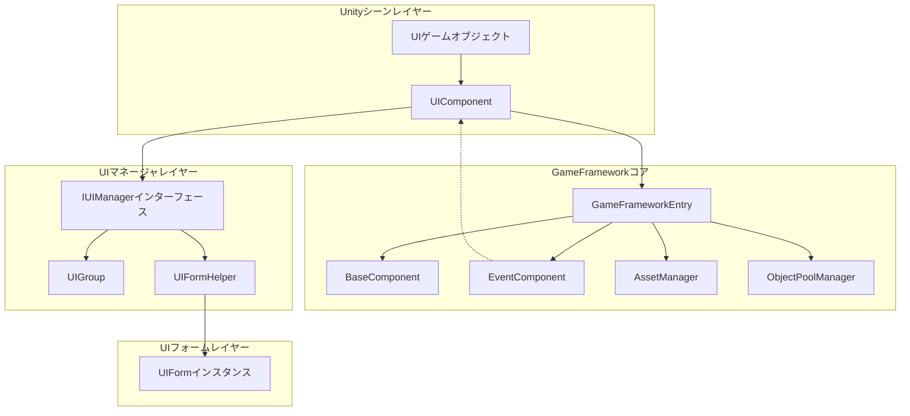
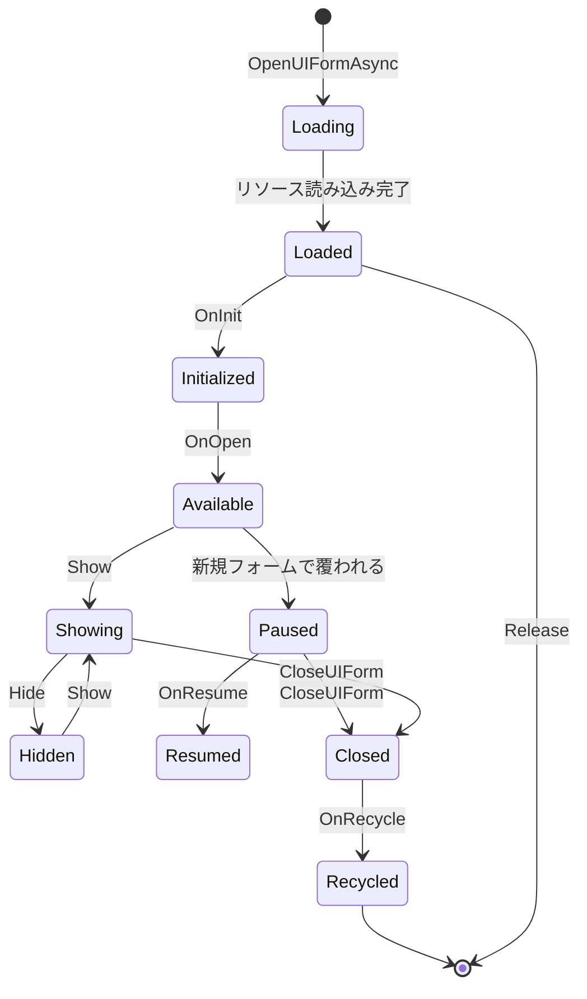

# UIComponent

UIComponentは、GameFrameXフレームワークにおけるコアUIコンポーネントであり、GameFrameworkComponentを継承し、ゲーム内のすべてのUIフォームを管理するために使用されます。IUIManagerインターフェースの门面クラスとして、UIの開く、閉じる、取得、その他の操作のためのシンプルなAPIを提供すると同時に、UGUIとFairyGUIの両方のUIシステムをサポートします。

## 概要

UIComponentは、Unityゲームのシーンにおけるコアコンポーネントであり、UIシステム全体の管理与調整を担当します。ゲームフレームワークのコアコンポーネントの1つとして、底层のIUIManagerの実装をカプセル化し、より使いやすいAPIインターフェースを提供します。

**主な機能：**
- UIフォームの非同期で開く・閉じる
- UIフォームのクエリと取得
- UIグループ（UIGroup）管理
- UIオブジェクトプール設定
- UIイベントシステム
- UI表示/非表示アニメーション制御

## アーキテクチャ

UIComponentは全体的なアーキテクチャにおいて门面の 역할을果たし、底层のIUIManager実装をカプセル化します。



## プロパティ

### ルートノードプロパティ

| プロパティ | タイプ | 説明 |
|----------|------|-------------|
| `UGUIRoot` | Transform | UGUIルートノードのTransformコンポーネントを取得 |
| `FairyGUIRoot` | Transform | FairyGUIルートノードのTransformコンポーネントを取得 |

### 自動リサイクル設定

| プロパティ | タイプ | デフォルト | 説明 |
|----------|------|---------|-------------|
| `EnableAutoReleaseUIForm` | bool | true | 自動リサイクルフォームを有効にするかどうか |
| `InstanceAutoReleaseInterval` | float | 60f | フォームインスタンスオブジェクトプールの自動解放間隔（秒） |
| `InstanceCapacity` | int | 16 | フォームインスタンスオブジェクトプール容量 |
| `InstanceExpireTime` | float | 60f | フォームインスタンスオブジェクトプールオブジェクトの期限切れ秒数 |
| `RecycleInterval` | int | 60 | フォームリサイクル間隔（秒） |

### アニメーション設定

| プロパティ | タイプ | デフォルト | 説明 |
|----------|------|---------|-------------|
| `IsEnableUIShowAnimation` | bool | false | UI表示アニメーションを有効にするかどうか |
| `IsEnableUIHideAnimation` | bool | false | UI非表示アニメーションを有効にするかどうか |

### UIグループ数

| プロパティ | タイプ | 説明 |
|----------|------|-------------|
| `UIGroupCount` | int | フォームグループの数を取得 |

## APIリファレンス

### フォームを開く

#### `OpenAsync<T>(object userData = null, bool isFullScreen = false): Task<T>`

フォームを非同期で開き、ジェネリックタイプに基づいてUIアセットパスを自動的に解決します。

**ソースファイル：** [Runtime/UIComponent.Open.cs](https://github.com/GameFrameX/com.gameframex.unity.ui/blob/main/Runtime/UIComponent.Open.cs#L167-L191)

```csharp
// 使用例
var mainMenuForm = await this.OpenAsync<MainMenuUIForm>();
var settingsForm = await this.OpenAsync<SettingsUIForm>(userData, true);
```

**ジェネリックパラメータ：**
- `T`：UIの具体的なタイプ、IUIFormインターフェースを実装する必要がある

**パラメータ：**
- `userData` (object)：UIに渡すユーザーデータ
- `isFullScreen` (bool)：全画面表示かどうか

**戻り値：** `Task<T>` - 開かれたUIフォームインスタンス

---

#### `OpenAsync<T>(string uiFormAssetPath, bool pauseCoveredUIForm, object userData = null, bool isFullScreen = false): Task<T>`

アセットパスを指定し、覆われたフォームを一時停止するかを指定してフォームを非同期で開きます。

**ソースファイル：** [Runtime/UIComponent.Open.cs](https://github.com/GameFrameX/com.gameframex.unity.ui/blob/main/Runtime/UIComponent.Open.cs#L152-L155)

```csharp
// 使用例
var form = await this.OpenAsync<MainMenuUIForm>("Assets/UI/MainMenu.prefab", true);
```

**パラメータ：**
- `uiFormAssetPath` (string)：UIアセットパス
- `pauseCoveredUIForm` (bool)：覆われたフォームを一時停止するかどうか
- `userData` (object)：UIに渡すユーザーデータ
- `isFullScreen` (bool)：全画面表示かどうか

---

#### `OpenFullScreenAsync<T>(object userData = null): Task<T>`

全画面UIを非同期で開きます。

**ソースファイル：** [Runtime/UIComponent.Open.cs](https://github.com/GameFrameX/com.gameframex.unity.ui/blob/main/Runtime/UIComponent.Open.cs#L63-L68)

```csharp
var dialog = await this.OpenFullScreenAsync<DialogUIForm>(userData);
```

---

#### `OpenUIAsync(string uiFormAssetPath, Type uiFormType, bool pauseCoveredUIForm, object userData = null, bool isFullScreen = false): Task<IUIForm>`

Typeパラメータを使用してUIを非同期で開きます。

**ソースファイル：** [Runtime/UIComponent.Open.cs](https://github.com/GameFrameX/com.gameframex.unity.ui/blob/main/Runtime/UIComponent.Open.cs#L83-L86)

---

### フォームを閉じる

#### `CloseUIForm(int serialId, bool isNowRecycle = false): void`

シリアルIDでフォームを閉じます。

**ソースファイル：** [Runtime/UIComponent.Close.cs](https://github.com/GameFrameX/com.gameframex.unity.ui/blob/main/Runtime/UIComponent.Close.cs#L43-L46)

```csharp
// 使用例
this.CloseUIForm(serialId);
this.CloseUIForm(serialId, true); // 即座にリサイクル
```

**パラメータ：**
- `serialId` (int)：閉じるフォームのシリアルID
- `isNowRecycle` (bool)：フォームを即座にリサイクルするかどうか、デフォルトはfalse

---

#### `CloseUIForm(IUIForm uiForm, bool isNowRecycle = false): void`

UIインスタンスでフォームを閉じます。

**ソースファイル：** [Runtime/UIComponent.Close.cs](https://github.com/GameFrameX/com.gameframex.unity.ui/blob/main/Runtime/UIComponent.Close.cs#L72-L75)

---

#### `CloseUIForm<T>(object userData = null, bool isNowRecycle = false): void where T : IUIForm`

タイプでフォームを閉じます。

**ソースファイル：** [Runtime/UIComponent.Close.cs](https://github.com/GameFrameX/com.gameframex.unity.ui/blob/main/Runtime/UIComponent.Close.cs#L89-L92)

---

#### `CloseAllLoadedUIForms(bool isNowRecycle = false): void`

すべての読み込み済みフォームを閉じます。

**ソースファイル：** [Runtime/UIComponent.Close.cs](https://github.com/GameFrameX/com.gameframex.unity.ui/blob/main/Runtime/UIComponent.Close.cs#L131-L134)

---

#### `CloseAllLoadingUIForms(): void`

すべての読み込み中フォームを閉じます。

**ソースファイル：** [Runtime/UIComponent.Close.cs](https://github.com/GameFrameX/com.gameframex.unity.ui/blob/main/Runtime/UIComponent.Close.cs#L171-L174)

---

#### `ReleaseAllLoadedUIForms(bool isNowRecycle = false, object userData = null): void`

すべての読み込み済みフォームを解放します。

**ソースファイル：** [Runtime/UIComponent.Close.cs](https://github.com/GameFrameX/com.gameframex.unity.ui/blob/main/Runtime/UIComponent.Close.cs#L145-L148)

---

#### `CloseUIGroup(string uiGroupName, object userData = null): void`

指定したUIグループ内のすべてのフォームを閉じます。

**ソースファイル：** [Runtime/UIComponent.Close.cs](https://github.com/GameFrameX/com.gameframex.unity.ui/blob/main/Runtime/UIComponent.Close.cs#L118-L121)

---

### フォームを取得

#### `GetUIForm(int serialId): IUIForm`

シリアルIDでフォームを取得します。

**ソースファイル：** [Runtime/UIComponent.Get.cs](https://github.com/GameFrameX/com.gameframex.unity.ui/blob/main/Runtime/UIComponent.Get.cs#L47-L50)

```csharp
var form = this.GetUIForm(serialId);
```

---

#### `GetUIForm(string uiFormAssetName): IUIForm`

アセット名でフォームを取得します。

**ソースファイル：** [Runtime/UIComponent.Get.cs](https://github.com/GameFrameX/com.gameframex.unity.ui/blob/main/Runtime/UIComponent.Get.cs#L61-L64)

---

#### `GetUIForms(string uiFormAssetName): IUIForm[]`

指定したアセット名のすべてのフォームを配列として取得します。

**ソースファイル：** [Runtime/UIComponent.Get.cs](https://github.com/GameFrameX/com.gameframex.unity.ui/blob/main/Runtime/UIComponent.Get.cs#L75-L85)

---

#### `GetLoaded<T>(): T where T : class, IUIForm`

タイプで読み込み済みフォームを取得し、最初のマッチングインスタンスを返します。

**ソースファイル：** [Runtime/UIComponent.Get.cs](https://github.com/GameFrameX/com.gameframex.unity.ui/blob/main/Runtime/UIComponent.Get.cs#L238-L251)

```csharp
var mainMenu = this.GetLoaded<MainMenuUIForm>();
```

---

#### `GetLoadedList<T>(): List<T> where T : class, IUIForm`

指定タイプのすべての読み込み済みフォームのリストを取得します。

**ソースファイル：** [Runtime/UIComponent.Get.cs](https://github.com/GameFrameX/com.gameframex.unity.ui/blob/main/Runtime/UIComponent.Get.cs#L120-L134)

---

#### `GetLoadedAndShowing<T>(): T where T : class, IUIForm`

読み込み済みで現在表示中のUIを取得します。

**ソースファイル：** [Runtime/UIComponent.Get.cs](https://github.com/GameFrameX/com.gameframex.unity.ui/blob/main/Runtime/UIComponent.Get.cs#L168-L181)

---

#### `GetAllLoadedUIForms(): IUIForm[]`

すべての読み込み済みフォームを取得します。

**ソースファイル：** [Runtime/UIComponent.Get.cs](https://github.com/GameFrameX/com.gameframex.unity.ui/blob/main/Runtime/UIComponent.Get.cs#L261-L271)

---

#### `GetAllLoadingUIFormSerialIds(): int[]`

すべての読み込み中フォームのシリアルIDを取得します。

**ソースファイル：** [Runtime/UIComponent.Get.cs](https://github.com/GameFrameX/com.gameframex.unity.ui/blob/main/Runtime/UIComponent.Get.cs#L305-L308)

---

### 状態をクエリ

#### `HasUIForm(int serialId): bool`

指定したシリアルIDのフォームが存在するかをチェックします。

**ソースファイル：** [Runtime/UIComponent.cs](https://github.com/GameFrameX/com.gameframex.unity.ui/blob/main/Runtime/UIComponent.cs#L542-L545)

---

#### `HasUIForm(string uiFormAssetName): bool`

指定したアセット名のフォームが存在するかをチェックします。

**ソースファイル：** [Runtime/UIComponent.cs](https://github.com/GameFrameX/com.gameframex.unity.ui/blob/main/Runtime/UIComponent.cs#L556-L559)

---

#### `IsLoadingUIForm(int serialId): bool`

フォームが読み込み中かどうかをチェック（シリアルIDによる）。

**ソースファイル：** [Runtime/UIComponent.cs](https://github.com/GameFrameX/com.gameframex.unity.ui/blob/main/Runtime/UIComponent.cs#L570-L573)

---

#### `IsLoadingUIForm(string uiFormAssetName): bool`

フォームが読み込み中かどうかをチェック（アセット名による）。

**ソースファイル：** [Runtime/UIComponent.cs](https://github.com/GameFrameX/com.gameframex.unity.ui/blob/main/Runtime/UIComponent.cs#L584-L587)

---

#### `IsValidUIForm(IUIForm uiForm): bool`

フォームが有効かどうかをチェックします。

**ソースファイル：** [Runtime/UIComponent.cs](https://github.com/GameFrameX/com.gameframex.unity.ui/blob/main/Runtime/UIComponent.cs#L598-L601)

---

#### `HasLoadedAndShowing(string uiFormAssetName): bool`

読み込み済みで表示中のUIが存在するかをチェックします。

**ソースファイル：** [Runtime/UIComponent.Get.cs](https://github.com/GameFrameX/com.gameframex.unity.ui/blob/main/Runtime/UIComponent.Get.cs#L192-L204)

---

### UIグループ管理

#### `HasUIGroup(string uiGroupName): bool`

指定したUIグループが存在するかをチェックします。

**ソースファイル：** [Runtime/UIComponent.IUIGroup.cs](https://github.com/GameFrameX/com.gameframex.unity.ui/blob/main/Runtime/UIComponent.IUIGroup.cs#L46-L49)

---

#### `GetUIGroup(string uiGroupName): IUIGroup`

指定した名前のUIグループを取得します。

**ソースファイル：** [Runtime/UIComponent.IUIGroup.cs](https://github.com/GameFrameX/com.gameframex.unity.ui/blob/main/Runtime/UIComponent.IUIGroup.cs#L60-L63)

---

#### `GetAllUIGroups(): IUIGroup[]`

すべてのUIグループを取得します。

**ソースファイル：** [Runtime/UIComponent.IUIGroup.cs](https://github.com/GameFrameX/com.gameframex.unity.ui/blob/main/Runtime/UIComponent.IUIGroup.cs#L73-L76)

---

#### `AddUIGroup(string uiGroupName): bool`

UIグループを追加します（デフォルト深度は0）。

**ソースファイル：** [Runtime/UIComponent.IUIGroup.cs](https://github.com/GameFrameX/com.gameframex.unity.ui/blob/main/Runtime/UIComponent.IUIGroup.cs#L100-L103)

---

#### `AddUIGroup(string uiGroupName, int depth): bool`

指定深度でUIグループを追加します。

**ソースファイル：** [Runtime/UIComponent.IUIGroup.cs](https://github.com/GameFrameX/com.gameframex.unity.ui/blob/main/Runtime/UIComponent.IUIGroup.cs#L115-L147)

---

### フォームアクティブ化

#### `RefocusUIForm(UIForm uiForm): void`

指定したフォームをアクティブ化します。

**ソースファイル：** [Runtime/UIComponent.cs](https://github.com/GameFrameX/com.gameframex.unity.ui/blob/main/Runtime/UIComponent.cs#L612-L615)

```csharp
this.RefocusUIForm(mainMenuForm);
```

---

#### `RefocusUIForm(UIForm uiForm, object userData): void`

ユーザーデータ付きで指定したフォームをアクティブ化します。

**ソースファイル：** [Runtime/UIComponent.cs](https://github.com/GameFrameX/com.gameframex.unity.ui/blob/main/Runtime/UIComponent.cs#L626-L629)

---

### インスタンスロック

#### `SetUIFormInstanceLocked(UIForm uiForm, bool locked): void`

フォームインスタンスがロックされているかを設定します。

**ソースファイル：** [Runtime/UIComponent.cs](https://github.com/GameFrameX/com.gameframex.unity.ui/blob/main/Runtime/UIComponent.cs#L640-L649)

---

### アニメーション処理

#### `SetShowUIFormHandler(IUIFormShowHandler uiFormShowHandler): void`

UI表示アニメーション handlerインターフェースを設定します。

**ソースファイル：** [Runtime/UIComponent.cs](https://github.com/GameFrameX/com.gameframex.unity.ui/blob/main/Runtime/UIComponent.cs#L668-L671)

---

#### `SetHideUIFormHandler(IUIFormHideHandler uiFormHideHandler): void`

UI非表示アニメーション handlerインターフェースを設定します。

**ソースファイル：** [Runtime/UIComponent.cs](https://github.com/GameFrameX/com.gameframex.unity.ui/blob/main/Runtime/UIComponent.cs#L673-L677)

---

## UIフォームライフサイクル

UIフォームはシステム内で完全なライフサイクルを持ちます。以下は状態の遷移関係です：



### ライフサイクルコールバック

| コールバックメソッド | 呼び出しタイミング | 説明 |
|-----------------|-------------|-------------|
| `OnAwake()` | Unity Awake時 | フォーム起床、イベント購読の初期化に使用可能 |
| `OnInit()` | フォーム初回初期化時 | 1回だけ呼び出され、ビューの初期化に使用可能 |
| `OnOpen(object userData)` | フォームを開く時 | フォームを開くたびに呼び出され、userDataを受け取れる |
| `BindEvent()` | イベントバインディング時 | フォームに必要なイベントをバインディング |
| `LoadData()` | データ読み込み時 | フォームに必要なデータを読み込む |
| `OnUpdate()` | 毎フレーム更新時 | フォームのポーリング |
| `OnClose(bool isShutdown, object userData)` | フォームを閉じる時 | 閉じる時にリソースをクリーンアップ |
| `OnRecycle()` | フォームリサイクル時 | リサイクル前に状態をリセット |
| `UpdateLocalization()` | 言語変更時 | ローカライズされたテキストを更新 |

## 設定オプション

| 設定 | タイプ | デフォルト | 説明 |
|---------------|------|---------|-------------|
| `EnableOpenUIFormSuccessEvent` | bool | true | フォームを開く成功イベントを有効にするかどうか |
| `EnableOpenUIFormFailureEvent` | bool | true | フォームを開く失敗イベントを有効にするかどうか |
| `EnableCloseUIFormCompleteEvent` | bool | true | フォームを閉じる完了イベントを有効にするかどうか |
| `EnableAutoReleaseUIForm` | bool | true | 自動リサイクルフォームを有効にするかどうか |
| `IsEnableUIShowAnimation` | bool | false | UI表示アニメーションを有効にするかどうか |
| `IsEnableUIHideAnimation` | bool | false | UI非表示アニメーションを有効にするかどうか |
| `InstanceAutoReleaseInterval` | float | 60f | 自動解放間隔（秒） |
| `InstanceCapacity` | int | 16 | オブジェクトプール容量 |
| `InstanceExpireTime` | float | 60f | オブジェクト期限切れ時間（秒） |
| `RecycleInterval` | int | 60 | リサイクル間隔（秒） |
| `m_UIFormHelperTypeName` | string | FairyGUIFormHelper | UIフォームヘルパーのタイプ名 |
| `m_UIGroupHelperTypeName` | string | FairyGUIUIGroupHelper | UIグループヘルパーのタイプ名 |

## 関連リンク

- [UIForm](./5-api-reference.ui-form) - UIフォーム基本クラス
- [IUIManager](./5-api-reference.iuimanager) - UIマネージャインターフェース
- [IUIGroup](./5-api-reference.iuigroup) - UIグループインターフェース
- [コアコンセプト - UIコンポーネント](./4-core-concepts.ui-component) - UIコンポーネントのコアコンセプト
- [コアコンセプト - UIフォーム](./4-core-concepts.ui-form) - UIフォームのコアコンセプト
- [コアコンセプト - UIグループシステム](./4-core-concepts.ui-group) - UIグループシステムのコアコンセプト
- [イベントシステム](./6-event-system) - UIイベントシステム