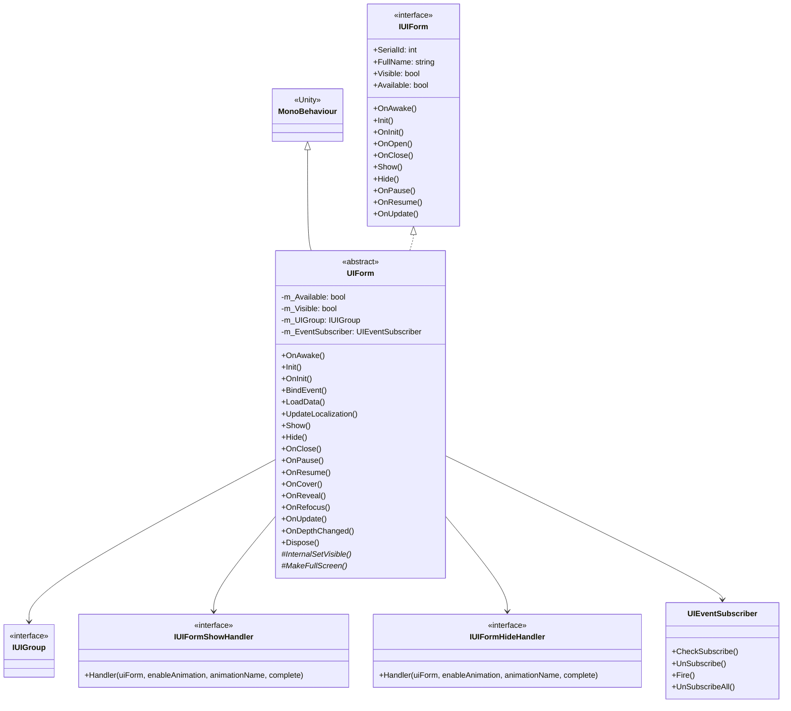
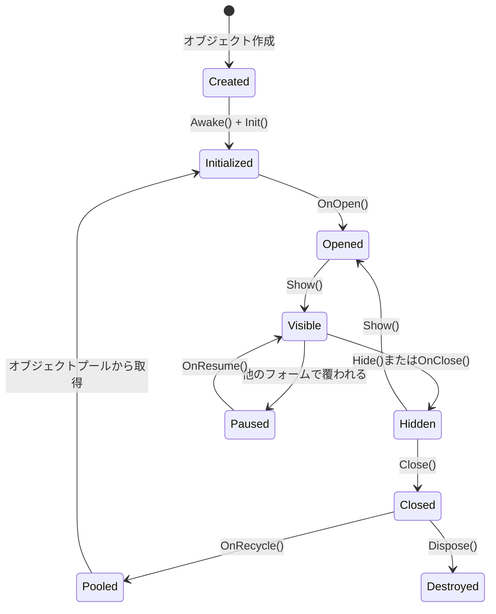

# UIForm

UIFormは、GameFrameXフレームワークにおけるすべてのUIフォームの基本クラスであり、フォームライフサイクル管理、可視性制御、イベント購読、UIグループ統合を提供します。

## 概要

UIFormは、UIシステムのコアクラスであり、Unityの`MonoBehaviour`を継承し、`IUIForm`インターフェースを実装します。初期化、表示、非表示、閉じる、一時停止、恢复などの状態遷移を含む、UIフォームの完全なライフサイクル管理を提供します。

**主な機能：**
- 完全なライフサイクルコールバックメカニズム
- 内蔵イベント購読システム
- 表示/非表示アニメーションサポート
- オブジェクトプールリサイクルメカニズム
- UIグループ深度管理
- 自動ローカライズ言語更新

## クラス関係図



## ライフサイクルフロー



## コアプロパティ

| プロパティ | タイプ | 説明 |
|----------|------|-------------|
| SerialId | int | フォームの一意なシリアルID |
| FullName | string | フォームの完全クラス名 |
| Name | string | フォーム名（GameObject名に対応） |
| Available | bool | フォームが利用可能かどうか |
| Visible | bool | フォームが表示されているかどうか |
| UIGroup | IUIGroup | このフォームが属するUIグループ |
| DepthInUIGroup | int | UIグループ内の深度 |
| PauseCoveredUIForm | bool | 覆われたフォームを一時停止するかどうか |
| IsAwake | bool | Awakeが実行されたかどうか |
| IsDisableRecycling | bool | リサイクルが無効かどうか |
| IsDisableClosing | bool | 閉じる操作が無効かどうか |
| IsCanRecycle | bool | リサイクル可能かどうか |
| EnableShowAnimation | bool | 表示アニメーションが有効かどうか |
| EnableHideAnimation | bool | 非表示アニメーションが有効かどうか |
| UserData | object | ユーザー定義データ |

## コアメソッド

### 初期化フロー

#### `OnAwake()` - Awakeコールバック

Unityライフサイクルメソッド、オブジェクト作成時に呼び出されます。イベント購読者 初期化とローカライズ言語変更イベントの購読に使用されます。

```csharp
public override void OnAwake()
{
    IsAwake = true;
}
```
> Source: [UIForm.cs](https://github.com/GameFrameX/com.gameframex.unity.ui/blob/main/Runtime/UIForm.cs#L433-L436)

#### `Init(...)` - 初期化メソッド

UIフォームを初期化し、UIマネージャによって呼び出されます。

**パラメータ：**
- `serialId` (int): フォームシリアルID
- `uiFormAssetPath` (string): フォームアセットパス
- `uiFormAssetName` (string): フォームアセット名
- `uiGroup` (IUIGroup): このフォームが属するUIグループ
- `onInitAction` (Action~IUIForm~): 初期化前に実行する делегат
- `pauseCoveredUIForm` (bool): 覆われたフォームを一時停止するかどうか
- `isNewInstance` (bool): 新しいインスタンスかどうか
- `userData` (object): ユーザー定義データ
- `recycleInterval` (int): リサイクル間隔（秒）
- `isFullScreen` (bool): 全画面かどうか

```csharp
public void Init(int serialId, string uiFormAssetPath, string uiFormAssetName, IUIGroup uiGroup,
    Action<IUIForm> onInitAction, bool pauseCoveredUIForm, bool isNewInstance,
    object userData, int recycleInterval, bool isFullScreen = false)
```
> Source: [UIForm.cs](https://github.com/GameFrameX/com.gameframex.unity.ui/blob/main/Runtime/UIForm.cs#L555-L599)

#### `OnInit()` - 初期化完了コールバック

初期化完了後のコールバック；サブクラスはこのメソッドをオーバーライドして初期化ロジックを実装できます。

```csharp
public virtual void OnInit()
{
}
```
> Source: [UIForm.cs](https://github.com/GameFrameX/com.gameframex.unity.ui/blob/main/Runtime/UIForm.cs#L608-L610)

### 表示と非表示

#### `OnOpen(object userData)` - 開くコールバック

フォームが開かれた時に呼び出されます。

```csharp
public virtual void OnOpen(object userData)
{
    m_Available = true;
    Visible = true;
    m_UserData = userData;
}
```
> Source: [UIForm.cs](https://github.com/GameFrameX/com.gameframex.unity.ui/blob/main/Runtime/UIForm.cs#L639-L644)

#### `Show(IUIFormShowHandler handler, Action complete)` - 表示メソッド

フォームを表示し、システムは表示アニメーションを呼び出します。

**パラメータ：**
- `handler` (IUIFormShowHandler): 表示 handlerインターフェース
- `complete` (Action): 完了コールバック

```csharp
public abstract void Show(IUIFormShowHandler handler, Action complete);
```
> Source: [UIForm.cs](https://github.com/GameFrameX/com.gameframex.unity.ui/blob/main/Runtime/UIForm.cs#L689)

#### `Hide(IUIFormHideHandler handler, Action complete)` - 非表示メソッド

フォームを非表示にし、システムは非表示アニメーションを呼び出します。

**パラメータ：**
- `handler` (IUIFormHideHandler): 非表示 handlerインターフェース
- `complete` (Action): 完了コールバック

```csharp
public abstract void Hide(IUIFormHideHandler handler, Action complete);
```
> Source: [UIForm.cs](https://github.com/GameFrameX/com.gameframex.unity.ui/blob/main/Runtime/UIForm.cs#L724)

#### `OnClose(bool isShutdown, object userData)` - 閉じるコールバック

フォームが閉じられた時に呼び出されます。

**パラメータ：**
- `isShutdown` (bool): UIマネージャを閉じるときにトリガーされたかどうか
- `userData` (object): ユーザー定義データ

```csharp
public virtual void OnClose(bool isShutdown, object userData)
{
    gameObject?.SetLayerRecursively(m_OriginalLayer);
    m_Available = false;
    Visible = false;
    if (m_IsDisableRecycling)
    {
        return;
    }
    ReleaseStartTime = DateTime.Now;
}
```
> Source: [UIForm.cs](https://github.com/GameFrameX/com.gameframex.unity.ui/blob/main/Runtime/UIForm.cs#L700-L712)

### 一時停止と恢复

#### `OnPause()` - 一時停止コールバック

フォームが他のフォームに覆われた時に呼び出されます。

```csharp
public virtual void OnPause()
{
    m_Available = false;
    Visible = false;
}
```
> Source: [UIForm.cs](https://github.com/GameFrameX/com.gameframex.unity.ui/blob/main/Runtime/UIForm.cs#L733-L737)

#### `OnResume()` - 恢复コールバック

フォームが一時停止状態から恢复された時に呼び出されます。

```csharp
public virtual void OnResume()
{
    m_Available = true;
    Visible = true;
}
```
> Source: [UIForm.cs](https://github.com/GameFrameX/com.gameframex.unity.ui/blob/main/Runtime/UIForm.cs#L746-L750)

### 覆い処理

#### `OnCover()` - 覆うコールバック

フォームが他のフォームに覆われた時に呼び出されます。

```csharp
public virtual void OnCover()
{
}
```
> Source: [UIForm.cs](https://github.com/GameFrameX/com.gameframex.unity.ui/blob/main/Runtime/UIForm.cs#L759-L761)

#### `OnReveal()` - 覆い解除コールバック

フォームが覆い状態から恢复された時に呼び出されます。

```csharp
public virtual void OnReveal()
{
}
```
> Source: [UIForm.cs](https://github.com/GameFrameX/com.gameframex.unity.ui/blob/main/Runtime/UIForm.cs#L770-L772)

### その他のコールバック

#### `OnRefocus(object userData)` - 再フォーカスコールバック

フォームがアクティブ化された時に呼び出され、フォームを最前面に戻すために使用されます。

```csharp
public virtual void OnRefocus(object userData)
{
}
```
> Source: [UIForm.cs](https://github.com/GameFrameX/com.gameframex.unity.ui/blob/main/Runtime/UIForm.cs#L782-L784)

#### `OnUpdate(float elapseSeconds, float realElapseSeconds)` - ポーリングコールバック

毎フレーム呼び出されるポーリングメソッド。

**パラメータ：**
- `elapseSeconds` (float): 論理的経過時間（秒）
- `realElapseSeconds` (float): 実際の経過時間（秒）

```csharp
public virtual void OnUpdate(float elapseSeconds, float realElapseSeconds)
{
}
```
> Source: [UIForm.cs](https://github.com/GameFrameX/com.gameframex.unity.ui/blob/main/Runtime/UIForm.cs#L795-L797)

#### `OnDepthChanged(int uiGroupDepth, int depthInUIGroup)` - 深度変更コールバック

フォーム深度が変更された時に呼び出されます。

**パラメータ：**
- `uiGroupDepth` (int): UIグループ深度
- `depthInUIGroup` (int): グループ内のフォーム深度

```csharp
public void OnDepthChanged(int uiGroupDepth, int depthInUIGroup)
{
    m_DepthInUIGroup = depthInUIGroup;
}
```
> Source: [UIForm.cs](https://github.com/GameFrameX/com.gameframex.unity.ui/blob/main/Runtime/UIForm.cs#L808-L811)

### イベントシステム

#### `OnEventSubscribe()` - イベント購読コールバック

`OnEnable`時に呼び出され、イベントを購読するために使用されます。サブクラスはこのメソッドをオーバーライドして、必要なイベントを登録できます。

```csharp
protected virtual void OnEventSubscribe()
{
}
```
> Source: [UIForm.cs](https://github.com/GameFrameX/com.gameframex.unity.ui/blob/main/Runtime/UIForm.cs#L508-L510)

#### `OnEventUnSubscribe()` - イベント購読解除コールバック

`OnDisable`時に呼び出され、イベントの購読を解除するために使用されます。

```csharp
protected virtual void OnEventUnSubscribe()
{
}
```
> Source: [UIForm.cs](https://github.com/GameFrameX/com.gameframex.unity.ui/blob/main/Runtime/UIForm.cs#L523-L525)

### リサイクルと破棄

#### `OnRecycle()` - リサイクルコールバック

フォームがリサイクルされる時に呼び出され、フォーム状態をリセットします。

```csharp
public virtual void OnRecycle()
{
    m_DepthInUIGroup = 0;
    m_PauseCoveredUIForm = true;
}
```
> Source: [UIForm.cs](https://github.com/GameFrameX/com.gameframex.unity.ui/blob/main/Runtime/UIForm.cs#L625-L629)

#### `Dispose()` - 破棄メソッド

フォームを破棄し、すべてのリソースを解放します。

```csharp
public virtual void Dispose()
{
    if (IsDisposed)
    {
        return;
    }
    if (m_EventSubscriber != null)
    {
        m_EventSubscriber.UnSubscribeAll();
        ReferencePool.Release(m_EventSubscriber);
    }
    m_EventSubscriber = null;
    IsDisposed = true;
}
```
> Source: [UIForm.cs](https://github.com/GameFrameX/com.gameframex.unity.ui/blob/main/Runtime/UIForm.cs#L820-L835)

### サブクラスが実装する必要があるメソッド

#### `InternalSetVisible(bool visible)` - 可視性設定

サブクラスはこのメソッドを実装して実際の可視性設定を処理する必要があります。

```csharp
protected abstract void InternalSetVisible(bool visible);
```
> Source: [UIForm.cs](https://github.com/GameFrameX/com.gameframex.unity.ui/blob/main/Runtime/UIForm.cs#L845)

#### `MakeFullScreen()` - 全画面設定

サブクラスはこのメソッドを実装して全画面設定処理を行う必要があります。

```csharp
protected internal abstract void MakeFullScreen();
```
> Source: [UIForm.cs](https://github.com/GameFrameX/com.gameframex.unity.ui/blob/main/Runtime/UIForm.cs#L854)

## 使用例

### カスタムUIFormを作成

```csharp
using GameFrameX.UI.Runtime;
using UnityEngine;

public class MainMenuForm : UIForm
{
    [SerializeField] private Text titleText;
    [SerializeField] private Button startButton;
    [SerializeField] private Button settingsButton;

    protected override void InternalSetVisible(bool visible)
    {
        gameObject.SetActive(visible);
    }

    protected internal override void MakeFullScreen()
    {
        // 全画面ロジックを実装
    }

    public override void OnInit()
    {
        base.OnInit();
        Debug.Log("MainMenuFormの初期化が完了");
    }

    public override void BindEvent()
    {
        startButton.onClick.AddListener(OnStartButtonClick);
        settingsButton.onClick.AddListener(OnSettingsButtonClick);
    }

    public override void LoadData()
    {
        // データを読み込む
        titleText.text = GetLocalizedString("MainMenu_Title");
    }

    private void OnStartButtonClick()
    {
        // 開始ボタンのクリックを処理
    }

    private void OnSettingsButtonClick()
    {
        // 設定ボタンのクリックを処理
    }

    public override void UpdateLocalization()
    {
        base.UpdateLocalization();
        titleText.text = GetLocalizedString("MainMenu_Title");
    }
}
```
> Source: [UIForm.cs](https://github.com/GameFrameX/com.gameframex.unity.ui/blob/main/Runtime/UIForm.cs#L37-L855)

### イベント購読の例

```csharp
public override void OnEventSubscribe()
{
    // ゲームイベントを購読
    EventSubscriber.CheckSubscribe(PlayerHealthChangedEventArgs.EventId, OnPlayerHealthChanged);
}

private void OnPlayerHealthChanged(object sender, GameEventArgs e)
{
    var args = (PlayerHealthChangedEventArgs)e;
    UpdateHealthBar(args.CurrentHealth, args.MaxHealth);
}

protected override void OnEventUnSubscribe()
{
    // 購読を解除
    EventSubscriber.UnSubscribe(PlayerHealthChangedEventArgs.EventId, OnPlayerHealthChanged);
}
```
> Source: [UIForm.cs](https://github.com/GameFrameX/com.gameframex.unity.ui/blob/main/Runtime/UIForm.cs#L507-L525)

## 抽象メソッドの説明

サブクラスが実装する必要がある以下のメソッド：

| メソッド | 説明 |
|--------|------|
| `Show(IUIFormShowHandler, Action)` | フォームを表示しアニメーションを実行 |
| `Hide(IUIFormHideHandler, Action)` | フォームを非表示にしアニメーションを実行 |
| `InternalSetVisible(bool)` | フォームの実際の可視性を設定 |
| `MakeFullScreen()` | フォームを全画面モードに設定 |

## IUIFormインターフェース

`UIForm`は`IUIForm`インターフェースを実装します。このインターフェースは、すべてのUIフォームが持つ必要があるすべてのプロパティとメソッドを定義します。インターフェース定義には以下が含まれます：

- プロパティ：`SerialId`、`FullName`、`Visible`、`Available`、`UIGroup`、`DepthInUIGroup`など
- メソッド：`Init()`、`OnInit()`、`OnOpen()`、`OnClose()`、`Show()`、`Hide()`、`OnPause()`、`OnResume()`、`OnUpdate()`など

> 詳細なインターフェース定義は [IUIForm.cs](https://github.com/GameFrameX/com.gameframex.unity.ui/blob/main/Runtime/UI/IUIForm.cs) を参照してください

## 関連リンク

- [UIComponent](./5-api-reference.ui-component) - UIコンポーネントリファレンス
- [IUIManager](./5-api-reference.iuimanager) - UIマネージャインターフェース
- [IUIGroup](./5-api-reference.iuigroup) - UIグループインターフェース
- [UIフォーム コアコンセプト](./4-core-concepts.ui-form) - UIフォームのコアコンセプト
- [UIグループシステム](./4-core-concepts.ui-group) - UIグループシステム
- [イベントシステム](./6-event-system) - イベントシステム