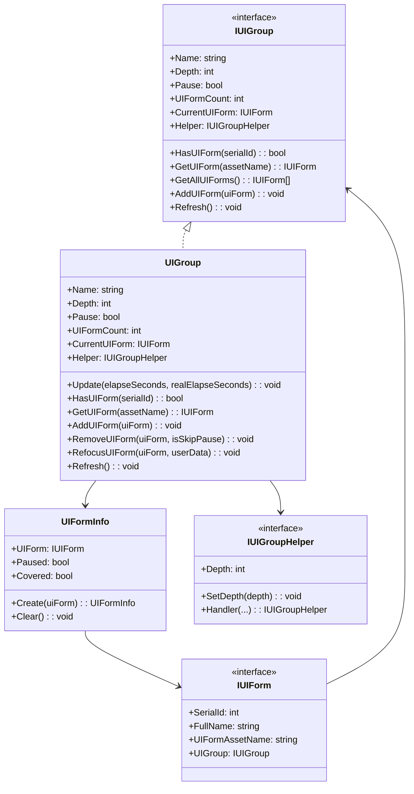
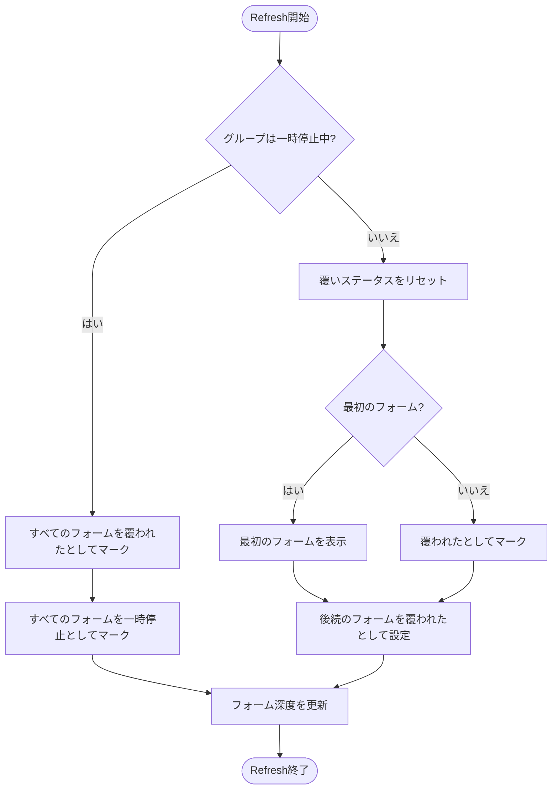
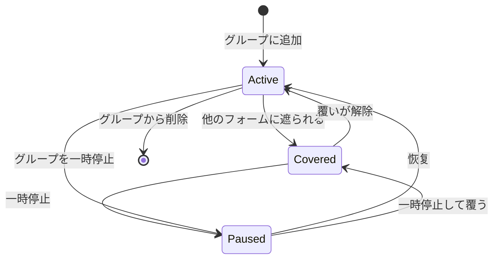

# IUIGroup

UIグループインターフェース、UIグループ管理の基本操作を定義します。

## 概要

`IUIGroup`はGameFrameX UIシステムにおけるコアインターフェースの一つであり、関連するUIフォームのグループを管理するために使用されます。UIフォームのクエリ、追加、削除、更新などの操作を提供すると同時に、深度管理与と一時停止/恢复機能をサポート。

**設計意図**：UIグループシステムにより、開発者はUIフォームを論理的にグループ化できます。各グループは独立して深度、一時停止ステータス、表示順序を制御できます。例えば、「メインメニューUI」、「ゲーム内UI」、「ポップアップUI」を異なるグループに配置して、管理と制御を容易にします。

## アーキテクチャ



**アーキテクチャ説明**：
- `IUIGroup`はUIグループの抽象インターフェースを定義
- `UIGroup`はインターフェースの具体的な実装であり、内部で`GameFrameworkLinkedList<UIFormInfo>`を使用してUIフォームリストを維持
- `UIFormInfo`は各UIフォームのステータス情報（一時停止/覆いステータス）を格納
- `IUIGroupHelper`はプラットフォーム固有のUIグループレンダリングロジックを処理

## コアフロー

### UIグループRefreshフロー

UIグループプロパティ（深度、一時停止ステータス）が変化すると、Refreshフローがトリガーされ、グループ内のすべてのUIフォームのステータスが更新されます。



**Refreshロジック説明**：
1. グループが一時停止ステータスにある場合、すべてのUIフォームは「覆われた」と「一時停止」としてマークされる
2. グループが一時停止していない場合、最初のUIフォームは表示され（覆いステータスが解除）、後続のフォームは覆われたとしてマークされる
3. Refresh中に各UIフォームの深度情報が更新される

### UIフォームライフサイクルステータス



## プロパティ詳解

### Name

```csharp
string Name { get; }
```

UIグループ名を取得。この名前はUIマネージャ内でグループを一意に識別します。

### Depth

```csharp
int Depth { get; set; }
```

UIグループ深度を取得または設定。深度値はUIグループのレンダリング順序を決定し、深度値が大きいグループが深度値が小さいグループの上にレンダリングされます。

### Pause

```csharp
bool Pause { get; set; }
```

UIグループが一時停止中かどうかを取得または設定。一時停止が`true`の場合、グループ内のすべてのUIフォームが一時停止され、ユーザーの操作に応答しません。

### UIFormCount

```csharp
int UIFormCount { get; }
```

UIグループ内のUIフォーム数を取得。

### CurrentUIForm

```csharp
IUIForm CurrentUIForm { get; }
```

最上部（最後に追加）のUIフォームを取得。

### Helper

```csharp
IUIGroupHelper Helper { get; }
```

プラットフォーム固有のUIグループ操作を処理するためのUIグループヘルパーを取得。

## メソッド詳解

### HasUIForm

```csharp
bool HasUIForm(int serialId);
bool HasUIForm(string uiFormAssetName);
```

UIグループ内に指定のUIフォームが存在するかをチェック。

**パラメータ**：
- `serialId` (int): UIフォームのシリアル番号
- `uiFormAssetName` (string): UIフォームのアセット名

**戻り値**：指定のUIフォームが存在するかどうか

### GetUIForm

```csharp
IUIForm GetUIForm(int serialId);
IUIForm GetUIForm(string uiFormAssetName);
```

UIグループからUIフォームを取得。

**パラメータ**：
- `serialId` (int): UIフォームのシリアル番号
- `uiFormAssetName` (string): UIフォームのアセット名

**戻り値**：要求されたUIフォーム、存在しない場合はnull

### GetUIForms

```csharp
IUIForm[] GetUIForms(string uiFormAssetName);
void GetUIForms(string uiFormAssetName, List<IUIForm> results);
```

UIグループから指定アセット名のすべてのUIフォームを取得（複数のインスタンスがある可能性）。

**パラメータ**：
- `uiFormAssetName` (string): UIフォームのアセット名
- `results` (List<IUIForm>): 結果を格納するためのリスト

### GetAllUIForms

```csharp
IUIForm[] GetAllUIForms();
void GetAllUIForms(List<IUIForm> results);
```

UIグループ内のすべてのUIフォームを取得。

**パラメータ**：
- `results` (List<IUIForm>): 結果を格納するためのリスト

### AddUIForm

```csharp
void AddUIForm(IUIForm uiForm);
```

UIグループにUIフォームを追加。新しく追加されたフォームが現在のフォーム（最上部）になります。

**パラメータ**：
- `uiForm` (IUIForm): 追加するUIフォーム

### InternalHasInstanceUIForm

```csharp
bool InternalHasInstanceUIForm(string uiFormAssetName, IUIForm uiForm);
```

UIグループ内に指定のUIフォームインスタンスが存在するかをチェック（内部使用）。

**パラメータ**：
- `uiFormAssetName` (string): UIフォームのアセット名
- `uiForm` (IUIForm): チェックするUIフォームインスタンス

**戻り値**：指定のUIフォームインスタンスが存在するかどうか

### Refresh

```csharp
void Refresh();
```

UIグループを更新。グループの深度または一時停止ステータスが変化した時に呼び出し、グループ内のすべてのUIフォームのステータスを更新します。

## 使用例

### UIグループを取得してフォームをクエリ

```csharp
// UIマネージャを通じてUIグループを取得
var uiGroup = uiManager.GetUIGroup("MainMenuGroup");

// グループ内に指定のフォームが存在するかをチェック
bool exists = uiGroup.HasUIForm("TestForm");

// 現在のフォームを取得
var currentForm = uiGroup.CurrentUIForm;

// すべてのフォームを取得
var allForms = uiGroup.GetAllUIForms();
```
> Source: [IUIGroup.cs](https://github.com/GameFrameX/com.gameframex.unity.ui/blob/main/Runtime/UI/IUIGroup.cs#L42-L197)

### UIグループステータスを変更

```csharp
var uiGroup = uiManager.GetUIGroup("DialogGroup");

// グループ深度を設定
uiGroup.Depth = 10;

// グループを一時停止（すべてのフォームが一時停止）
uiGroup.Pause = true;

// グループステータスを更新
uiGroup.Refresh();
```
> Source: [UIGroup.cs](https://github.com/GameFrameX/com.gameframex.unity.ui/blob/main/Runtime/UI/UIGroup.cs#L106-L142)

### UIフォームを管理

```csharp
var uiGroup = uiManager.GetUIGroup("DefaultGroup");

// グループにフォームを追加
uiGroup.AddUIForm(uiForm);

// グループを更新
uiGroup.Refresh();

// フォームを取得
var form = uiGroup.GetUIForm("MyForm");
```
> Source: [UIGroup.cs](https://github.com/GameFrameX/com.gameframex.unity.ui/blob/main/Runtime/UI/UIGroup.cs#L439-L442)

## 関連リンク

- [UIForm](./5-api-reference.ui-form) - UIフォームインターフェース
- [IUIManager](./5-api-reference.iuimanager) - UIマネージャインターフェース
- [UIグループシステム](../4-core-concepts.ui-group) - UIグループシステムのコアコンセプト
- [UIグループレイヤー](../7-ui-group-hierarchy) - UIグループレイヤーの設定