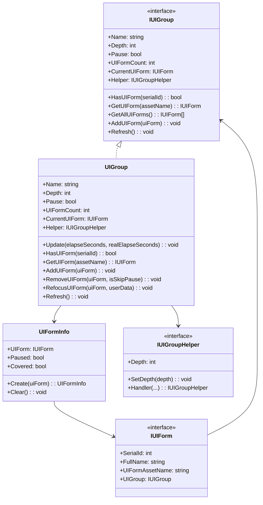
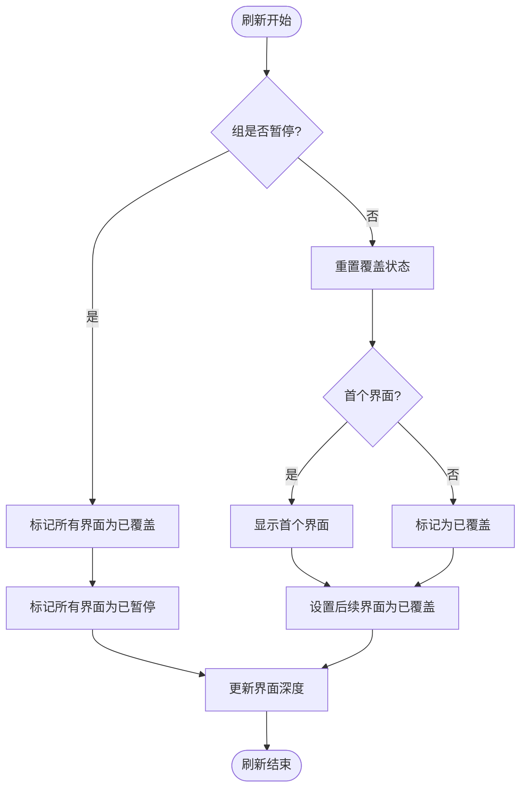
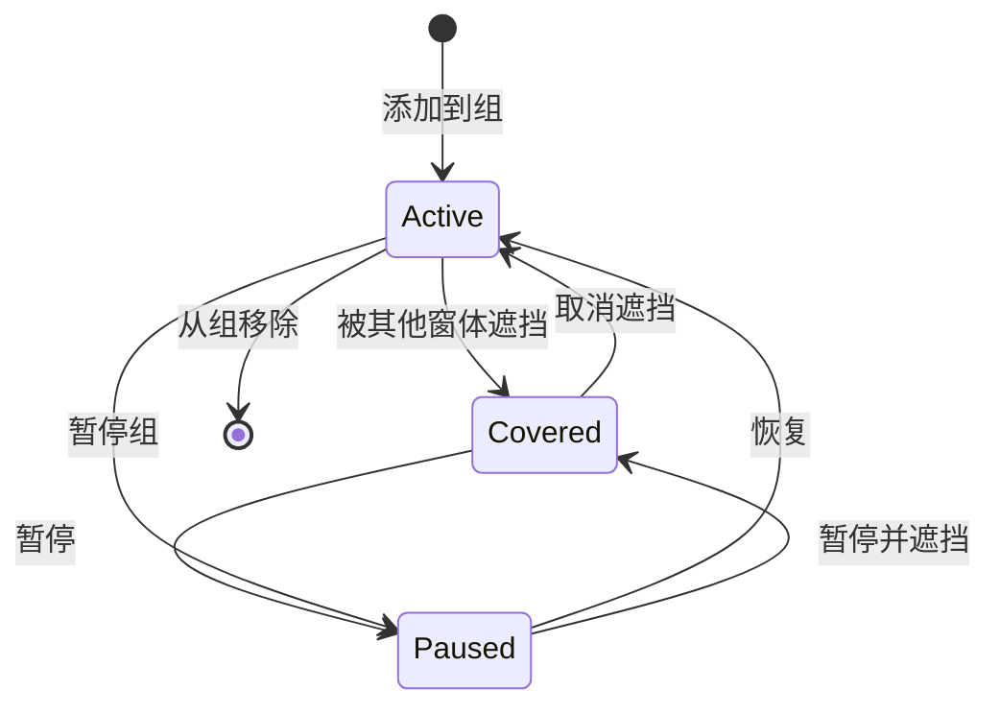

# IUIGroup

界面组インターフェース，定義了 UI 组管理的基本操作。

## 概要

`IUIGroup` 是 GameFrameX UI 系统中的コアインターフェース之一，用于管理一组相关的 UI 窗体。它提供します对 UI 窗体的查询、追加、移除、刷新等操作，同時にサポート深度管理和暂停/恢复機能。

**設計意图**：UI 组系统允许開発者将 UI 窗体逻辑分组，每组〜できます独立控制深度、暂停ステータス和显示顺序。例えば，〜できます将"主メニュー UI"、"游戏内 UI"、"弹窗 UI"分别放入不同的组，便于管理和控制。

## アーキテクチャ



**アーキテクチャ説明**：
- `IUIGroup` 定義了 UI 组的抽象インターフェース
- `UIGroup` 是インターフェース的具体実装，内部使用 `GameFrameworkLinkedList<UIFormInfo>` 维护 UI 窗体列表
- `UIFormInfo` 存储每个 UI 窗体的ステータス情報（暂停/覆盖ステータス）
- `IUIGroupHelper` 処理プラットフォーム特定的 UI 组渲染逻辑

## コアフロー

### UI 组刷新フロー

当 UI 组プロパティ（深度、暂停ステータス）发生变化时，会トリガー刷新フロー，アップデート组内所有 UI 窗体的ステータス。



**刷新逻辑説明**：
1. もし组处于暂停ステータス，所有 UI 窗体都会被标记为"已覆盖"和"已暂停"
2. もし组未暂停，首个 UI 窗体会被显示（取消覆盖ステータス），后续窗体被标记为已覆盖
3. 在刷新过程中アップデート每个 UI 窗体的深度情報

### UI 窗体ライフサイクルステータス



## プロパティ详解

### Name

```csharp
string Name { get; }
```

取得 UI 组名称。该名称在 UI マネージャー中唯一标识该组。

### Depth

```csharp
int Depth { get; set; }
```

取得或設定 UI 组深度。深度值决定 UI 组的渲染顺序，深度值大的组会渲染在深度值小的组之上。

### Pause

```csharp
bool Pause { get; set; }
```

取得或設定 UI 组是否暂停。当暂停为 `true` 时，组内所有 UI 窗体都会被暂停，不会响应ユーザー交互。

### UIFormCount

```csharp
int UIFormCount { get; }
```

取得 UI 组中 UI 窗体的数量。

### CurrentUIForm

```csharp
IUIForm CurrentUIForm { get; }
```

取得当前最上层（最後に追加）的 UI 窗体。

### Helper

```csharp
IUIGroupHelper Helper { get; }
```

取得 UI 组辅助器，用于処理プラットフォーム特定的 UI 组操作。

## メソッド详解

### HasUIForm

```csharp
bool HasUIForm(int serialId);
bool HasUIForm(string uiFormAssetName);
```

確認 UI 组中是否存在指定的 UI 窗体。

**パラメータ**：
- `serialId` (int): UI 窗体的序列编号
- `uiFormAssetName` (string): UI 窗体的リソース名称

**戻り値**：是否存在指定的 UI 窗体

### GetUIForm

```csharp
IUIForm GetUIForm(int serialId);
IUIForm GetUIForm(string uiFormAssetName);
```

从 UI 组中取得 UI 窗体。

**パラメータ**：
- `serialId` (int): UI 窗体的序列编号
- `uiFormAssetName` (string): UI 窗体的リソース名称

**戻り値**：要取得的 UI 窗体，もし不存在则返す null

### GetUIForms

```csharp
IUIForm[] GetUIForms(string uiFormAssetName);
void GetUIForms(string uiFormAssetName, List<IUIForm> results);
```

从 UI 组中取得所有指定リソース名称的 UI 窗体（〜の可能性があります有多个インスタンス）。

**パラメータ**：
- `uiFormAssetName` (string): UI 窗体的リソース名称
- `results` (List<IUIForm>): 用于存储結果的列表

### GetAllUIForms

```csharp
IUIForm[] GetAllUIForms();
void GetAllUIForms(List<IUIForm> results);
```

取得 UI 组中的所有 UI 窗体。

**パラメータ**：
- `results` (List<IUIForm>): 用于存储結果的列表

### AddUIForm

```csharp
void AddUIForm(IUIForm uiForm);
```

往 UI 组增加 UI 窗体。新追加的窗体会成为当前窗体（最上层）。

**パラメータ**：
- `uiForm` (IUIForm): 要增加的 UI 窗体

### InternalHasInstanceUIForm

```csharp
bool InternalHasInstanceUIForm(string uiFormAssetName, IUIForm uiForm);
```

確認 UI 组中是否存在指定的 UI 窗体インスタンス（内部使用）。

**パラメータ**：
- `uiFormAssetName` (string): UI 窗体的リソース名称
- `uiForm` (IUIForm): 要確認的 UI 窗体インスタンス

**戻り値**：是否存在指定的 UI 窗体インスタンス

### Refresh

```csharp
void Refresh();
```

刷新 UI 组。当组的深度或暂停ステータス发生变化时呼び出し此メソッドアップデート组内所有 UI 窗体的ステータス。

## 使用例

### 取得 UI 组并查询窗体

```csharp
// 通过 UI 管理器获取 UI 组
var uiGroup = uiManager.GetUIGroup("MainMenuGroup");

// 检查组中是否存在指定窗体
bool exists = uiGroup.HasUIForm("TestForm");

// 获取当前窗体
var currentForm = uiGroup.CurrentUIForm;

// 获取所有窗体
var allForms = uiGroup.GetAllUIForms();
```
> Source: [IUIGroup.cs](https://github.com/GameFrameX/com.gameframex.unity.ui/blob/main/Runtime/UI/IUIGroup.cs#L42-L197)

### 変更 UI 组ステータス

```csharp
var uiGroup = uiManager.GetUIGroup("DialogGroup");

// 设置组深度
uiGroup.Depth = 10;

// 暂停组（所有窗体将暂停）
uiGroup.Pause = true;

// 刷新组状态
uiGroup.Refresh();
```
> Source: [UIGroup.cs](https://github.com/GameFrameX/com.gameframex.unity.ui/blob/main/Runtime/UI/UIGroup.cs#L106-L142)

### 管理 UI 窗体

```csharp
var uiGroup = uiManager.GetUIGroup("DefaultGroup");

// 添加窗体到组
uiGroup.AddUIForm(uiForm);

// 刷新组
uiGroup.Refresh();

// 获取窗体
var form = uiGroup.GetUIForm("MyForm");
```
> Source: [UIGroup.cs](https://github.com/GameFrameX/com.gameframex.unity.ui/blob/main/Runtime/UI/UIGroup.cs#L439-L442)

## 関連リンク

- [UIForm](./5-api-reference.ui-form) - UI 窗体インターフェース
- [IUIManager](./5-api-reference.iuimanager) - UI マネージャーインターフェース
- [UI 组系统](../4-core-concepts.ui-group) - UI 组系统コアコンセプト
- [UI 组层级](../7-ui-group-hierarchy) - UI 组层级設定
