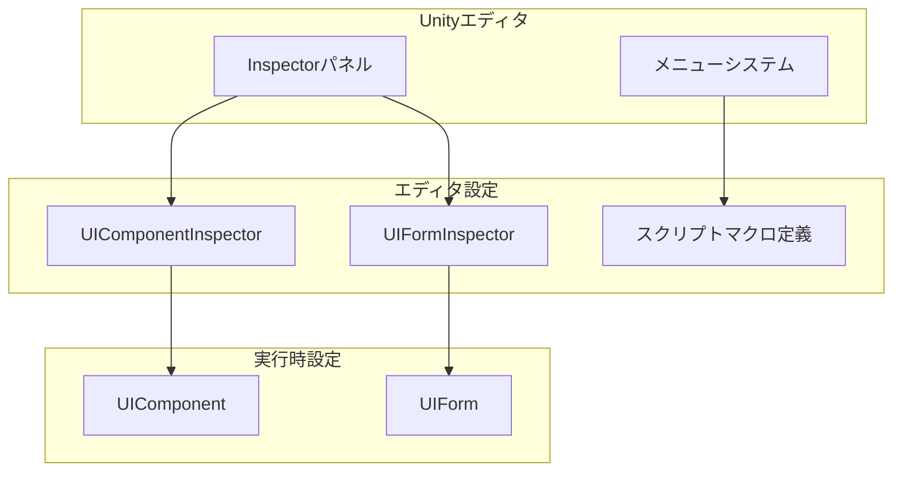
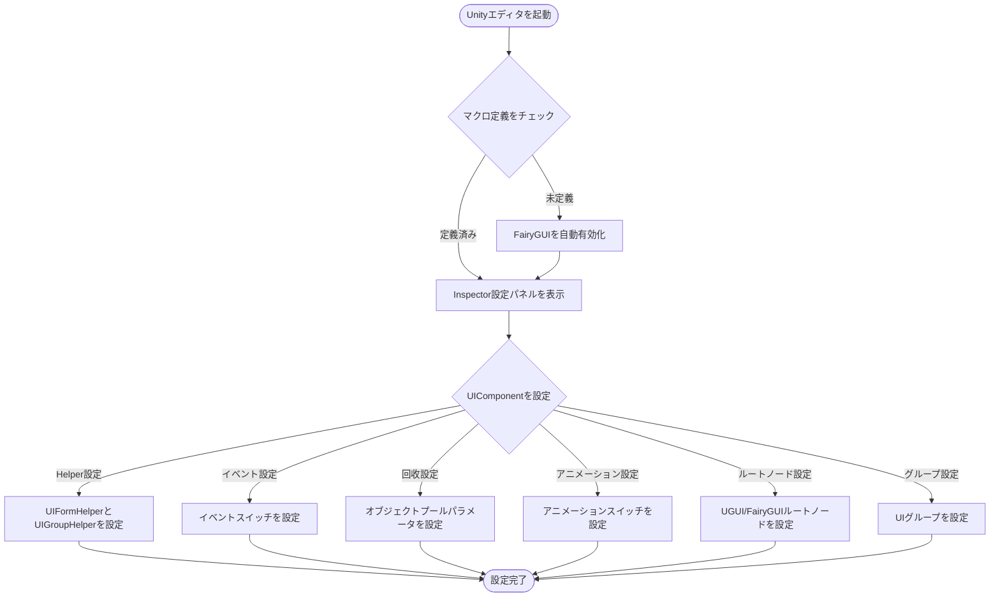

# エディタ設定

GameFrameX UIシステムは、完全なUnityエディタ設定機能を提供し、開発者がInspectorパネルとメニューオプションを通じてUIシステムの各项パラメータを柔軟に設定できます。

## 概要

エディタ設定はGameFrameX UIシステムの重要な组成部分であり、2つの主要な設定方法を提供します：

1. **Inspectorパネル設定**：UnityエディタのInspectorパネルを通じてUIコンポーネントとフォームを直接設定
2. **スクリプトマクロ定義切り替え**：メニューを通じて異なるUIエンジン（UGUIまたはFairyGUI）を切り替え

この設計により、UIシステム設定は直感的で便利になり、コードを書かなくても大部分の設定作業を完了できます。

## UIコンポーネント設定

UIComponentはUIシステムのコアコンポーネントであり、その設定は`UIComponentInspector`を通じてInspectorパネルに представлена。

### 設定インターフェース概要

```csharp
[CustomEditor(typeof(UIComponent))]
internal sealed class UIComponentInspector : ComponentTypeComponentInspector
```
> Source: [UIComponentInspector.cs](https://github.com/GameFrameX/com.gameframex.unity.ui/blob/main/Editor/UIComponentInspector.cs#L38-L40)

### Helper設定

Inspectorパネルで以下のHelperクラスを設定できます：

| 設定項目 | タイプ | 説明 |
|---------------|------|------|
| UIForm Helper | UIFormHelperBase | UIフォーム読み込みヘルパー |
| UIGroup Helper | UIGroupHelperBase | UIグループヘルパー |

```csharp
private HelperInfo<UIFormHelperBase> m_UIFormHelperInfo = new HelperInfo<UIFormHelperBase>("UIForm");
private HelperInfo<UIGroupHelperBase> m_UIGroupHelperInfo = new HelperInfo<UIGroupHelperBase>("UIGroup");
```
> Source: [UIComponentInspector.cs](https://github.com/GameFrameX/com.gameframex.unity.ui/blob/main/Editor/UIComponentInspector.cs#L62-L63)

**重要なヒント**：UIForm HelperとUIGroup Helperの名前空間プレフィックスは一致する必要があります。一致しない場合、初期化が失敗します。

## イベントシステム設定

UIComponentは複数のイベントスイッチを提供し、特定のUIイベントを購読するかを制御します：

| イベント設定 | デフォルト | 説明 |
|--------------------|---------|-------------|
| EnableOpenUIFormSuccessEvent | true | フォームを開く成功イベントを有効にする |
| EnableOpenUIFormFailureEvent | true | フォームを開く失敗イベントを有効にする |
| EnableCloseUIFormCompleteEvent | true | フォームを閉じる完了イベントを有効にする |

```csharp
[SerializeField] private bool m_EnableOpenUIFormSuccessEvent = true;
[SerializeField] private bool m_EnableOpenUIFormFailureEvent = true;
[SerializeField] private bool m_EnableCloseUIFormCompleteEvent = true;
```
> Source: [UIComponent.cs](https://github.com/GameFrameX/com.gameframex.unity.ui/blob/main/Runtime/UIComponent.cs#L62-L86)

### 設定説明

- **Enable Open Form Success Event**：有効にすると、フォームが正常に開かれた時に相应のイベントがトリガーされます
- **Enable Open Form Failure Event**：有効にすると、フォームを開くのに失敗した時に相应のイベントがトリガーされます
- **Enable Close Form Complete Event**：有効にすると、フォームが閉じるが完了した時に相应のイベントがトリガーされます

## 自動回收設定

UIComponentは完全なオブジェクトプールと自動回收メカニズムの設定を提供します：

### 回收設定

| 設定項目 | タイプ | デフォルト | 説明 |
|---------------|------|---------|-------------|
| EnableAutoReleaseUIForm | bool | true | 自動回收フォームを有効にするかどうか |
| RecycleInterval | int | 60 | フォーム回收間隔（秒）、範囲10-600 |
| InstanceAutoReleaseInterval | float | 60f | インスタンス自動解放間隔（秒） |
| InstanceCapacity | int | 16 | インスタンスオブジェクトプール容量 |
| InstanceExpireTime | float | 60f | インスタンス期限切れ時間（秒） |

```csharp
[SerializeField] private bool m_EnableAutoReleaseUIForm = true;
[SerializeField] private float m_InstanceAutoReleaseInterval = 60f;
[SerializeField] private int m_InstanceCapacity = 16;
[SerializeField] private float m_InstanceExpireTime = 60f;
[SerializeField] private int m_RecycleInterval = 60;
```
> Source: [UIComponent.cs](https://github.com/GameFrameX/com.gameframex.unity.ui/blob/main/Runtime/UIComponent.cs#L77-L141)

### 設定説明

- **EnableAutoReleaseUIForm**：無効にすると、フォームを閉じてもリソースが自動解放されません。キャッシュ再利用が必要なシナリオに適しています
- **RecycleInterval**：オブジェクトプールが回收可能なオブジェクトを自動回收する時間間隔を設定、範囲10-600秒
- **InstanceAutoReleaseInterval**：フォームインスタンスオブジェクトプールが回收可能なオブジェクトを自動解放する間隔秒数
- **InstanceCapacity**：フォームインスタンスオブジェクトプールの容量；プールにキャッシュできるフォームインスタンスの最大数
- **InstanceExpireTime**：フォームインスタンスオブジェクトプールオブジェクトの期限切れ秒数；フォームを閉じた後、この時間内に再利用が可能

## アニメーション設定

UIComponentはフォームを開く・閉じる時のアニメーション効果をサポートします：

| 設定項目 | タイプ | デフォルト | 説明 |
|---------------|------|---------|-------------|
| IsEnableUIShowAnimation | bool | false | フォーム表示アニメーションを有効にするかどうか |
| IsEnableUIHideAnimation | bool | false | フォーム非表示アニメーションを有効にするかどうか |

```csharp
[SerializeField] private bool m_IsEnableUIShowAnimation = false;
[SerializeField] private bool m_IsEnableUIHideAnimation = false;
```
> Source: [UIComponent.cs](https://github.com/GameFrameX/com.gameframex.unity.ui/blob/main/Runtime/UIComponent.cs#L95-L104)

## UIルートノード設定

異なるUIエンジンに基づいて、相应のルートノードを設定する必要があります：

### UGUIルートノード

```csharp
[SerializeField] private Transform m_InstanceUGUIRoot = null;
```
> Source: [UIComponent.cs](https://github.com/GameFrameX/com.gameframex.unity.ui/blob/main/Runtime/UIComponent.cs#L152)

### FairyGUIルートノード

```csharp
[SerializeField] private Transform m_InstanceFairyGUIRoot = null;
```
> Source: [UIComponent.cs](https://github.com/GameFrameX/com.gameframex.unity.ui/blob/main/Runtime/UIComponent.cs#L161)

## UIグループ設定

UIComponentは複数のUIグループ（UIGroup）の設定をサポートし、各グループは独立した名前と深度を持つことができます：

```csharp
[SerializeField] private UIGroup[] m_UIGroups = new UIGroup[]
{
    new UIGroup(UIGroupConstants.Hidden.Depth, UIGroupConstants.Hidden.Name),
};
```
> Source: [UIComponent.cs](https://github.com/GameFrameX/com.gameframex.unity.ui/blob/main/Runtime/UIComponent.cs#L206-L208)

**重要なヒント**：
- 少なくとも1つのUIGroupを設定する必要があります
- 複数のUIGroupに同じDepthを設定しないことを強くお勧めします

## UIフォーム設定

UIFormはUIシステム内のフォーム基本クラスであり、その設定は`UIFormInspector`を通じてInspectorパネルに表示されます：

### フォーム基本プロパティ

| プロパティ | タイプ | 説明 |
|----------|------|-------------|
| FullName | string | フォームの完全名 |
| SerialId | int | フォームのシリアルID |
| Available | bool | フォームが利用可能かどうか |
| Visible | bool | フォームが可視かどうか |
| IsInit | bool | フォームが初期化済みかどうか |
| IsDisableRecycling | bool | 回收が無効かどうか |
| IsDisableClosing | bool | 閉じる操作が無効かどうか |
| DepthInUIGroup | int | UIグループ内の深度 |
| PauseCoveredUIForm | bool | 覆われた時に一時停止するかどうか |

```csharp
[CustomEditor(typeof(UIForm), true)]
internal sealed class UIFormInspector : GameFrameworkInspector
```
> Source: [UIFormInspector.cs](https://github.com/GameFrameX/com.gameframex.unity.ui/blob/main/Editor/UIFormInspector.cs#L41-L42)

### フォームアニメーションプロパティ

| プロパティ | タイプ | 説明 |
|----------|------|-------------|
| EnableShowAnimation | bool | 表示アニメーションが有効かどうか |
| ShowAnimationName | string | 表示アニメーション名 |
| EnableHideAnimation | bool | 非表示アニメーションが有効かどうか |
| HideAnimationName | string | 非表示アニメーション名 |

## スクリプトマクロ定義設定

GameFrameX UIシステムは2つのUIエンジンをサポート：UGUIとFairyGUI。スクリプトマクロ定義を通じて異なるエンジンを切り替えられます。

### マクロ定義

| マクロ | 説明 |
|-------|------|
| ENABLE_UI_UGUI | UGUI适配を有効にする |
| ENABLE_UI_FAIRYGUI | FairyGUI适配を有効にする |

```csharp
public const string UGUIScriptingDefineSymbol = "ENABLE_UI_UGUI";
public const string FairyGUIScriptingDefineSymbol = "ENABLE_UI_FAIRYGUI";
```
> Source: [UISystemScriptingDefineSymbols.cs](https://github.com/GameFrameX/com.gameframex.unity.ui/blob/main/Editor/UISystemScriptingDefineSymbols.cs#L42-L43)

### UIエンジンの切り替え

Unityエディタでメニューを通じてUI引擎を切り替えられます：

1. メニューを開く：**GameFrameX -> Scripting Define Symbols**
2. 必要なUIシステムを選択：
   - **Enable UGUI(开启UGUI适配)** - UGUIに切り替え
   - **Enable FairyGUI(开启FairyGUI适配)** - FairyGUIに切り替え

```csharp
[MenuItem("GameFrameX/Scripting Define Symbols/Enable UGUI(开启UGUI适配)", false, 1000)]
public static void EnableUGUISystem()
{
    ScriptingDefineSymbols.RemoveScriptingDefineSymbol(FairyGUIScriptingDefineSymbol);
    ScriptingDefineSymbols.AddScriptingDefineSymbol(UGUIScriptingDefineSymbol);
}

[MenuItem("GameFrameX/Scripting Define Symbols/Enable FairyGUI(开启FairyGUI适配)", false, 1001)]
public static void EnableFairyGUISystem()
{
    ScriptingDefineSymbols.RemoveScriptingDefineSymbol(UGUIScriptingDefineSymbol);
    ScriptingDefineSymbols.AddScriptingDefineSymbol(FairyGUIScriptingDefineSymbol);
}
```
> Source: [UISystemScriptingDefineSymbols.cs](https://github.com/GameFrameX/com.gameframex.unity.ui/blob/main/Editor/UISystemScriptingDefineSymbols.cs#L48-L63)

### 自動検出

システムは自動検出メカニズムを提供します。エディタが読み込まれる時、UIシステムのマクロ定義が定義されているかをチェック：

```csharp
[InitializeOnLoadMethod]
static void Run()
{
    var hasUGUIScriptingDefineSymbol = ScriptingDefineSymbols.HasScriptingDefineSymbol(...);
    var hasFairyGUIScriptingDefineSymbol = ScriptingDefineSymbols.HasScriptingDefineSymbol(...);

    if (!(hasFairyGUIScriptingDefineSymbol || hasUGUIScriptingDefineSymbol))
    {
        EditorUtility.DisplayDialog("UIシステムのマクロ定義が検出されません", "FairyGUI UIシステムを自動的に有効にします", "了解");
        UISystemScriptingDefineSymbols.EnableFairyGUISystem();
    }
}
```
> Source: [UISystemScriptingDefineCheckHandler.cs](https://github.com/GameFrameX/com.gameframex.unity.ui/blob/main/Editor/UISystemScriptingDefineCheckHandler.cs#L15-L47)

UIシステムのマクロ定義が検出されない場合、システムは自動的にFairyGUIをデフォルトエンジンとして有効にします。

## UI設定属性

`OptionUIConfigAttribute`属性クラスはUI設定をマークするために使用され、FairyGUIとUGUIの両方のフレームワークをサポート：

```csharp
[AttributeUsage(AttributeTargets.Class)]
public sealed class OptionUIConfigAttribute : Attribute
{
    public string PackageName { get; private set; }  // FairyGUIパッケ名
    public string Path { get; private set; }         // UGUIリソースパス
    public bool IsResource { get; private set; }    // リソースパスかどうか
}
```
> Source: [OptionUIConfigAttribute.cs](https://github.com/GameFrameX/com.gameframex.unity.ui/blob/main/Runtime/Attribute/OptionUIConfigAttribute.cs#L44-L74)

### 使用例

```csharp
// FairyGUI設定
[OptionUIConfigAttribute("MyFairyGUIPackage")]
public class MyUIForm : UIForm { }

// UGUIプレハブパス設定
[OptionUIConfigAttribute("Assets/Prefabs/UI/")]
public class MyUIForm : UIForm { }

// UGUIリソースパス設定
[OptionUIConfigAttribute(true)]  // isResource = true
public class MyUIForm : UIForm { }
```

## アーキテクチャ図



## 設定フローチャート



## よくある設定問題

### 1. Helper名前空間の不一致

**問題**：初期化が失敗し、Helper設定エラーがヒントされる

**解決策**：UIForm HelperとUIGroup Helperの名前空間プレフィックスが一致していることを確認

### 2. UIグループ深度の重複

**問題**：複数のUIグループに同じ深度値が設定されている

**解決策**：Inspectorパネルで各UIグループに異なるDepth値を設定

### 3. ルートノードが未設定

**問題**：実行時にルートノード設定エラーがヒントされる

**解決策**：InspectorパネルでUGUI RootまたはFairyGUI Rootを正しく設定

## 関連リンク

- [UIコンポーネント](./4-core-concepts.ui-component)
- [UIフォーム](./4-core-concepts.ui-form)
- [UIグループシステム](./4-core-concepts.ui-group)
- [オブジェクトプール管理](./4-core-concepts.object-pool)
- [UIプロパティ](./8-configuration.attributes)
- [プラットフォームサポート](./9-platforms)