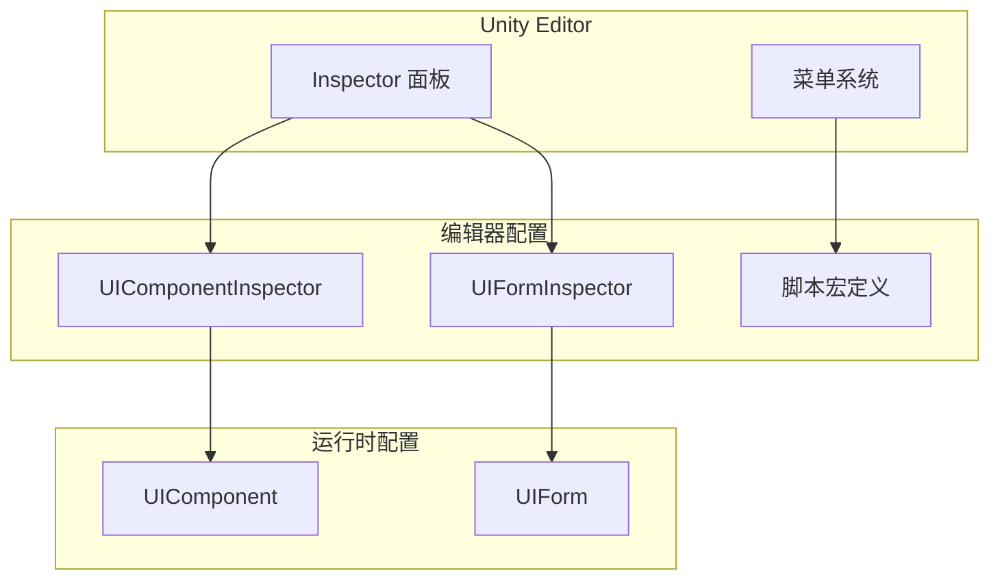
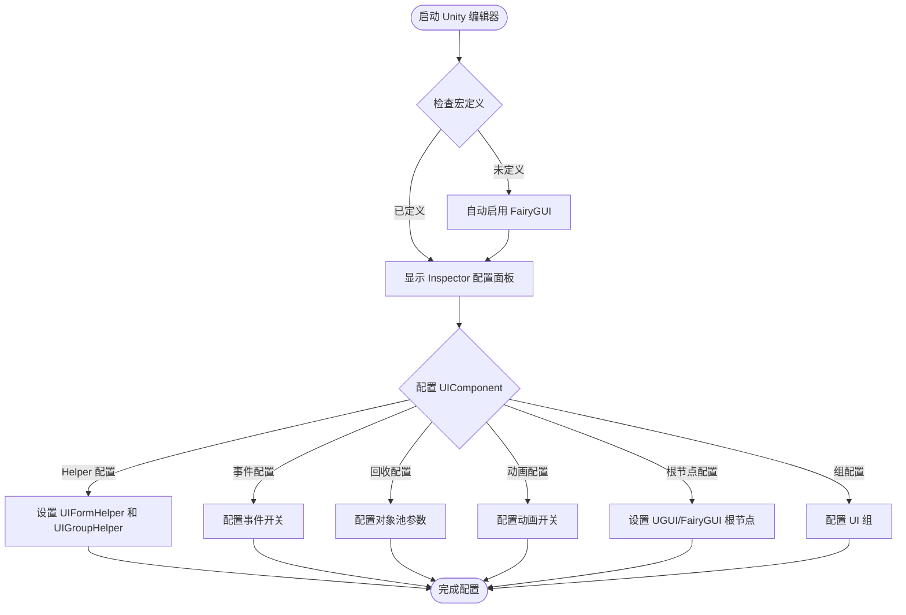

# エディタ設定

GameFrameX UI 系统提供します一套完全な的 Unity エディタ設定機能，允许開発者通过 Inspector パネル和メニューオプション柔軟設定 UI 系统的各项パラメータ。

## 概要

エディタ設定是 GameFrameX UI 系统的重要な组成部分，它提供します两种主な的設定方法：

1. **Inspector パネル設定**：通过 Unity エディタ的 Inspector パネル直接設定 UI コンポーネント和窗体
2. **脚本宏定義切换**：通过メニュー切换不同的 UI 引擎（UGUI 或 FairyGUI）

这种設計使得 UI 系统的設定变得直观和便捷，无需编写コードつまり可完成大部分設定工作。

## UI コンポーネント設定

UIComponent 是 UI 系统的コアコンポーネント，其設定通过 `UIComponentInspector` 在 Inspector パネル中呈现。

### 設定界面概览

```csharp
[CustomEditor(typeof(UIComponent))]
internal sealed class UIComponentInspector : ComponentTypeComponentInspector
```
> Source: [UIComponentInspector.cs](https://github.com/GameFrameX/com.gameframex.unity.ui/blob/main/Editor/UIComponentInspector.cs#L38-L40)

### Helper 設定

在 Inspector パネル中〜できます設定以下 Helper 类：

| 設定项 | タイプ | 説明 |
|--------|------|------|
| UIForm Helper | UIFormHelperBase | UI 窗体ロード辅助器 |
| UIGroup Helper | UIGroupHelperBase | UI 组辅助器 |

```csharp
private HelperInfo<UIFormHelperBase> m_UIFormHelperInfo = new HelperInfo<UIFormHelperBase>("UIForm");
private HelperInfo<UIGroupHelperBase> m_UIGroupHelperInfo = new HelperInfo<UIGroupHelperBase>("UIGroup");
```
> Source: [UIComponentInspector.cs](https://github.com/GameFrameX/com.gameframex.unity.ui/blob/main/Editor/UIComponentInspector.cs#L62-L63)

**重要なヒント**：UIForm Helper 和 UIGroup Helper 的名前空間前缀〜しなければなりません保持一致，否则会导致初期化失敗。

## イベント系统設定

UIComponent 提供多种イベント开关，用于控制是否購読特定的 UI イベント：

| イベント設定 | デフォルト值 | 説明 |
|----------|--------|------|
| EnableOpenUIFormSuccessEvent | true | 启用打开界面成功イベント |
| EnableOpenUIFormFailureEvent | true | 启用打开界面失敗イベント |
| EnableCloseUIFormCompleteEvent | true | 启用閉じる界面完成イベント |

```csharp
[SerializeField] private bool m_EnableOpenUIFormSuccessEvent = true;
[SerializeField] private bool m_EnableOpenUIFormFailureEvent = true;
[SerializeField] private bool m_EnableCloseUIFormCompleteEvent = true;
```
> Source: [UIComponent.cs](https://github.com/GameFrameX/com.gameframex.unity.ui/blob/main/Runtime/UIComponent.cs#L62-L86)

### 設定説明

- **启用打开界面成功イベント**：启用后，当界面打开成功时会トリガー相应イベント
- **启用打开界面失敗イベント**：启用后，当界面打开失敗时会トリガー相应イベント
- **启用閉じる界面完成イベント**：启用后，当界面閉じる完成时会トリガー相应イベント

## 自动回收設定

UIComponent 提供します完善的对象池和自动回收机制設定：

### 回收設定

| 設定项 | タイプ | デフォルト值 | 説明 |
|--------|------|--------|------|
| EnableAutoReleaseUIForm | bool | true | 是否启用自动回收界面 |
| RecycleInterval | int | 60 | 界面回收间隔（秒），范围 10-600 |
| InstanceAutoReleaseInterval | float | 60f | インスタンス自动解放间隔（秒） |
| InstanceCapacity | int | 16 | インスタンス对象池容量 |
| InstanceExpireTime | float | 60f | インスタンス过期时间（秒） |

```csharp
[SerializeField] private bool m_EnableAutoReleaseUIForm = true;
[SerializeField] private float m_InstanceAutoReleaseInterval = 60f;
[SerializeField] private int m_InstanceCapacity = 16;
[SerializeField] private float m_InstanceExpireTime = 60f;
[SerializeField] private int m_RecycleInterval = 60;
```
> Source: [UIComponent.cs](https://github.com/GameFrameX/com.gameframex.unity.ui/blob/main/Runtime/UIComponent.cs#L77-L141)

### 設定説明

- **EnableAutoReleaseUIForm**：禁用后，閉じる界面时不会自动解放リソース，適しています〜する必要があります缓存复用的シーン
- **RecycleInterval**：設定对象池自动回收可回收对象的时间间隔，范围 10-600 秒
- **InstanceAutoReleaseInterval**：界面インスタンス对象池自动解放可解放对象的间隔秒数
- **InstanceCapacity**：界面インスタンス对象池的容量，池中最多可缓存的界面インスタンス数量
- **InstanceExpireTime**：界面インスタンス对象池对象过期秒数，界面閉じる后在此时间内可被复用

## 动画設定

UIComponent サポート界面打开和閉じる时的动画效果：

| 設定项 | タイプ | デフォルト值 | 説明 |
|--------|------|--------|------|
| IsEnableUIShowAnimation | bool | false | 是否启用界面显示动画 |
| IsEnableUIHideAnimation | bool | false | 是否启用界面隐藏动画 |

```csharp
[SerializeField] private bool m_IsEnableUIShowAnimation = false;
[SerializeField] private bool m_IsEnableUIHideAnimation = false;
```
> Source: [UIComponent.cs](https://github.com/GameFrameX/com.gameframex.unity.ui/blob/main/Runtime/UIComponent.cs#L95-L104)

## UI 根节点設定

根据不同的 UI 引擎，〜する必要があります設定相应的根节点：

### UGUI 根节点

```csharp
[SerializeField] private Transform m_InstanceUGUIRoot = null;
```
> Source: [UIComponent.cs](https://github.com/GameFrameX/com.gameframex.unity.ui/blob/main/Runtime/UIComponent.cs#L152)

### FairyGUI 根节点

```csharp
[SerializeField] private Transform m_InstanceFairyGUIRoot = null;
```
> Source: [UIComponent.cs](https://github.com/GameFrameX/com.gameframex.unity.ui/blob/main/Runtime/UIComponent.cs#L161)

## UI 组設定

UIComponent サポート設定多个 UI 组（UIGroup），每个组〜できます設定独立的名称和深度：

```csharp
[SerializeField] private UIGroup[] m_UIGroups = new UIGroup[]
{
    new UIGroup(UIGroupConstants.Hidden.Depth, UIGroupConstants.Hidden.Name),
};
```
> Source: [UIComponent.cs](https://github.com/GameFrameX/com.gameframex.unity.ui/blob/main/Runtime/UIComponent.cs#L206-L208)

**重要なヒント**：
- 〜しなければなりません要設定至少一个 UIGroup
- 强烈推奨不要将多个 UIGroup 設定为相同的 Depth（深度）

## UI 窗体設定

UIForm 是 UI 系统中的窗体基底クラス，其設定通过 `UIFormInspector` 在 Inspector パネル中呈现：

### 窗体基本プロパティ

| プロパティ | タイプ | 説明 |
|------|------|------|
| FullName | string | 窗体完全な名称 |
| SerialId | int | 窗体序列 ID |
| Available | bool | 窗体是否可用 |
| Visible | bool | 窗体是否可见 |
| IsInit | bool | 窗体是否已初期化 |
| IsDisableRecycling | bool | 是否禁用回收 |
| IsDisableClosing | bool | 是否禁用閉じる |
| DepthInUIGroup | int | 在 UI 组中的深度 |
| PauseCoveredUIForm | bool | 被覆盖时是否暂停 |

```csharp
[CustomEditor(typeof(UIForm), true)]
internal sealed class UIFormInspector : GameFrameworkInspector
```
> Source: [UIFormInspector.cs](https://github.com/GameFrameX/com.gameframex.unity.ui/blob/main/Editor/UIFormInspector.cs#L41-L42)

### 窗体动画プロパティ

| プロパティ | タイプ | 説明 |
|------|------|------|
| EnableShowAnimation | bool | 是否启用显示动画 |
| ShowAnimationName | string | 显示动画名称 |
| EnableHideAnimation | bool | 是否启用隐藏动画 |
| HideAnimationName | string | 隐藏动画名称 |

## 脚本宏定義設定

GameFrameX UI 系统サポート两种 UI 引擎：UGUI 和 FairyGUI。通过脚本宏定義〜できます切换不同的引擎。

### 宏定義符号

| 宏定義 | 説明 |
|--------|------|
| ENABLE_UI_UGUI | 启用 UGUI 适配 |
| ENABLE_UI_FAIRYGUI | 启用 FairyGUI 适配 |

```csharp
public const string UGUIScriptingDefineSymbol = "ENABLE_UI_UGUI";
public const string FairyGUIScriptingDefineSymbol = "ENABLE_UI_FAIRYGUI";
```
> Source: [UISystemScriptingDefineSymbols.cs](https://github.com/GameFrameX/com.gameframex.unity.ui/blob/main/Editor/UISystemScriptingDefineSymbols.cs#L42-L43)

### 切换 UI 引擎

在 Unity エディタ中，〜できます通过メニュー切换 UI 引擎：

1. 打开メニュー：**GameFrameX → Scripting Define Symbols**
2. 选择所需的 UI 系统：
   - **Enable UGUI(开启UGUI适配)** - 切换到 UGUI
   - **Enable FairyGUI(开启FairyGUI适配)** - 切换到 FairyGUI

```csharp
[MenuItem("GameFrameX/Scripting Define Symbols/Enable UGUI(开启UGUI适配)", false, 1000)]
public static void EnableUGUISystem()
{
    ScriptingDefineSymbols.RemoveScriptingDefineSymbol(FairyGUIScriptingDefineSymbol);
    ScriptingDefineSymbols.AddScriptingDefineSymbol(UGUIScriptingDefineSymbol);
}

[MenuItem("GameFrameX/Scripting Define Symbols/Enable FairyGUI(开启FairyGUI适配)", false, 1001)]
public static void EnableFairyGUISystem()
{
    ScriptingDefineSymbols.RemoveScriptingDefineSymbol(UGUIScriptingDefineSymbol);
    ScriptingDefineSymbols.AddScriptingDefineSymbol(FairyGUIScriptingDefineSymbol);
}
```
> Source: [UISystemScriptingDefineSymbols.cs](https://github.com/GameFrameX/com.gameframex.unity.ui/blob/main/Editor/UISystemScriptingDefineSymbols.cs#L48-L63)

### 自动检测

系统提供します自动检测机制，在エディタロード时会確認是否已定義 UI 系统的宏定義符号：

```csharp
[InitializeOnLoadMethod]
static void Run()
{
    var hasUGUIScriptingDefineSymbol = ScriptingDefineSymbols.HasScriptingDefineSymbol(...);
    var hasFairyGUIScriptingDefineSymbol = ScriptingDefineSymbols.HasScriptingDefineSymbol(...);
    
    if (!(hasFairyGUIScriptingDefineSymbol || hasUGUIScriptingDefineSymbol))
    {
        EditorUtility.DisplayDialog("没有检测到UI系统的宏定义存在", "将自动启用FairyGUI的UI系统", "我知道了");
        UISystemScriptingDefineSymbols.EnableFairyGUISystem();
    }
}
```
> Source: [UISystemScriptingDefineCheckHandler.cs](https://github.com/GameFrameX/com.gameframex.unity.ui/blob/main/Editor/UISystemScriptingDefineCheckHandler.cs#L15-L47)

もし没有检测到任何 UI 系统的宏定義，系统会自动启用 FairyGUI 作为デフォルト引擎。

## UI 設定特性

`OptionUIConfigAttribute` 特性类用于标记 UI 設定，サポート FairyGUI 和 UGUI 两种フレームワーク：

```csharp
[AttributeUsage(AttributeTargets.Class)]
public sealed class OptionUIConfigAttribute : Attribute
{
    public string PackageName { get; private set; }  // FairyGUI 包名
    public string Path { get; private set; }         // UGUI 资源路径
    public bool IsResource { get; private set; }    // 是否为资源路径
}
```
> Source: [OptionUIConfigAttribute.cs](https://github.com/GameFrameX/com.gameframex.unity.ui/blob/main/Runtime/Attribute/OptionUIConfigAttribute.cs#L44-L74)

### 使用例

```csharp
// FairyGUI 配置
[OptionUIConfigAttribute("MyFairyGUIPackage")]
public class MyUIForm : UIForm { }

// UGUI 预制体路径配置
[OptionUIConfigAttribute("Assets/Prefabs/UI/")]
public class MyUIForm : UIForm { }

// UGUI 资源路径配置
[OptionUIConfigAttribute(true)]  // isResource = true
public class MyUIForm : UIForm { }
```

## アーキテクチャ图



## 設定フロー图



## 常见設定問題

### 1. Helper 名前空間不一致

**問題**：初期化失敗，ヒント Helper 設定エラー

**解決策**：確認してください UIForm Helper 和 UIGroup Helper 的名前空間前缀一致

### 2. UI 组深度重复

**問題**：多个 UI 组設定了相同的深度值

**解決策**：在 Inspector パネル中为每个 UI 组設定不同的 Depth 值

### 3. 未設定根节点

**問題**：ランタイムヒント根节点設定エラー

**解決策**：在 Inspector パネル中正确設定 UGUI Root 或 FairyGUI Root

## 関連リンク

- [UI コンポーネント](./4-core-concepts.ui-component)
- [UI 窗体](./4-core-concepts.ui-form)
- [UI 组系统](./4-core-concepts.ui-group)
- [对象池管理](./4-core-concepts.object-pool)
- [UI プロパティ](./8-configuration.attributes)
- [プラットフォームサポート](./9-platforms)
