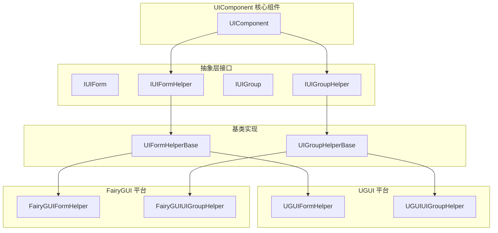
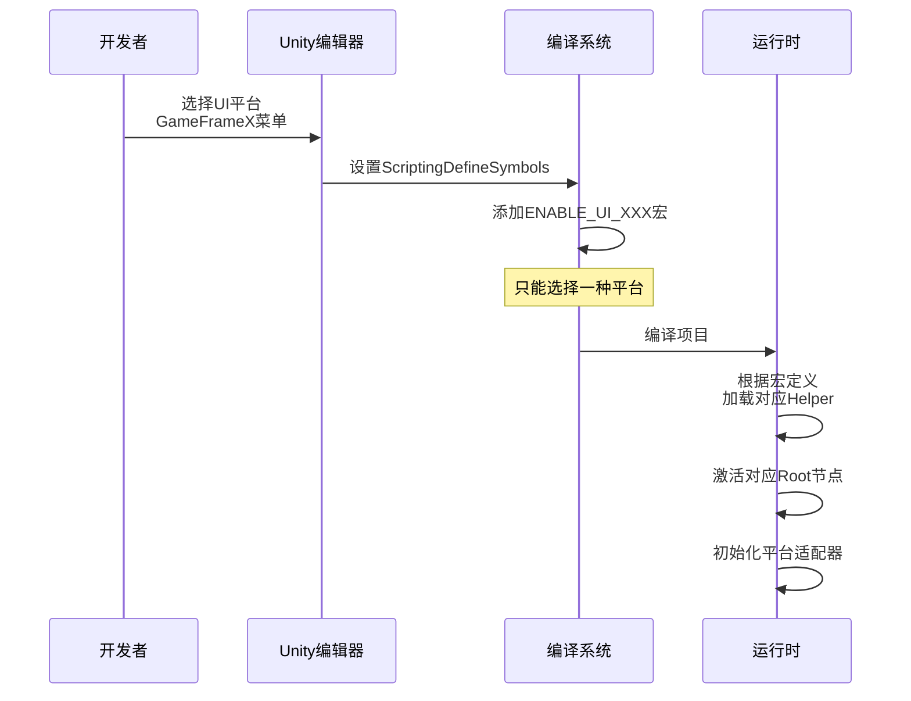

# プラットフォームサポート

GameFrameX UI 系统サポート多种 UI 渲染プラットフォーム，通过統一された的インターフェース抽象，使開発者能够在不同的 UI 系统之间柔軟切换，同時に保持业务コード的一致性。

## 概要

GameFrameX UI フレームワーク采用プラットフォーム无关的設計理念，通过抽象層（Helper インターフェース）隔离不同 UI 系统的実装差异。目前サポート两大主流 UI プラットフォーム：

| UI プラットフォーム | 宏定義符号 | 説明 |
|---------|------------|------|
| **UGUI** | `ENABLE_UI_UGUI` | Unity 官方内置的 UI 系统 |
| **FairyGUI** | `ENABLE_UI_FAIRYGUI` | 专业的第3方 UI 解決策 |

这种設計使得业务逻辑コード无需変更，仅通过切换宏定義つまり可在不同 UI 系统之间迁移，有效降低了プラットフォーム切换成本。

## アーキテクチャ設計



### コアコンポーネント説明

| コンポーネント | 职责 |
|------|------|
| **UIComponent** | UI コアマネージャー，负责协调各 Helper 工作 |
| **IUIFormHelper** | UI 窗体辅助器インターフェース，定義窗体的作成、インスタンス化和解放 |
| **IUIGroupHelper** | UI 组辅助器インターフェース，定義组的管理和深度控制 |
| **UIFormHelperBase** | 窗体辅助器抽象基底クラス，提供プラットフォーム无关的統一された実装 |
| **UIGroupHelperBase** | 组辅助器抽象基底クラス，提供プラットフォーム无关的統一された実装 |

## プラットフォーム切换設定

### 通过脚本宏定義切换

在 Unity エディタ中，通过メニュー設定 UI プラットフォーム：

```
GameFrameX → Scripting Define Symbols → Enable UGUI(开启UGUI适配)
GameFrameX → Scripting Define Symbols → Enable FairyGUI(开启FairyGUI适配)
```

> Source: [UISystemScriptingDefineSymbols.cs](https://github.com/GameFrameX/com.gameframex.unity.ui/blob/main/Editor/UISystemScriptingDefineSymbols.cs#L42-L63)

宏定義符号説明：

| 宏定義 | 作用 |
|--------|------|
| `ENABLE_UI_UGUI` | 启用 UGUI プラットフォームサポート |
| `ENABLE_UI_FAIRYGUI` | 启用 FairyGUI プラットフォームサポート |

切换原理：
```csharp
public static void EnableUGUISystem()
{
    ScriptingDefineSymbols.RemoveScriptingDefineSymbol(FairyGUIScriptingDefineSymbol);
    ScriptingDefineSymbols.AddScriptingDefineSymbol(UGUIScriptingDefineSymbol);
}

public static void EnableFairyGUISystem()
{
    ScriptingDefineSymbols.RemoveScriptingDefineSymbol(UGUIScriptingDefineSymbol);
    ScriptingDefineSymbols.AddScriptingDefineSymbol(FairyGUIScriptingDefineSymbol);
}
```
> Source: [UISystemScriptingDefineSymbols.cs](https://github.com/GameFrameX/com.gameframex.unity.ui/blob/main/Editor/UISystemScriptingDefineSymbols.cs#L49-L63)

### ランタイムプラットフォーム适配

UIComponent 在ランタイム通过条件コンパイル自动适配对应プラットフォーム：

```csharp
protected override void Awake()
{
    // ...
    var namespaceName = ImplementationComponentType.Namespace;

#if ENABLE_UI_FAIRYGUI
    if (!namespaceName.StartsWithFast("GameFrameX.UI.FairyGUI.Runtime"))
    {
        Debug.LogError("UI组件的 ComponentType 设置错误。请设置和 UI 系统一致的组件.");
        return;
    }

    if (m_InstanceFairyGUIRoot == null)
    {
        Debug.LogError("UI组件的 FAIRY GUI Root 设置错误。请设置");
        return;
    }

    m_InstanceFairyGUIRoot.gameObject.SetActive(true);
    if (m_InstanceUGUIRoot != null)
    {
        m_InstanceUGUIRoot.gameObject.SetActive(false);
    }

#elif ENABLE_UI_UGUI
    if (!namespaceName.StartsWithFast("GameFrameX.UI.UGUI.Runtime"))
    {
        Debug.LogError("UI组件的 ComponentType 设置错误。请设置和 UI 系统一致的组件.");
        return;
    }

    if (m_InstanceUGUIRoot == null)
    {
        Debug.LogError("UI组件的 UGUI Root 设置错误。请设置");
        return;
    }

    m_InstanceUGUIRoot.gameObject.SetActive(true);
#endif
}
```
> Source: [UIComponent.cs](https://github.com/GameFrameX/com.gameframex.unity.ui/blob/main/Runtime/UIComponent.cs#L370-L416)

## 根节点設定

每个 UI プラットフォーム都〜する必要があります設定独立的根节点（Root Transform），用于挂载该プラットフォーム作成的 UI 界面。

| プロパティ | タイプ | 説明 |
|------|------|------|
| `UGUIRoot` | `Transform` | UGUI 界面的根节点 |
| `FairyGUIRoot` | `Transform` | FairyGUI 界面的根节点 |

```csharp
/// 获取 UGUI 根节点变换组件。
public Transform UGUIRoot
{
    get { return m_InstanceUGUIRoot; }
}

/// 获取 FairyGUI 根节点变换组件。
public Transform FairyGUIRoot
{
    get { return m_InstanceFairyGUIRoot; }
}
```
> Source: [UIComponent.cs](https://github.com/GameFrameX/com.gameframex.unity.ui/blob/main/Runtime/UIComponent.cs#L235-L249)

### 設定例

在 Unity エディタ中設定根节点：

1. 作成空 GameObject 命名为 `UGUIRoot`，設定 Layer 为 `UI`
2. 作成空 GameObject 命名为 `FairyGUIRoot`
3. 在 UIComponent コンポーネント中分别将这两个 GameObject 赋值给对应プロパティ

```csharp
[SerializeField] private Transform m_InstanceUGUIRoot = null;
[SerializeField] private Transform m_InstanceFairyGUIRoot = null;
```
> Source: [UIComponent.cs](https://github.com/GameFrameX/com.gameframex.unity.ui/blob/main/Runtime/UIComponent.cs#L151-L161)

## Helper 設定

UI 系统通过 Helper（辅助器）来実装プラットフォーム特定的機能：

### UIFormHelper 設定

负责 UI 窗体的インスタンス化、作成和解放：

| プラットフォーム | デフォルトタイプ名称 |
|------|--------------|
| FairyGUI | `GameFrameX.UI.FairyGUI.Runtime.FairyGUIFormHelper` |
| UGUI | `GameFrameX.UI.UGUI.Runtime.UGUIFormHelper` |

```csharp
[SerializeField] private string m_UIFormHelperTypeName = "GameFrameX.UI.FairyGUI.Runtime.FairyGUIFormHelper";
[SerializeField] private UIFormHelperBase m_CustomUIFormHelper = null;
```
> Source: [UIComponent.cs](https://github.com/GameFrameX/com.gameframex.unity.ui/blob/main/Runtime/UIComponent.cs#L169-L179)

### UIGroupHelper 設定

负责 UI 组的管理和深度控制：

| プラットフォーム | デフォルトタイプ名称 |
|------|--------------|
| FairyGUI | `GameFrameX.UI.FairyGUI.Runtime.FairyGUIUIGroupHelper` |
| UGUI | `GameFrameX.UI.UGUI.Runtime.UGUIUIGroupHelper` |

```csharp
[SerializeField] private string m_UIGroupHelperTypeName = "GameFrameX.UI.FairyGUI.Runtime.FairyGUIUIGroupHelper";
[SerializeField] private UIGroupHelperBase m_CustomUIGroupHelper = null;
```
> Source: [UIComponent.cs](https://github.com/GameFrameX/com.gameframex.unity.ui/blob/main/Runtime/UIComponent.cs#L187-L197)

## 抽象基底クラス設計

### UIFormHelperBase

```csharp
public abstract class UIFormHelperBase : MonoBehaviour, IUIFormHelper
{
    /// 实例化界面
    public abstract object InstantiateUIForm(object uiFormAsset);

    /// 创建界面
    public abstract IUIForm CreateUIForm(object uiFormInstance, Type uiFormType, object userData);

    /// 释放界面
    public abstract void ReleaseUIForm(object uiFormAsset, object uiFormInstance, object assetHandle, string uiFormAssetPath, string uiFormAssetName);
}
```
> Source: [UIFormHelperBase.cs](https://github.com/GameFrameX/com.gameframex.unity.ui/blob/main/Runtime/UIFormHelperBase.cs#L42-L81)

### UIGroupHelperBase

```csharp
public abstract class UIGroupHelperBase : MonoBehaviour, IUIGroupHelper
{
    /// 获取界面组深度
    public abstract int Depth { get; protected set; }

    /// 设置界面组深度
    public abstract void SetDepth(int depth);

    /// 创建界面组
    public abstract IUIGroupHelper Handler(Transform root, string groupName, string uiGroupHelperTypeName, IUIGroupHelper customUIGroupHelper, int depth = 0);
}
```
> Source: [UIGroupHelperBase.cs](https://github.com/GameFrameX/com.gameframex.unity.ui/blob/main/Runtime/UIGroupHelperBase.cs#L41-L77)

## プラットフォーム切换フロー



## 自定義 Helper 开发

如需実装自定義 UI プラットフォーム，可按以下ステップ拡張：

### 1. 作成自定義 Helper 类

```csharp
namespace GameFrameX.UI.Custom.Runtime
{
    public class CustomUIFormHelper : UIFormHelperBase
    {
        public override object InstantiateUIForm(object uiFormAsset)
        {
            // 实现实例化逻辑
        }

        public override IUIForm CreateUIForm(object uiFormInstance, Type uiFormType, object userData)
        {
            // 实现创建逻辑
        }

        public override void ReleaseUIForm(object uiFormAsset, object uiFormInstance, object assetHandle, string uiFormAssetPath, string uiFormAssetName)
        {
            // 实现释放逻辑
        }
    }
}
```

### 2. 設定自定義 Helper

在 UIComponent コンポーネント中設定自定義 Helper：

- 設定 `Custom UIForm Helper` プロパティ
- 確認してください名前空間与 ComponentType 一致

### 3. 追加宏定義

在 `Project Settings → Player → Other Settings → Scripting Define Symbols` 中追加自定義プラットフォーム的宏定義（如 `ENABLE_UI_CUSTOM`），并在コード中使用条件コンパイル。

## よくある問題

### Q1: 切换プラットフォーム后报错"ComponentType 設定エラー"

**原因**: ComponentType 的名前空間与当前启用的宏定義不匹配。

**解決策**: 
- 使用 UGUI 时，確認してください ComponentType 継承自 `GameFrameX.UI.UGUI.Runtime`
- 使用 FairyGUI 时，確認してください ComponentType 継承自 `GameFrameX.UI.FairyGUI.Runtime`

### Q2: UI 界面显示但点击无响应

**原因**: 未正确設定对应プラットフォーム的 Root 节点。

**解決策**: 
- 確認 UGUI Root 或 FairyGUI Root 是否正确赋值
- 確認してください根节点的 Layer 設定正确（UGUI 通常使用 "UI" 层）

### Q3: 如何同時にサポート UGUI 和 FairyGUI？

**当前設計不サポート同時に启用两个プラットフォーム**。如需双プラットフォームサポート，お勧め：
- 打パッケージ不同バージョン的客户端
- 或在ランタイム动态切换（需自行拡張フレームワーク）

## 関連リンク

- [UI コンポーネント](./4-core-concepts.ui-component) - UI コンポーネントコアコンセプト
- [UI 窗体](./4-core-concepts.ui-form) - UI 窗体开发ガイド
- [UI 组系统](./4-core-concepts.ui-group) - UI 组层级管理
- [API リファレンス - UIComponent](./5-api-reference.ui-component) - UIComponent 完全な API
- [API リファレンス - IUIManager](./5-api-reference.iuimanager) - UI マネージャーインターフェース
