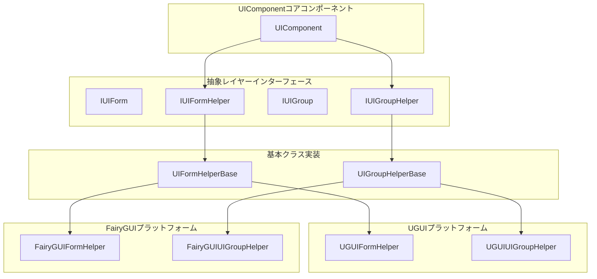
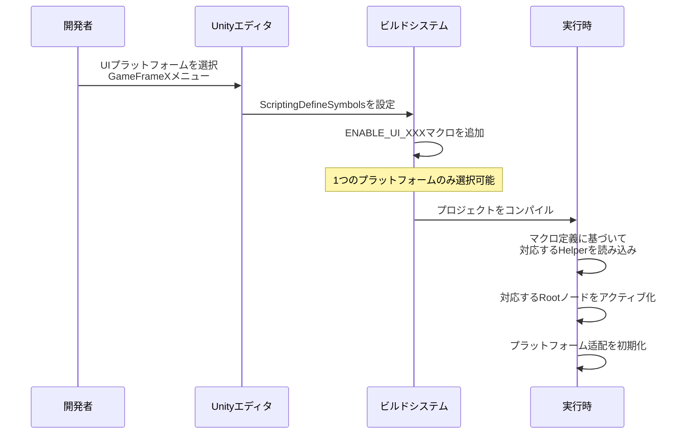

# プラットフォームサポート

GameFrameX UIシステムは複数のUIレンダリングプラットフォームをサポートし、統一されたインターフェース抽象化を通じて、開発者が異なるUIシステム間を灵活に切り替えながらビジネスコードの一貫性を保つことができます。

## 概要

GameFrameX UIフレームワークはプラットフォーム非依存の設計思想を採用し、抽象レイヤー（Helperインターフェース）を通じて異なるUIシステムの実装の違いを隔離します。現在、2つの主要なUIプラットフォームをサポート：

| UIプラットフォーム | マクロ定義 | 説明 |
|-------------|--------------|------|
| **UGUI** | `ENABLE_UI_UGUI` | Unity公式組み込みのUIシステム |
| **FairyGUI** | `ENABLE_UI_FAIRYGUI` | 專業のサードパーティUI解決策 |

この設計により、ビジネスロジックコードを変更せずに、マクロ定義を切り替えるだけで異なるUIシステム間で移行でき、プラットフォーム切り替えコストを効果的に削減します。

## アーキテクチャ設計



### コアコンポーネント説明

| コンポーネント | 責任 |
|------------|----------------|
| **UIComponent** | UIコアマネージャ、Helperの調整を担当 |
| **IUIFormHelper** | UIフォームヘルパーインターフェース、フォームの作成、インスタンス化、解放を定義 |
| **IUIGroupHelper** | UIグループヘルパーインターフェース、グループの管理与深度制御を定義 |
| **UIFormHelperBase** | フォームヘルパーの抽象基本クラス、プラットフォーム非依存の統一実装を提供 |
| **UIGroupHelperBase** | グループヘルパーの抽象基本クラス、プラットフォーム非依存の統一実装を提供 |

## プラットフォーム切り替え設定

### スクリプトマクロ定義を通じて切り替え

Unityエディタでメニューを通じてUIプラットフォームを設定：

```
GameFrameX -> Scripting Define Symbols -> Enable UGUI(开启UGUI适配)
GameFrameX -> Scripting Define Symbols -> Enable FairyGUI(开启FairyGUI适配)
```

> Source: [UISystemScriptingDefineSymbols.cs](https://github.com/GameFrameX/com.gameframex.unity.ui/blob/main/Editor/UISystemScriptingDefineSymbols.cs#L42-L63)

マクロ定義説明：

| マクロ | 効果 |
|-------|------|
| `ENABLE_UI_UGUI` | UGUIプラットフォームサポートを有効にする |
| `ENABLE_UI_FAIRYGUI` | FairyGUIプラットフォームサポートを有効にする |

切り替え原理：
```csharp
public static void EnableUGUISystem()
{
    ScriptingDefineSymbols.RemoveScriptingDefineSymbol(FairyGUIScriptingDefineSymbol);
    ScriptingDefineSymbols.AddScriptingDefineSymbol(UGUIScriptingDefineSymbol);
}

public static void EnableFairyGUISystem()
{
    ScriptingDefineSymbols.RemoveScriptingDefineSymbol(UGUIScriptingDefineSymbol);
    ScriptingDefineSymbols.AddScriptingDefineSymbol(FairyGUIScriptingDefineSymbol);
}
```
> Source: [UISystemScriptingDefineSymbols.cs](https://github.com/GameFrameX/com.gameframex.unity.ui/blob/main/Editor/UISystemScriptingDefineSymbols.cs#L49-L63)

### 実行時プラットフォーム适配

UIComponentは条件付きコンパイルを通じて実行時に相应のプラットフォームに自動适配：

```csharp
protected override void Awake()
{
    // ...
    var namespaceName = ImplementationComponentType.Namespace;

#if ENABLE_UI_FAIRYGUI
    if (!namespaceName.StartsWithFast("GameFrameX.UI.FairyGUI.Runtime"))
    {
        Debug.LogError("UIコンポーネントのComponentType設定が正しくありません。UIシステムと一致するコンポーネントを設定してください。");
        return;
    }

    if (m_InstanceFairyGUIRoot == null)
    {
        Debug.LogError("UIコンポーネントのFAIRY GUI Root設定が正しくありません。設定してください。");
        return;
    }

    m_InstanceFairyGUIRoot.gameObject.SetActive(true);
    if (m_InstanceUGUIRoot != null)
    {
        m_InstanceUGUIRoot.gameObject.SetActive(false);
    }

#elif ENABLE_UI_UGUI
    if (!namespaceName.StartsWithFast("GameFrameX.UI.UGUI.Runtime"))
    {
        Debug.LogError("UIコンポーネントのComponentType設定が正しくありません。UIシステムと一致するコンポーネントを設定してください。");
        return;
    }

    if (m_InstanceUGUIRoot == null)
    {
        Debug.LogError("UIコンポーネントのUGUI Root設定が正しくありません。設定してください。");
        return;
    }

    m_InstanceUGUIRoot.gameObject.SetActive(true);
#endif
}
```
> Source: [UIComponent.cs](https://github.com/GameFrameX/com.gameframex.unity.ui/blob/main/Runtime/UIComponent.cs#L370-L416)

## ルートノード設定

各UIプラットフォームには、そのプラットフォームで作成されたUIフォームをマウントする独立したルートノード（Root Transform）の設定が必要です。

| プロパティ | タイプ | 説明 |
|----------|------|-------------|
| `UGUIRoot` | `Transform` | UGUIフォームのルートノード |
| `FairyGUIRoot` | `Transform` | FairyGUIフォームのルートノード |

```csharp
/// UGUIルートノードのTransformコンポーネントを取得。
public Transform UGUIRoot
{
    get { return m_InstanceUGUIRoot; }
}

/// FairyGUIルートノードのTransformコンポーネントを取得。
public Transform FairyGUIRoot
{
    get { return m_InstanceFairyGUIRoot; }
}
```
> Source: [UIComponent.cs](https://github.com/GameFrameX/com.gameframex.unity.ui/blob/main/Runtime/UIComponent.cs#L235-L249)

### 設定例

Unityエディタでルートノードを設定：

1. 空のGameObjectを作成し、`UGUIRoot`という名前を付けて、Layerを`UI`に設定
2. 空のGameObjectを作成し、`FairyGUIRoot`という名前を付ける
3. UIComponentコンポーネントで、これらの2つのGameObjectを相应のプロパティに割り当て

```csharp
[SerializeField] private Transform m_InstanceUGUIRoot = null;
[SerializeField] private Transform m_InstanceFairyGUIRoot = null;
```
> Source: [UIComponent.cs](https://github.com/GameFrameX/com.gameframex.unity.ui/blob/main/Runtime/UIComponent.cs#L151-L161)

## Helper設定

UIシステムはHelper（ヘルパー）を通じてプラットフォーム固有の機能を実装：

### UIFormHelper設定

UIフォームのインスタンス化、作成、解放を担当：

| プラットフォーム | デフォルトタイプ名 |
|----------|------------------|
| FairyGUI | `GameFrameX.UI.FairyGUI.Runtime.FairyGUIFormHelper` |
| UGUI | `GameFrameX.UI.UGUI.Runtime.UGUIFormHelper` |

```csharp
[SerializeField] private string m_UIFormHelperTypeName = "GameFrameX.UI.FairyGUI.Runtime.FairyGUIFormHelper";
[SerializeField] private UIFormHelperBase m_CustomUIFormHelper = null;
```
> Source: [UIComponent.cs](https://github.com/GameFrameX/com.gameframex.unity.ui/blob/main/Runtime/UIComponent.cs#L169-L179)

### UIGroupHelper設定

UIグループの管理与深度制御を担当：

| プラットフォーム | デフォルトタイプ名 |
|----------|------------------|
| FairyGUI | `GameFrameX.UI.FairyGUI.Runtime.FairyGUIUIGroupHelper` |
| UGUI | `GameFrameX.UI.UGUI.Runtime.UGUIUIGroupHelper` |

```csharp
[SerializeField] private string m_UIGroupHelperTypeName = "GameFrameX.UI.FairyGUI.Runtime.FairyGUIUIGroupHelper";
[SerializeField] private UIGroupHelperBase m_CustomUIGroupHelper = null;
```
> Source: [UIComponent.cs](https://github.com/GameFrameX/com.gameframex.unity.ui/blob/main/Runtime/UIComponent.cs#L187-L197)

## 抽象基本クラス設計

### UIFormHelperBase

```csharp
public abstract class UIFormHelperBase : MonoBehaviour, IUIFormHelper
{
    /// フォームをインスタンス化
    public abstract object InstantiateUIForm(object uiFormAsset);

    /// フォームを作成
    public abstract IUIForm CreateUIForm(object uiFormInstance, Type uiFormType, object userData);

    /// フォームを解放
    public abstract void ReleaseUIForm(object uiFormAsset, object uiFormInstance, object assetHandle, string uiFormAssetPath, string uiFormAssetName);
}
```
> Source: [UIFormHelperBase.cs](https://github.com/GameFrameX/com.gameframex.unity.ui/blob/main/Runtime/UIFormHelperBase.cs#L42-L81)

### UIGroupHelperBase

```csharp
public abstract class UIGroupHelperBase : MonoBehaviour, IUIGroupHelper
{
    /// フォームグループ深度を取得
    public abstract int Depth { get; protected set; }

    /// フォームグループ深度を設定
    public abstract void SetDepth(int depth);

    /// フォームグループを作成
    public abstract IUIGroupHelper Handler(Transform root, string groupName, string uiGroupHelperTypeName, IUIGroupHelper customUIGroupHelper, int depth = 0);
}
```
> Source: [UIGroupHelperBase.cs](https://github.com/GameFrameX/com.gameframex.unity.ui/blob/main/Runtime/UIGroupHelperBase.cs#L41-L77)

## プラットフォーム切り替えフロー



## カスタムHelper開発

カスタムUIプラットフォームを実装する必要がある場合、以下の手順で拡張できます：

### 1. カスタムHelperクラスを作成

```csharp
namespace GameFrameX.UI.Custom.Runtime
{
    public class CustomUIFormHelper : UIFormHelperBase
    {
        public override object InstantiateUIForm(object uiFormAsset)
        {
            // インスタンス化ロジックを実装
        }

        public override IUIForm CreateUIForm(object uiFormInstance, Type uiFormType, object userData)
        {
            // 作成ロジックを実装
        }

        public override void ReleaseUIForm(object uiFormAsset, object uiFormInstance, object assetHandle, string uiFormAssetPath, string uiFormAssetName)
        {
            // 解放ロジックを実装
        }
    }
}
```

### 2. カスタムHelperを設定

UIComponentコンポーネントでカスタムHelperを設定：

- `Custom UIForm Helper`プロパティを設定
- 名前空間がComponentTypeと一致していることを確認

### 3. マクロ定義を追加

`Project Settings -> Player -> Other Settings -> Scripting Define Symbols`でカスタムプラットフォームのマクロ定義を追加（例如`ENABLE_UI_CUSTOM`）、コードで条件付きコンパイルを使用。

## よくある質問

### Q1: プラットフォーム切り替え後に「ComponentType設定エラー」と表示される

**原因**：ComponentTypeの名前空間が現在有効になっているマクロ定義と一致しない。

**解決策**：
- UGUIを使用する時、ComponentTypeが`GameFrameX.UI.UGUI.Runtime`を継承していることを確認
- FairyGUIを使用する時、ComponentTypeが`GameFrameX.UI.FairyGUI.Runtime`を継承していることを確認

### Q2: UIフォームは表示されるがクリックに反応しない

**原因**：対応するプラットフォームのRootノードが正しく設定されていない。

**解決策**：
- UGUI RootまたはFairyGUI Rootが正しく割り当てられているかを確認
- ルートノードのLayerが正しく設定されていることを確認（UGUIは通常「UI」レイヤーを使用）

### Q3: UGUIとFairyGUIの両方を同時にサポートするには？

**現在の設計では両方のプラットフォームを同時に有効にすることはサポートされていません**。デュアルプラットフォームサポートが必要な場合：
- 異なるバージョンのクライアントをパッケージ化
- または実行時に動的に切り替え（自分でフレームワークを拡張する必要があります）

## 関連リンク

- [UIコンポーネント](./4-core-concepts.ui-component) - UIコンポーネントのコアコンセプト
- [UIフォーム](./4-core-concepts.ui-form) - UIフォーム開発ガイド
- [UIグループシステム](./4-core-concepts.ui-group) - UIグループレイヤー管理
- [APIリファレンス - UIComponent](./5-api-reference.ui-component) - UIComponent完全API
- [APIリファレンス - IUIManager](./5-api-reference.iuimanager) - UIマネージャインターフェース