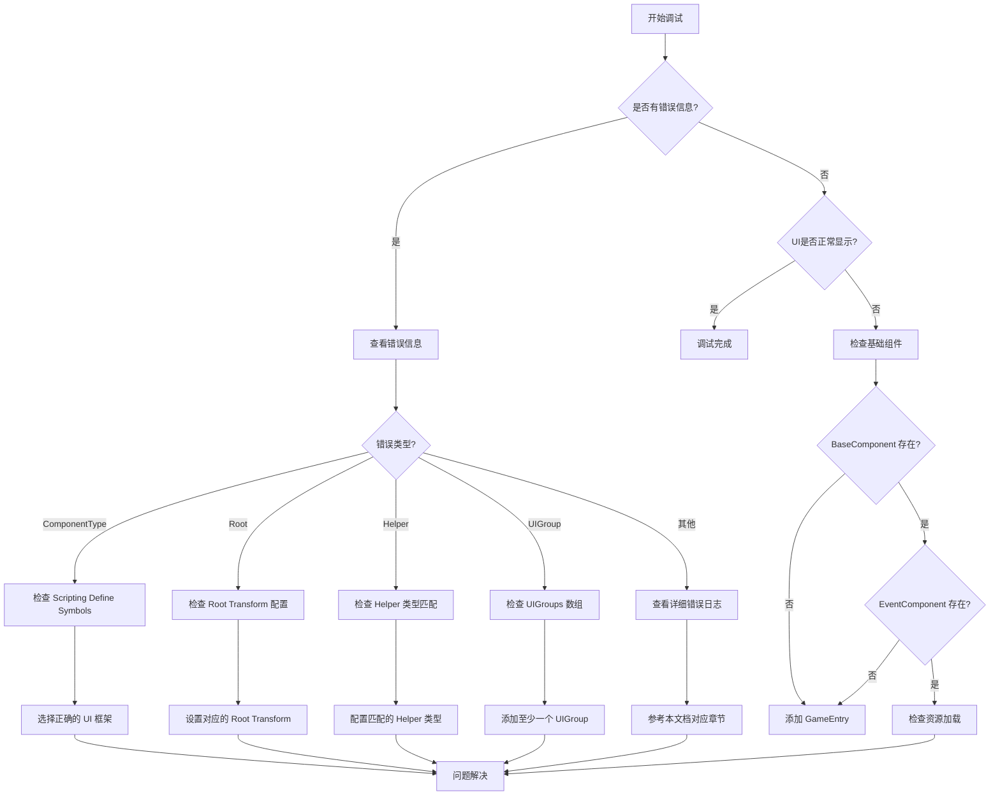

# よくある問題

このドキュメント列出了使用 GameFrameX UI フレームワーク时常见的エラーシーン、原因分析および解決策。

## 概要

GameFrameX UI フレームワークはサポート UGUI 和 FairyGUI 两种 UI 解決策的モジュール化系统。由于存在多种設定オプション和プラットフォーム特定的設定，開発者在集成过程中〜の可能性があります会遇到各种設定エラー。このドキュメント旨在帮助開発者快速定位和解决常见問題。

## よくある問題列表

### 1. UI コンポーネントタイプ不匹配

**エラー情報：**
```
UI组件的 ComponentType 设置错误。请设置和 UI 系统一致的组件.
```

**原因分析：**
此エラー发生在 `UIComponent` 的 `ComponentType` 設定与プロジェクト中的 Scripting Define Symbols 不一致时。例えば，プロジェクト中启用了 `ENABLE_UI_FAIRYGUI`，但 `ComponentType` 却設定为 UGUI 実装类。

**解決策：**
1. 確認プロジェクト使用的 UI フレームワーク（UGUI 或 FairyGUI）
2. 打开メニュー `GameFrameX → Scripting Define Symbols`
3. 选择对应的 UI フレームワーク：
   - 选择 `Enable UGUI(开启UGUI适配)` 使用 UGUI
   - 选择 `Enable FairyGUI(开启FairyGUI适配)` 使用 FairyGUI
4. 確認してください `UIComponent` 的 `ComponentType` 与启用的フレームワーク一致

> Source: [Runtime/UIComponent.cs](https://github.com/GameFrameX/com.gameframex.unity.ui/blob/main/Runtime/UIComponent.cs#L378-L400)

---

### 2. Root 变换未設定

**エラー情報：**
```
UI组件的 FAIRY GUI Root 设置错误。请设置
UI组件的 UGUI Root 设置错误。请设置
```

**原因分析：**
`UIComponent` 〜する必要があります指定 UI 根节点的 Transform。当使用 FairyGUI 时〜する必要があります設定 `FairyGUI Root`，使用 UGUI 时〜する必要があります設定 `UGUI Root`。

**解決策：**
1. 在シーン中作成一个空的 GameObject 作为 UI 根节点
2. 在 `UIComponent` コンポーネント的 Inspector パネル中：
   - 使用 FairyGUI 时：設定 `FairyGUI Root` 为 FairyGUI 的容器 Transform
   - 使用 UGUI 时：設定 `UGUI Root` 为 Canvas 或 UI 容器 Transform

```csharp
// 示例：运行时动态设置 Root（不推荐，仅用于调试）
var uiComponent = gameObject.GetComponent<UIComponent>();
// 需在编辑器中正确配置 Root
```

> Source: [Runtime/UIComponent.cs](https://github.com/GameFrameX/com.gameframex.unity.ui/blob/main/Runtime/UIComponent.cs#L385-L389)

---

### 3. UI Form Helper タイプ不匹配

**エラー情報：**
```
UI组件的 UI Form Helper 设置错误。请设置和 ComponentType 类型 一致.
```

**原因分析：**
`UI Form Helper` 的タイプ〜しなければなりません与 `ComponentType` 匹配。もし使用了 FairyGUI 但設定了 UGUI 的 Helper，会导致此エラー。

**解決策：**
1. 在 `UIComponent` 的 Inspector パネル中
2. 找到 `UI Form Helper Type Name` フィールド
3. 根据使用的 UI フレームワーク选择正确的タイプ：
   - FairyGUI：`GameFrameX.UI.FairyGUI.Runtime.FairyGUIFormHelper`
   - UGUI：`GameFrameX.UI.UGUI.Runtime.UGUIFormHelper`

> Source: [Runtime/UIComponent.cs](https://github.com/GameFrameX/com.gameframex.unity.ui/blob/main/Runtime/UIComponent.cs#L417-L421)

---

### 4. UI Group Helper タイプ不匹配

**エラー情報：**
```
UI组件的 UI Group Helper 设置错误。请设置和 ComponentType 类型 一致.
```

**原因分析：**
与 UI Form Helper 类似，`UI Group Helper` 也〜しなければなりません与 `ComponentType` 匹配。

**解決策：**
1. 在 `UIComponent` 的 Inspector パネル中
2. 找到 `UI Group Helper Type Name` フィールド
3. 根据使用的 UI フレームワーク选择正确的タイプ：
   - FairyGUI：`GameFrameX.UI.FairyGUI.Runtime.FairyGUIUIGroupHelper`
   - UGUI：`GameFrameX.UI.UGUI.Runtime.UGUIUIGroupHelper`

> Source: [Runtime/UIComponent.cs](https://github.com/GameFrameX/com.gameframex.unity.ui/blob/main/Runtime/UIComponent.cs#L423-L427)

---

### 5. UI Group 未設定

**エラー情報：**
```
必须要设置至少一个UIGroup
```

**原因分析：**
`UIComponent` 至少〜する必要があります設定一个 UI Group，否则无法正确管理 UI 窗体的层级和显示。

**解決策：**
1. 在 `UIComponent` 的 Inspector パネル中
2. 找到 `UIGroups` 数组
3. 点击 `+` 追加至少一个 UI Group
4. 为每个 Group 設定：
   - `GroupName`：分组名称（不能为空）
   - `Depth`：显示优先级（お勧め不同分组設定不同的 Depth）

> Source: [Editor/UIComponentInspector.cs](https://github.com/GameFrameX/com.gameframex.unity.ui/blob/main/Editor/UIComponentInspector.cs#L169-L172)

---

### 6. Scripting Define Symbol 未設定

**エラー现象：**
UI 系统完全不工作，控制台无エラー情報或显示上述設定エラー。

**原因分析：**
プロジェクト中既没有启用 `ENABLE_UI_UGUI` 也没有启用 `ENABLE_UI_FAIRYGUI`，导致 UI 系统的条件コンパイルコード无法正确コンパイル。

**解決策：**
1. 打开 Unity メニュー `GameFrameX → Scripting Define Symbols`
2. 选择一种 UI フレームワーク：
   - `Enable UGUI(开启UGUI适配)` - 启用 UGUI サポート
   - `Enable FairyGUI(开启FairyGUI适配)` - 启用 FairyGUI サポート
3. 重新コンパイルプロジェクト

> Source: [Editor/UISystemScriptingDefineSymbols.cs](https://github.com/GameFrameX/com.gameframex.unity.ui/blob/main/Editor/UISystemScriptingDefineSymbols.cs#L42-L63)

---

### 7. 基本コンポーネント缺失

**エラー情報：**
```
Base component is invalid.
Event component is invalid.
```

**原因分析：**
`UIComponent` 依赖 `BaseComponent` 和 `EventComponent`，もし这些コンポーネント不存在于シーン中，UI 系统将无法正常工作。

**解決策：**
1. 確認してくださいシーン中存在 `GameEntry` 对象
2. 確認してください `GameEntry` 上挂载了以下コンポーネント：
   - `BaseComponent`（GameFrameX コアコンポーネント）
   - `EventComponent`（イベント系统コンポーネント）

```csharp
// 检查组件是否存在的示例代码
var baseComponent = GameEntry.GetComponent<BaseComponent>();
if (baseComponent == null)
{
    Debug.LogError("BaseComponent 未找到，请确保场景中存在 GameEntry");
}

var eventComponent = GameEntry.GetComponent<EventComponent>();
if (eventComponent == null)
{
    Debug.LogError("EventComponent 未找到，请确保场景中存在 GameEntry");
}
```

> Source: [Runtime/UIComponent.cs](https://github.com/GameFrameX/com.gameframex.unity.ui/blob/main/Runtime/UIComponent.cs#L462-L474)

---

### 8. UI Form 打开失敗

**エラー情報：**
```
Open UI form failure, asset name '{0}', pause covered UI form '{1}', error message '{2}'.
Can not find UI form '{0}'.
```

**原因分析：**
1. UI Form リソースパス不正确
2. UI Form リソース未在对应路径下
3. UI Form Helper 設定エラー

**解決策：**
1. 確認 UI Form 的リソースパス是否正确
2. 確認 `OptionUIConfigAttribute` 設定正确：
   - FairyGUI：設定正确的 `PackageName`
   - UGUI：設定正确的リソース `Path`
3. 確認リソース是否已追加到リソース管理系统

```csharp
// 正确的 UI Form 配置示例
[OptionUIConfigAttribute(packageName = "MyFairyGUIPackage")]
public class MyUIForm : UIForm
{
    // ...
}

// 或 UGUI 版本
[OptionUIConfigAttribute(path = "UI/Prefabs/MyForm")]
public class MyUIForm : UIForm
{
    // ...
}
```

> Source: [Runtime/BaseUIManager.Open.cs](https://github.com/GameFrameX/com.gameframex.unity.ui/blob/main/Runtime/BaseUIManager.Open.cs)

---

### 9. OptionUIConfigAttribute 設定エラー

**エラー情報：**
```
PackageName or Path is null
```

**原因分析：**
`OptionUIConfigAttribute` 要求至少提供 `packageName`（FairyGUI）或 `path`（UGUI）之一，不能两者都为空。

**解決策：**
確認してください UI Form 类上的特性設定正确：

```csharp
// 错误示例 - 会抛出异常
[OptionUIConfigAttribute()]  // 错误：两者都为空
public class BadUIForm : UIForm { }

// 正确示例 - FairyGUI
[OptionUIConfigAttribute(packageName = "MainPackage")]
public class FairyGUIForm : UIForm { }

// 正确示例 - UGUI
[OptionUIConfigAttribute(path = "UI/Forms/MainForm")]
public class UGUIForm : UIForm { }
```

> Source: [Runtime/Attribute/OptionUIConfigAttribute.cs](https://github.com/GameFrameX/com.gameframex.unity.ui/blob/main/Runtime/Attribute/OptionUIConfigAttribute.cs#L86-L93)

---

### 10. UI Group 不存在

**エラー情報：**
```
UI group '{0}' is not exist.
```

**原因分析：**
尝试打开或操作一个不存在的 UI Group。

**解決策：**
1. 在 `UIComponent` 中预先設定所需的 UI Group
2. 打开 UI Form 时使用已存在的 Group 名称

```csharp
// 正确使用已存在的 UI Group
UIManager.Instance.OpenUIForm<MyForm>("MainGroup", userData: null);
```

> Source: [Runtime/BaseUIManager.UIGroup.cs](https://github.com/GameFrameX/com.gameframex.unity.ui/blob/main/Runtime/BaseUIManager.UIGroup.cs#L159-L162)

---

## デバッグ技巧

### 启用詳細ログ

〜できます通过設定取得更詳細的ランタイム情報：

```csharp
// 在启动时设置更详细的日志级别
Log.SetLogHelper(new UnityLogHelper());
Log.AddDebuger();
```

### 確認 UI コンポーネントステータス

```csharp
// 获取 UIComponent 并检查状态
var uiComponent = GameEntry.GetComponent<UIComponent>();
if (uiComponent == null)
{
    Debug.LogError("UIComponent 未找到");
    return;
}

// 检查 UI Group 数量
Debug.Log($"UI Group Count: {uiComponent.UIGroupCount}");
```

### イベント購読問題排查

もし UI イベント没有トリガー，確認是否正确購読：

```csharp
// 确保在正确的时机订阅事件
void OnOpenUIFormSuccess(object sender, OpenUIFormSuccessEventArgs e)
{
    Debug.Log($"UI Form 打开成功: {e.UIFormAssetName}");
}

// 订阅事件
UIManager.Instance.OpenUIFormSuccess += OnOpenUIFormSuccess;
```

---

## 常见エラーフロー图



---

## 関連リンク

- [UI コンポーネント](./4-core-concepts.ui-component) - UIComponent コアコンセプト
- [UI 窗体](./4-core-concepts.ui-form) - UIForm 窗体コンセプト
- [UI 组系统](./4-core-concepts.ui-group) - UI Group 层级管理
- [エディタ設定](./8-configuration.editor) - エディタ設定オプション
- [UI プロパティ](./8-configuration.attributes) - UI プロパティ設定
- [プラットフォームサポート](./9-platforms) - プラットフォーム相关設定
