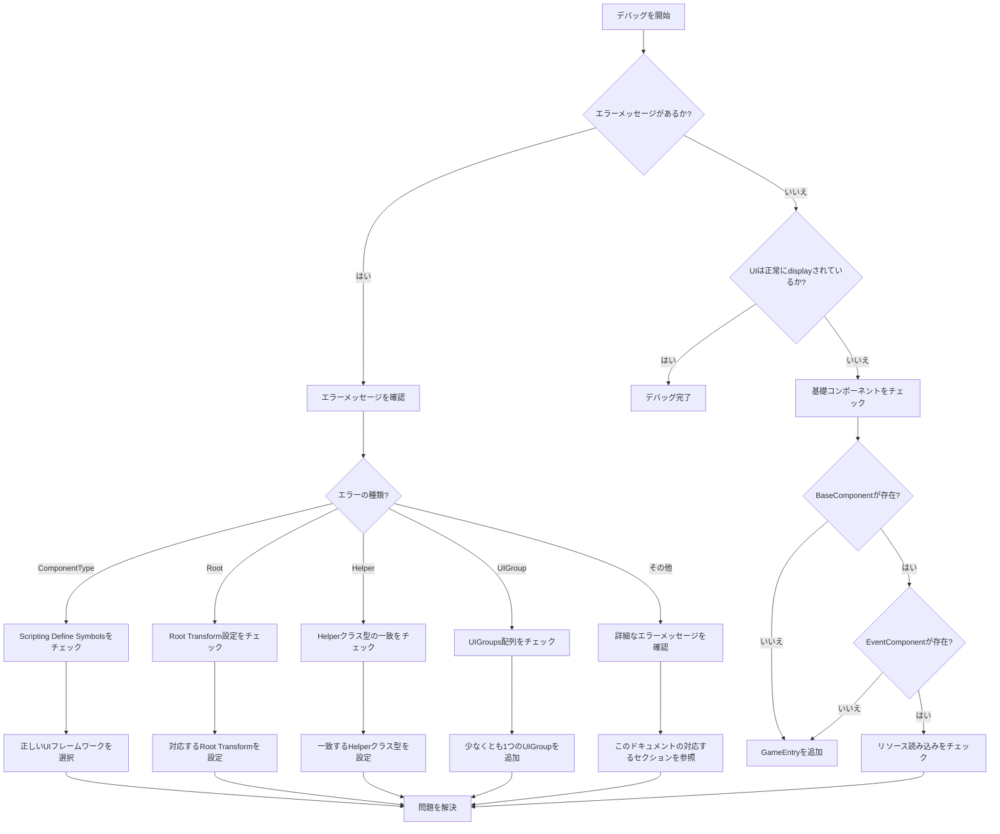

# よくある質問

このドキュメントでは、GameFrameX UIフレームワークを使用する際に発生する一般的なエラーシナリオ、原因分析、解決策を説明します。

## 概要

GameFrameX UIフレームワークは、UGUIとFairyGUIの両方のUI解決策をサポートするモジュール式システムです。多种多样的設定オプションとプラットフォーム固有の設定が存在するため、開発者は統合プロセス中にさまざまな設定エラーが発生する可能性があります。このドキュメントは、開発者が一般的な問題を迅速に特定して解決するのに役立ちます。

## よくある質問リスト

### 1. UIコンポーネントタイプが一致しない

**エラーメッセージ：**
```
UIコンポーネントのComponentType設定が正しくありません。UIシステムと一致するコンポーネントを設定してください。
```

**原因分析：**
`UIComponent`の`ComponentType`設定がプロジェクトのScripting Define Symbolsと一致しない場合にこのエラーが発生します。例えば、プロジェクトで`ENABLE_UI_FAIRYGUI`が有効になっているのに、`ComponentType`はUGUI実装クラスに設定されている場合。

**解決策：**
1. プロジェクトで使用されているUIフレームワーク（UGUIまたはFairyGUI）を確認
2. メニューを開く：`GameFrameX -> Scripting Define Symbols`
3.  соответствующий UIフレームワークを選択：
   - `Enable UGUI(开启UGUI适配)`を選択するとUGUIを使用
   - `Enable FairyGUI(开启FairyGUI适配)`を選択するとFairyGUIを使用
4. `UIComponent`の`ComponentType`が有効なフレームワークと一致していることを確認

> Source: [Runtime/UIComponent.cs](https://github.com/GameFrameX/com.gameframex.unity.ui/blob/main/Runtime/UIComponent.cs#L378-L400)

---

### 2. Root Transformが未設定

**エラーメッセージ：**
```
UIコンポーネントのFAIRY GUI Root設定が正しくありません。設定してください。
UIコンポーネントのUGUI Root設定が正しくありません。設定してください。
```

**原因分析：**
`UIComponent`にはUIルートノードのTransformを指定する必要があります。FairyGUIを使用する時は`FairyGUI Root`を設定し、UGUIを使用する時は`UGUI Root`を設定する必要があります。

**解決策：**
1. シーンに空のGameObjectを作成してUIルートノードとする
2. `UIComponent`コンポーネントのInspectorパネルで：
   - FairyGUIを使用する場合：`FairyGUI Root`をFairyGUIコンテナTransformに設定
   - UGUIを使用する場合：`UGUI Root`をCanvasまたはUIコンテナTransformに設定

```csharp
// 例：実行時に動的にRootを設定（推奨されません、デバッグのみに使用）
var uiComponent = gameObject.GetComponent<UIComponent>();
// エディタでRootを正しく設定する必要があります
```

> Source: [Runtime/UIComponent.cs](https://github.com/GameFrameX/com.gameframex.unity.ui/blob/main/Runtime/UIComponent.cs#L385-L389)

---

### 3. UI Form Helperクラス型が一致しない

**エラーメッセージ：**
```
UIコンポーネントのUI Form Helper設定が正しくありません。ComponentTypeクラス型と一致するように設定してください。
```

**原因分析：**
`UI Form Helper`のクラス型は`ComponentType`と一致する必要があります。FairyGUIを使用していてUGUIのHelperを設定すると、このエラーが発生します。

**解決策：**
1. `UIComponent`のInspectorパネルで
2. `UI Form Helper Type Name`フィールドを見つける
3. 使用するUIフレームワークに基づいて正しいクラス型を選択：
   - FairyGUI：`GameFrameX.UI.FairyGUI.Runtime.FairyGUIFormHelper`
   - UGUI：`GameFrameX.UI.UGUI.Runtime.UGUIFormHelper`

> Source: [Runtime/UIComponent.cs](https://github.com/GameFrameX/com.gameframex.unity.ui/blob/main/Runtime/UIComponent.cs#L417-L421)

---

### 4. UI Group Helperクラス型が一致しない

**エラーメッセージ：**
```
UIコンポーネントのUI Group Helper設定が正しくありません。ComponentTypeクラス型と一致するように設定してください。
```

**原因分析：**
UI Form Helperと同様に、`UI Group Helper`も`ComponentType`と一致する必要があります。

**解決策：**
1. `UIComponent`のInspectorパネルで
2. `UI Group Helper Type Name`フィールドを見つける
3. 使用するUIフレームワークに基づいて正しいクラス型を選択：
   - FairyGUI：`GameFrameX.UI.FairyGUI.Runtime.FairyGUIUIGroupHelper`
   - UGUI：`GameFrameX.UI.UGUI.Runtime.UGUIUIGroupHelper`

> Source: [Runtime/UIComponent.cs](https://github.com/GameFrameX/com.gameframex.unity.ui/blob/main/Runtime/UIComponent.cs#L423-L427)

---

### 5. UI Groupが未設定

**エラーメッセージ：**
```
少なくとも1つのUIGroupを設定する必要があります。
```

**原因分析：**
`UIComponent`には少なくとも1つのUIグループを設定する必要があります。設定しないと、UIフォームのレイヤーと表示を正しく管理できません。

**解決策：**
1. `UIComponent`のInspectorパネルで
2. `UIGroups`配列を見つける
3. `+`をクリックして少なくとも1つのUIグループを追加
4. 各グループに設定：
   - `GroupName`：グループ名（空にできません）
   - `Depth`：表示優先度（異なるグループには異なるDepthを設定することをお勧めします）

> Source: [Editor/UIComponentInspector.cs](https://github.com/GameFrameX/com.gameframex.unity.ui/blob/main/Editor/UIComponentInspector.cs#L169-L172)

---

### 6. Scripting Define Symbolが未設定

**エラー現象：**
UIシステムがまったく動作しない、コンソールにエラーメッセージがないか、前述の設定エラーが表示される。

**原因分析：**
プロジェクトで`ENABLE_UI_UGUI`も`ENABLE_UI_FAIRYGUI`も有効になっていないため、UIシステムの条件付きコンパイルコードが正しくコンパイルされません。

**解決策：**
1. Unityメニューを開く：`GameFrameX -> Scripting Define Symbols`
2. 1つのUIフレームワークを選択：
   - `Enable UGUI(开启UGUI适配)` - UGUIサポートを有効にする
   - `Enable FairyGUI(开启FairyGUI适配)` - FairyGUIサポートを有効にする
3. プロジェクトを再コンパイル

> Source: [Editor/UISystemScriptingDefineSymbols.cs](https://github.com/GameFrameX/com.gameframex.unity.ui/blob/main/Editor/UISystemScriptingDefineSymbols.cs#L42-L63)

---

### 7. 基礎コンポーネント缺失

**エラーメッセージ：**
```
Base component is invalid.
Event component is invalid.
```

**原因分析：**
`UIComponent`は`BaseComponent`と`EventComponent`に依存します。これらのコンポーネントがシーンに存在しない場合、UIシステムは正常に動作しません。

**解決策：**
1. シーンに`GameEntry`オブジェクトが存在することを確認
2. `GameEntry`に以下のコンポーネントがアタッチされていることを確認：
   - `BaseComponent`（GameFrameXコアコンポーネント）
   - `EventComponent`（イベントシステムコンポーネント）

```csharp
// コンポーネントが存在するかをチェックするサンプルコード
var baseComponent = GameEntry.GetComponent<BaseComponent>();
if (baseComponent == null)
{
    Debug.LogError("BaseComponentが見つかりません。シーンにGameEntryが存在する必要があります。");
}

var eventComponent = GameEntry.GetComponent<EventComponent>();
if (eventComponent == null)
{
    Debug.LogError("EventComponentが見つかりません。シーンにGameEntryが存在する必要があります。");
}
```

> Source: [Runtime/UIComponent.cs](https://github.com/GameFrameX/com.gameframex.unity.ui/blob/main/Runtime/UIComponent.cs#L462-L474)

---

### 8. UI Formを開くのに失敗

**エラーメッセージ：**
```
Open UI form failure, asset name '{0}', pause covered UI form '{1}', error message '{2}'.
Can not find UI form '{0}'.
```

**原因分析：**
1. UI Formリソースパスが正しくない
2. UI Formリソースが対応するパスに存在しない
3. UI Form Helper設定が正しくない

**解決策：**
1. UI Formのリソースパスが正しいかを確認
2. `OptionUIConfigAttribute`設定が正しいことを確認：
   - FairyGUI：正しい`PackageName`を設定
   - UGUI：正しいリソース`Path`を設定
3. リソースがリソース管理システムに追加されているかを確認

```csharp
// 正しいUI Form設定例
[OptionUIConfigAttribute(packageName = "MyFairyGUIPackage")]
public class MyUIForm : UIForm
{
    // ...
}

// またはUGUIバージョン
[OptionUIConfigAttribute(path = "UI/Prefabs/MyForm")]
public class MyUIForm : UIForm
{
    // ...
}
```

> Source: [Runtime/BaseUIManager.Open.cs](https://github.com/GameFrameX/com.gameframex.unity.ui/blob/main/Runtime/BaseUIManager.Open.cs)

---

### 9. OptionUIConfigAttribute設定エラー

**エラーメッセージ：**
```
PackageName or Path is null
```

**原因分析：**
`OptionUIConfigAttribute`は`packageName`（FairyGUI）または`path`（UGUI）の少なくとも1つを指定する必要があります。两者とも空にすることはできません。

**解決策：**
UI Formクラスの属性設定が正しいことを確認：

```csharp
// 错误示例 - 例外が発生します
[OptionUIConfigAttribute()]  // 错误：两者とも空
public class BadUIForm : UIForm { }

// 正しい例 - FairyGUI
[OptionUIConfigAttribute(packageName = "MainPackage")]
public class FairyGUIForm : UIForm { }

// 正しい例 - UGUI
[OptionUIConfigAttribute(path = "UI/Forms/MainForm")]
public class UGUIForm : UIForm { }
```

> Source: [Runtime/Attribute/OptionUIConfigAttribute.cs](https://github.com/GameFrameX/com.gameframex.unity.ui/blob/main/Runtime/Attribute/OptionUIConfigAttribute.cs#L86-L93)

---

### 10. UI Groupが存在しない

**エラーメッセージ：**
```
UI group '{0}' is not exist.
```

**原因分析：**
存在しないUIグループを開こうとしたり、操作しようとしました。

**解決策：**
1. `UIComponent`に必要なUIグループを事前に設定
2. UI Formを開く時に既存のグループ名を使用

```csharp
// 既存のUIグループを正しく使用
UIManager.Instance.OpenUIForm<MyForm>("MainGroup", userData: null);
```

> Source: [Runtime/BaseUIManager.UIGroup.cs](https://github.com/GameFrameX/com.gameframex.unity.ui/blob/main/Runtime/BaseUIManager.UIGroup.cs#L159-L162)

---

## デバッグ技巧

### 詳細ログを有効にする

設定を通じてより詳細な実行時情報を取得できます：

```csharp
// 起動時に詳細なログレベルを設定
Log.SetLogHelper(new UnityLogHelper());
Log.AddDebuger();
```

### UIコンポーネントステータスをチェック

```csharp
// UIComponentを取得してステータスをチェック
var uiComponent = GameEntry.GetComponent<UIComponent>();
if (uiComponent == null)
{
    Debug.LogError("UIComponentが見つかりません");
    return;
}

// UIグループの数をチェック
Debug.Log($"UI Group Count: {uiComponent.UIGroupCount}");
```

### イベント購読の問題を排查

UIイベントがトリガーされていない場合は、正しく購読しているかを確認：

```csharp
// 正しいタイミングでイベントを購読していることを確認
void OnOpenUIFormSuccess(object sender, OpenUIFormSuccessEventArgs e)
{
    Debug.Log($"UI Formを開く成功: {e.UIFormAssetName}");
}

// イベントを購読
UIManager.Instance.OpenUIFormSuccess += OnOpenUIFormSuccess;
```

---

## 一般的なエラーフローチャート



---

## 関連リンク

- [UIコンポーネント](./4-core-concepts.ui-component) - UIComponentコアコンセプト
- [UIフォーム](./4-core-concepts.ui-form) - UIFormフォームコンセプト
- [UIグループシステム](./4-core-concepts.ui-group) - UIグループレイヤー管理
- [エディタ設定](./8-configuration.editor) - エディタ設定オプション
- [UIプロパティ](./8-configuration.attributes) - UIプロパティ設定
- [プラットフォームサポート](./9-platforms) - プラットフォーム関連設定