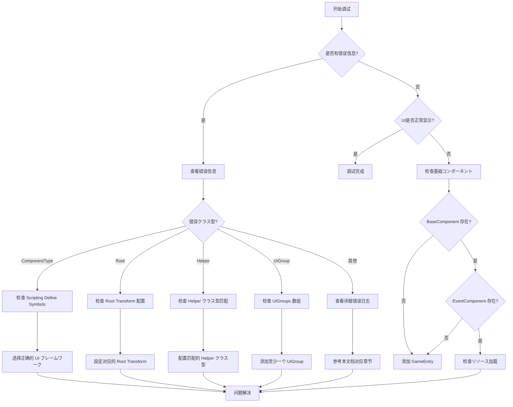

# 常见问题

本文档列出了使用 GameFrameX UI フレームワーク时常见的错误シーン、原因分析以及解決策。

## 概要

GameFrameX UI フレームワークはサポート UGUI 和 FairyGUI 两种 UI 解決策的模块化系统。由于存在多种配置选项和平台特定的設定，開発者在集成过程中可能会遇到各种配置错误。本文档旨在帮助開発者快速定位和解决常见问题。

## よくある質問列表

### 1. UI コンポーネントタイプ不匹配

**错误信息：**
```
UIコンポーネント的 ComponentType 設定错误。お願いします設定和 UI 系统一致的コンポーネント.
```

**原因分析：**
此错误发生在 `UIComponent` 的 `ComponentType` 設定与プロジェクト中的 Scripting Define Symbols 不一致时。例如，プロジェクト中启用了 `ENABLE_UI_FAIRYGUI`，但 `ComponentType` 却設定为 UGUI 実装クラス。

**解決策：**
1. 确认プロジェクト使用的 UI フレームワーク（UGUI 或 FairyGUI）
2. メニューを開く `GameFrameX → Scripting Define Symbols`
3. 选择对应的 UI フレームワーク：
   - 选择 `Enable UGUI(开启UGUI适配)` 使用 UGUI
   - 选择 `Enable FairyGUI(开启FairyGUI适配)` 使用 FairyGUI
4. 确保 `UIComponent` 的 `ComponentType` 与启用的フレームワーク一致

> Source: [Runtime/UIComponent.cs](https://github.com/GameFrameX/com.gameframex.unity.ui/blob/main/Runtime/UIComponent.cs#L378-L400)

---

### 2. Root 变换未設定

**错误信息：**
```
UIコンポーネント的 FAIRY GUI Root 設定错误。お願いします設定
UIコンポーネント的 UGUI Root 設定错误。お願いします設定
```

**原因分析：**
`UIComponent` 必要指定 UI 根节点的 Transform。当使用 FairyGUI 时必要設定 `FairyGUI Root`，使用 UGUI 时必要設定 `UGUI Root`。

**解決策：**
1. 在シーン中作成一个空的 GameObject 作为 UI 根节点
2. 在 `UIComponent` コンポーネント的 Inspector 面板中：
   - 使用 FairyGUI 时：設定 `FairyGUI Root` 为 FairyGUI 的容器 Transform
   - 使用 UGUI 时：設定 `UGUI Root` 为 Canvas 或 UI 容器 Transform

```csharp
// 示例：运行时动态設定 Root（不推荐，仅に使用调试）
var uiComponent = gameObject.GetComponent<UIComponent>();
// 需在编辑器中正确配置 Root
```

> Source: [Runtime/UIComponent.cs](https://github.com/GameFrameX/com.gameframex.unity.ui/blob/main/Runtime/UIComponent.cs#L385-L389)

---

### 3. UI Form Helper クラス型不匹配

**错误信息：**
```
UIコンポーネント的 UI Form Helper 設定错误。お願いします設定和 ComponentType クラス型 一致.
```

**原因分析：**
`UI Form Helper` 的クラス型必須与 `ComponentType` 匹配。如果使用了 FairyGUI 但設定了 UGUI 的 Helper，会导致此错误。

**解決策：**
1. 在 `UIComponent` 的 Inspector 面板中
2. 找到 `UI Form Helper Type Name` 字段
3. に基づいて使用的 UI フレームワーク选择正确的クラス型：
   - FairyGUI：`GameFrameX.UI.FairyGUI.Runtime.FairyGUIFormHelper`
   - UGUI：`GameFrameX.UI.UGUI.Runtime.UGUIFormHelper`

> Source: [Runtime/UIComponent.cs](https://github.com/GameFrameX/com.gameframex.unity.ui/blob/main/Runtime/UIComponent.cs#L417-L421)

---

### 4. UI Group Helper クラス型不匹配

**错误信息：**
```
UIコンポーネント的 UI Group Helper 設定错误。お願いします設定和 ComponentType クラス型 一致.
```

**原因分析：**
与 UI Form Helper クラス似，`UI Group Helper` 也必須与 `ComponentType` 匹配。

**解決策：**
1. 在 `UIComponent` 的 Inspector 面板中
2. 找到 `UI Group Helper Type Name` 字段
3. に基づいて使用的 UI フレームワーク选择正确的クラス型：
   - FairyGUI：`GameFrameX.UI.FairyGUI.Runtime.FairyGUIUIGroupHelper`
   - UGUI：`GameFrameX.UI.UGUI.Runtime.UGUIUIGroupHelper`

> Source: [Runtime/UIComponent.cs](https://github.com/GameFrameX/com.gameframex.unity.ui/blob/main/Runtime/UIComponent.cs#L423-L427)

---

### 5. UI Group 未配置

**错误信息：**
```
必須要設定至少一个UIGroup
```

**原因分析：**
`UIComponent` 至少必要配置一个 UI Group，否则无法正确管理 UI 窗体的层级和显示。

**解決策：**
1. 在 `UIComponent` 的 Inspector 面板中
2. 找到 `UIGroups` 数组
3. 点击 `+` 添加至少一个 UI Group
4. 为每个 Group 設定：
   - `GroupName`：分组名称（不能为空）
   - `Depth`：显示优先级（建议不同分组設定不同的 Depth）

> Source: [Editor/UIComponentInspector.cs](https://github.com/GameFrameX/com.gameframex.unity.ui/blob/main/Editor/UIComponentInspector.cs#L169-L172)

---

### 6. Scripting Define Symbol 未設定

**错误现象：**
UI 系统完全不工作，控制台无错误信息或显示上述配置错误。

**原因分析：**
プロジェクト中既没有启用 `ENABLE_UI_UGUI` 也没有启用 `ENABLE_UI_FAIRYGUI`，导致 UI 系统的条件编译代码无法正确编译。

**解決策：**
1. 打开 Unity 菜单 `GameFrameX → Scripting Define Symbols`
2. 选择一种 UI フレームワーク：
   - `Enable UGUI(开启UGUI适配)` - 启用 UGUI サポート
   - `Enable FairyGUI(开启FairyGUI适配)` - 启用 FairyGUI サポート
3. 重新编译プロジェクト

> Source: [Editor/UISystemScriptingDefineSymbols.cs](https://github.com/GameFrameX/com.gameframex.unity.ui/blob/main/Editor/UISystemScriptingDefineSymbols.cs#L42-L63)

---

### 7. 基础コンポーネント缺失

**错误信息：**
```
Base component is invalid.
Event component is invalid.
```

**原因分析：**
`UIComponent` 依赖 `BaseComponent` 和 `EventComponent`，如果这些コンポーネント不存在于シーン中，UI 系统将无法正常工作。

**解決策：**
1. 确保シーン中存在 `GameEntry` 对象
2. 确保 `GameEntry` 上挂载了以下コンポーネント：
   - `BaseComponent`（GameFrameX コアコンポーネント）
   - `EventComponent`（イベント系统コンポーネント）

```csharp
// 检查コンポーネント是否存在的示例代码
var baseComponent = GameEntry.GetComponent<BaseComponent>();
if (baseComponent == null)
{
    Debug.LogError("BaseComponent 未找到，必ずシーン中存在 GameEntry");
}

var eventComponent = GameEntry.GetComponent<EventComponent>();
if (eventComponent == null)
{
    Debug.LogError("EventComponent 未找到，必ずシーン中存在 GameEntry");
}
```

> Source: [Runtime/UIComponent.cs](https://github.com/GameFrameX/com.gameframex.unity.ui/blob/main/Runtime/UIComponent.cs#L462-L474)

---

### 8. UI Form 打开失败

**错误信息：**
```
Open UI form failure, asset name '{0}', pause covered UI form '{1}', error message '{2}'.
Can not find UI form '{0}'.
```

**原因分析：**
1. UI Form リソース路径不正确
2. UI Form リソース未在对应路径下
3. UI Form Helper 配置错误

**解決策：**
1. 检查 UI Form 的リソース路径是否正确
2. 确认 `OptionUIConfigAttribute` 配置正确：
   - FairyGUI：設定正确的 `PackageName`
   - UGUI：設定正确的リソース `Path`
3. 检查リソース是否已添加到リソース管理系统

```csharp
// 正确的 UI Form 配置示例
[OptionUIConfigAttribute(packageName = "MyFairyGUIPackage")]
public class MyUIForm : UIForm
{
    // ...
}

// 或 UGUI 版本
[OptionUIConfigAttribute(path = "UI/Prefabs/MyForm")]
public class MyUIForm : UIForm
{
    // ...
}
```

> Source: [Runtime/BaseUIManager.Open.cs](https://github.com/GameFrameX/com.gameframex.unity.ui/blob/main/Runtime/BaseUIManager.Open.cs)

---

### 9. OptionUIConfigAttribute 配置错误

**错误信息：**
```
PackageName or Path is null
```

**原因分析：**
`OptionUIConfigAttribute` 要求至少提供 `packageName`（FairyGUI）或 `path`（UGUI）之一，不能两者都为空。

**解決策：**
确保 UI Form クラス上的特性配置正确：

```csharp
// 错误示例 - 会抛出異常
[OptionUIConfigAttribute()]  // 错误：两者都为空
public class BadUIForm : UIForm { }

// 正确示例 - FairyGUI
[OptionUIConfigAttribute(packageName = "MainPackage")]
public class FairyGUIForm : UIForm { }

// 正确示例 - UGUI
[OptionUIConfigAttribute(path = "UI/Forms/MainForm")]
public class UGUIForm : UIForm { }
```

> Source: [Runtime/Attribute/OptionUIConfigAttribute.cs](https://github.com/GameFrameX/com.gameframex.unity.ui/blob/main/Runtime/Attribute/OptionUIConfigAttribute.cs#L86-L93)

---

### 10. UI Group 不存在

**错误信息：**
```
UI group '{0}' is not exist.
```

**原因分析：**
尝试打开或操作一个不存在的 UI Group。

**解決策：**
1. 在 `UIComponent` 中预先配置所需的 UI Group
2. 打开 UI Form 时使用已存在的 Group 名称

```csharp
// 正确使用已存在的 UI Group
UIManager.Instance.OpenUIForm<MyForm>("MainGroup", userData: null);
```

> Source: [Runtime/BaseUIManager.UIGroup.cs](https://github.com/GameFrameX/com.gameframex.unity.ui/blob/main/Runtime/BaseUIManager.UIGroup.cs#L159-L162)

---

## 调试技巧

### 启用详细日志

可能を通じて配置取得更详细的运行时信息：

```csharp
// 在启动时設定更详细的日志级别
Log.SetLogHelper(new UnityLogHelper());
Log.AddDebuger();
```

### 检查 UI コンポーネントステータス

```csharp
// 取得 UIComponent 并检查ステータス
var uiComponent = GameEntry.GetComponent<UIComponent>();
if (uiComponent == null)
{
    Debug.LogError("UIComponent 未找到");
    return;
}

// 检查 UI Group 数量
Debug.Log($"UI Group Count: {uiComponent.UIGroupCount}");
```

### イベント订阅问题排查

如果 UI イベント没有触发，检查是否正确订阅：

```csharp
// 确保在正确的时机订阅イベント
void OnOpenUIFormSuccess(object sender, OpenUIFormSuccessEventArgs e)
{
    Debug.Log($"UI Form 打开成功: {e.UIFormAssetName}");
}

// 订阅イベント
UIManager.Instance.OpenUIFormSuccess += OnOpenUIFormSuccess;
```

---

## 常见错误フロー图



---

## 関連リンク

- [UI コンポーネント](./4-core-concepts.ui-component) - UIComponent コア概念
- [UI 窗体](./4-core-concepts.ui-form) - UIForm 窗体概念
- [UI 组系统](./4-core-concepts.ui-group) - UI Group 层级管理
- [编辑器配置](./8-configuration.editor) - 编辑器配置选项
- [UI プロパティ](./8-configuration.attributes) - UI プロパティ配置
- [平台サポート](./9-platforms) - 平台関連配置
