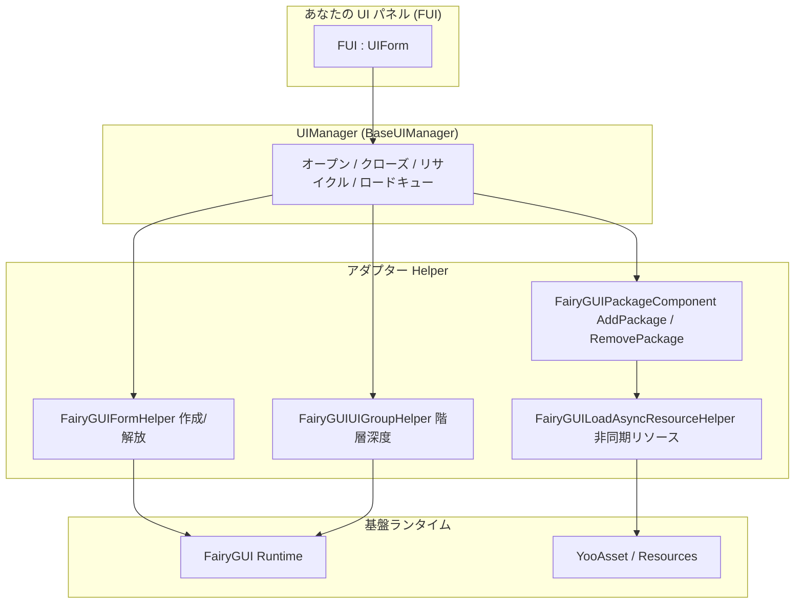

# 概要:GameFrameX UI FairyGUI とは

GameFrameX UI FairyGUI は Unity UI のアダプター層であり、[FairyGUI](https://www.fairygui.com/) フレームワークを GameFrameX モジュール式ゲームフレームワークにカプセル化し、統一された UI ライフサイクル管理(オープン、クローズ、リサイクル、アニメーション)と YooAsset ベースの非同期リソースロードを提供します。パネルクラスを `FUI` 基底クラスから継承させるだけで、同一の API で FairyGUI インターフェースを管理でき、オブジェクトプールの再利用、シングルトンの重複排除、ロードのキューイングなどの機能をすぐに利用できます。

## クイックスタート

### ステップ 1:パッケージのインストール

Unity プロジェクトの `Packages/manifest.json` を編集し、`scopedRegistries` と依存関係を追加します(現在のバージョンは 3.4.3):

```json
{
  "scopedRegistries": [
    {
      "name": "GameFrameX",
      "url": "https://gameframex.upm.alianblank.uk",
      "scopes": [
        "com.gameframex"
      ]
    }
  ],
  "dependencies": {
    "com.gameframex.unity.ui.fairygui": "3.4.3"
  }
}
```

`scopes` は、どのパッケージがこの registry から解決されるかを決定します:`com.gameframex` で始まる名前のパッケージのみがここから取得されます。

以下のいずれかの方法でインストールすることもできます:

- `manifest.json` の `dependencies` に直接 Git アドレスを記述する:`"com.gameframex.unity.ui.fairygui": "https://github.com/gameframex/com.gameframex.unity.ui.fairygui.git"`
- Unity の **Package Manager** で **Add package from git URL** を選択し、`https://github.com/gameframex/com.gameframex.unity.ui.fairygui.git` を入力する
- リポジトリを Unity プロジェクトの `Packages` ディレクトリにクローンすると、自動的にロードされます

出典: [README.md](https://github.com/GameFrameX/com.gameframex.unity.ui.fairygui/blob/main/README.md#L67-L100)

### ステップ 2:UI パネルを作成する

すべての FairyGUI パネルは `FUI` 基底クラスを継承します。C# 属性(Attribute)で表示/非表示アニメーションを設定でき、追加のコードを書く必要はありません:

```csharp
[OptionUIShowAnimation(typeof(FadeInAnimation))]
[OptionUIHideAnimation(typeof(FadeOutAnimation))]
public class AnimatedPanel : FUI { }
```

出典: [README.md](https://github.com/GameFrameX/com.gameframex.unity.ui.fairygui/blob/main/README.md#L101-L111)

`FUI` は `UIForm` を継承し、FairyGUI の `GObject` をプロパティとして公開します。フレームワークは UI フォームを表示する際に、`GObject`、アニメーションのオン/オフ、アニメーション名を表示ハンドラーに渡します:

```csharp
[UnityEngine.Scripting.Preserve]
public class FUI : UIForm
{
    [UnityEngine.Scripting.Preserve]
    public GObject GObject { get; private set; }

    [UnityEngine.Scripting.Preserve]
    public override void Show(IUIFormShowHandler handler, Action complete)
    {
        if (handler != null)
        {
            handler.Handler(GObject, EnableShowAnimation, ShowAnimationName, complete);
        }
        // ...
    }
}
```

出典: [Runtime/FUI.cs](https://github.com/GameFrameX/com.gameframex.unity.ui.fairygui/blob/main/Runtime/FUI.cs#L42-L80)

(注：上記のプロパティに付されている `UnityEngine.Scripture.Preserve` は抜粋に示された表記であり、ソースコードでの実際の記述は `UnityEngine.Scripting.Preserve` で、IL2CPP ストリッピングを防ぐために使用されます。)

### ステップ 3:UIManager を初期化して使用する

`UIManager` は中核となるマネージャーで、内部で `GameEntry` から `FairyGUIPackageComponent` を取得して、FairyGUI パッケージのロードとアンロードを管理します:

```csharp
[UnityEngine.Scripting.Preserve]
internal sealed partial class UIManager : BaseUIManager
{
    [UnityEngine.Scripting.Preserve]
    private FairyGUIPackageComponent FairyGuiPackage { get; set; }

    [UnityEngine.Scripting.Preserve]
    public override void SetResourceManager(IAssetManager assetManager)
    {
        base.SetResourceManager(assetManager);
        FairyGuiPackage = GameEntry.GetComponent<FairyGUIPackageComponent>();
        GameFrameworkGuard.NotNull(FairyGuiPackage, nameof(FairyGuiPackage));
    }
}
```

出典: [Runtime/UIManager.cs](https://github.com/GameFrameX/com.gameframex.unity.ui.fairygui/blob/main/Runtime/UIManager.cs#L42-L92)

初期化時にシーン内に `FairyGUIPackageComponent` がない場合、`GameFrameworkGuard.NotNull` が直接例外をスローします――必ず先にこのコンポーネントをアタッチしてから `SetResourceManager` を呼び出してください。

### ステップ 4(オプション):パスで GObject を検索する

```csharp
// ある GObject の階層パスを取得
string path = gObject.GetUIPath();

// パスから GObject を逆引き
GObject obj = FairyGUIPathFinderHelper.GetUIFromPath("GRoot/Group/MyButton");
```

出典： [README.md](https://github.com/GameFrameX/com.gameframex.unity.ui.fairygui/blob/main/README.md#L113-L120)

## 動作原理の概要

パッケージ全体は階層構造で連携します:`UIManager` がオープン/クローズ/リサイクルとロードのキューイングを統一的にスケジュールし、具体的な作業は各 Helper に振り分けられ、下層は FairyGUI ランタイムと YooAsset リソースシステムに依存しています:



各コンポーネントの役割一覧：

| コンポーネント | 型 | 説明 |
|------|------|------|
| `UIManager` | `internal sealed partial class`、`BaseUIManager` を継承 | 中央 UI マネージャー。UI フォームのオープン、クローズ、リサイクルのライフサイクルを担当し、`UIManager.cs` / `UIManager.Open.cs` / `UIManager.Close.cs` の複数の partial ファイルに分割されている |
| `FUI` | `public class`、`UIForm` を継承 | すべての FairyGUI パネルの基底クラス。`GObject` と可視性コールバックを公開し、パネルはこれを継承する |
| `FairyGUIPackageComponent` | MonoBehaviour | FairyGUI パッケージのロードとアンロードを管理 |
| `FairyGUIFormHelper` | Helper | UI フォームのインスタンス化、作成と解放を担当 |
| `FairyGUIUIGroupHelper` | Helper | UI グループの深度と階層を管理 |
| `FairyGUILoadAsyncResourceHelper` | Helper | FairyGUI のリソースリクエストを YooAsset の非同期ロードへブリッジ |
| `FairyGUIPathFinderHelper` | Helper | パスベースの GObject 検索ツール |
| `BindablePropertyExtension` | 拡張 | MVVM バインディングサポート。`BindableProperty` イベントを自動クリーンアップ |

出典： [Runtime/UIManager.cs](https://github.com/GameFrameX/com.gameframex.unity.ui.fairygui/blob/main/Runtime/UIManager.cs#L34-L92) · [Runtime/FUI.cs](https://github.com/GameFrameX/com.gameframex.unity.ui.fairygui/blob/main/Runtime/FUI.cs#L34-L53) · [README.md](https://github.com/GameFrameX/com.gameframex.unity.ui.fairygui/blob/main/README.md#L40-L65)

コア機能一覧:

- **完全な UI ライフサイクル** — 統一 API でオープン、クローズ、リサイクル、アニメーションを管理
- **非同期リソースロード** — YooAsset ベースの FairyGUI パッケージとリソースの非同期ロード
- **オブジェクトプール再利用** — UI インスタンスをプールして再利用し、GC 割り当てを削減
- **シングルトン重複排除** — 同一 UI フォームの重複作成を自動的に防止
- **ロードのキューイング** — 同一 UI フォームへの同時オープンリクエストを統合
- **属性駆動設定** — C# 属性で UI グループや表示/非表示アニメーションを制御
- **MVVM バインディングサポート** — `BindablePropertyExtension` がバインディングイベントを自動クリーンアップ
- **デュアルリソースチャネル** — `Resources.Load` と YooAsset AssetBundle の両方をサポート
- **IL2CPP 安全性** — `Preserve` 属性によるコードストリッピング防止

## 次のステップ

- 完全なインストール方法とその他の使用例:[README.md](https://github.com/GameFrameX/com.gameframex.unity.ui.fairygui/blob/main/README.md)
- 公式ドキュメント(各モジュールの詳細説明を含む):https://gameframex.doc.alianblank.com
- バージョン履歴：リポジトリルートの `CHANGELOG.md`
- コミュニティグループ:QQ 467608841 / 233840761