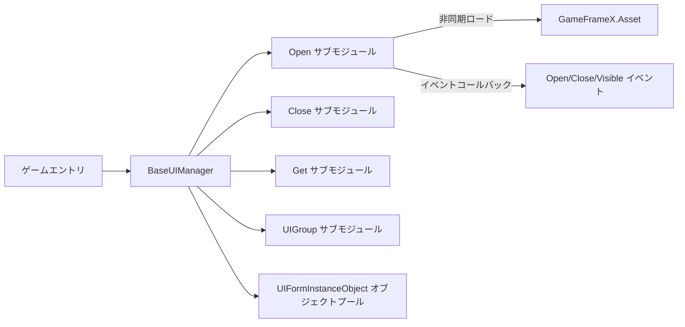

# フレームワークの概要

GameFrameX.UI は GameFrameX ゲーム開発フレームワークの UI サブモジュールであり、統一された UI 管理インターフェースを提供します。UGUI と FairyGUI の 2 種類の UI ソリューションをサポートし、UI グループ化、オブジェクトプール、ライフサイクルイベントなどの常用機能を内蔵しており、Unity 商用プロジェクトの基礎 UI レイヤーとして適しています。

## クイックスタート

以下の 3 ステップを完了するだけで、Unity プロジェクトで UI モジュールを有効にできます。

1. Package Manager でパッケージを追加：Unity で **Window → Package Manager → + → Add package from git URL** を選択し、以下を入力します：
   ```
   https://github.com/gameframex/com.gameframex.unity.ui.git
   ```
   または、プロジェクトの `Packages/manifest.json` の `dependencies` に同じ URL を追加します。
2. `BaseUIManager` を継承したマネージャークラスを作成し(またはフレームワーク組み込みの `UIManager` をそのまま使用)、ゲーム起動エントリでモジュール登録を行うと、フレームワークが自動的に UI サブシステムを初期化します。
3. 各 UI Prefab に `IUIForm` 実装スクリプトを作成し、`[OptionUIGroup]` などの属性でグループ、表示/非表示アニメーション、マルチインスタンス戦略を付与してから、`OpenUIForm` を呼び出すだけで UI を開けます。

## 仕組みの概要

中核となるエントリは `BaseUIManager` で、ロード、回収、グループ化、イベントの 4 つの主要サブ機能を集約しており、それぞれ 4 つの分割ファイルに対応しています:
[BaseUIManager.cs](https://github.com/GameFrameX/com.gameframex.unity.ui/blob/main/Runtime/BaseUIManager.cs#L39-L80) はマネージャーの骨格を定義します;
[BaseUIManager.Open.cs](https://github.com/GameFrameX/com.gameframex.unity.ui/blob/main/Runtime/BaseUIManager.Open.cs#L36-L60) は UI を開くためのイベントとメソッドを提供します;
`BaseUIManager.Close.cs` はクローズを処理します;
`BaseUIManager.Get.cs` はシリアル番号による UI の取得を担当します;
`BaseUIManager.UIGroup.cs` は UI グループのルートノードを管理します。



UI インスタンスは [BaseUIManager.UIFormInstanceObject.cs](https://github.com/GameFrameX/com.gameframex.unity.ui/blob/main/Runtime/BaseUIManager.UIFormInstanceObject.cs) によってオブジェクトプールが維持され、アイドル状態のインスタンスは `m_RecycleInterval`(デフォルト 60 秒)に従って自動的に回収されます。ロード中のインスタンスは `m_UIFormsBeingLoaded` ディクショナリによって追跡されます。

## 主な機能

| 機能 | 説明 | 主要ファイル |
|------|------|----------|
| 統一 UI インターフェース | 単一の `IUIManager` で UGUI と FairyGUI の両方をサポート | [BaseUIManager.cs](https://github.com/GameFrameX/com.gameframex.unity.ui/blob/main/Runtime/BaseUIManager.cs#L39-L80) |
| グループ管理 | 属性で UI の所属グループを宣言し、対応するルートノードを自動作成 | [Runtime/Attribute/OptionUIGroupAttribute.cs](https://github.com/GameFrameX/com.gameframex.unity.ui/blob/main/Runtime/Attribute/OptionUIGroupAttribute.cs) |
| オブジェクトプール | アイドルインスタンスを自動再利用し、頻繁な UI の開閉によるオーバーヘッドを削減 | [BaseUIManager.UIFormInstanceObject.cs](https://github.com/GameFrameX/com.gameframex.unity.ui/blob/main/Runtime/BaseUIManager.UIFormInstanceObject.cs) |
| 表示/非表示アニメーション | 属性でオープン/クローズアニメーションを設定 | [OptionUIShowAnimationAttribute.cs](https://github.com/GameFrameX/com.gameframex.unity.ui/blob/main/Runtime/Attribute/OptionUIShowAnimationAttribute.cs),[OptionUIHideAnimationAttribute.cs](https://github.com/GameFrameX/com.gameframex.unity.ui/blob/main/Runtime/Attribute/OptionUIHideAnimationAttribute.cs) |
| マルチインスタンス制御 | 属性で同一 UI の複数インスタンスの並存を許可するかどうかを宣言 | [OptionUIAllowMultiInstanceAttribute.cs](https://github.com/GameFrameX/com.gameframex.unity.ui/blob/main/Runtime/Attribute/OptionUIAllowMultiInstanceAttribute.cs) |
| 完全なイベント | オープン成功/失敗、クローズ、可視状態変更などのイベントを提供 | [EventArgs/OpenUIFormSuccessEventArgs.cs](https://github.com/GameFrameX/com.gameframex.unity.ui/blob/main/Runtime/EventArgs/OpenUIFormSuccessEventArgs.cs) など |

## エディター拡張

モジュールには Unity エディターのチェック機能が組み込まれており、スクリプトのマクロ定義を自動的に注入することで、実行時のコンポーネント欠落によるエラーを回避します。詳細は [Editor/UISystemScriptingDefineSymbols.cs](https://github.com/GameFrameX/com.gameframex.unity.ui/blob/main/Editor/UISystemScriptingDefineSymbols.cs) と [Editor/UISystemScriptingDefineCheckHandler.cs](https://github.com/GameFrameX/com.gameframex.unity.ui/blob/main/Editor/UISystemScriptingDefineCheckHandler.cs) を参照してください。
UI Prefab のカスタムインスペクターは [Editor/UIFormInspector.cs](https://github.com/GameFrameX/com.gameframex.unity.ui/blob/main/Editor/UIFormInspector.cs) にあり、UIComponent のインスペクターは [Editor/UIComponentInspector.cs](https://github.com/GameFrameX/com.gameframex.unity.ui/blob/main/Editor/UIComponentInspector.cs) を参照してください。

## バージョン

最新バージョンと変更履歴は [CHANGELOG.md](https://github.com/GameFrameX/com.gameframex.unity.ui/blob/main/CHANGELOG.md) を参照してください。

## 関連リンク

- UI グループの設定詳細については、『UI グループ』を参照してください
- UI のオープンとライフサイクルについては、『UI を開く/閉じる』を参照してください
- イベント購読の例については、『UI イベント』を参照してください
- 公式ドキュメントサイト:https://gameframex.doc.alianblank.com/