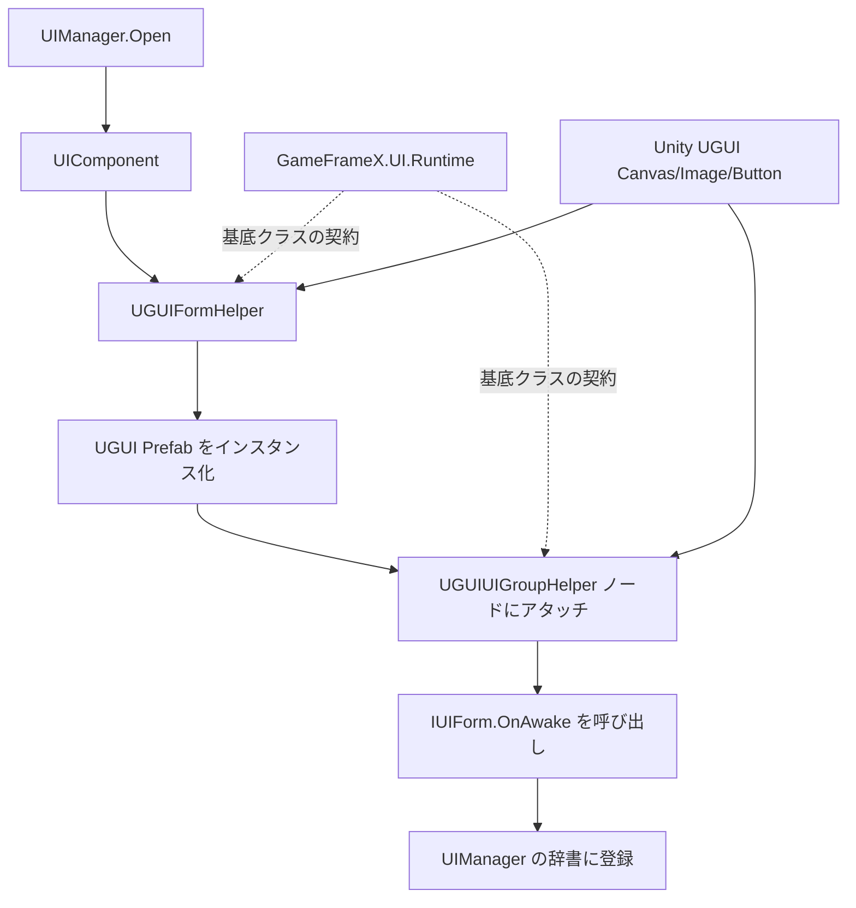

# 動作原理：UGUI と GameFrameX UI システムの適応関係

本パッケージは、Unity UGUI バックエンド上における GameFrameX UI Runtime の公式アダプター層です。`UIFormHelperBase`、`UIGroupHelperBase` などの抽象基底クラスを実装することで、UGUI の `GameObject` / `Canvas` / `RectTransform` をフレームワークの `UIComponent` / `UIManager` ライフサイクルに接続し、ゲームのビジネスコードを変更することなく、異なる UI バックエンドの置き換えや共存を可能にします。

## アダプター層の一覧

| アダプタークラス | 継承元の基底クラス | 職責 |
|--------|------------|------|
| `UGUIFormHelper` | `UIFormHelperBase` | UI フォームのインスタンス化・作成・解放；UI グループのアタッチとアニメーション ON/OFF の処理 |
| `UGUIUIGroupHelper` | `UIGroupHelperBase` | UI グループの深度（`z = depth * 1000`）とノード階層の管理 |
| `UGUICodeGenerator` (Editor) | — | Prefab のフィールドにバインドされた UI コードをワンクリックで生成 |
| `UGUIComponentInspector` (Editor) | — | Inspector 上でコンポーネント参照を視覚的にバインド |
| `UGUIButtonExtension` / `UGUIImageExtension` / `RectTransformExtension` | — | UGUI ネイティブコンポーネントに対する拡張メソッド |
| `UIImage` | `Image` | UGUI `Image` をベースに非同期ロード・差し替え機能を追加 |
| `UIManager` / `UGUI` | — | フレームワーク側のランタイムエントリポイントと抽象 UI 基底クラス |

## 動作原理の概要



この一連のフローの中で、フレームワーク側は `IUIForm` と `IUIGroup` という 2 つの抽象のみを認識し、UGUI アダプター層が Unity のネイティブ型をこれらの抽象へ変換します。逆に、ビジネススクリプト側は `UGUI` 抽象基底クラスを継承するだけで、バックエンドに依存しない OnAwake / OnShow / OnHide などのコールバックを利用できます。

## 主要なアダプターポイント

### 1. UI フォームのインスタンス化

`UGUIFormHelper.InstantiateUIForm` はアセットオブジェクトをそのまま返すだけで、実際の GameObject は上位のアセットパイプラインによって非同期ロードされた後で渡されます。`CreateUIForm` は `uiFormInstance as GameObject` によるキャストで UGUI ノードを取得し、`GetOrAddComponent` を通じてビジネススクリプトをアタッチします。

```csharp
// Source: Runtime/UGUIFormHelper.cs#L74-L78
[UnityEngine.Scripting.Preserve]
public override object InstantiateUIForm(object uiFormAsset)
{
    return (UnityEngine.Object)uiFormAsset;
}
```

### 2. UI フォームのアタッチとグループへの割り当て

`CreateUIForm` は型に付与された `OptionUIGroupAttribute`、`OptionUIShowAnimationAttribute`、`OptionUIHideAnimationAttribute` を読み取り、未指定の場合は `UIComponent` のグローバル設定を使用します。最終的に、ノードを `Transform.SetParent(helper.transform)` で対応する UI グループへアタッチし、`localScale` を正規化します。

```csharp
// Source: Runtime/UGUIFormHelper.cs#L91-L163
[UnityEngine.Scripting.Preserve]
public override IUIForm CreateUIForm(object uiFormInstance, Type uiFormType, object userData)
{
    var uiGameObject = uiFormInstance as GameObject;
    if (uiGameObject == null)
    {
        Log.Error($"UI form instance type {uiFormType} is invalid.");
        return null;
    }

    var componentType = uiGameObject.GetOrAddComponent(uiFormType);
    if (!(componentType is IUIForm uiForm))
    {
        Log.Error($"UI form instance type {uiFormType} is invalid.");
        return null;
    }

    if (uiForm.IsAwake == false)
    {
        uiForm.OnAwake();
    }
    // ... グループのアタッチとアニメーション設定は省略 ...
    uiTransform.SetParent(helper.transform);
    uiTransform.localScale = Vector3.one;
    return uiForm;
}
```

### 3. UI グループの深度制御

UGUI は `Canvas` の描画順序またはノードの Z 値によって前後の階層を制御します。アダプター層は最も直接的な方式を採用しており、`localPosition.z = depth * 1000` とすることで、各グループを 1000 単位ずつ離し、異なるグループ同士が互いに重ならないようにしています。

```csharp
// Source: Runtime/UGUIUIGroupHelper.cs#L65-L70
[UnityEngine.Scripting.Preserve]
public override void SetDepth(int depth)
{
    Depth = depth;
    transform.localPosition = new Vector3(0, 0, depth * 1000);
}
```

### 4. 抽象 UI 基底クラス

ビジネススクリプトが `UGUI` を継承すると、`UGUIComponent` / `UGUIElementPropertyAttribute` を通じて Prefab 上の UGUI コントロールとバインドされ、フレームワークが `OnAwake` フェーズでフィールドインジェクションを完了します。ランタイムでは `OnShow`、`OnHide`、`OnClose` などのライフサイクルメソッドが呼び出されます。

## 次のステップ

- 最初の UI をアタッチして表示する方法については、『クイックスタート』を参照してください
- エディターで Prefab と同期した UI コードをワンクリックで生成したい場合は、『方法：UGUI コードジェネレーターの使用』を参照してください
- UI バックエンドをカスタマイズしたい場合（例：FairyGUI / UI Toolkit）は、`UIFormHelperBase` / `UIGroupHelperBase` を再利用するだけで実現できます