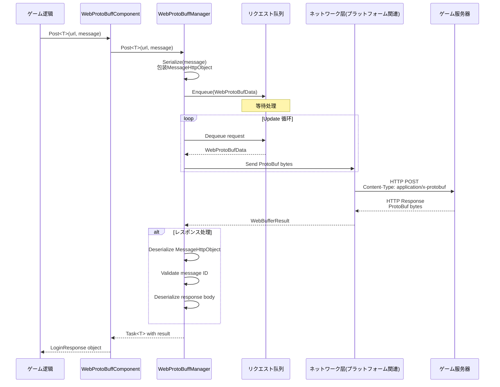
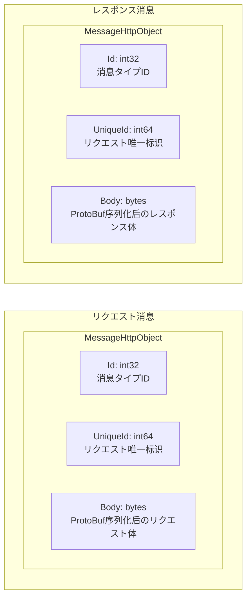

# 

GameFrameX Web ProtoBuff は Unity ゲームのネットワークリクエストコンポーネント，にづく Protocol Buffer（ProtoBuf）、タイプの HTTP 。

## 

Web ProtoBuff コンポーネント（WebProtoBuffComponent）は GameFrameX ゲームフレームワークのコアネットワークモジュール，ににづく Protocol Buffer のネットワークリクエスト。にゲーム，ProtoBuf のとのデータ，にとの。

の：

- **ProtoBuf と**： C#  ProtoBuf ，レスポンスの
- **ネットワークリクエスト**：にづく Task<T> の API，サポート async/await ，と Unity のコルーチン
- **リクエスト**：のリクエスト，サポートとリクエスト
- **プラットフォームサポート**：プラットフォーム（WebGL、Standalone、）のネットワーク
- ****：の，リクエスト

### コア

1. **タイプ**：をじて，にコンパイルリクエストとレスポンスタイプの
2. ****：ProtoBuf の JSON ，/
3. ****：の API ，，ネットワーク
4. **フレームワーク**： GameFrameX フレームワーク，フレームワークのと

## アーキテクチャ

### コンポーネントアーキテクチャ

Web ProtoBuff コンポーネントに GameFrameX フレームワークのアーキテクチャ：

```mermaid
flowchart TD
    subgraph Client["客户端层"]
        GameLogic[ゲーム逻辑コード]
    end

    subgraph Component["コンポーネント层"]
        WebProtoBuffComponent[WebProtoBuffComponent]
    end

    subgraph Module["モジュール层"]
        IWebProtoBuffManager[IWebProtoBuffManager インターフェース]
        WebProtoBuffManager[WebProtoBuffManager 实现]
    end

    subgraph Framework["フレームワーク层"]
        GameFrameworkEntry[GameFrameworkEntry]
        GameFrameworkModule[GameFrameworkModule 基クラス]
    end

    subgraph Network["ネットワーク层"]
        WebGL[UnityWebRequest<br/>WebGLプラットフォーム]
        HttpClient[HttpWebRequest<br/>其他プラットフォーム]
    end

    subgraph Data["データ层"]
        Serializer[SerializerHelper<br/>ProtoBuf序列化]
        ProtoHandler[ProtoMessageIdHandler<br/>消息ID处理]
    end

    GameLogic --> WebProtoBuffComponent
    WebProtoBuffComponent --> IWebProtoBuffManager
    IWebProtoBuffManager <|.. WebProtoBuffManager
    WebProtoBuffManager --> GameFrameworkEntry
    WebProtoBuffManager --> GameFrameworkModule
    WebProtoBuffManager --> WebGL
    WebProtoBuffManager --> HttpClient
    WebProtoBuffManager --> Serializer
    WebProtoBuffManager --> ProtoHandler
```

**アーキテクチャ：**

1. ****：ゲームコードびし WebProtoBuffComponent ネットワークリクエスト
2. **コンポーネント**：WebProtoBuffComponent  Unity コンポーネント，の API，はの
3. **モジュール**：IWebProtoBuffManager インターフェース，WebProtoBuffManager のネットワークリクエスト
4. **フレームワーク**：GameFrameworkEntry モジュールのと，GameFrameworkModule モジュールの
5. **ネットワーク**：プラットフォームのネットワーク（WebGL  UnityWebRequest，プラットフォーム HttpWebRequest）
6. **データ**： ProtoBuf の/，タイプの ID 

### ファイル

のコード：


### コアクラス

| クラス |  |  |
|------|------|----------|
| WebProtoBuffComponent | Unity コンポーネント，ネットワークリクエスト API | public sealed |
| WebProtoBuffManager | ネットワークリクエストの，リクエストと | public partial |
| WebProtoBufData | リクエストのデータ（URL、データ、Task） | private sealed |
| IWebProtoBuffManager | ネットワークマネージャーのインターフェース | public interface |

## コアフロー

### リクエストフロー

ゲームコードびし `Post<T>` メソッド ProtoBuf リクエスト，フロー：



### 

の：



1. **Id**: タイプ，にの
2. **UniqueId**: リクエストの，にリクエストとレスポンス
3. **Body**: のデータ， ProtoBuf 

## 

### 1. Protocol Buffer サポート

サポート Protocol Buffer ， protobuf-net ：

- クラス `MessageObject` クラス
-  `[ProtoContract]` と `[ProtoMember]` プロパティ
- サポートタイプとタイプ

### 2. 

にづく `Task<T>` の API ：

-  async/await ，コード
- サポート（CancellationToken）
- と Unity の

### 3. 

の：

- デフォルト：5 
- をじてコンポーネントプロパティコード
- サポートリクエスト

### 4. リクエスト

のリクエスト：

- （WaitingQueue）：のリクエスト
- （SendingList）：にのリクエスト
- ：デフォルト 8 

### 5. プラットフォーム

プラットフォーム：

| プラットフォーム | ネットワーク |  |
|------|----------|------|
| WebGL | UnityWebRequest | ， |
| Standalone | HttpWebRequest | .NET ，サポート/ |
| iOS | HttpWebRequest | .NET  |
| Android | HttpWebRequest | .NET  |

## シーン

Web ProtoBuff コンポーネントに：

1. ****：リクエスト，
2. **データ**：ゲーム、データ
3. ****：とデータ
4. ****：リクエスト、ゲーム
5. ****：
6. ****：、

## プラットフォーム

 `package.json` の：

- **Unity バージョン**：2019.4 
- **.NET **：2.1
- ****：
  - com.gameframex.unity (1.1.1+)
  - com.gameframex.unity.web (1.0.0+)
  - com.gameframex.unity.network (1.0.0+)
  - com.gameframex.unity.google.protobuf (1.0.0+)

## リンク

- [](./1-overview.features) - の
- [インストールメソッド](./2-installation.install-methods) - インストール
- [](./2-installation.requirements) - 
- [クイックスタート](./3-getting-started.quick-start) - クイックスタート
- [](./3-getting-started.basic-example) - コード
- [コンポーネントアーキテクチャ](./4-core-concepts.architecture) - アーキテクチャ
- [](./4-core-concepts.message-definition) - ProtoBuf ガイド
- [API リファレンス](./5-api-reference.webprotobuffcomponent) - の API ドキュメント
- [コンポーネント](./6-configuration.component-config) - オプション
- [コンパイル](./6-configuration.compile-defines) - コンパイル
- [プラットフォーム](./7-platforms.platform-info) - プラットフォーム
- [よくある](./8-troubleshooting.faq) - よくある
