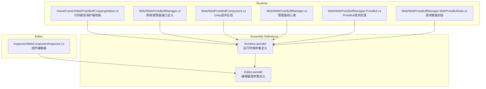
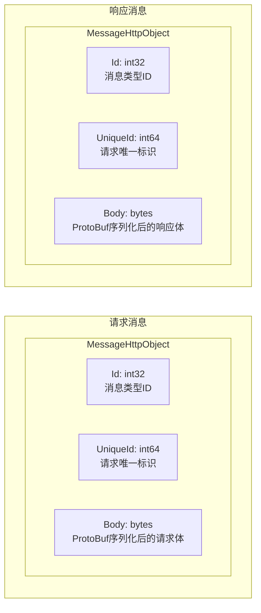

# プラグイン介绍

GameFrameX Web ProtoBuff プラグインは专为 Unity 游戏設計的网络请求コンポーネント，基于 Protocol Buffer（ProtoBuf）提供効率的、タイプ安全的 HTTP 通信機能。

## 概要

Web ProtoBuff コンポーネント（WebProtoBuffComponent）是 GameFrameX 游戏フレームワーク的コア网络モジュール之一，专门用于処理基于 Protocol Buffer フォーマット的网络请求。在现代游戏开发中，ProtoBuf 因其効率的的シリアライズ能力和紧凑的数据传输フォーマット，被广泛应用于客户端与服务器之间的通信。

该プラグイン的主な职责含みます：

- **ProtoBuf メッセージシリアライズ与反シリアライズ**：自动将 C# 对象シリアライズ为 ProtoBuf 字节流，并从响应中反シリアライズ出对应的メッセージ对象
- **异步网络请求**：基于 Task<T> 的异步 API，サポート async/await モード，与 Unity 的协程系统无缝集成
- **请求队列管理**：内部使用队列机制管理待发送的请求，サポート连接数限制和请求优先级
- **跨プラットフォームサポート**：针对不同プラットフォーム（WebGL、Standalone、移动端）提供相应的网络実装
- **超时控制**：可設定的超时时间，確認してください请求不会无限等待

### コア价值

1. **タイプ安全**：通过ジェネリック机制，在コンパイル时確認してください请求和响应タイプ的正确性
2. **効率的传输**：ProtoBuf 的二进制フォーマット比 JSON 更紧凑，シリアライズ/反シリアライズ速度更快
3. **易于使用**：シンプル的 API 設計，開発者只需关注业务逻辑，无需処理底层网络细节
4. **フレームワーク集成**：深度集成到 GameFrameX フレームワーク中，遵循フレームワーク的設計规范和ライフサイクル管理

## アーキテクチャ

### コンポーネントアーキテクチャ

Web ProtoBuff コンポーネント在 GameFrameX フレームワーク中的アーキテクチャ层次如下：

```mermaid
flowchart TD
    subgraph Client["客户端层"]
        GameLogic[游戏逻辑代码]
    end

    subgraph Component["组件层"]
        WebProtoBuffComponent[WebProtoBuffComponent]
    end

    subgraph Module["模块层"]
        IWebProtoBuffManager[IWebProtoBuffManager 接口]
        WebProtoBuffManager[WebProtoBuffManager 实现]
    end

    subgraph Framework["框架层"]
        GameFrameworkEntry[GameFrameworkEntry]
        GameFrameworkModule[GameFrameworkModule 基类]
    end

    subgraph Network["网络层"]
        WebGL[UnityWebRequest<br/>WebGL平台]
        HttpClient[HttpWebRequest<br/>其他平台]
    end

    subgraph Data["数据层"]
        Serializer[SerializerHelper<br/>ProtoBuf序列化]
        ProtoHandler[ProtoMessageIdHandler<br/>消息ID处理]
    end

    GameLogic --> WebProtoBuffComponent
    WebProtoBuffComponent --> IWebProtoBuffManager
    IWebProtoBuffManager <|.. WebProtoBuffManager
    WebProtoBuffManager --> GameFrameworkEntry
    WebProtoBuffManager --> GameFrameworkModule
    WebProtoBuffManager --> WebGL
    WebProtoBuffManager --> HttpClient
    WebProtoBuffManager --> Serializer
    WebProtoBuffManager --> ProtoHandler
```

**アーキテクチャ説明：**

1. **客户端层**：游戏业务逻辑コード呼び出し WebProtoBuffComponent 发起网络请求
2. **コンポーネント層**：WebProtoBuffComponent 作为 Unity コンポーネント，提供面向业务的 API，是開発者直接交互的入口点
3. **モジュール层**：IWebProtoBuffManager 定義インターフェース规范，WebProtoBuffManager 実装具体的网络请求逻辑
4. **フレームワーク層**：GameFrameworkEntry 负责モジュール的作成和初期化，GameFrameworkModule 提供モジュール的基本機能
5. **网络层**：根据运行プラットフォーム选择合适的网络実装（WebGL 使用 UnityWebRequest，其他プラットフォーム使用 HttpWebRequest）
6. **数据层**：负责 ProtoBuf メッセージ的シリアライズ/反シリアライズ，およびメッセージタイプ的 ID 映射

### ファイル结构

プラグイン的ソースコード组织结构如下：



### コア类説明

| 类名 | 职责 | 访问级别 |
|------|------|----------|
| WebProtoBuffComponent | Unity コンポーネント，对外提供网络请求 API | public sealed |
| WebProtoBuffManager | 网络请求的具体実装，管理请求队列和処理逻辑 | public partial |
| WebProtoBufData | カプセル化单个请求的数据（URL、数据、Task） | private sealed |
| IWebProtoBuffManager | 定義网络マネージャー的インターフェース规范 | public interface |

## コアフロー

### 请求処理フロー

当游戏コード呼び出し `Post<T>` メソッド发送 ProtoBuf 请求时，整个処理フロー如下：


### メッセージカプセル化フォーマット

プラグイン使用統一された的メッセージカプセル化フォーマット进行通信：



1. **Id**: メッセージタイプ标识符，用于路由到正确的解析器
2. **UniqueId**: 请求的唯一标识，用于关联请求和响应
3. **Body**: 实际的业务数据，经过 ProtoBuf シリアライズ

## 機能特性

### 1. Protocol Buffer 原生サポート

プラグイン原生サポート Protocol Buffer メッセージフォーマット，使用 protobuf-net 库进行シリアライズ：

- メッセージ类需継承 `MessageObject` 基底クラス
- 使用 `[ProtoContract]` 和 `[ProtoMember]` プロパティ标记
- サポート複雑嵌套タイプ和集合タイプ

### 2. 异步编程模型

基于 `Task<T>` 的异步 API 設計：

- 使用 async/await 语法，コードシンプル易懂
- サポート取消操作（CancellationToken）
- 与 Unity 的ライフサイクル完美集成

### 3. 超时控制

可設定的超时机制：

- デフォルト超时时间：5 秒
- 可通过コンポーネントプロパティ或コード动态設定
- サポート针对不同请求設定不同超时

### 4. 请求队列管理

効率的的请求队列系统：

- 等待队列（WaitingQueue）：存储待发送的请求
- 发送列表（SendingList）：〜中処理的请求
- 连接数限制：デフォルト每服务器最多 8 个并发连接

### 5. 跨プラットフォーム兼容

针对不同プラットフォーム提供最优実装：

| プラットフォーム | 网络実装 | 特点 |
|------|----------|------|
| WebGL | UnityWebRequest | 浏览器兼容，需処理异步コールバック |
| Standalone | HttpWebRequest | .NET 標準実装，サポート同步/异步 |
| iOS | HttpWebRequest | .NET 標準実装 |
| Android | HttpWebRequest | .NET 標準実装 |

## 使用シーン

Web ProtoBuff コンポーネント適しています以下シーン：

1. **登录认证**：发送ユーザー名密码请求，取得认证令牌
2. **数据同步**：从服务器同步游戏設定、プレイヤー数据
3. **排行榜**：取得和提交プレイヤー排行榜数据
4. **多人对战**：请求匹配、提交游戏結果
5. **内购検証**：検証应用内购买凭证
6. **社交機能**：取得好友列表、发送メッセージ

## プラットフォーム要求

根据 `package.json` 的設定：

- **Unity バージョン**：2019.4 及以上
- **.NET 標準**：2.1
- **依赖パッケージ**：
  - com.gameframex.unity (1.1.1+)
  - com.gameframex.unity.web (1.0.0+)
  - com.gameframex.unity.network (1.0.0+)
  - com.gameframex.unity.google.protobuf (1.0.0+)

## 関連リンク

- [機能特性](./1-overview.features) - 詳細的機能特性説明
- [インストール方法](./2-installation.install-methods) - プラグインインストール教程
- [環境要求](./2-installation.requirements) - 开发環境設定
- [快速入门](./3-getting-started.quick-start) - 快速开始使用
- [基本例](./3-getting-started.basic-example) - コード例
- [コンポーネントアーキテクチャ](./4-core-concepts.architecture) - アーキテクチャ設計详解
- [メッセージ定義](./4-core-concepts.message-definition) - ProtoBuf メッセージ定義ガイド
- [API リファレンス](./5-api-reference.webprotobuffcomponent) - 完全な的 API ドキュメント
- [コンポーネント設定](./6-configuration.component-config) - 設定オプション説明
- [コンパイル宏定義](./6-configuration.compile-defines) - 条件コンパイル設定
- [プラットフォーム説明](./7-platforms.platform-info) - 各プラットフォーム特性説明
- [常见問題](./8-troubleshooting.faq) - 常见問題解答
