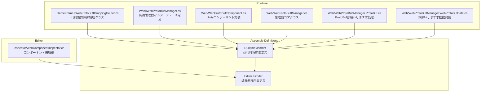
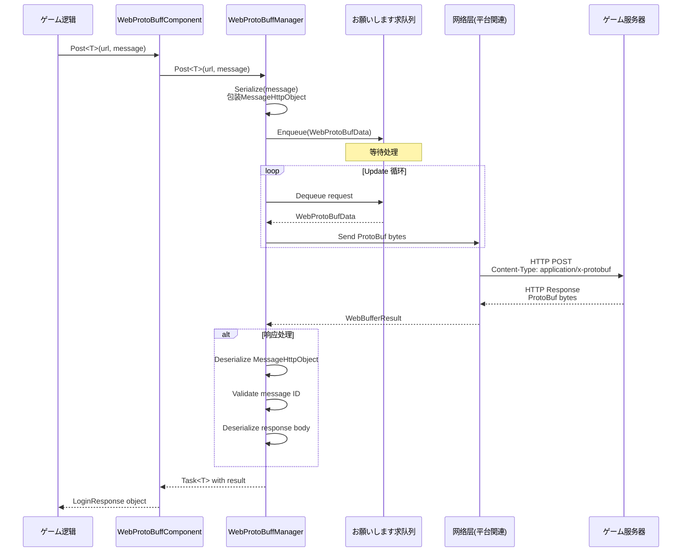
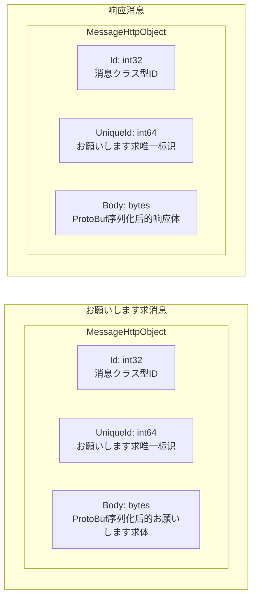

# 插件介绍

GameFrameX Web ProtoBuff 插件は专为 Unity ゲーム设计的网络お願いします求コンポーネント，基づく Protocol Buffer（ProtoBuf）提供高效、クラス型安全的 HTTP 通信機能。

## 概要

Web ProtoBuff コンポーネント（WebProtoBuffComponent）是 GameFrameX ゲームフレームワーク的コア网络模块之一，专门に使用处理基づく Protocol Buffer 格式的网络お願いします求。在现代ゲーム开发中，ProtoBuf 因其高效的序列化能力和紧凑的数据传输格式，被广泛应に使用客户端与服务器之间的通信。

该插件的主要职责包括：

- **ProtoBuf 消息序列化与反序列化**：自动将 C# 对象序列化为 ProtoBuf 字节流，并从响应中反序列化出对应的消息对象
- **异步网络お願いします求**：基づく Task<T> 的异步 API，サポート async/await 模式，与 Unity 的コルーチン系统无缝集成
- **お願いします求队列管理**：内部使用队列机制管理待发送的お願いします求，サポート连接数限制和お願いします求优先级
- **跨平台サポート**：针对不同平台（WebGL、Standalone、移动端）提供相应的网络実装
- **超时控制**：可配置的超时时间，确保お願いします求不会无限等待

### コア价值

1. **クラス型安全**：を通じて泛型机制，在编译时确保お願いします求和响应クラス型的正确性
2. **高效传输**：ProtoBuf 的二进制格式比 JSON 更紧凑，序列化/反序列化速度更快
3. **易于使用**：简洁的 API 设计，開発者只需关注业务逻辑，无需处理底层网络细节
4. **フレームワーク集成**：深度集成到 GameFrameX フレームワーク中，遵循フレームワーク的设计规范和生命周期管理

## 架构

### コンポーネント架构

Web ProtoBuff コンポーネント在 GameFrameX フレームワーク中的架构层次如下：

```mermaid
flowchart TD
    subgraph Client["客户端层"]
        GameLogic[ゲーム逻辑代码]
    end

    subgraph Component["コンポーネント层"]
        WebProtoBuffComponent[WebProtoBuffComponent]
    end

    subgraph Module["模块层"]
        IWebProtoBuffManager[IWebProtoBuffManager インターフェース]
        WebProtoBuffManager[WebProtoBuffManager 実装]
    end

    subgraph Framework["フレームワーク层"]
        GameFrameworkEntry[GameFrameworkEntry]
        GameFrameworkModule[GameFrameworkModule 基クラス]
    end

    subgraph Network["网络层"]
        WebGL[UnityWebRequest<br/>WebGL平台]
        HttpClient[HttpWebRequest<br/>其他平台]
    end

    subgraph Data["数据层"]
        Serializer[SerializerHelper<br/>ProtoBuf序列化]
        ProtoHandler[ProtoMessageIdHandler<br/>消息ID处理]
    end

    GameLogic --> WebProtoBuffComponent
    WebProtoBuffComponent --> IWebProtoBuffManager
    IWebProtoBuffManager <|.. WebProtoBuffManager
    WebProtoBuffManager --> GameFrameworkEntry
    WebProtoBuffManager --> GameFrameworkModule
    WebProtoBuffManager --> WebGL
    WebProtoBuffManager --> HttpClient
    WebProtoBuffManager --> Serializer
    WebProtoBuffManager --> ProtoHandler
```

**架构説明：**

1. **客户端层**：ゲーム业务逻辑代码呼び出し WebProtoBuffComponent 发起网络お願いします求
2. **コンポーネント层**：WebProtoBuffComponent 作为 Unity コンポーネント，提供面向业务的 API，是開発者直接交互的エントリーポイント点
3. **模块层**：IWebProtoBuffManager 定义インターフェース规范，WebProtoBuffManager 実装具体的网络お願いします求逻辑
4. **フレームワーク层**：GameFrameworkEntry 负责模块的作成和初期化，GameFrameworkModule 提供模块的基础機能
5. **网络层**：に基づいて运行平台选择合适的网络実装（WebGL 使用 UnityWebRequest，其他平台使用 HttpWebRequest）
6. **数据层**：负责 ProtoBuf 消息的序列化/反序列化，以及消息クラス型的 ID 映射

### ファイル结构

插件的源代码组织结构如下：



### コアクラス説明

| クラス名 | 职责 | 访问级别 |
|------|------|----------|
| WebProtoBuffComponent | Unity コンポーネント，对外提供网络お願いします求 API | public sealed |
| WebProtoBuffManager | 网络お願いします求的具体実装，管理お願いします求队列和处理逻辑 | public partial |
| WebProtoBufData | 封装单个お願いします求的数据（URL、数据、Task） | private sealed |
| IWebProtoBuffManager | 定义网络管理器的インターフェース规范 | public interface |

## コアフロー

### お願いします求处理フロー

当ゲーム代码呼び出し `Post<T>` メソッド发送 ProtoBuf お願いします求时，整个处理フロー如下：



### 消息封装格式

插件使用统一的消息封装格式进行通信：



1. **Id**: 消息クラス型标识符，に使用路由到正确的解析器
2. **UniqueId**: お願いします求的唯一标识，に使用关联お願いします求和响应
3. **Body**: 实际的业务数据，经过 ProtoBuf 序列化

## 機能特性

### 1. Protocol Buffer 原生サポート

插件原生サポート Protocol Buffer 消息格式，使用 protobuf-net 库进行序列化：

- 消息クラス需继承 `MessageObject` 基クラス
- 使用 `[ProtoContract]` 和 `[ProtoMember]` プロパティ标记
- サポート复杂嵌套クラス型和集合クラス型

### 2. 异步编程模型

基づく `Task<T>` 的异步 API 设计：

- 使用 async/await 语法，代码简洁易懂
- サポート取消操作（CancellationToken）
- 与 Unity 的生命周期完美集成

### 3. 超时控制

可配置的超时机制：

- 默认超时时间：5 秒
- 可を通じてコンポーネントプロパティ或代码动态設定
- サポート针对不同お願いします求設定不同超时

### 4. お願いします求队列管理

高效的お願いします求队列系统：

- 等待队列（WaitingQueue）：存储待发送的お願いします求
- 发送列表（SendingList）：正在处理的お願いします求
- 连接数限制：默认每服务器最多 8 个并发连接

### 5. 跨平台兼容

针对不同平台提供最优実装：

| 平台 | 网络実装 | 特点 |
|------|----------|------|
| WebGL | UnityWebRequest | 浏览器兼容，需处理异步回调 |
| Standalone | HttpWebRequest | .NET 标准実装，サポート同步/异步 |
| iOS | HttpWebRequest | .NET 标准実装 |
| Android | HttpWebRequest | .NET 标准実装 |

## 使用シーン

Web ProtoBuff コンポーネント适に使用以下シーン：

1. **登录认证**：发送用户名密码お願いします求，取得认证令牌
2. **数据同步**：从服务器同步ゲーム配置、玩家数据
3. **排行榜**：取得和提交玩家排行榜数据
4. **多人对战**：お願いします求匹配、提交ゲーム结果
5. **内购验证**：验证应用内购买凭证
6. **社交機能**：取得好友列表、发送消息

## 平台要求

に基づいて `package.json` 的配置：

- **Unity 版本**：2019.4 及以上
- **.NET 标准**：2.1
- **依赖包**：
  - com.gameframex.unity (1.1.1+)
  - com.gameframex.unity.web (1.0.0+)
  - com.gameframex.unity.network (1.0.0+)
  - com.gameframex.unity.google.protobuf (1.0.0+)

## 関連リンク

- [機能特性](./1-overview.features) - 详细的機能特性説明
- [安装方法](./2-installation.install-methods) - 插件安装教程
- [环境要求](./2-installation.requirements) - 开发环境配置
- [快速入门](./3-getting-started.quick-start) - 快速开始使用
- [基础示例](./3-getting-started.basic-example) - 代码示例
- [コンポーネント架构](./4-core-concepts.architecture) - アーキテクチャ設計详解
- [消息定义](./4-core-concepts.message-definition) - ProtoBuf 消息定义指南
- [API 参考](./5-api-reference.webprotobuffcomponent) - 完整的 API 文档
- [コンポーネント配置](./6-configuration.component-config) - 配置选项説明
- [编译宏定义](./6-configuration.compile-defines) - 条件编译配置
- [平台説明](./7-platforms.platform-info) - 各平台特性説明
- [常见问题](./8-troubleshooting.faq) - 常见问题解答
