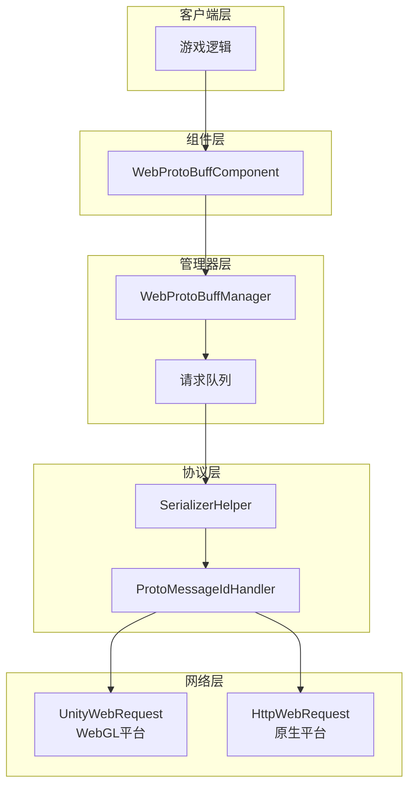
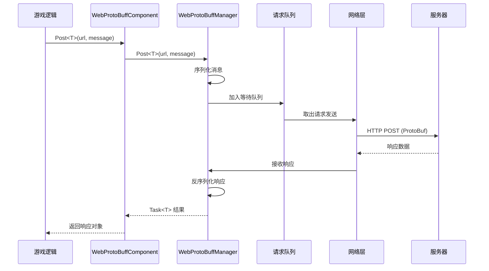

# クイックスタート

Web ProtoBuff コンポーネント是 GameFrameX フレームワーク的网络モジュール，专门用于処理基于 Protocol Buffer 的 HTTP POST 请求。它提供异步メッセージ发送和受信機能，サポート ProtoBuf メッセージ的シリアライズ与反シリアライズ。

## 概要

WebProtoBuffComponent 是 Unity 游戏フレームワーク的网络请求コンポーネント，カプセル化了 Protocol Buffer フォーマット数据的网络传输能力。当你的游戏〜する必要があります与服务器进行効率的的数据交换时，特别是使用 ProtoBuf 作为シリアライズフォーマット时，这个コンポーネント能够大大簡素化网络请求的実装。

### コア機能

- **ProtoBuf サポート**：原生サポート Protocol Buffer メッセージフォーマット的シリアライズ与反シリアライズ
- **异步 API**：基于 Task<T> 的异步编程模型，使用 async/await モード
- **超时控制**：可設定的请求超时时间
- **跨プラットフォーム**：兼容 Unity WebGL 及原生プラットフォーム（PC/iOS/Android）
- **队列管理**：内置请求队列和并发控制

### 使用シーン

WebProtoBuffComponent 適しています以下シーン：

1. **与 ProtoBuf 服务器通信**：服务器使用 Protocol Buffer 作为数据交换フォーマット
2. **高性能网络请求**：ProtoBuf 比 JSON 更紧凑，传输效率更高
3. **异步数据取得**：〜する必要があります等待服务器响应的游戏逻辑
4. **跨プラットフォームデプロイ**：同一套コード同時にサポート WebGL 和原生プラットフォーム

## アーキテクチャ

WebProtoBuffComponent 采用分层アーキテクチャ設計，各层职责清晰：



### コンポーネント説明

| コンポーネント | 説明 |
|------|------|
| WebProtoBuffComponent | Unity コンポーネント，挂载在 GameObject 上使用 |
| WebProtoBuffManager | コアマネージャー，処理请求队列和并发控制 |
| WebProtoBufData | 请求数据カプセル化，パッケージ含 URL、シリアライズ数据、TaskCompletionSource |
| SerializerHelper | シリアライズ/反シリアライズ工具 |
| ProtoMessageIdHandler | メッセージ ID 処理器 |

## ワークフロー

コンポーネント的请求処理フロー如下：



### フロー説明

1. **请求发起**：游戏逻辑呼び出しコンポーネント的 Post<T> メソッド
2. **メッセージカプセル化**：将 MessageObject シリアライズ为 ProtoBuf 字节数组，パッケージ装在 MessageHttpObject 中
3. **队列管理**：请求加入等待队列，等待发送
4. **并发控制**：同時に最多发送 MaxConnectionPerServer (デフォルト8) 个请求
5. **网络发送**：根据プラットフォーム选择 UnityWebRequest (WebGL) 或 HttpWebRequest (原生)
6. **响应処理**：受信服务器响应，反シリアライズ为对应的 MessageObject

## 前置条件

### 1. インストール依赖

確認してください你的 Unity プロジェクト已インストール以下依赖：

- `com.gameframex.unity` (1.1.1+)
- `com.gameframex.unity.web` (1.0.0+)
- `com.gameframex.unity.network` (1.0.0+)
- `com.gameframex.unity.google.protobuf` (1.0.0+)

### 2. 启用コンパイル宏

在 Unity エディタ中，打开 **Edit > Project Settings > Player**，在 **Scripting Define Symbols** 中追加：

```
ENABLE_GAME_FRAME_X_WEB_PROTOBUF_NETWORK
```

> **注意**：もし不追加此宏定義，Post<T> メソッド将不可用。

### 3. 追加コンポーネント

在 Unity シーン中作成一个空的 GameObject，次に追加 **Web ProtoBuff** コンポーネント：

```csharp
// 或者通过代码添加
var gameObject = new GameObject("WebProtoBuff");
var webComponent = gameObject.AddComponent<WebProtoBuffComponent>();
```

コンポーネント会自动依赖 GameFrameXWebProtoBuffCroppingHelper，用于防止 IL2CPP コンパイル时タイプ被裁剪。

## メッセージ定義

在使用コンポーネント之前，〜する必要があります定義请求和响应的メッセージタイプ。メッセージ类〜しなければなりません継承自 MessageObject，响应类还〜する必要があります実装 IResponseMessage インターフェース：

```csharp
using ProtoBuf;
using GameFrameX.Network.Runtime;

[ProtoContract]
public class LoginRequest : MessageObject
{
    [ProtoMember(1)]
    public string Username { get; set; }
    
    [ProtoMember(2)]
    public string Password { get; set; }
}

[ProtoContract]
public class LoginResponse : MessageObject, IResponseMessage
{
    [ProtoMember(1)]
    public bool Success { get; set; }
    
    [ProtoMember(2)]
    public string Token { get; set; }
}
```

> Source: [README.md](https://github.com/GameFrameX/com.gameframex.unity.web.protobuff/blob/main/README.md#L60-L88)

## 发送请求

取得コンポーネントインスタンス后，つまり可发送 ProtoBuf 请求：

```csharp
using UnityEngine;
using GameFrameX.Web.ProtoBuff.Runtime;

public class LoginController : MonoBehaviour
{
    public WebProtoBuffComponent WebComponent;

    private async void Start()
    {
        var request = new LoginRequest 
        { 
            Username = "user", 
            Password = "password" 
        };
        
        string url = "http://api.example.com/login";

        try
        {
            LoginResponse response = await WebComponent.Post<LoginResponse>(url, request);
            
            if (response != null)
            {
                Debug.Log($"Login Result: {response.Success}, Token: {response.Token}");
            }
        }
        catch (System.Exception e)
        {
            Debug.LogError($"Request Failed: {e.Message}");
        }
    }
}
```

> Source: [README.md](https://github.com/GameFrameX/com.gameframex.unity.web.protobuff/blob/main/README.md#L94-L128)

## 設定オプション

WebProtoBuffComponent 提供以下可設定プロパティ：

| プロパティ | タイプ | デフォルト值 | 説明 |
|------|------|--------|------|
| Timeout | float | 5.0 | 请求超时时间（秒） |

〜できます通过 Inspector パネル或コード設定：

```csharp
// 通过代码配置超时时间
webComponent.Timeout = 10f;
```

## プラットフォーム差异

コンポーネント会自动根据目标プラットフォーム选择合适的网络実装：

| プラットフォーム | 网络実装 | 説明 |
|------|----------|------|
| WebGL | UnityWebRequest | Unity 原生 WebGL サポート |
| 其他プラットフォーム | HttpWebRequest | .NET 標準 HTTP 请求 |

两种実装使用相同的 API インターフェース和メッセージフォーマット，コード无需変更。

## 関連リンク

- [基本例](./3-getting-started.basic-example) - 完全な的コード例
- [コンポーネントアーキテクチャ](./4-core-concepts.architecture) - 深入理解するアーキテクチャ設計
- [API リファレンス](./5-api-reference.webprotobuffcomponent) - 完全な的 API ドキュメント
- [コンパイル宏定義](./6-configuration.compile-defines) - 宏定義設定详解
- [プラットフォーム説明](./7-platforms.platform-info) - 各プラットフォームサポート详情
