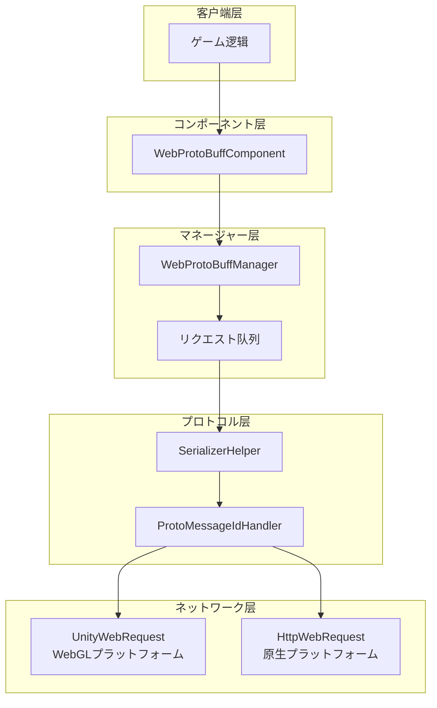
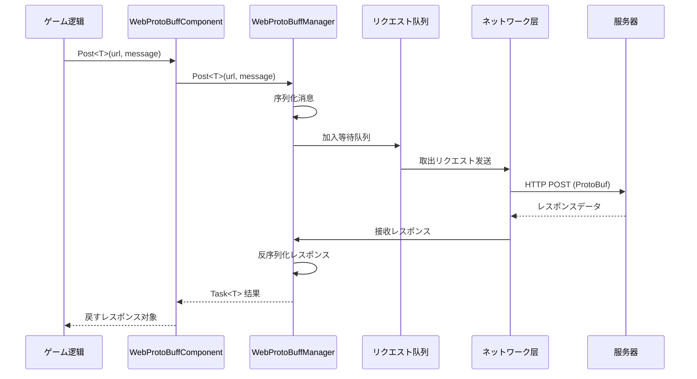

# クイックスタート

Web ProtoBuff コンポーネントは GameFrameX フレームワークのネットワークモジュール，ににづく Protocol Buffer の HTTP POST リクエスト。と，サポート ProtoBuf のと。

## 

WebProtoBuffComponent は Unity ゲームフレームワークのネットワークリクエストコンポーネント，た Protocol Buffer データのネットワーク。のゲームとのデータ，は ProtoBuf ，コンポーネントネットワークリクエストの。

### コア

- **ProtoBuf サポート**：サポート Protocol Buffer のと
- ** API**：にづく Task<T> の， async/await 
- ****：のリクエスト
- **プラットフォーム**： Unity WebGL プラットフォーム（PC/iOS/Android）
- ****：リクエストと

### シーン

WebProtoBuffComponent に：

1. **と ProtoBuf **： Protocol Buffer データ
2. **ネットワークリクエスト**：ProtoBuf  JSON ，
3. **データ**：レスポンスのゲーム
4. **プラットフォームデプロイ**：コードサポート WebGL とプラットフォーム

## アーキテクチャ

WebProtoBuffComponent アーキテクチャ，：



### コンポーネント

| コンポーネント |  |
|------|------|
| WebProtoBuffComponent | Unity コンポーネント，に GameObject  |
| WebProtoBuffManager | コアマネージャー，リクエストと |
| WebProtoBufData | リクエストデータ，む URL、データ、TaskCompletionSource |
| SerializerHelper | / |
| ProtoMessageIdHandler |  ID  |

## フロー

コンポーネントのリクエストフロー：



### フロー

1. **リクエスト**：ゲームびしコンポーネントの Post<T> メソッド
2. ****： MessageObject  ProtoBuf ，に MessageHttpObject 
3. ****：リクエスト，
4. ****： MaxConnectionPerServer (デフォルト8) リクエスト
5. **ネットワーク**：プラットフォーム UnityWebRequest (WebGL)  HttpWebRequest ()
6. **レスポンス**：レスポンス，の MessageObject

## 

### 1. インストール

の Unity プロジェクトインストール：

- `com.gameframex.unity` (1.1.1+)
- `com.gameframex.unity.web` (1.0.0+)
- `com.gameframex.unity.network` (1.0.0+)
- `com.gameframex.unity.google.protobuf` (1.0.0+)

### 2. コンパイル

に Unity エディター， **Edit > Project Settings > Player**，に **Scripting Define Symbols** ：

```
ENABLE_GAME_FRAME_X_WEB_PROTOBUF_NETWORK
```

> ****：，Post<T> メソッド。

### 3. コンポーネント

に Unity の GameObject， **Web ProtoBuff** コンポーネント：

```csharp
// 或者を通じてコード添加
var gameObject = new GameObject("WebProtoBuff");
var webComponent = gameObject.AddComponent<WebProtoBuffComponent>();
```

コンポーネント GameFrameXWebProtoBuffCroppingHelper，に IL2CPP コンパイルタイプ。

## 

にコンポーネント，リクエストとレスポンスのタイプ。クラス MessageObject，レスポンスクラス IResponseMessage インターフェース：

```csharp
using ProtoBuf;
using GameFrameX.Network.Runtime;

[ProtoContract]
public class LoginRequest : MessageObject
{
    [ProtoMember(1)]
    public string Username { get; set; }
    
    [ProtoMember(2)]
    public string Password { get; set; }
}

[ProtoContract]
public class LoginResponse : MessageObject, IResponseMessage
{
    [ProtoMember(1)]
    public bool Success { get; set; }
    
    [ProtoMember(2)]
    public string Token { get; set; }
}
```

> Source: [README.md](https://github.com/GameFrameX/com.gameframex.unity.web.protobuff/blob/main/README.md#L60-L88)

## リクエスト

コンポーネント， ProtoBuf リクエスト：

```csharp
using UnityEngine;
using GameFrameX.Web.ProtoBuff.Runtime;

public class LoginController : MonoBehaviour
{
    public WebProtoBuffComponent WebComponent;

    private async void Start()
    {
        var request = new LoginRequest 
        { 
            Username = "user", 
            Password = "password" 
        };
        
        string url = "http://api.example.com/login";

        try
        {
            LoginResponse response = await WebComponent.Post<LoginResponse>(url, request);
            
            if (response != null)
            {
                Debug.Log($"Login Result: {response.Success}, Token: {response.Token}");
            }
        }
        catch (System.Exception e)
        {
            Debug.LogError($"Request Failed: {e.Message}");
        }
    }
}
```

> Source: [README.md](https://github.com/GameFrameX/com.gameframex.unity.web.protobuff/blob/main/README.md#L94-L128)

## オプション

WebProtoBuffComponent プロパティ：

| プロパティ | タイプ | デフォルト |  |
|------|------|--------|------|
| Timeout | float | 5.0 | リクエスト（） |

をじて Inspector コード：

```csharp
// を通じてコード設定超时时间
webComponent.Timeout = 10f;
```

## プラットフォーム

コンポーネントプラットフォームのネットワーク：

| プラットフォーム | ネットワーク |  |
|------|----------|------|
| WebGL | UnityWebRequest | Unity  WebGL サポート |
| プラットフォーム | HttpWebRequest | .NET  HTTP リクエスト |

の API インターフェースと，コード。

## リンク

- [](./3-getting-started.basic-example) - のコード
- [コンポーネントアーキテクチャ](./4-core-concepts.architecture) - たアーキテクチャ
- [API リファレンス](./5-api-reference.webprotobuffcomponent) - の API ドキュメント
- [コンパイル](./6-configuration.compile-defines) - 
- [プラットフォーム](./7-platforms.platform-info) - プラットフォームサポート
