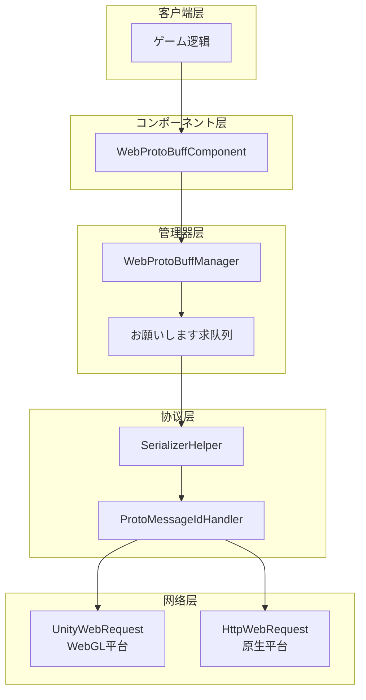
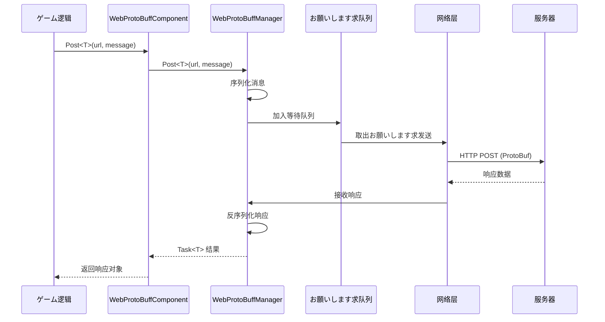

# 快速入门

Web ProtoBuff コンポーネント是 GameFrameX フレームワーク的网络模块，专门に使用处理基づく Protocol Buffer 的 HTTP POST お願いします求。它提供异步消息发送和接收機能，サポート ProtoBuf 消息的序列化与反序列化。

## 概要

WebProtoBuffComponent 是 Unity ゲームフレームワーク的网络お願いします求コンポーネント，封装了 Protocol Buffer 格式数据的网络传输能力。当你的ゲーム必要与服务器进行高效的数据交换时，特别是使用 ProtoBuf 作为序列化格式时，这个コンポーネント能够大大简化网络お願いします求的実装。

### コア機能

- **ProtoBuf サポート**：原生サポート Protocol Buffer 消息格式的序列化与反序列化
- **异步 API**：基づく Task<T> 的异步编程模型，使用 async/await 模式
- **超时控制**：可配置的お願いします求超时时间
- **跨平台**：兼容 Unity WebGL 及原生平台（PC/iOS/Android）
- **队列管理**：内置お願いします求队列和并发控制

### 使用シーン

WebProtoBuffComponent 适に使用以下シーン：

1. **与 ProtoBuf 服务器通信**：服务器使用 Protocol Buffer 作为数据交换格式
2. **高性能网络お願いします求**：ProtoBuf 比 JSON 更紧凑，传输效率更高
3. **异步数据取得**：必要等待服务器响应的ゲーム逻辑
4. **跨平台部署**：同一套代码同时サポート WebGL 和原生平台

## 架构

WebProtoBuffComponent 采用分层アーキテクチャ設計，各层职责清晰：



### コンポーネント説明

| コンポーネント | 説明 |
|------|------|
| WebProtoBuffComponent | Unity コンポーネント，挂载在 GameObject 上使用 |
| WebProtoBuffManager | コア管理器，处理お願いします求队列和并发控制 |
| WebProtoBufData | お願いします求数据封装，包含 URL、序列化数据、TaskCompletionSource |
| SerializerHelper | 序列化/反序列化工具 |
| ProtoMessageIdHandler | 消息 ID 处理器 |

## 工作フロー

コンポーネント的お願いします求处理フロー如下：



### フロー説明

1. **お願いします求发起**：ゲーム逻辑呼び出しコンポーネント的 Post<T> メソッド
2. **消息封装**：将 MessageObject 序列化为 ProtoBuf 字节数组，包装在 MessageHttpObject 中
3. **队列管理**：お願いします求加入等待队列，等待发送
4. **并发控制**：同时最多发送 MaxConnectionPerServer (默认8) 个お願いします求
5. **网络发送**：に基づいて平台选择 UnityWebRequest (WebGL) 或 HttpWebRequest (原生)
6. **响应处理**：接收服务器响应，反序列化为对应的 MessageObject

## 前置条件

### 1. 安装依赖

确保你的 Unity プロジェクト已安装以下依赖：

- `com.gameframex.unity` (1.1.1+)
- `com.gameframex.unity.web` (1.0.0+)
- `com.gameframex.unity.network` (1.0.0+)
- `com.gameframex.unity.google.protobuf` (1.0.0+)

### 2. 启用编译宏

在 Unity 编辑器中，打开 **Edit > Project Settings > Player**，在 **Scripting Define Symbols** 中添加：

```
ENABLE_GAME_FRAME_X_WEB_PROTOBUF_NETWORK
```

> **注意**：如果不添加此宏定义，Post<T> メソッド将不可用。

### 3. 添加コンポーネント

在 Unity シーン中作成一个空的 GameObject，然后添加 **Web ProtoBuff** コンポーネント：

```csharp
// 或者を通じて代码添加
var gameObject = new GameObject("WebProtoBuff");
var webComponent = gameObject.AddComponent<WebProtoBuffComponent>();
```

コンポーネント会自动依赖 GameFrameXWebProtoBuffCroppingHelper，に使用防止 IL2CPP 编译时クラス型被裁剪。

## 消息定义

在使用コンポーネント之前，必要定义お願いします求和响应的消息クラス型。消息クラス必須を継承 MessageObject，响应クラス还必要実装 IResponseMessage インターフェース：

```csharp
using ProtoBuf;
using GameFrameX.Network.Runtime;

[ProtoContract]
public class LoginRequest : MessageObject
{
    [ProtoMember(1)]
    public string Username { get; set; }
    
    [ProtoMember(2)]
    public string Password { get; set; }
}

[ProtoContract]
public class LoginResponse : MessageObject, IResponseMessage
{
    [ProtoMember(1)]
    public bool Success { get; set; }
    
    [ProtoMember(2)]
    public string Token { get; set; }
}
```

> Source: [README.md](https://github.com/GameFrameX/com.gameframex.unity.web.protobuff/blob/main/README.md#L60-L88)

## 发送お願いします求

取得コンポーネントインスタンス后，即可发送 ProtoBuf お願いします求：

```csharp
using UnityEngine;
using GameFrameX.Web.ProtoBuff.Runtime;

public class LoginController : MonoBehaviour
{
    public WebProtoBuffComponent WebComponent;

    private async void Start()
    {
        var request = new LoginRequest 
        { 
            Username = "user", 
            Password = "password" 
        };
        
        string url = "http://api.example.com/login";

        try
        {
            LoginResponse response = await WebComponent.Post<LoginResponse>(url, request);
            
            if (response != null)
            {
                Debug.Log($"Login Result: {response.Success}, Token: {response.Token}");
            }
        }
        catch (System.Exception e)
        {
            Debug.LogError($"Request Failed: {e.Message}");
        }
    }
}
```

> Source: [README.md](https://github.com/GameFrameX/com.gameframex.unity.web.protobuff/blob/main/README.md#L94-L128)

## 設定选项

WebProtoBuffComponent 提供以下可配置プロパティ：

| プロパティ | クラス型 | 默认值 | 説明 |
|------|------|--------|------|
| Timeout | float | 5.0 | お願いします求超时时间（秒） |

可能を通じて Inspector 面板或代码配置：

```csharp
// を通じて代码配置超时时间
webComponent.Timeout = 10f;
```

## 平台差异

コンポーネント会自动に基づいて目标平台选择合适的网络実装：

| 平台 | 网络実装 | 説明 |
|------|----------|------|
| WebGL | UnityWebRequest | Unity 原生 WebGL サポート |
| 其他平台 | HttpWebRequest | .NET 标准 HTTP お願いします求 |

两种実装使用相同的 API インターフェース和消息格式，代码无需修改。

## 関連リンク

- [基础示例](./3-getting-started.basic-example) - 完整的代码示例
- [コンポーネント架构](./4-core-concepts.architecture) - 深入了解アーキテクチャ設計
- [API 参考](./5-api-reference.webprotobuffcomponent) - 完整的 API 文档
- [编译宏定义](./6-configuration.compile-defines) - 宏定义配置详解
- [平台説明](./7-platforms.platform-info) - 各平台サポート详情
