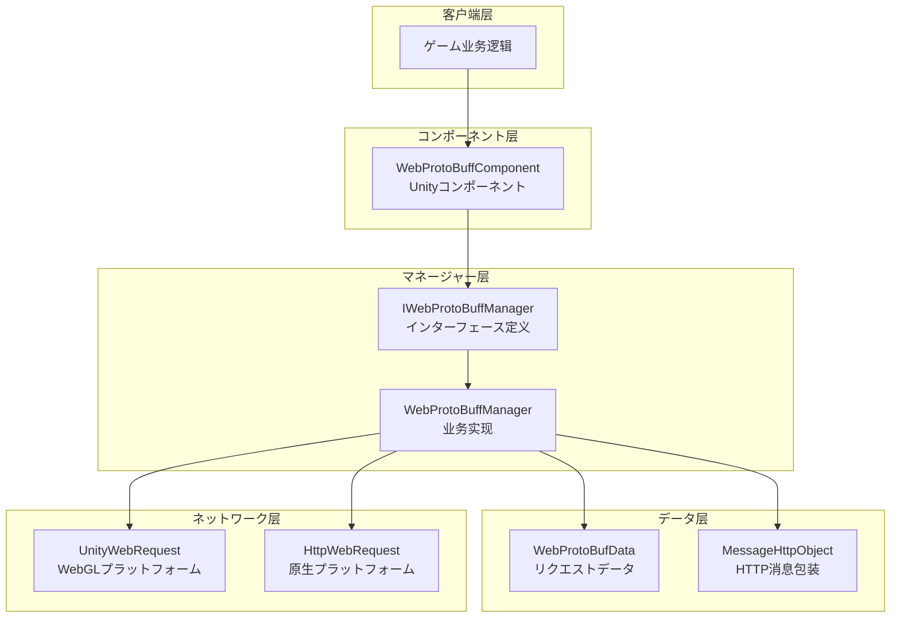
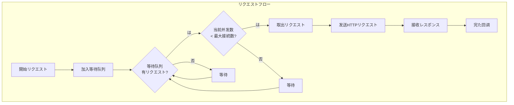
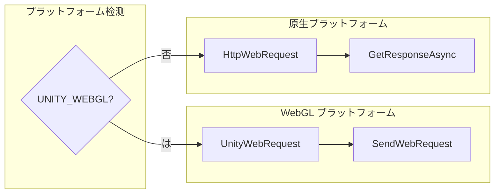

# 

GameFrameX Web ProtoBuff コンポーネントにづく Protocol Buffer の HTTP ネットワークリクエスト，サポートと ProtoBuf ，は Unity ゲームとの。

## 

Web ProtoBuff コンポーネントは GameFrameX ゲームフレームワークのネットワークモジュール，ににづく **Protocol Buffer** のネットワーク。との JSON/XML ，Protocol Buffer のとのデータ，ゲームのネットワーク。

コンポーネントたのリクエスト，リクエスト、、レスポンス，サポート Unity WebGL プラットフォームとプラットフォーム（PC/Android/iOS）のネットワークリクエストびし。

## アーキテクチャ

コンポーネントアーキテクチャ， Unity コンポーネント、とネットワークリクエスト，コード。



### コアコンポーネント

| コンポーネント |  | ファイル |
|------|------|----------|
| WebProtoBuffComponent | Unity コンポーネント， Inspector と API | Runtime/Web/WebProtoBuffComponent.cs |
| IWebProtoBuffManager | ネットワークマネージャーのインターフェース | Runtime/Web/IWebProtoBuffManager.cs |
| WebProtoBuffManager | の ProtoBuf リクエスト | Runtime/Web/WebProtoBuffManager.cs |
| WebProtoBufData | リクエストデータと | Runtime/Web/WebProtoBuffManager.WebProtoBufData.cs |

## コア

### 1. Protocol Buffer サポート

コンポーネントサポート Protocol Buffer のと。リクエストとレスポンス ProtoBuf ， JSON  30%-70% の。

 `MessageObject` クラス， `[ProtoContract]` と `[ProtoMember]` プロパティ：

```csharp
[ProtoContract]
public class LoginRequest : MessageObject
{
    [ProtoMember(1)]
    public string Username { get; set; }
    
    [ProtoMember(2)]
    public string Password { get; set; }
}

[ProtoContract]
public class LoginResponse : MessageObject, IResponseMessage
{
    [ProtoMember(1)]
    public bool Success { get; set; }
    
    [ProtoMember(2)]
    public string Token { get; set; }
}
```
> Source: [WebProtoBuffManager.ProtoBuf.cs](https://github.com/GameFrameX/com.gameframex.unity.web.protobuff/blob/main/Runtime/Web/WebProtoBuffManager.ProtoBuf.cs#L178-L201)

コンポーネントの `application/x-protobuf` Content-Type リクエスト， ProtoBuf データ：

```csharp
private const string ProtoBufContentType = "application/x-protobuf";
```
> Source: [WebProtoBuffManager.ProtoBuf.cs](https://github.com/GameFrameX/com.gameframex.unity.web.protobuff/blob/main/Runtime/Web/WebProtoBuffManager.ProtoBuf.cs#L32)

### 2. リクエスト

コンポーネントにづく `Task<T>` の，サポート `async/await` ，ネットワークリクエストコード：

```csharp
public async void Login()
{
    var request = new LoginRequest 
    { 
        Username = "user", 
        Password = "password" 
    };
    
    string url = "http://api.example.com/login";
    
    try
    {
        LoginResponse response = await WebComponent.Post<LoginResponse>(url, request);
        
        if (response != null)
        {
            Debug.Log($"Login Result: {response.Success}, Token: {response.Token}");
        }
    }
    catch (System.Exception e)
    {
        Debug.LogError($"Request Failed: {e.Message}");
    }
}
```
> Source: [WebProtoBuffComponent.cs](https://github.com/GameFrameX/com.gameframex.unity.web.protobuff/blob/main/Runtime/Web/WebProtoBuffComponent.cs#L105-L108)

### 3. リクエスト

コンポーネントリクエスト，サポートとリクエスト，ネットワークリクエスト：



コア：

```csharp
private readonly Queue<WebProtoBufData> m_WaitingProtoBufQueue = new Queue<WebProtoBufData>(256);
private readonly List<WebProtoBufData> m_SendingProtoBufList = new List<WebProtoBufData>(16);
```
> Source: [WebProtoBuffManager.ProtoBuf.cs](https://github.com/GameFrameX/com.gameframex.unity.web.protobuff/blob/main/Runtime/Web/WebProtoBuffManager.ProtoBuf.cs#L22-L27)

デフォルト 8 ：

```csharp
public WebProtoBuffManager()
{
    MaxConnectionPerServer = 8;
    m_MemoryStream = new MemoryStream();
    Timeout = 5f;
}
```
> Source: [WebProtoBuffManager.cs](https://github.com/GameFrameX/com.gameframex.unity.web.protobuff/blob/main/Runtime/Web/WebProtoBuffManager.cs#L31-L36)

### 4. 

コンポーネントの，サポートに Inspector コード：

```csharp
[SerializeField] [Tooltip("超时时间.单位：秒")]
private float m_Timeout = 5f;

public float Timeout
{
    get { return m_WebProtoBuffManager.Timeout; }
    set { m_WebProtoBuffManager.Timeout = m_Timeout = value; }
}
```
> Source: [WebProtoBuffComponent.cs](https://github.com/GameFrameX/com.gameframex.unity.web.protobuff/blob/main/Runtime/Web/WebProtoBuffComponent.cs#L60-L71)

Inspector サポート 0-120 の：

```csharp
float timeout = EditorGUILayout.Slider("Timeout", m_Timeout.floatValue, 0f, 120f);
```
> Source: [WebComponentInspector.cs](https://github.com/GameFrameX/com.gameframex.unity.web.protobuff/blob/main/Editor/Inspector/WebComponentInspector.cs#L23)

### 5. デバッグログ

コンポーネントオプションのデバッグログ，ネットワークリクエストのと：

```csharp
private void DebugSendLog(MessageObject messageObject)
{
#if ENABLE_GAMEFRAMEX_WEB_SEND_LOG
    var messageId = ProtoMessageIdHandler.GetReqMessageIdByType(messageObject.GetType());
    Log.Debug($"发送消息 ID:[{messageId},{messageObject.UniqueId},{messageObject.GetType().Name}] 消息内容:{GameFrameX.Runtime.Utility.Json.ToJson(messageObject)}");
#endif
}

private void DebugReceiveLog(MessageObject messageObject)
{
#if ENABLE_GAMEFRAMEX_WEB_RECEIVE_LOG
    var messageId = ProtoMessageIdHandler.GetReqMessageIdByType(messageObject.GetType());
    Log.Debug($"接收消息 ID:[{messageId},{messageObject.UniqueId},{messageObject.GetType().Name}] 消息内容:{GameFrameX.Runtime.Utility.Json.ToJson(messageObject)}");
#endif
}
```
> Source: [WebProtoBuffManager.ProtoBuf.cs](https://github.com/GameFrameX/com.gameframex.unity.web.protobuff/blob/main/Runtime/Web/WebProtoBuffManager.ProtoBuf.cs#L227-L241)

ログに Unity Player Settings コンパイル：
- `ENABLE_GAMEFRAMEX_WEB_SEND_LOG` - ログ
- `ENABLE_GAMEFRAMEX_WEB_RECEIVE_LOG` - ログ

### 6. プラットフォームサポート

コンポーネント Unity プラットフォームたのネットワーク：



WebGL プラットフォーム Unity の `UnityWebRequest`：

```csharp
#if UNITY_WEBGL
UnityEngine.Networking.UnityWebRequest unityWebRequest;
if (webData.IsGet)
{
    unityWebRequest = UnityEngine.Networking.UnityWebRequest.Get(webData.URL);
}
else
{
    unityWebRequest = UnityEngine.Networking.UnityWebRequest.Post(webData.URL, string.Empty);
}

unityWebRequest.timeout = (int)RequestTimeout.TotalSeconds;
unityWebRequest.SetRequestHeader("Content-Type", ProtoBufContentType);
byte[] postData = webData.SendData;
unityWebRequest.uploadHandler = new UnityEngine.Networking.UploadHandlerRaw(postData);
```
> Source: [WebProtoBuffManager.ProtoBuf.cs](https://github.com/GameFrameX/com.gameframex.unity.web.protobuff/blob/main/Runtime/Web/WebProtoBuffManager.ProtoBuf.cs#L87-L103)

プラットフォーム .NET の `HttpWebRequest`：

```csharp
#else
try
{
    HttpWebRequest request = WebRequest.CreateHttp(webData.URL);
    request.Method = webData.IsGet ? WebRequestMethods.Http.Get : WebRequestMethods.Http.Post;
    request.Timeout = (int)RequestTimeout.TotalMilliseconds;
    request.ContentType = ProtoBufContentType;
    // ... 发送と接收逻辑
}
```
> Source: [WebProtoBuffManager.ProtoBuf.cs](https://github.com/GameFrameX/com.gameframex.unity.web.protobuff/blob/main/Runtime/Web/WebProtoBuffManager.ProtoBuf.cs#L118-L130)

### 7.  ID 

コンポーネントをじて `ProtoMessageIdHandler` タイプと ID の，とのプロトコル：

```csharp
var id = ProtoMessageIdHandler.GetReqMessageIdByType(message.GetType());
MessageHttpObject messageHttpObject = new MessageHttpObject
{
    Id = id,
    UniqueId = message.UniqueId,
    Body = SerializerHelper.Serialize(message),
};
```
> Source: [WebProtoBuffManager.ProtoBuf.cs](https://github.com/GameFrameX/com.gameframex.unity.web.protobuff/blob/main/Runtime/Web/WebProtoBuffManager.ProtoBuf.cs#L214-L221)

## 

コンポーネント `MessageHttpObject`  ProtoBuf ，む ID、と：

```csharp
MessageHttpObject messageHttpObject = new MessageHttpObject
{
    Id = id,
    UniqueId = message.UniqueId,
    Body = SerializerHelper.Serialize(message),
};
var sendData = SerializerHelper.Serialize(messageHttpObject);
```
> Source: [WebProtoBuffManager.ProtoBuf.cs](https://github.com/GameFrameX/com.gameframex.unity.web.protobuff/blob/main/Runtime/Web/WebProtoBuffManager.ProtoBuf.cs#L215-L221)

と，サポートリクエストの（UniqueId）。

## 

コンポーネントの ProtoBuf をじてコンパイル。に Unity Player Settings ：

```
ENABLE_GAME_FRAME_X_WEB_PROTOBUF_NETWORK
```

，`Post<T>` メソッド，にびしの。

```csharp
#if ENABLE_GAME_FRAME_X_WEB_PROTOBUF_NETWORK
public Task<T> Post<T>(string url, GameFrameX.Network.Runtime.MessageObject message) where T : GameFrameX.Network.Runtime.MessageObject, GameFrameX.Network.Runtime.IResponseMessage
{
    return m_WebProtoBuffManager.Post<T>(url, message);
}
#endif
```
> Source: [WebProtoBuffComponent.cs](https://github.com/GameFrameX/com.gameframex.unity.web.protobuff/blob/main/Runtime/Web/WebProtoBuffComponent.cs#L92-L109)

## リソース

コンポーネントにリクエストリソース，：

```csharp
protected override void Shutdown()
{
    ShutdownProtoBuf();
    m_MemoryStream.Dispose();
}

private void ShutdownProtoBuf()
{
    while (m_WaitingProtoBufQueue.Count > 0)
    {
        var webData = m_WaitingProtoBufQueue.Dequeue();
        webData.Dispose();
    }
    // ... 清理发送中のリクエスト
}
```
> Source: [WebProtoBuffManager.cs](https://github.com/GameFrameX/com.gameframex.unity.web.protobuff/blob/main/Runtime/Web/WebProtoBuffManager.cs#L75-L79) と [WebProtoBuffManager.ProtoBuf.cs](https://github.com/GameFrameX/com.gameframex.unity.web.protobuff/blob/main/Runtime/Web/WebProtoBuffManager.ProtoBuf.cs#L60-L79)

## リンク

- [](./1-overview.introduction) - たの
- [クイックスタート](./3-getting-started.quick-start) - コンポーネント
- [](./3-getting-started.basic-example) - コード
- [コンポーネントアーキテクチャ](./4-core-concepts.architecture) - たアーキテクチャ
- [API リファレンス](./5-api-reference.webprotobuffcomponent) - の API ドキュメント
- [コンポーネント](./6-configuration.component-config) - オプション
- [コンパイル](./6-configuration.compile-defines) - コンパイル
- [プラットフォーム](./7-platforms.platform-info) - プラットフォーム
