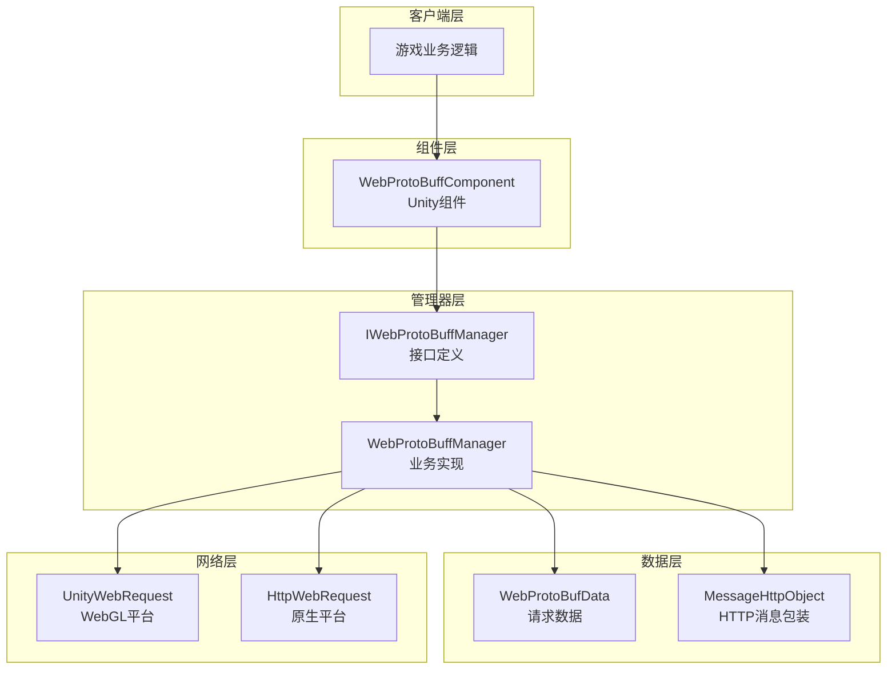
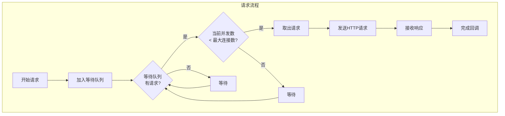
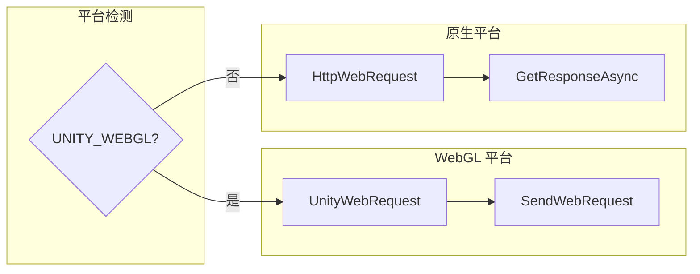

# 機能特性

GameFrameX Web ProtoBuff コンポーネント提供基于 Protocol Buffer 的 HTTP 网络请求機能，サポート异步发送和受信 ProtoBuf メッセージ，是 Unity 游戏与后端服务器通信的轻量级解決策。

## 概要

Web ProtoBuff コンポーネント是 GameFrameX 游戏フレームワーク的网络モジュール拡張，专门用于処理基于 **Protocol Buffer** フォーマット的网络通信。与传统的 JSON/XML 相比，Protocol Buffer 具有更高的シリアライズ效率和更小的数据体积，非常适合移动游戏シーン下的网络通信。

该コンポーネント提供します完全な的请求管理機能，含みます请求队列、超时控制、异步响应処理等特性，同時にサポート Unity WebGL プラットフォーム和原生プラットフォーム（PC/Android/iOS）的网络请求呼び出し。

## アーキテクチャ設計

コンポーネント采用分层アーキテクチャ設計，将 Unity コンポーネント層、业务逻辑层和网络请求层分离，確認してくださいコード结构清晰且易于维护。



### コアコンポーネント説明

| コンポーネント | 职责 | ファイル位置 |
|------|------|----------|
| WebProtoBuffComponent | Unity コンポーネント層，提供 Inspector 設定和对外 API | Runtime/Web/WebProtoBuffComponent.cs |
| IWebProtoBuffManager | 定義网络マネージャー的インターフェース规范 | Runtime/Web/IWebProtoBuffManager.cs |
| WebProtoBuffManager | 実装具体的 ProtoBuf 请求処理逻辑 | Runtime/Web/WebProtoBuffManager.cs |
| WebProtoBufData | カプセル化请求数据和相关ステータス | Runtime/Web/WebProtoBuffManager.WebProtoBufData.cs |

## コア機能

### 1. Protocol Buffer メッセージサポート

コンポーネント原生サポート Protocol Buffer メッセージフォーマット的シリアライズ与反シリアライズ。请求メッセージ和响应メッセージ都采用 ProtoBuf フォーマット传输，相比 JSON 可节省 30%-70% 的带宽。

メッセージ结构采用 `MessageObject` 基底クラス，配合 `[ProtoContract]` 和 `[ProtoMember]` プロパティ标记実装自动シリアライズ：

```csharp
[ProtoContract]
public class LoginRequest : MessageObject
{
    [ProtoMember(1)]
    public string Username { get; set; }
    
    [ProtoMember(2)]
    public string Password { get; set; }
}

[ProtoContract]
public class LoginResponse : MessageObject, IResponseMessage
{
    [ProtoMember(1)]
    public bool Success { get; set; }
    
    [ProtoMember(2)]
    public string Token { get; set; }
}
```
> Source: [WebProtoBuffManager.ProtoBuf.cs](https://github.com/GameFrameX/com.gameframex.unity.web.protobuff/blob/main/Runtime/Web/WebProtoBuffManager.ProtoBuf.cs#L178-L201)

コンポーネント使用专用的 `application/x-protobuf` Content-Type 进行请求，確認してください服务端能够正确识别 ProtoBuf フォーマット数据：

```csharp
private const string ProtoBufContentType = "application/x-protobuf";
```
> Source: [WebProtoBuffManager.ProtoBuf.cs](https://github.com/GameFrameX/com.gameframex.unity.web.protobuff/blob/main/Runtime/Web/WebProtoBuffManager.ProtoBuf.cs#L32)

### 2. 异步请求処理

コンポーネント采用基于 `Task<T>` 的异步编程モード，サポート `async/await` 语法糖，使网络请求コードシンプル易读：

```csharp
public async void Login()
{
    var request = new LoginRequest 
    { 
        Username = "user", 
        Password = "password" 
    };
    
    string url = "http://api.example.com/login";
    
    try
    {
        LoginResponse response = await WebComponent.Post<LoginResponse>(url, request);
        
        if (response != null)
        {
            Debug.Log($"Login Result: {response.Success}, Token: {response.Token}");
        }
    }
    catch (System.Exception e)
    {
        Debug.LogError($"Request Failed: {e.Message}");
    }
}
```
> Source: [WebProtoBuffComponent.cs](https://github.com/GameFrameX/com.gameframex.unity.web.protobuff/blob/main/Runtime/Web/WebProtoBuffComponent.cs#L105-L108)

### 3. 请求队列管理

コンポーネント内部维护请求队列，サポート并发控制和请求优先级管理，確認してください网络请求有序进行：



コア队列管理逻辑：

```csharp
private readonly Queue<WebProtoBufData> m_WaitingProtoBufQueue = new Queue<WebProtoBufData>(256);
private readonly List<WebProtoBufData> m_SendingProtoBufList = new List<WebProtoBufData>(16);
```
> Source: [WebProtoBuffManager.ProtoBuf.cs](https://github.com/GameFrameX/com.gameframex.unity.web.protobuff/blob/main/Runtime/Web/WebProtoBuffManager.ProtoBuf.cs#L22-L27)

デフォルト最大并发连接数为 8 个：

```csharp
public WebProtoBuffManager()
{
    MaxConnectionPerServer = 8;
    m_MemoryStream = new MemoryStream();
    Timeout = 5f;
}
```
> Source: [WebProtoBuffManager.cs](https://github.com/GameFrameX/com.gameframex.unity.web.protobuff/blob/main/Runtime/Web/WebProtoBuffManager.cs#L31-L36)

### 4. 超时控制

コンポーネント提供柔軟的超时設定机制，サポート在 Inspector パネル或コード中动态設定超时时间：

```csharp
[SerializeField] [Tooltip("超时时间.单位：秒")]
private float m_Timeout = 5f;

public float Timeout
{
    get { return m_WebProtoBuffManager.Timeout; }
    set { m_WebProtoBuffManager.Timeout = m_Timeout = value; }
}
```
> Source: [WebProtoBuffComponent.cs](https://github.com/GameFrameX/com.gameframex.unity.web.protobuff/blob/main/Runtime/Web/WebProtoBuffComponent.cs#L60-L71)

Inspector パネルサポート 0-120 秒的超时滑块設定：

```csharp
float timeout = EditorGUILayout.Slider("Timeout", m_Timeout.floatValue, 0f, 120f);
```
> Source: [WebComponentInspector.cs](https://github.com/GameFrameX/com.gameframex.unity.web.protobuff/blob/main/Editor/Inspector/WebComponentInspector.cs#L23)

### 5. デバッグログ

コンポーネント提供可选的デバッグログ機能，帮助開発者追踪网络请求的发送和受信过程：

```csharp
private void DebugSendLog(MessageObject messageObject)
{
#if ENABLE_GAMEFRAMEX_WEB_SEND_LOG
    var messageId = ProtoMessageIdHandler.GetReqMessageIdByType(messageObject.GetType());
    Log.Debug($"发送消息 ID:[{messageId},{messageObject.UniqueId},{messageObject.GetType().Name}] 消息内容:{GameFrameX.Runtime.Utility.Json.ToJson(messageObject)}");
#endif
}

private void DebugReceiveLog(MessageObject messageObject)
{
#if ENABLE_GAMEFRAMEX_WEB_RECEIVE_LOG
    var messageId = ProtoMessageIdHandler.GetReqMessageIdByType(messageObject.GetType());
    Log.Debug($"接收消息 ID:[{messageId},{messageObject.UniqueId},{messageObject.GetType().Name}] 消息内容:{GameFrameX.Runtime.Utility.Json.ToJson(messageObject)}");
#endif
}
```
> Source: [WebProtoBuffManager.ProtoBuf.cs](https://github.com/GameFrameX/com.gameframex.unity.web.protobuff/blob/main/Runtime/Web/WebProtoBuffManager.ProtoBuf.cs#L227-L241)

启用ログ〜する必要があります在 Unity Player Settings 中追加コンパイル宏：
- `ENABLE_GAMEFRAMEX_WEB_SEND_LOG` - 启用发送ログ
- `ENABLE_GAMEFRAMEX_WEB_RECEIVE_LOG` - 启用受信ログ

### 6. 跨プラットフォームサポート

コンポーネント针对不同 Unity プラットフォーム提供します差异化的网络実装：



WebGL プラットフォーム使用 Unity 内置的 `UnityWebRequest`：

```csharp
#if UNITY_WEBGL
UnityEngine.Networking.UnityWebRequest unityWebRequest;
if (webData.IsGet)
{
    unityWebRequest = UnityEngine.Networking.UnityWebRequest.Get(webData.URL);
}
else
{
    unityWebRequest = UnityEngine.Networking.UnityWebRequest.Post(webData.URL, string.Empty);
}

unityWebRequest.timeout = (int)RequestTimeout.TotalSeconds;
unityWebRequest.SetRequestHeader("Content-Type", ProtoBufContentType);
byte[] postData = webData.SendData;
unityWebRequest.uploadHandler = new UnityEngine.Networking.UploadHandlerRaw(postData);
```
> Source: [WebProtoBuffManager.ProtoBuf.cs](https://github.com/GameFrameX/com.gameframex.unity.web.protobuff/blob/main/Runtime/Web/WebProtoBuffManager.ProtoBuf.cs#L87-L103)

原生プラットフォーム使用 .NET 的 `HttpWebRequest`：

```csharp
#else
try
{
    HttpWebRequest request = WebRequest.CreateHttp(webData.URL);
    request.Method = webData.IsGet ? WebRequestMethods.Http.Get : WebRequestMethods.Http.Post;
    request.Timeout = (int)RequestTimeout.TotalMilliseconds;
    request.ContentType = ProtoBufContentType;
    // ... 发送和接收逻辑
}
```
> Source: [WebProtoBuffManager.ProtoBuf.cs](https://github.com/GameFrameX/com.gameframex.unity.web.protobuff/blob/main/Runtime/Web/WebProtoBuffManager.ProtoBuf.cs#L118-L130)

### 7. メッセージ ID 映射

コンポーネント通过 `ProtoMessageIdHandler` 実装メッセージタイプ与 ID 的映射，確認してください客户端和服务端使用統一された的协议标识：

```csharp
var id = ProtoMessageIdHandler.GetReqMessageIdByType(message.GetType());
MessageHttpObject messageHttpObject = new MessageHttpObject
{
    Id = id,
    UniqueId = message.UniqueId,
    Body = SerializerHelper.Serialize(message),
};
```
> Source: [WebProtoBuffManager.ProtoBuf.cs](https://github.com/GameFrameX/com.gameframex.unity.web.protobuff/blob/main/Runtime/Web/WebProtoBuffManager.ProtoBuf.cs#L214-L221)

## メッセージカプセル化フォーマット

コンポーネント使用 `MessageHttpObject` 对 ProtoBuf メッセージ进行カプセル化，パッケージ含メッセージ ID、唯一标识和メッセージ体：

```csharp
MessageHttpObject messageHttpObject = new MessageHttpObject
{
    Id = id,
    UniqueId = message.UniqueId,
    Body = SerializerHelper.Serialize(message),
};
var sendData = SerializerHelper.Serialize(messageHttpObject);
```
> Source: [WebProtoBuffManager.ProtoBuf.cs](https://github.com/GameFrameX/com.gameframex.unity.web.protobuff/blob/main/Runtime/Web/WebProtoBuffManager.ProtoBuf.cs#L215-L221)

这种カプセル化フォーマット便于服务端路由和メッセージ分发，同時にサポート请求的唯一定位（UniqueId）。

## 使用限制

コンポーネント的 ProtoBuf 機能〜する必要があります通过コンパイル宏来启用。在 Unity Player Settings 中〜する必要があります追加以下宏定義：

```
ENABLE_GAME_FRAME_X_WEB_PROTOBUF_NETWORK
```

未定義此宏时，`Post<T>` メソッド将被禁用，確認してください不会在本番環境中意外呼び出し未設定的機能。

```csharp
#if ENABLE_GAME_FRAME_X_WEB_PROTOBUF_NETWORK
public Task<T> Post<T>(string url, GameFrameX.Network.Runtime.MessageObject message) where T : GameFrameX.Network.Runtime.MessageObject, GameFrameX.Network.Runtime.IResponseMessage
{
    return m_WebProtoBuffManager.Post<T>(url, message);
}
#endif
```
> Source: [WebProtoBuffComponent.cs](https://github.com/GameFrameX/com.gameframex.unity.web.protobuff/blob/main/Runtime/Web/WebProtoBuffComponent.cs#L92-L109)

## リソース清理

コンポーネント在閉じる时会自动清理所有请求リソース，防止内存泄漏：

```csharp
protected override void Shutdown()
{
    ShutdownProtoBuf();
    m_MemoryStream.Dispose();
}

private void ShutdownProtoBuf()
{
    while (m_WaitingProtoBufQueue.Count > 0)
    {
        var webData = m_WaitingProtoBufQueue.Dequeue();
        webData.Dispose();
    }
    // ... 清理发送中的请求
}
```
> Source: [WebProtoBuffManager.cs](https://github.com/GameFrameX/com.gameframex.unity.web.protobuff/blob/main/Runtime/Web/WebProtoBuffManager.cs#L75-L79) 和 [WebProtoBuffManager.ProtoBuf.cs](https://github.com/GameFrameX/com.gameframex.unity.web.protobuff/blob/main/Runtime/Web/WebProtoBuffManager.ProtoBuf.cs#L60-L79)

## 関連リンク

- [プラグイン介绍](./1-overview.introduction) - 理解するプラグイン的基本情報
- [快速入门](./3-getting-started.quick-start) - 开始使用コンポーネント
- [基本例](./3-getting-started.basic-example) - 確認完全なコード例
- [コンポーネントアーキテクチャ](./4-core-concepts.architecture) - 深入理解するアーキテクチャ設計
- [API リファレンス](./5-api-reference.webprotobuffcomponent) - 完全な的 API ドキュメント
- [コンポーネント設定](./6-configuration.component-config) - 設定オプション详解
- [コンパイル宏定義](./6-configuration.compile-defines) - コンパイル宏使用説明
- [プラットフォーム説明](./7-platforms.platform-info) - プラットフォーム兼容性説明
