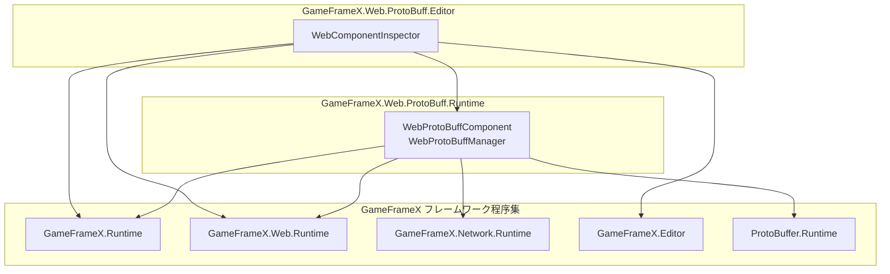
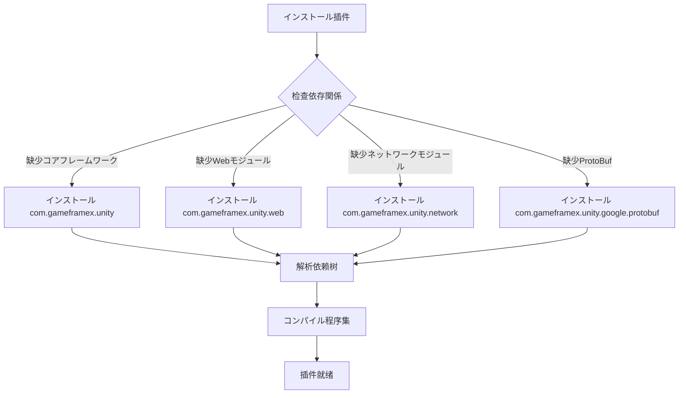

# 

ドキュメント GameFrameX Web ProtoBuff の，、。

## 

Web ProtoBuff は GameFrameX フレームワークの，フレームワークのコアモジュールにづく Protocol Buffer の HTTP ネットワークリクエスト。たインストール、と。

## 

のに `package.json` ファイル，をじて Unity Package Manager とインストール。

```json
{
  "dependencies": {
    "com.gameframex.unity": "1.1.1",
    "com.gameframex.unity.web": "1.0.0",
    "com.gameframex.unity.network": "1.0.0",
    "com.gameframex.unity.google.protobuf": "1.0.0"
  }
}
```

> Source: [package.json](https://github.com/GameFrameX/com.gameframex.unity.web.protobuff/blob/main/package.json#L23-L28)

### 

|  | バージョン |  |
|--------|------|------|
| `com.gameframex.unity` | 1.1.1 | GameFrameX コアフレームワーク，コンポーネントとモジュール |
| `com.gameframex.unity.web` | 1.0.0 | Web ネットワークモジュール， HTTP リクエストの |
| `com.gameframex.unity.network` | 1.0.0 | ネットワークモジュール， `MessageObject` クラスとサポート |
| `com.gameframex.unity.google.protobuf` | 1.0.0 | Google Protocol Buffers サポート， ProtoBuf のと |

### 


****：アーキテクチャ，コアフレームワーク， Web と Network モジュールのネットワークリクエスト。たコードのモジュールと。

## 

た Unity Package Manager の，をじて Assembly Definition ファイルの。

### Runtime 

`Runtime/GameFrameX.Web.ProtoBuff.Runtime.asmdef` ファイルたの：

```json
{
  "name": "GameFrameX.Web.ProtoBuff.Runtime",
  "references": [
    "GameFrameX.Runtime",
    "GameFrameX.Web.Runtime",
    "GameFrameX.Network.Runtime",
    "ProtoBuffer.Runtime"
  ],
  "versionDefines": [
    {
      "name": "com.gameframex.unity.network",
      "define": "ENABLE_GAME_FRAME_X_WEB_PROTOBUF_NETWORK"
    }
  ]
}
```

> Source: [Runtime/GameFrameX.Web.ProtoBuff.Runtime.asmdef](https://github.com/GameFrameX/com.gameframex.unity.web.protobuff/blob/main/Runtime/GameFrameX.Web.ProtoBuff.Runtime.asmdef#L1-L25)

### Editor 

`Editor/GameFrameX.Web.ProtoBuff.Editor.asmdef` ファイルたエディターの：

```json
{
  "name": "GameFrameX.Web.ProtoBuff.Editor",
  "references": [
    "GameFrameX.Web.Runtime",
    "GameFrameX.Web.ProtoBuff.Runtime",
    "GameFrameX.Editor",
    "GameFrameX.Runtime"
  ],
  "includePlatforms": ["Editor"]
}
```

> Source: [Editor/GameFrameX.Web.ProtoBuff.Editor.asmdef](https://github.com/GameFrameX/com.gameframex.unity.web.protobuff/blob/main/Editor/GameFrameX.Web.ProtoBuff.Editor.asmdef#L1-L11)

### 



## コンパイル

コンパイル ProtoBuf ネットワークの。の：

|  |  |  |
|--------|--------|------|
| `ENABLE_GAME_FRAME_X_WEB_PROTOBUF_NETWORK` | com.gameframex.unity.network |  ProtoBuf ネットワークリクエスト |

### メソッド

に Unity コンパイルのステップ：

1.  Unity エディター
2.  **Edit** → **Project Settings** → **Player**
3. に **Player Settings** ， **Other Settings** 
4.  **Scripting Define Symbols** オプション
5. ：`ENABLE_GAME_FRAME_X_WEB_PROTOBUF_NETWORK`

> ****：，`WebProtoBuffComponent` の `Post<T>` メソッド。

```csharp
#if ENABLE_GAME_FRAME_X_WEB_PROTOBUF_NETWORK
/// <summary>
/// 发送Postリクエスト，に使用发送と接收Protocol Buffer消息。
/// 此メソッド仅に启用ENABLE_GAME_FRAME_X_WEB_PROTOBUF_NETWORK宏定义时可用。
/// </summary>
public Task<T> Post<T>(string url, GameFrameX.Network.Runtime.MessageObject message) 
    where T : GameFrameX.Network.Runtime.MessageObject, GameFrameX.Network.Runtime.IResponseMessage
{
    return m_WebProtoBuffManager.Post<T>(url, message);
}
#endif
```

> Source: [Runtime/Web/WebProtoBuffComponent.cs](https://github.com/GameFrameX/com.gameframex.unity.web.protobuff/blob/main/Runtime/Web/WebProtoBuffComponent.cs#L92-L109)

## インストールフロー

にプロジェクトインストール Web ProtoBuff ，Unity Package Manager インストールの：



## バージョン

のバージョン：

|  | バージョン | バージョン |  Unity バージョン |
|--------|----------|----------|-----------------|
| com.gameframex.unity | 1.1.0 | 1.1.1 | 2019.4+ |
| com.gameframex.unity.web | 1.0.0 | 1.0.0 | 2019.4+ |
| com.gameframex.unity.network | 1.0.0 | 1.0.0 | 2019.4+ |
| com.gameframex.unity.google.protobuf | 1.0.0 | 1.0.0 | 2019.4+ |

> ****： `package.json` のバージョン。

## 

### ： GameFrameX.Runtime

****：コンパイルエラー `GameFrameX.Runtime` 

****：インストール `com.gameframex.unity` コア

### ：Post メソッド

****：`WebProtoBuffComponent.Post<T>` メソッドびし

****：
1. に Player Settings  `ENABLE_GAME_FRAME_X_WEB_PROTOBUF_NETWORK` 
2. インストール `com.gameframex.unity.network` 

### ：ProtoBuf 

****：リクエストレスポンスデータ/

****：
1. インストール `com.gameframex.unity.google.protobuf` 
2. クラスは `[ProtoContract]` と `[ProtoMember]` プロパティ

## リンク

- [インストールメソッド](./2-installation.install-methods) - たのインストールメソッド
- [](./2-installation.requirements) -  Unity バージョンと
- [](./1-overview.features) - た
- [コンポーネントアーキテクチャ](./4-core-concepts.architecture) - たコンポーネントアーキテクチャ
