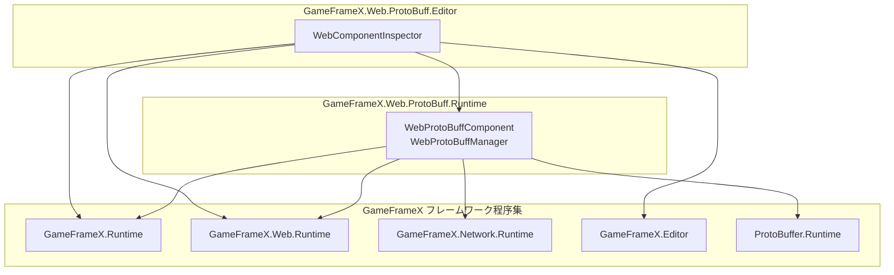
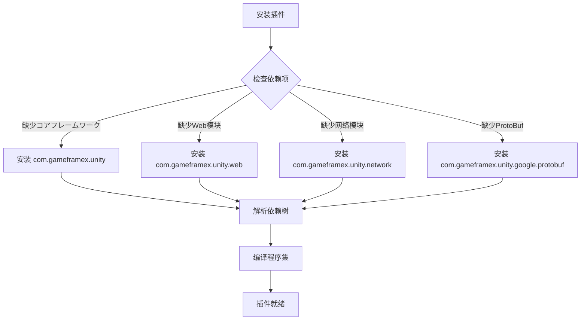

# 依赖项

本文档介绍 GameFrameX Web ProtoBuff 插件的依赖项，包括运行时依赖、开发依赖以及程序集引用关系。

## 概要

Web ProtoBuff 插件是 GameFrameX フレームワーク生态系统中的一员，它依赖于フレームワーク的其他コア模块来実装基づく Protocol Buffer 的 HTTP 网络お願いします求機能。了解这些依赖项对于正确安装、配置和排查问题非常重要。

## 运行时依赖

插件的运行时依赖在 `package.json` ファイル中定义，を通じて Unity Package Manager 自动解析和安装。

```json
{
  "dependencies": {
    "com.gameframex.unity": "1.1.1",
    "com.gameframex.unity.web": "1.0.0",
    "com.gameframex.unity.network": "1.0.0",
    "com.gameframex.unity.google.protobuf": "1.0.0"
  }
}
```

> Source: [package.json](https://github.com/GameFrameX/com.gameframex.unity.web.protobuff/blob/main/package.json#L23-L28)

### 依赖项説明

| 依赖包 | 版本 | 説明 |
|--------|------|------|
| `com.gameframex.unity` | 1.1.1 | GameFrameX コアフレームワーク，提供基础コンポーネント系统和模块管理機能 |
| `com.gameframex.unity.web` | 1.0.0 | Web 网络基础模块，提供 HTTP お願いします求的底层実装 |
| `com.gameframex.unity.network` | 1.0.0 | 网络消息模块，提供 `MessageObject` 基クラス和消息序列化サポート |
| `com.gameframex.unity.google.protobuf` | 1.0.0 | Google Protocol Buffers サポート，提供 ProtoBuf 消息的序列化与反序列化機能 |

### 依赖关系图


**设计意图**：插件采用分层架构，底层依赖コアフレームワーク，上层依赖 Web 和 Network 模块来実装具体的网络お願いします求機能。这种依赖设计确保了代码的模块化和可复用性。

## 程序集引用

除了 Unity Package Manager 管理的包依赖外，插件还を通じて Assembly Definition ファイル定义程序集级别的引用关系。

### Runtime 程序集

`Runtime/GameFrameX.Web.ProtoBuff.Runtime.asmdef` ファイル定义了运行时程序集的引用：

```json
{
  "name": "GameFrameX.Web.ProtoBuff.Runtime",
  "references": [
    "GameFrameX.Runtime",
    "GameFrameX.Web.Runtime",
    "GameFrameX.Network.Runtime",
    "ProtoBuffer.Runtime"
  ],
  "versionDefines": [
    {
      "name": "com.gameframex.unity.network",
      "define": "ENABLE_GAME_FRAME_X_WEB_PROTOBUF_NETWORK"
    }
  ]
}
```

> Source: [Runtime/GameFrameX.Web.ProtoBuff.Runtime.asmdef](https://github.com/GameFrameX/com.gameframex.unity.web.protobuff/blob/main/Runtime/GameFrameX.Web.ProtoBuff.Runtime.asmdef#L1-L25)

### Editor 程序集

`Editor/GameFrameX.Web.ProtoBuff.Editor.asmdef` ファイル定义了编辑器程序集的引用：

```json
{
  "name": "GameFrameX.Web.ProtoBuff.Editor",
  "references": [
    "GameFrameX.Web.Runtime",
    "GameFrameX.Web.ProtoBuff.Runtime",
    "GameFrameX.Editor",
    "GameFrameX.Runtime"
  ],
  "includePlatforms": ["Editor"]
}
```

> Source: [Editor/GameFrameX.Web.ProtoBuff.Editor.asmdef](https://github.com/GameFrameX/com.gameframex.unity.web.protobuff/blob/main/Editor/GameFrameX.Web.ProtoBuff.Editor.asmdef#L1-L11)

### 程序集引用关系



## 编译宏定义

插件使用条件编译来控制 ProtoBuf 网络機能的启用。以下宏定义控制着插件機能的可用性：

| 宏定义 | 控制包 | 説明 |
|--------|--------|------|
| `ENABLE_GAME_FRAME_X_WEB_PROTOBUF_NETWORK` | com.gameframex.unity.network | 启用 ProtoBuf 网络お願いします求機能 |

### 宏定义配置メソッド

在 Unity 中配置编译宏定义的手順：

1. 打开 Unity 编辑器
2. 导航到 **Edit** → **Project Settings** → **Player**
3. 在 **Player Settings** 窗口中，选择 **Other Settings** 标签
4. 找到 **Scripting Define Symbols** 选项
5. 添加宏定义：`ENABLE_GAME_FRAME_X_WEB_PROTOBUF_NETWORK`

> **注意**：如果不添加此宏定义，`WebProtoBuffComponent` 的 `Post<T>` メソッド将不可用。

```csharp
#if ENABLE_GAME_FRAME_X_WEB_PROTOBUF_NETWORK
/// <summary>
/// 发送Postお願いします求，に使用发送和接收Protocol Buffer消息。
/// 此メソッド仅在启用ENABLE_GAME_FRAME_X_WEB_PROTOBUF_NETWORK宏定义时可用。
/// </summary>
public Task<T> Post<T>(string url, GameFrameX.Network.Runtime.MessageObject message) 
    where T : GameFrameX.Network.Runtime.MessageObject, GameFrameX.Network.Runtime.IResponseMessage
{
    return m_WebProtoBuffManager.Post<T>(url, message);
}
#endif
```

> Source: [Runtime/Web/WebProtoBuffComponent.cs](https://github.com/GameFrameX/com.gameframex.unity.web.protobuff/blob/main/Runtime/Web/WebProtoBuffComponent.cs#L92-L109)

## 依赖安装フロー

当您在プロジェクト中安装 Web ProtoBuff 插件时，Unity Package Manager 会自动解析并安装所有必要的依赖项：



## 依赖版本兼容性

插件依赖的版本要求如下：

| 依赖项 | 最小バージョン | 推荐版本 | 兼容 Unity 版本 |
|--------|----------|----------|-----------------|
| com.gameframex.unity | 1.1.0 | 1.1.1 | 2019.4+ |
| com.gameframex.unity.web | 1.0.0 | 1.0.0 | 2019.4+ |
| com.gameframex.unity.network | 1.0.0 | 1.0.0 | 2019.4+ |
| com.gameframex.unity.google.protobuf | 1.0.0 | 1.0.0 | 2019.4+ |

> **ヒント**：建议使用 `package.json` 中指定的版本以确保最佳兼容性。

## 常见依赖问题

### 问题：找不到 GameFrameX.Runtime

**症状**：编译错误ヒント找不到 `GameFrameX.Runtime` 名前空間

**解決策**：确保已正确安装 `com.gameframex.unity` コア包

### 问题：Post メソッド不可用

**症状**：`WebProtoBuffComponent.Post<T>` メソッド显示为灰色或不可呼び出し

**解決策**：
1. 确认已在 Player Settings 中添加 `ENABLE_GAME_FRAME_X_WEB_PROTOBUF_NETWORK` 宏定义
2. 确认已安装 `com.gameframex.unity.network` 包

### 问题：ProtoBuf 序列化失败

**症状**：お願いします求或响应数据无法正确序列化/反序列化

**解決策**：
1. 确认已安装 `com.gameframex.unity.google.protobuf` 包
2. 检查消息クラス是否正确使用 `[ProtoContract]` 和 `[ProtoMember]` プロパティ修饰

## 関連リンク

- [安装方法](./2-installation.install-methods) - 了解不同的插件安装メソッド
- [环境要求](./2-installation.requirements) - 查看 Unity 版本和其他环境要求
- [機能特性](./1-overview.features) - 了解更多插件機能
- [コンポーネント架构](./4-core-concepts.architecture) - 了解コンポーネント内部架构
