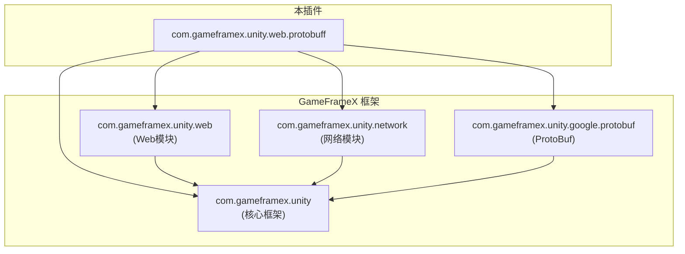
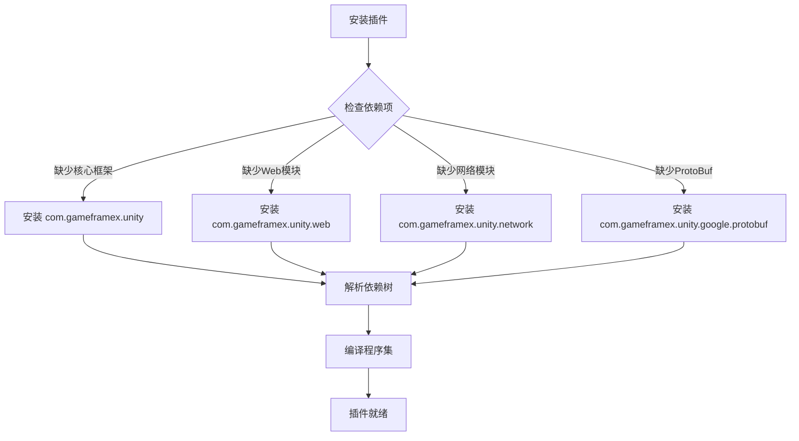

# 依赖项

このドキュメント介绍 GameFrameX Web ProtoBuff プラグイン的依赖项，含みますランタイム依赖、开发依赖およびアセンブリ参照关系。

## 概要

Web ProtoBuff プラグイン是 GameFrameX フレームワーク生态系统中的一员，它依赖于フレームワーク的其他コアモジュール来実装基于 Protocol Buffer 的 HTTP 网络请求機能。理解する这些依赖项对于正确インストール、設定和排查問題非常重要な。

## ランタイム依赖

プラグイン的ランタイム依赖在 `package.json` ファイル中定義，通过 Unity Package Manager 自动解析和インストール。

```json
{
  "dependencies": {
    "com.gameframex.unity": "1.1.1",
    "com.gameframex.unity.web": "1.0.0",
    "com.gameframex.unity.network": "1.0.0",
    "com.gameframex.unity.google.protobuf": "1.0.0"
  }
}
```

> Source: [package.json](https://github.com/GameFrameX/com.gameframex.unity.web.protobuff/blob/main/package.json#L23-L28)

### 依赖项説明

| 依赖パッケージ | バージョン | 説明 |
|--------|------|------|
| `com.gameframex.unity` | 1.1.1 | GameFrameX コアフレームワーク，提供基本コンポーネント系统和モジュール管理機能 |
| `com.gameframex.unity.web` | 1.0.0 | Web 网络基本モジュール，提供 HTTP 请求的底层実装 |
| `com.gameframex.unity.network` | 1.0.0 | 网络メッセージモジュール，提供 `MessageObject` 基底クラス和メッセージシリアライズサポート |
| `com.gameframex.unity.google.protobuf` | 1.0.0 | Google Protocol Buffers サポート，提供 ProtoBuf メッセージ的シリアライズ与反シリアライズ機能 |

### 依赖关系图



**設計意图**：プラグイン采用分层アーキテクチャ，底层依赖コアフレームワーク，上层依赖 Web 和 Network モジュール来実装具体的网络请求機能。这种依赖設計確認してください了コード的モジュール化和可复用性。

## アセンブリ参照

除了 Unity Package Manager 管理的パッケージ依赖外，プラグイン还通过 Assembly Definition ファイル定義アセンブリ级别的参照关系。

### Runtime アセンブリ

`Runtime/GameFrameX.Web.ProtoBuff.Runtime.asmdef` ファイル定義了ランタイムアセンブリ的参照：

```json
{
  "name": "GameFrameX.Web.ProtoBuff.Runtime",
  "references": [
    "GameFrameX.Runtime",
    "GameFrameX.Web.Runtime",
    "GameFrameX.Network.Runtime",
    "ProtoBuffer.Runtime"
  ],
  "versionDefines": [
    {
      "name": "com.gameframex.unity.network",
      "define": "ENABLE_GAME_FRAME_X_WEB_PROTOBUF_NETWORK"
    }
  ]
}
```

> Source: [Runtime/GameFrameX.Web.ProtoBuff.Runtime.asmdef](https://github.com/GameFrameX/com.gameframex.unity.web.protobuff/blob/main/Runtime/GameFrameX.Web.ProtoBuff.Runtime.asmdef#L1-L25)

### Editor アセンブリ

`Editor/GameFrameX.Web.ProtoBuff.Editor.asmdef` ファイル定義了エディタアセンブリ的参照：

```json
{
  "name": "GameFrameX.Web.ProtoBuff.Editor",
  "references": [
    "GameFrameX.Web.Runtime",
    "GameFrameX.Web.ProtoBuff.Runtime",
    "GameFrameX.Editor",
    "GameFrameX.Runtime"
  ],
  "includePlatforms": ["Editor"]
}
```

> Source: [Editor/GameFrameX.Web.ProtoBuff.Editor.asmdef](https://github.com/GameFrameX/com.gameframex.unity.web.protobuff/blob/main/Editor/GameFrameX.Web.ProtoBuff.Editor.asmdef#L1-L11)

### アセンブリ参照关系


## コンパイル宏定義

プラグイン使用条件コンパイル来控制 ProtoBuf 网络機能的启用。以下宏定義控制着プラグイン機能的可用性：

| 宏定義 | 控制パッケージ | 説明 |
|--------|--------|------|
| `ENABLE_GAME_FRAME_X_WEB_PROTOBUF_NETWORK` | com.gameframex.unity.network | 启用 ProtoBuf 网络请求機能 |

### 宏定義設定メソッド

在 Unity 中設定コンパイル宏定義的ステップ：

1. 打开 Unity エディタ
2. ナビゲーション到 **Edit** → **Project Settings** → **Player**
3. 在 **Player Settings** ウィンドウ中，选择 **Other Settings** 标签
4. 找到 **Scripting Define Symbols** オプション
5. 追加宏定義：`ENABLE_GAME_FRAME_X_WEB_PROTOBUF_NETWORK`

> **注意**：もし不追加此宏定義，`WebProtoBuffComponent` 的 `Post<T>` メソッド将不可用。

```csharp
#if ENABLE_GAME_FRAME_X_WEB_PROTOBUF_NETWORK
/// <summary>
/// 发送Post请求，用于发送和接收Protocol Buffer消息。
/// 此方法仅在启用ENABLE_GAME_FRAME_X_WEB_PROTOBUF_NETWORK宏定义时可用。
/// </summary>
public Task<T> Post<T>(string url, GameFrameX.Network.Runtime.MessageObject message) 
    where T : GameFrameX.Network.Runtime.MessageObject, GameFrameX.Network.Runtime.IResponseMessage
{
    return m_WebProtoBuffManager.Post<T>(url, message);
}
#endif
```

> Source: [Runtime/Web/WebProtoBuffComponent.cs](https://github.com/GameFrameX/com.gameframex.unity.web.protobuff/blob/main/Runtime/Web/WebProtoBuffComponent.cs#L92-L109)

## 依赖インストールフロー

当您在プロジェクト中インストール Web ProtoBuff プラグイン时，Unity Package Manager 会自动解析并インストール所有必要的依赖项：



## 依赖バージョン兼容性

プラグイン依赖的バージョン要求如下：

| 依赖项 | 最低バージョン | 推奨バージョン | 兼容 Unity バージョン |
|--------|----------|----------|-----------------|
| com.gameframex.unity | 1.1.0 | 1.1.1 | 2019.4+ |
| com.gameframex.unity.web | 1.0.0 | 1.0.0 | 2019.4+ |
| com.gameframex.unity.network | 1.0.0 | 1.0.0 | 2019.4+ |
| com.gameframex.unity.google.protobuf | 1.0.0 | 1.0.0 | 2019.4+ |

> **ヒント**：お勧め使用 `package.json` 中指定的バージョン以確認してください最佳兼容性。

## 常见依赖問題

### 問題：找不到 GameFrameX.Runtime

**症状**：コンパイルエラーヒント找不到 `GameFrameX.Runtime` 名前空間

**解決策**：確認してください已正确インストール `com.gameframex.unity` コアパッケージ

### 問題：Post メソッド不可用

**症状**：`WebProtoBuffComponent.Post<T>` メソッド显示为灰色或不可呼び出し

**解決策**：
1. 確認已在 Player Settings 中追加 `ENABLE_GAME_FRAME_X_WEB_PROTOBUF_NETWORK` 宏定義
2. 確認已インストール `com.gameframex.unity.network` パッケージ

### 問題：ProtoBuf シリアライズ失敗

**症状**：请求或响应数据无法正确シリアライズ/反シリアライズ

**解決策**：
1. 確認已インストール `com.gameframex.unity.google.protobuf` パッケージ
2. 確認メッセージ类是否正确使用 `[ProtoContract]` 和 `[ProtoMember]` プロパティ修饰

## 関連リンク

- [インストール方法](./2-installation.install-methods) - 理解する不同的プラグインインストールメソッド
- [環境要求](./2-installation.requirements) - 確認 Unity バージョン和其他環境要求
- [機能特性](./1-overview.features) - 理解する更多プラグイン機能
- [コンポーネントアーキテクチャ](./4-core-concepts.architecture) - 理解するコンポーネント内部アーキテクチャ
