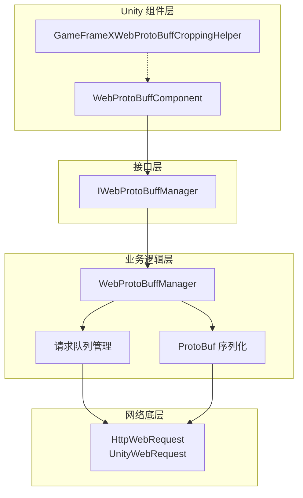
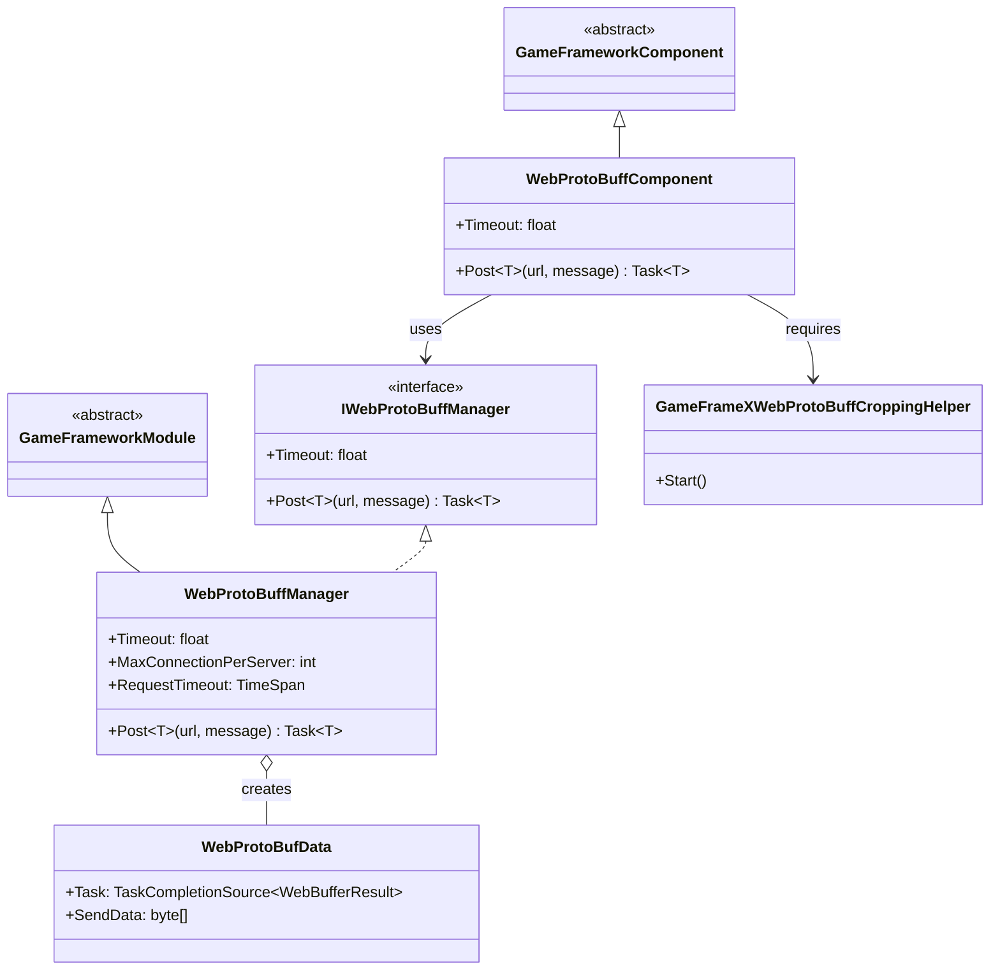
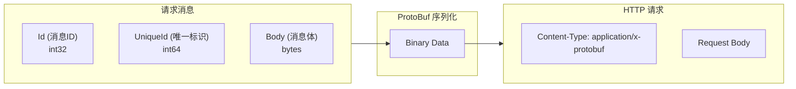
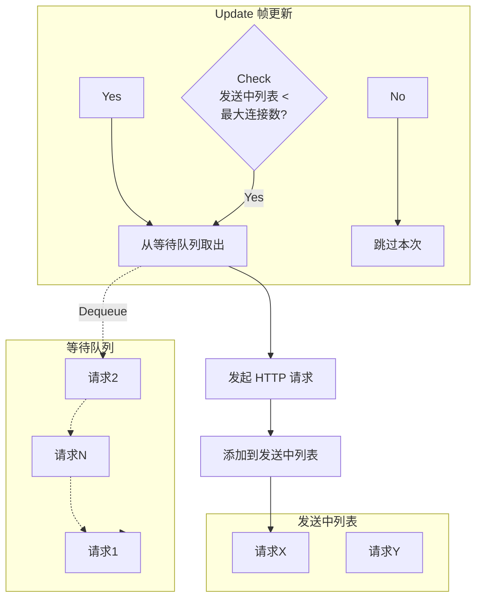

# コンポーネントアーキテクチャ

Web ProtoBuff コンポーネント是 GameFrameX フレームワーク中专门用于処理 HTTP 请求与 Protocol Buffer メッセージシリアライズ的コアモジュール。该コンポーネント提供します効率的、易用的网络通信機能，サポート在 Unity プロジェクト中与サポート ProtoBuf 协议的后端服务器进行数据交互。

## 概要

GameFrameX Web ProtoBuff コンポーネント采用分层アーキテクチャ設計，将 Unity コンポーネント層、业务逻辑层和网络底层実装分离，以実装更好的可维护性和拡張性。

该コンポーネント的コア機能含みます：

- **Protocol Buffer メッセージシリアライズ/反シリアライズ**：使用 ProtoBuf 库効率的処理二进制数据
- **HTTP POST 请求**：サポート向服务器发送 ProtoBuf フォーマット的请求メッセージ
- **异步処理**：基于 Task 异步モード，避免阻塞主线程
- **队列管理**：请求队列机制，サポート高并发シーン
- **プラットフォーム适配**：サポート WebGL プラットフォーム和其他 Unity プラットフォーム

## アーキテクチャ設計

コンポーネント采用典型的三层アーキテクチャ設計，各层职责清晰：



### コアコンポーネント説明

| コンポーネント | タイプ | 职责 |
|------|------|------|
| WebProtoBuffComponent | Unity コンポーネント | 作为 Unity GameObject コンポーネント，提供对外 API 入口 |
| IWebProtoBuffManager | インターフェース | 定義 Web 请求マネージャー的抽象インターフェース |
| WebProtoBuffManager | モジュール类 | 実装コア业务逻辑，含みます请求队列、ProtoBuf 処理 |
| WebProtoBufData | 内部类 | カプセル化单个请求的数据（URL、数据、Task） |
| GameFrameXWebProtoBuffCroppingHelper | 辅助类 | IL2CPP/AOT コード裁剪サポート |

## 类图关系



## 请求処理フロー

当客户端发送 ProtoBuf 请求时，コンポーネント按照以下フロー処理：

```mermaid
sequenceDiagram
    participant Client as 调用方
    participant Component as WebProtoBuffComponent
    participant Manager as WebProtoBuffManager
    participant Queue as 请求队列
    participant Network as 网络层
    participant Server as 服务器

    Client->>Component: Post&lt;T&gt;(url, message)
    Component->>Manager: Post&lt;T&gt;(url, message)
    
    Note over Manager: 1. 序列化消息
    
    Manager->>Manager: SerializerHelper.Serialize(message)
    
    Note over Manager: 2. 构建 HTTP 包装对象
    
    Manager->>Manager: 创建 MessageHttpObject<br/>(Id + UniqueId + Body)
    
    Note over Manager: 3. 再次序列化
    
    Manager->>Manager: SerializerHelper.Serialize(messageHttpObject)
    
    Note over Manager: 4. 加入请求队列
    
    Manager->>Queue: Enqueue(WebProtoBufData)
    Queue-->>Manager: 已加入队列
    
    Manager->>Network: 异步发送请求
    
    Note over Network: 5. HTTP 请求处理
    
    Network->>Server: POST /url<br/>Content-Type: application/x-protobuf
    Server-->>Network: HTTP Response (ProtoBuf)
    Network-->>Manager: WebBufferResult
    
    Note over Manager: 6. 反序列化响应
    
    Manager->>Manager: Deserialize&lt;MessageHttpObject&gt;()
    Manager->>Manager: Deserialize&lt;T&gt;(Body)
    
    Manager-->>Component: Task&lt;T&gt; Result
    Component-->>Client: Response Object
```

### メッセージカプセル化フォーマット

コンポーネント使用 `MessageHttpObject` 对 ProtoBuf メッセージ进行二次カプセル化：



## 请求队列管理

コンポーネント使用双队列モード管理网络请求：



**队列管理规则：**

- **等待队列（m_WaitingProtoBufQueue）**：存储所有待发送的请求，FIFO 顺序処理
- **发送中列表（m_SendingProtoBufList）**：存储〜中処理的请求
- **最大并发数（MaxConnectionPerServer）**：デフォルト 8 个并发连接

## プラットフォーム适配

コンポーネント针对不同プラットフォーム使用不同的网络実装：

| プラットフォーム | 网络実装 | 説明 |
|------|----------|------|
| WebGL | UnityWebRequest | Unity 原生 WebGL 网络库 |
| 其他プラットフォーム | HttpWebRequest | .NET 標準网络库 |

```csharp
#if UNITY_WEBGL
        // WebGL 平台：使用 UnityWebRequest
        unityWebRequest = UnityEngine.Networking.UnityWebRequest.Post(url, string.Empty);
#else
        // 其他平台：使用 HttpWebRequest
        var request = WebRequest.CreateHttp(url);
#endif
```
> Source: [WebProtoBuffManager.ProtoBuf.cs](https://github.com/GameFrameX/com.gameframex.unity.web.protobuff/blob/main/Runtime/Web/WebProtoBuffManager.ProtoBuf.cs#L87-L120)

## コンパイル宏定義

コンポーネント機能受以下コンパイル宏控制：

| 宏定義 | 機能 |
|--------|------|
| ENABLE_GAME_FRAME_X_WEB_PROTOBUF_NETWORK | 启用 ProtoBuf 网络機能 |
| ENABLE_GAMEFRAMEX_WEB_SEND_LOG | 启用发送ログ |
| ENABLE_GAMEFRAMEX_WEB_RECEIVE_LOG | 启用受信ログ |

## 使用例

### 基本用法

在 Unity シーン中追加 WebProtoBuffComponent コンポーネント后，〜できます通过以下方法发送请求：

```csharp
// 获取组件
var webComponent = UnityEngine.SceneManagement.SceneManager
    .GetActiveScene()
    .GetRootGameObjects()
    .SelectMany(go => go.GetComponentsInChildren<WebProtoBuffComponent>())
    .FirstOrDefault();

// 发送 ProtoBuf 请求
var request = new LoginRequest { Username = "test", Password = "123456" };
var response = await webComponent.Post<LoginResponse>("http://localhost:8080/api/login", request);
```
> Source: [WebProtoBuffComponent.cs](https://github.com/GameFrameX/com.gameframex.unity.web.protobuff/blob/main/Runtime/Web/WebProtoBuffComponent.cs#L105-L108)

### コンポーネント初期化

コンポーネント在 Awake フェーズ完成初期化：

```csharp
protected override void Awake()
{
    // 设置实现类类型
    ImplementationComponentType = Utility.Assembly.GetType(componentType);
    InterfaceComponentType = typeof(IWebProtoBuffManager);
    
    base.Awake();
    
    // 获取管理器实例
    m_WebProtoBuffManager = GameFrameworkEntry.GetModule<IWebProtoBuffManager>();
    
    // 设置超时时间
    m_WebProtoBuffManager.Timeout = m_Timeout;
}
```
> Source: [WebProtoBuffComponent.cs](https://github.com/GameFrameX/com.gameframex.unity.web.protobuff/blob/main/Runtime/Web/WebProtoBuffComponent.cs#L77-L90)

## 設定オプション

| 設定项 | タイプ | デフォルト值 | 説明 |
|--------|------|--------|------|
| Timeout | float | 5.0 | 请求超时时间（秒） |
| MaxConnectionPerServer | int | 8 | 单服务器最大并发连接数 |

## 関連リンク

- [プラグイン介绍](../1-overview.introduction)
- [機能特性](../1-overview.features)
- [WebProtoBuffComponent API リファレンス](../5-api-reference.webprotobuffcomponent)
- [IWebProtoBuffManager API リファレンス](../5-api-reference.iwebprotobuffmanager)
- [メッセージ定義](./4-core-concepts.message-definition)
- [コンポーネント設定](./6-configuration.component-config)
- [コンパイル宏定義](./6-configuration.compile-defines)
