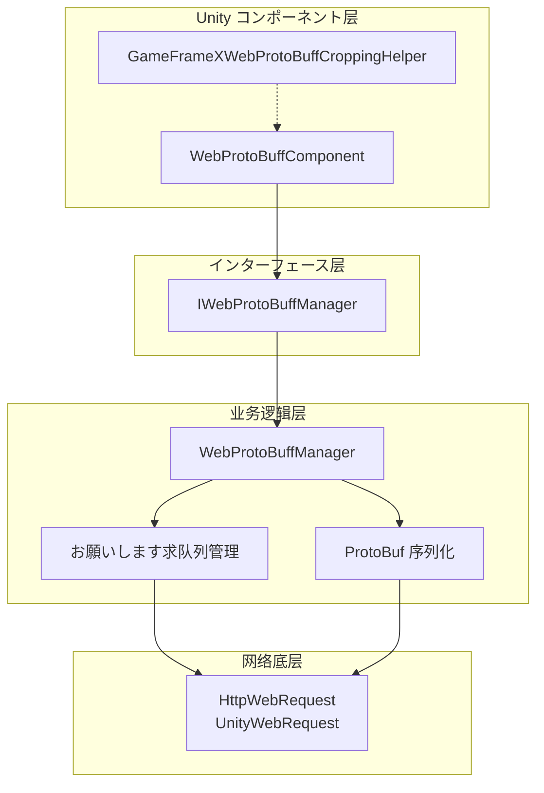
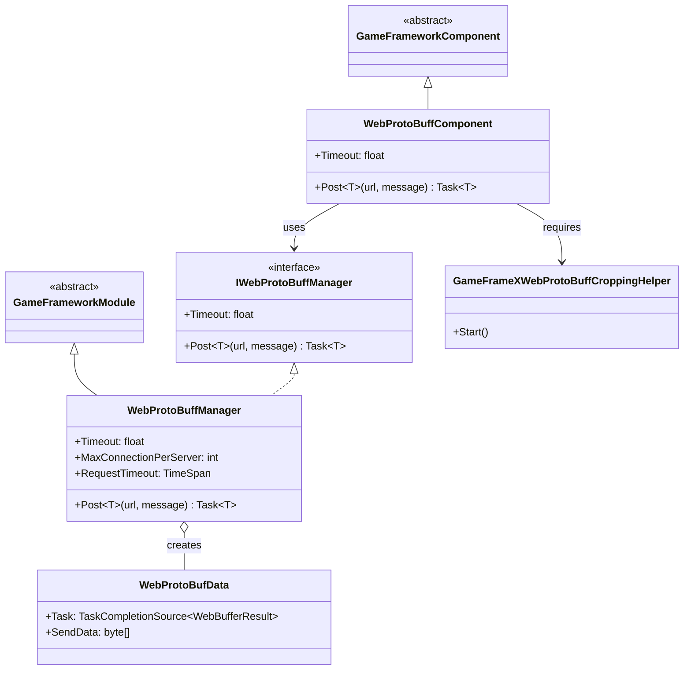
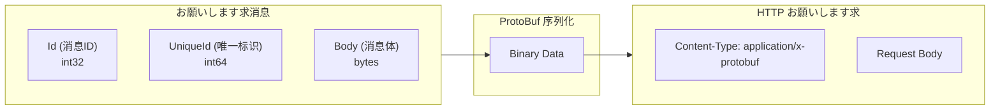
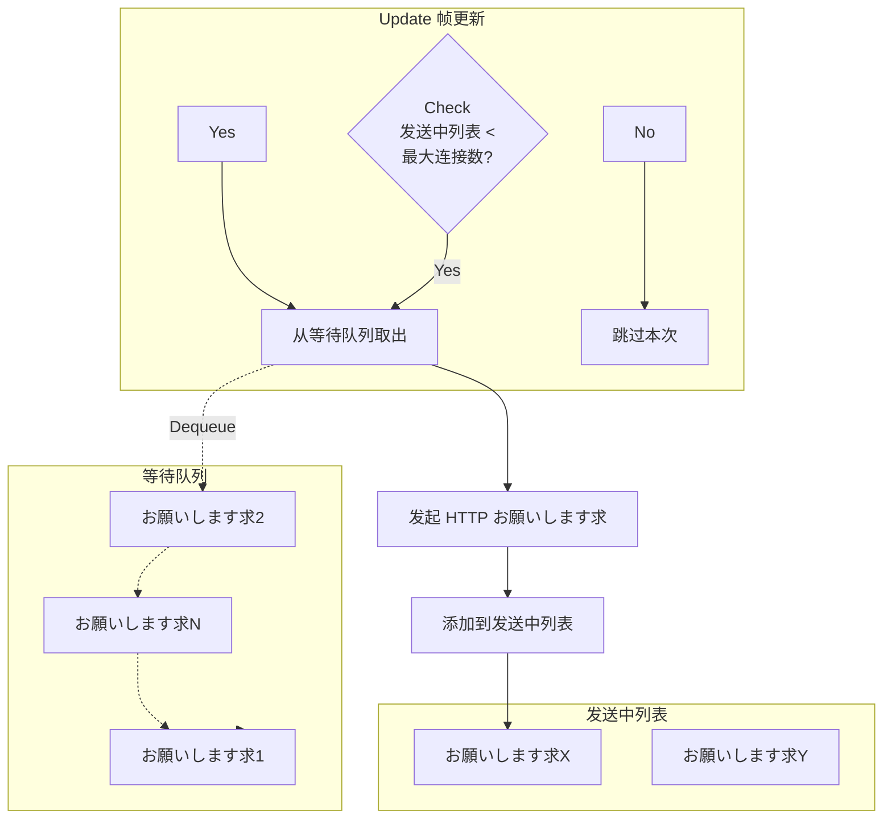

# コンポーネント架构

Web ProtoBuff コンポーネント是 GameFrameX フレームワーク中专门に使用处理 HTTP お願いします求与 Protocol Buffer 消息序列化的コア模块。该コンポーネント提供します高效、易用的网络通信機能，サポート在 Unity プロジェクト中与サポート ProtoBuf 协议的后端服务器进行数据交互。

## 概要

GameFrameX Web ProtoBuff コンポーネント采用分层アーキテクチャ設計，将 Unity コンポーネント层、业务逻辑层和网络底层実装分离，以実装更好的可维护性和扩展性。

该コンポーネント的コア機能包括：

- **Protocol Buffer 消息序列化/反序列化**：使用 ProtoBuf 库高效处理二进制数据
- **HTTP POST お願いします求**：サポート向服务器发送 ProtoBuf 格式的お願いします求消息
- **异步处理**：基づく Task 异步模式，避免阻塞主线程
- **队列管理**：お願いします求队列机制，サポート高并发シーン
- **平台适配**：サポート WebGL 平台和其他 Unity 平台

## アーキテクチャ設計

コンポーネント采用典型的三层アーキテクチャ設計，各层职责清晰：



### コアコンポーネント説明

| コンポーネント | クラス型 | 职责 |
|------|------|------|
| WebProtoBuffComponent | Unity コンポーネント | 作为 Unity GameObject コンポーネント，提供对外 API エントリーポイント |
| IWebProtoBuffManager | インターフェース | 定义 Web お願いします求管理器的抽象インターフェース |
| WebProtoBuffManager | 模块クラス | 実装コア业务逻辑，包括お願いします求队列、ProtoBuf 处理 |
| WebProtoBufData | 内部クラス | 封装单个お願いします求的数据（URL、数据、Task） |
| GameFrameXWebProtoBuffCroppingHelper | 辅助クラス | IL2CPP/AOT 代码裁剪サポート |

## クラス图关系



## お願いします求处理フロー

当客户端发送 ProtoBuf お願いします求时，コンポーネント按照以下フロー处理：

```mermaid
sequenceDiagram
    participant Client as 呼び出し方
    participant Component as WebProtoBuffComponent
    participant Manager as WebProtoBuffManager
    participant Queue as お願いします求队列
    participant Network as 网络层
    participant Server as 服务器

    Client->>Component: Post&lt;T&gt;(url, message)
    Component->>Manager: Post&lt;T&gt;(url, message)
    
    Note over Manager: 1. 序列化消息
    
    Manager->>Manager: SerializerHelper.Serialize(message)
    
    Note over Manager: 2. 构建 HTTP 包装对象
    
    Manager->>Manager: 作成 MessageHttpObject<br/>(Id + UniqueId + Body)
    
    Note over Manager: 3. 再次序列化
    
    Manager->>Manager: SerializerHelper.Serialize(messageHttpObject)
    
    Note over Manager: 4. 加入お願いします求队列
    
    Manager->>Queue: Enqueue(WebProtoBufData)
    Queue-->>Manager: 已加入队列
    
    Manager->>Network: 异步发送お願いします求
    
    Note over Network: 5. HTTP お願いします求处理
    
    Network->>Server: POST /url<br/>Content-Type: application/x-protobuf
    Server-->>Network: HTTP Response (ProtoBuf)
    Network-->>Manager: WebBufferResult
    
    Note over Manager: 6. 反序列化响应
    
    Manager->>Manager: Deserialize&lt;MessageHttpObject&gt;()
    Manager->>Manager: Deserialize&lt;T&gt;(Body)
    
    Manager-->>Component: Task&lt;T&gt; Result
    Component-->>Client: Response Object
```

### 消息封装格式

コンポーネント使用 `MessageHttpObject` 对 ProtoBuf 消息进行二次封装：



## お願いします求队列管理

コンポーネント使用双队列模式管理网络お願いします求：



**队列管理规则：**

- **等待队列（m_WaitingProtoBufQueue）**：存储所有待发送的お願いします求，FIFO 顺序处理
- **发送中列表（m_SendingProtoBufList）**：存储正在处理的お願いします求
- **最大并发数（MaxConnectionPerServer）**：默认 8 个并发连接

## 平台适配

コンポーネント针对不同平台使用不同的网络実装：

| 平台 | 网络実装 | 説明 |
|------|----------|------|
| WebGL | UnityWebRequest | Unity 原生 WebGL 网络库 |
| 其他平台 | HttpWebRequest | .NET 标准网络库 |

```csharp
#if UNITY_WEBGL
        // WebGL 平台：使用 UnityWebRequest
        unityWebRequest = UnityEngine.Networking.UnityWebRequest.Post(url, string.Empty);
#else
        // 其他平台：使用 HttpWebRequest
        var request = WebRequest.CreateHttp(url);
#endif
```
> Source: [WebProtoBuffManager.ProtoBuf.cs](https://github.com/GameFrameX/com.gameframex.unity.web.protobuff/blob/main/Runtime/Web/WebProtoBuffManager.ProtoBuf.cs#L87-L120)

## 编译宏定义

コンポーネント機能受以下编译宏控制：

| 宏定义 | 機能 |
|--------|------|
| ENABLE_GAME_FRAME_X_WEB_PROTOBUF_NETWORK | 启用 ProtoBuf 网络機能 |
| ENABLE_GAMEFRAMEX_WEB_SEND_LOG | 启用发送日志 |
| ENABLE_GAMEFRAMEX_WEB_RECEIVE_LOG | 启用接收日志 |

## 使用例

### 基本用法

在 Unity シーン中添加 WebProtoBuffComponent コンポーネント后，可能を通じて以下方法发送お願いします求：

```csharp
// 取得コンポーネント
var webComponent = UnityEngine.SceneManagement.SceneManager
    .GetActiveScene()
    .GetRootGameObjects()
    .SelectMany(go => go.GetComponentsInChildren<WebProtoBuffComponent>())
    .FirstOrDefault();

// 发送 ProtoBuf お願いします求
var request = new LoginRequest { Username = "test", Password = "123456" };
var response = await webComponent.Post<LoginResponse>("http://localhost:8080/api/login", request);
```
> Source: [WebProtoBuffComponent.cs](https://github.com/GameFrameX/com.gameframex.unity.web.protobuff/blob/main/Runtime/Web/WebProtoBuffComponent.cs#L105-L108)

### コンポーネント初期化

コンポーネント在 Awake 阶段完成初期化：

```csharp
protected override void Awake()
{
    // 設定実装クラスクラス型
    ImplementationComponentType = Utility.Assembly.GetType(componentType);
    InterfaceComponentType = typeof(IWebProtoBuffManager);
    
    base.Awake();
    
    // 取得管理器インスタンス
    m_WebProtoBuffManager = GameFrameworkEntry.GetModule<IWebProtoBuffManager>();
    
    // 設定超时时间
    m_WebProtoBuffManager.Timeout = m_Timeout;
}
```
> Source: [WebProtoBuffComponent.cs](https://github.com/GameFrameX/com.gameframex.unity.web.protobuff/blob/main/Runtime/Web/WebProtoBuffComponent.cs#L77-L90)

## 設定选项

| 配置项 | クラス型 | 默认值 | 説明 |
|--------|------|--------|------|
| Timeout | float | 5.0 | お願いします求超时时间（秒） |
| MaxConnectionPerServer | int | 8 | 单服务器最大并发连接数 |

## 関連リンク

- [插件介绍](../1-overview.introduction)
- [機能特性](../1-overview.features)
- [WebProtoBuffComponent API 参考](../5-api-reference.webprotobuffcomponent)
- [IWebProtoBuffManager API 参考](../5-api-reference.iwebprotobuffmanager)
- [消息定义](./4-core-concepts.message-definition)
- [コンポーネント配置](./6-configuration.component-config)
- [编译宏定义](./6-configuration.compile-defines)
