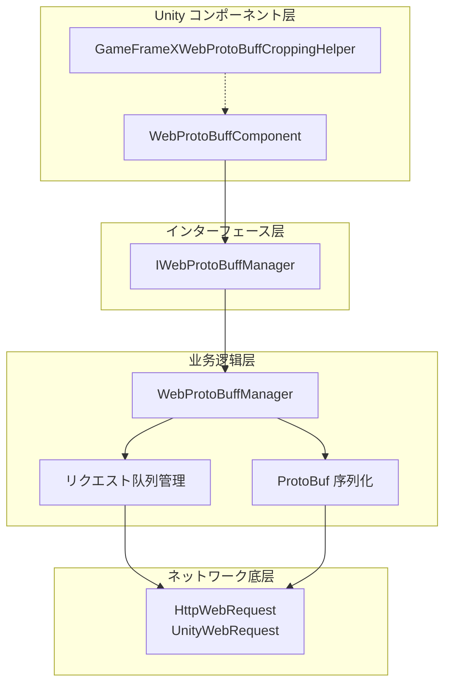
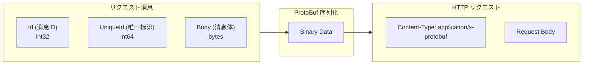
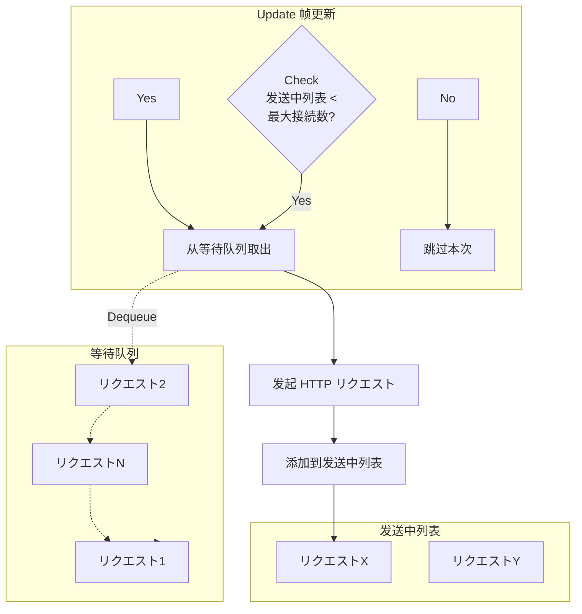

# コンポーネントアーキテクチャ

Web ProtoBuff コンポーネントは GameFrameX フレームワークに HTTP リクエストと Protocol Buffer のコアモジュール。コンポーネントた、のネットワーク，サポートに Unity プロジェクトとサポート ProtoBuf プロトコルのデータ。

## 

GameFrameX Web ProtoBuff コンポーネントアーキテクチャ， Unity コンポーネント、とネットワーク，のと。

コンポーネントのコア：

- **Protocol Buffer /**： ProtoBuf データ
- **HTTP POST リクエスト**：サポート ProtoBuf のリクエスト
- ****：にづく Task ，
- ****：リクエスト，サポート
- **プラットフォーム**：サポート WebGL プラットフォームと Unity プラットフォーム

## アーキテクチャ

コンポーネントのアーキテクチャ，：



### コアコンポーネント

| コンポーネント | タイプ |  |
|------|------|------|
| WebProtoBuffComponent | Unity コンポーネント |  Unity GameObject コンポーネント， API  |
| IWebProtoBuffManager | インターフェース |  Web リクエストマネージャーのインターフェース |
| WebProtoBuffManager | モジュールクラス | コア，リクエスト、ProtoBuf  |
| WebProtoBufData | クラス | リクエストのデータ（URL、データ、Task） |
| GameFrameXWebProtoBuffCroppingHelper | クラス | IL2CPP/AOT コードサポート |

## クラス


## リクエストフロー

 ProtoBuf リクエスト，コンポーネントフロー：

```mermaid
sequenceDiagram
    participant Client as 呼び出し方
    participant Component as WebProtoBuffComponent
    participant Manager as WebProtoBuffManager
    participant Queue as リクエスト队列
    participant Network as ネットワーク层
    participant Server as 服务器

    Client->>Component: Post&lt;T&gt;(url, message)
    Component->>Manager: Post&lt;T&gt;(url, message)
    
    Note over Manager: 1. 序列化消息
    
    Manager->>Manager: SerializerHelper.Serialize(message)
    
    Note over Manager: 2. ビルド HTTP 包装对象
    
    Manager->>Manager: 作成 MessageHttpObject<br/>(Id + UniqueId + Body)
    
    Note over Manager: 3. 再次序列化
    
    Manager->>Manager: SerializerHelper.Serialize(messageHttpObject)
    
    Note over Manager: 4. 加入リクエスト队列
    
    Manager->>Queue: Enqueue(WebProtoBufData)
    Queue-->>Manager: 已加入队列
    
    Manager->>Network: 异步发送リクエスト
    
    Note over Network: 5. HTTP リクエスト处理
    
    Network->>Server: POST /url<br/>Content-Type: application/x-protobuf
    Server-->>Network: HTTP Response (ProtoBuf)
    Network-->>Manager: WebBufferResult
    
    Note over Manager: 6. 反序列化レスポンス
    
    Manager->>Manager: Deserialize&lt;MessageHttpObject&gt;()
    Manager->>Manager: Deserialize&lt;T&gt;(Body)
    
    Manager-->>Component: Task&lt;T&gt; Result
    Component-->>Client: Response Object
```

### 

コンポーネント `MessageHttpObject`  ProtoBuf ：



## リクエスト

コンポーネントネットワークリクエスト：



**：**

- **（m_WaitingProtoBufQueue）**：のリクエスト，FIFO 
- **（m_SendingProtoBufList）**：にのリクエスト
- **（MaxConnectionPerServer）**：デフォルト 8 

## プラットフォーム

コンポーネントプラットフォームのネットワーク：

| プラットフォーム | ネットワーク |  |
|------|----------|------|
| WebGL | UnityWebRequest | Unity  WebGL ネットワーク |
| プラットフォーム | HttpWebRequest | .NET ネットワーク |

```csharp
#if UNITY_WEBGL
        // WebGL プラットフォーム：使用 UnityWebRequest
        unityWebRequest = UnityEngine.Networking.UnityWebRequest.Post(url, string.Empty);
#else
        // 其他プラットフォーム：使用 HttpWebRequest
        var request = WebRequest.CreateHttp(url);
#endif
```
> Source: [WebProtoBuffManager.ProtoBuf.cs](https://github.com/GameFrameX/com.gameframex.unity.web.protobuff/blob/main/Runtime/Web/WebProtoBuffManager.ProtoBuf.cs#L87-L120)

## コンパイル

コンポーネントコンパイル：

|  |  |
|--------|------|
| ENABLE_GAME_FRAME_X_WEB_PROTOBUF_NETWORK |  ProtoBuf ネットワーク |
| ENABLE_GAMEFRAMEX_WEB_SEND_LOG | ログ |
| ENABLE_GAMEFRAMEX_WEB_RECEIVE_LOG | ログ |

## 

### 

に Unity  WebProtoBuffComponent コンポーネント，をじてリクエスト：

```csharp
// 获取コンポーネント
var webComponent = UnityEngine.SceneManagement.SceneManager
    .GetActiveScene()
    .GetRootGameObjects()
    .SelectMany(go => go.GetComponentsInChildren<WebProtoBuffComponent>())
    .FirstOrDefault();

// 发送 ProtoBuf リクエスト
var request = new LoginRequest { Username = "test", Password = "123456" };
var response = await webComponent.Post<LoginResponse>("http://localhost:8080/api/login", request);
```
> Source: [WebProtoBuffComponent.cs](https://github.com/GameFrameX/com.gameframex.unity.web.protobuff/blob/main/Runtime/Web/WebProtoBuffComponent.cs#L105-L108)

### コンポーネント

コンポーネントに Awake た：

```csharp
protected override void Awake()
{
    // 設定实现クラスタイプ
    ImplementationComponentType = Utility.Assembly.GetType(componentType);
    InterfaceComponentType = typeof(IWebProtoBuffManager);
    
    base.Awake();
    
    // 获取マネージャー实例
    m_WebProtoBuffManager = GameFrameworkEntry.GetModule<IWebProtoBuffManager>();
    
    // 設定超时时间
    m_WebProtoBuffManager.Timeout = m_Timeout;
}
```
> Source: [WebProtoBuffComponent.cs](https://github.com/GameFrameX/com.gameframex.unity.web.protobuff/blob/main/Runtime/Web/WebProtoBuffComponent.cs#L77-L90)

## オプション

|  | タイプ | デフォルト |  |
|--------|------|--------|------|
| Timeout | float | 5.0 | リクエスト（） |
| MaxConnectionPerServer | int | 8 |  |

## リンク

- [](../1-overview.introduction)
- [](../1-overview.features)
- [WebProtoBuffComponent API リファレンス](../5-api-reference.webprotobuffcomponent)
- [IWebProtoBuffManager API リファレンス](../5-api-reference.iwebprotobuffmanager)
- [](./4-core-concepts.message-definition)
- [コンポーネント](./6-configuration.component-config)
- [コンパイル](./6-configuration.compile-defines)
