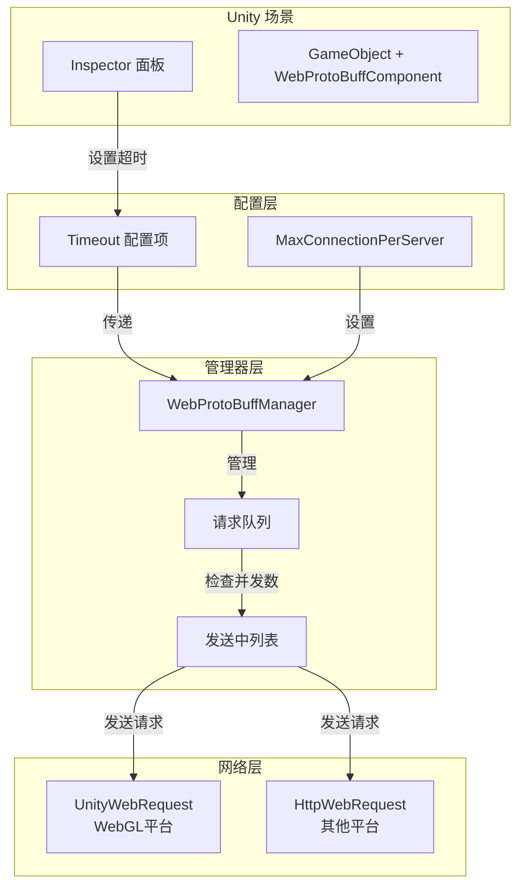

# コンポーネント設定

このドキュメント詳細介绍 WebProtoBuffComponent コンポーネント的各个設定项及其使用メソッド。

## 概要

WebProtoBuffComponent 是 GameFrameX フレームワーク中负责処理 Web 请求的コアコンポーネント，サポート HTTP POST 请求并使用 Protocol Buffer 进行メッセージシリアライズ。该コンポーネント継承自 GameFrameworkComponent，可作为 Unity コンポーネント追加到シーン中，并通过 WebProtoBuffManager 実装具体的网络请求逻辑。

コンポーネント設定主な分为两类：
1. **ランタイム設定** - 通过コード在ランタイム設定
2. **エディタ設定** - 通过 Unity Inspector パネル在エディタ中設定

## 設定オプション详解

### Timeout（超时时间）

| プロパティ | 説明 |
|------|------|
| タイプ | float |
| デフォルト值 | 5 秒 |
| 有效范围 | 0 - 120 秒 |
| 設定位置 | Inspector パネル / コード |

**機能説明：**
Timeout 設定用于設定网络请求的超时时间。当请求超过指定时间未完成时，系统会自动终止该请求并返す超时エラー。这对于防止网络请求无限期等待至关重要な。

**在 Inspector 中設定：**

```csharp
// WebComponentInspector.cs 中的配置 UI
float timeout = EditorGUILayout.Slider("Timeout", m_Timeout.floatValue, 0f, 120f);
```
> Source: [WebComponentInspector.cs](https://github.com/GameFrameX/com.gameframex.unity.web.protobuff/blob/main/Editor/Inspector/WebComponentInspector.cs#L23)

**通过コード設定：**

```csharp
// 通过组件属性设置超时时间
var webComponent = gameObject.GetComponent<WebProtoBuffComponent>();
webComponent.Timeout = 10f; // 设置为 10 秒
```
> Source: [WebProtoBuffComponent.cs](https://github.com/GameFrameX/com.gameframex.unity.web.protobuff/blob/main/Runtime/Web/WebProtoBuffComponent.cs#L67-L71)

**内部実装：**

```csharp
// WebProtoBuffManager.cs 中的超时设置
public float Timeout
{
    get { return m_Timeout; }
    set
    {
        m_Timeout = value;
        RequestTimeout = TimeSpan.FromSeconds(value);
    }
}
```
> Source: [WebProtoBuffManager.cs](https://github.com/GameFrameX/com.gameframex.unity.web.protobuff/blob/main/Runtime/Web/WebProtoBuffManager.cs#L41-L49)

### MaxConnectionPerServer（最大连接数）

| プロパティ | 説明 |
|------|------|
| タイプ | int |
| デフォルト值 | 8 |
| 設定位置 | コード |

**機能説明：**
MaxConnectionPerServer 用于控制单个服务器的最大并发连接数。该設定影响请求队列的処理策略，当已有连接数小于此值时，才会从等待队列中取出新请求进行処理。

**内部実装：**

```csharp
// 构造函数中设置默认值
public WebProtoBuffManager()
{
    MaxConnectionPerServer = 8;
    m_MemoryStream = new MemoryStream();
    Timeout = 5f;
}
```
> Source: [WebProtoBuffManager.cs](https://github.com/GameFrameX/com.gameframex.unity.web.protobuff/blob/main/Runtime/Web/WebProtoBuffManager.cs#L30-L36)

**队列処理逻辑：**

```csharp
// 更新处理 ProtoBuf 请求队列
void UpdateProtoBuf(float elapseSeconds, float realElapseSeconds)
{
    lock (m_StringBuilder)
    {
        if (m_SendingProtoBufList.Count < MaxConnectionPerServer)
        {
            if (m_WaitingProtoBufQueue.Count > 0)
            {
                var webProtoBufData = m_WaitingProtoBufQueue.Dequeue();
                MakeProtoBufBytesRequest(webProtoBufData);
                m_SendingProtoBufList.Add(webProtoBufData);
            }
        }
    }
}
```
> Source: [WebProtoBuffManager.ProtoBuf.cs](https://github.com/GameFrameX/com.gameframex.unity.web.protobuff/blob/main/Runtime/Web/WebProtoBuffManager.ProtoBuf.cs#L39-L55)

### Content-Type（内容タイプ）

| プロパティ | 説明 |
|------|------|
| タイプ | string |
| 值 | application/x-protobuf |
| 設定位置 | コード（固定） |

**機能説明：**
コンポーネント使用固定的内容タイプ `application/x-protobuf` 进行 ProtoBuf メッセージ传输。这是 ProtoBuf 的標準内容タイプ，用于告知服务器请求体采用 Protocol Buffer フォーマット。

**内部実装：**

```csharp
// ProtoBuf 内容类型常量
private const string ProtoBufContentType = "application/x-protobuf";
```
> Source: [WebProtoBuffManager.ProtoBuf.cs](https://github.com/GameFrameX/com.gameframex.unity.web.protobuff/blob/main/Runtime/Web/WebProtoBuffManager.ProtoBuf.cs#L32)

## 設定アーキテクチャ



## 在 Unity Editor 中設定

### 追加コンポーネント

1. 在 Unity シーン中作成一个空 GameObject 或选择现有 GameObject
2. 在 Inspector パネル中点击 **Add Component** ボタン
3. 検索 "Web ProtoBuff" 并选择追加
4. コンポーネント会自动追加依赖的 GameFrameXWebProtoBuffCroppingHelper

### 設定超时时间

コンポーネント追加后，〜できます在 Inspector パネル中看到 Timeout 滑块：

```csharp
// 组件定义
[DisallowMultipleComponent]
[AddComponentMenu("GameFrameX/Web ProtoBuff")]
[UnityEngine.Scripting.Preserve]
[RequireComponent(typeof(GameFrameXWebProtoBuffCroppingHelper))]
public sealed class WebProtoBuffComponent : GameFrameworkComponent
```
> Source: [WebProtoBuffComponent.cs](https://github.com/GameFrameX/com.gameframex.unity.web.protobuff/blob/main/Runtime/Web/WebProtoBuffComponent.cs#L46-L49)

Inspector 中的設定界面允许在ランタイム动态変更超时时间：

```csharp
public override void OnInspectorGUI()
{
    base.OnInspectorGUI();
    serializedObject.Update();

    WebProtoBuffComponent t = (WebProtoBuffComponent)target;
    float timeout = EditorGUILayout.Slider("Timeout", m_Timeout.floatValue, 0f, 120f);
    if (timeout != m_Timeout.floatValue)
    {
        if (EditorApplication.isPlaying)
        {
            t.Timeout = timeout;  // 运行时动态修改
        }
        else
        {
            m_Timeout.floatValue = timeout;  // 编辑器中修改
        }
    }
    // ...
}
```
> Source: [WebComponentInspector.cs](https://github.com/GameFrameX/com.gameframex.unity.web.protobuff/blob/main/Editor/Inspector/WebComponentInspector.cs#L17-L37)

## ランタイム設定例

### 通过コード設定超时

```csharp
using GameFrameX.Web.ProtoBuff.Runtime;

// 获取组件实例
var webComponent = gameObject.GetComponent<WebProtoBuffComponent>();

// 设置超时时间（秒）
webComponent.Timeout = 15f;

// 获取当前超时配置
float currentTimeout = webComponent.Timeout;
Debug.Log($"当前超时时间: {currentTimeout} 秒");
```
> Source: [WebProtoBuffComponent.cs](https://github.com/GameFrameX/com.gameframex.unity.web.protobuff/blob/main/Runtime/Web/WebProtoBuffComponent.cs#L67-L71)

### 通过 Manager 直接設定

```csharp
using GameFrameX.Web.ProtoBuff.Runtime;

// 通过框架获取管理器
var manager = GameFrameworkEntry.GetModule<IWebProtoBuffManager>();

// 设置超时时间
manager.Timeout = 30f;

// 获取管理器实例
var webManager = manager as WebProtoBuffManager;

// 设置最大连接数
webManager.MaxConnectionPerServer = 16;
```
> Source: [WebProtoBuffManager.cs](https://github.com/GameFrameX/com.gameframex.unity.web.protobuff/blob/main/Runtime/Web/WebProtoBuffManager.cs#L41-L54)

## 設定デフォルト值汇总

| 設定项 | タイプ | デフォルト值 | 説明 |
|--------|------|--------|------|
| Timeout | float | 5f | 请求超时时间（秒） |
| MaxConnectionPerServer | int | 8 | 单服务器最大并发数 |
| RequestTimeout | TimeSpan | 5秒 | 内部使用的超时对象 |
| ContentType | string | application/x-protobuf | 请求内容タイプ |

## 設定最佳实践

### 1. 超时时间选择

- **短超时（1-5秒）**：適しています实时性要求高的游戏操作请求
- **中等超时（5-15秒）**：適しています常规游戏数据同步
- **长超时（15-30秒）**：適しています大ファイル下载或複雑数据请求

### 2. 并发连接数設定

- **低并发（4-8）**：適しています移动设备或网络環境不稳定的情况
- **中等并发（8-16）**：適しています大多数シーン
- **高并发（16+）**：〜する必要があります服务器サポート，适合高速网络環境

### 3. 动态调整

コンポーネントサポート在ランタイム动态调整超时时间：

```csharp
public class NetworkConfigManager
{
    private WebProtoBuffComponent _webComponent;
    
    // 根据网络状态动态调整超时
    public void AdjustTimeoutForNetworkCondition(bool isPoorNetwork)
    {
        if (_webComponent == null) return;
        
        // 网络状况差时增加超时时间
        _webComponent.Timeout = isPoorNetwork ? 30f : 10f;
    }
}
```

## 関連リンク

- [快速入门](../3-getting-started.quick-start)
- [基本例](../3-getting-started.basic-example)
- [コンポーネントアーキテクチャ](../4-core-concepts.architecture)
- [API リファレンス - WebProtoBuffComponent](../5-api-reference.webprotobuffcomponent)
- [API リファレンス - IWebProtoBuffManager](../5-api-reference.iwebprotobuffmanager)
- [コンパイル宏定義](./6-configuration.compile-defines)
