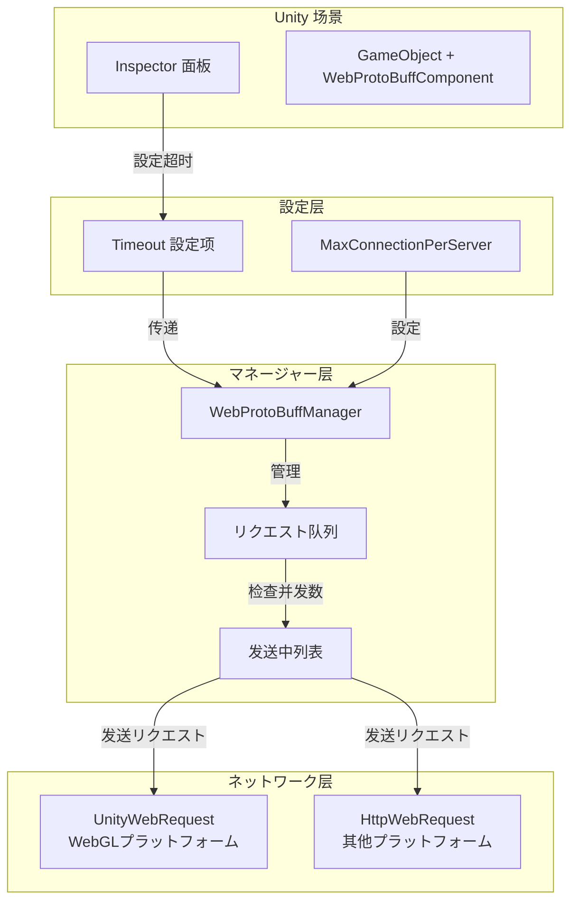

# コンポーネント

ドキュメント WebProtoBuffComponent コンポーネントのメソッド。

## 

WebProtoBuffComponent は GameFrameX フレームワーク Web リクエストのコアコンポーネント，サポート HTTP POST リクエスト Protocol Buffer 。コンポーネント GameFrameworkComponent， Unity コンポーネント，をじて WebProtoBuffManager のネットワークリクエスト。

コンポーネントクラス：
1. **** - をじてコードに
2. **エディター** - をじて Unity Inspector にエディター

## オプション

### Timeout（）

| プロパティ |  |
|------|------|
| タイプ | float |
| デフォルト | 5  |
|  | 0 - 120  |
|  | Inspector  / コード |

**：**
Timeout にネットワークリクエストの。リクエストた，リクエストすエラー。ネットワークリクエスト。

**に Inspector ：**

```csharp
// WebComponentInspector.cs 中の設定 UI
float timeout = EditorGUILayout.Slider("Timeout", m_Timeout.floatValue, 0f, 120f);
```
> Source: [WebComponentInspector.cs](https://github.com/GameFrameX/com.gameframex.unity.web.protobuff/blob/main/Editor/Inspector/WebComponentInspector.cs#L23)

**をじてコード：**

```csharp
// を通じてコンポーネントプロパティ設定超时时间
var webComponent = gameObject.GetComponent<WebProtoBuffComponent>();
webComponent.Timeout = 10f; // 設定为 10 秒
```
> Source: [WebProtoBuffComponent.cs](https://github.com/GameFrameX/com.gameframex.unity.web.protobuff/blob/main/Runtime/Web/WebProtoBuffComponent.cs#L67-L71)

**：**

```csharp
// WebProtoBuffManager.cs 中の超时設定
public float Timeout
{
    get { return m_Timeout; }
    set
    {
        m_Timeout = value;
        RequestTimeout = TimeSpan.FromSeconds(value);
    }
}
```
> Source: [WebProtoBuffManager.cs](https://github.com/GameFrameX/com.gameframex.unity.web.protobuff/blob/main/Runtime/Web/WebProtoBuffManager.cs#L41-L49)

### MaxConnectionPerServer（）

| プロパティ |  |
|------|------|
| タイプ | int |
| デフォルト | 8 |
|  | コード |

**：**
MaxConnectionPerServer にの。リクエストの，，リクエスト。

**：**

```csharp
// 构造函数中設定デフォルト值
public WebProtoBuffManager()
{
    MaxConnectionPerServer = 8;
    m_MemoryStream = new MemoryStream();
    Timeout = 5f;
}
```
> Source: [WebProtoBuffManager.cs](https://github.com/GameFrameX/com.gameframex.unity.web.protobuff/blob/main/Runtime/Web/WebProtoBuffManager.cs#L30-L36)

**：**

```csharp
// 更新处理 ProtoBuf リクエスト队列
void UpdateProtoBuf(float elapseSeconds, float realElapseSeconds)
{
    lock (m_StringBuilder)
    {
        if (m_SendingProtoBufList.Count < MaxConnectionPerServer)
        {
            if (m_WaitingProtoBufQueue.Count > 0)
            {
                var webProtoBufData = m_WaitingProtoBufQueue.Dequeue();
                MakeProtoBufBytesRequest(webProtoBufData);
                m_SendingProtoBufList.Add(webProtoBufData);
            }
        }
    }
}
```
> Source: [WebProtoBuffManager.ProtoBuf.cs](https://github.com/GameFrameX/com.gameframex.unity.web.protobuff/blob/main/Runtime/Web/WebProtoBuffManager.ProtoBuf.cs#L39-L55)

### Content-Type（タイプ）

| プロパティ |  |
|------|------|
| タイプ | string |
|  | application/x-protobuf |
|  | コード（） |

**：**
コンポーネントのタイプ `application/x-protobuf`  ProtoBuf 。は ProtoBuf のタイプ，にリクエスト Protocol Buffer 。

**：**

```csharp
// ProtoBuf 内容タイプ常量
private const string ProtoBufContentType = "application/x-protobuf";
```
> Source: [WebProtoBuffManager.ProtoBuf.cs](https://github.com/GameFrameX/com.gameframex.unity.web.protobuff/blob/main/Runtime/Web/WebProtoBuffManager.ProtoBuf.cs#L32)

## アーキテクチャ



## に Unity Editor 

### コンポーネント

1. に Unity  GameObject  GameObject
2. に Inspector  **Add Component** 
3.  "Web ProtoBuff" 
4. コンポーネントの GameFrameXWebProtoBuffCroppingHelper

### 

コンポーネント，に Inspector  Timeout ：

```csharp
// コンポーネント定义
[DisallowMultipleComponent]
[AddComponentMenu("GameFrameX/Web ProtoBuff")]
[UnityEngine.Scripting.Preserve]
[RequireComponent(typeof(GameFrameXWebProtoBuffCroppingHelper))]
public sealed class WebProtoBuffComponent : GameFrameworkComponent
```
> Source: [WebProtoBuffComponent.cs](https://github.com/GameFrameX/com.gameframex.unity.web.protobuff/blob/main/Runtime/Web/WebProtoBuffComponent.cs#L46-L49)

Inspector のに：

```csharp
public override void OnInspectorGUI()
{
    base.OnInspectorGUI();
    serializedObject.Update();

    WebProtoBuffComponent t = (WebProtoBuffComponent)target;
    float timeout = EditorGUILayout.Slider("Timeout", m_Timeout.floatValue, 0f, 120f);
    if (timeout != m_Timeout.floatValue)
    {
        if (EditorApplication.isPlaying)
        {
            t.Timeout = timeout;  // 実行时动态修改
        }
        else
        {
            m_Timeout.floatValue = timeout;  // エディター中修改
        }
    }
    // ...
}
```
> Source: [WebComponentInspector.cs](https://github.com/GameFrameX/com.gameframex.unity.web.protobuff/blob/main/Editor/Inspector/WebComponentInspector.cs#L17-L37)

## 

### をじてコード

```csharp
using GameFrameX.Web.ProtoBuff.Runtime;

// 获取コンポーネント实例
var webComponent = gameObject.GetComponent<WebProtoBuffComponent>();

// 設定超时时间（秒）
webComponent.Timeout = 15f;

// 获取当前超时設定
float currentTimeout = webComponent.Timeout;
Debug.Log($"当前超时时间: {currentTimeout} 秒");
```
> Source: [WebProtoBuffComponent.cs](https://github.com/GameFrameX/com.gameframex.unity.web.protobuff/blob/main/Runtime/Web/WebProtoBuffComponent.cs#L67-L71)

### をじて Manager 

```csharp
using GameFrameX.Web.ProtoBuff.Runtime;

// を通じてフレームワーク获取マネージャー
var manager = GameFrameworkEntry.GetModule<IWebProtoBuffManager>();

// 設定超时时间
manager.Timeout = 30f;

// 获取マネージャー实例
var webManager = manager as WebProtoBuffManager;

// 設定最大接続数
webManager.MaxConnectionPerServer = 16;
```
> Source: [WebProtoBuffManager.cs](https://github.com/GameFrameX/com.gameframex.unity.web.protobuff/blob/main/Runtime/Web/WebProtoBuffManager.cs#L41-L54)

## デフォルト

|  | タイプ | デフォルト |  |
|--------|------|--------|------|
| Timeout | float | 5f | リクエスト（） |
| MaxConnectionPerServer | int | 8 |  |
| RequestTimeout | TimeSpan | 5 | の |
| ContentType | string | application/x-protobuf | リクエストタイプ |

## 

### 1. 

- **（1-5）**：にのゲームリクエスト
- **（5-15）**：にゲームデータ
- **（15-30）**：にファイルデータリクエスト

### 2. 

- **（4-8）**：にネットワークの
- **（8-16）**：に
- **（16+）**：サポート，ネットワーク

### 3. 

コンポーネントサポートに：

```csharp
public class NetworkConfigManager
{
    private WebProtoBuffComponent _webComponent;
    
    // 根据ネットワーク状態动态调整超时
    public void AdjustTimeoutForNetworkCondition(bool isPoorNetwork)
    {
        if (_webComponent == null) return;
        
        // ネットワーク状况差时增加超时时间
        _webComponent.Timeout = isPoorNetwork ? 30f : 10f;
    }
}
```

## リンク

- [クイックスタート](../3-getting-started.quick-start)
- [](../3-getting-started.basic-example)
- [コンポーネントアーキテクチャ](../4-core-concepts.architecture)
- [API リファレンス - WebProtoBuffComponent](../5-api-reference.webprotobuffcomponent)
- [API リファレンス - IWebProtoBuffManager](../5-api-reference.iwebprotobuffmanager)
- [コンパイル](./6-configuration.compile-defines)
