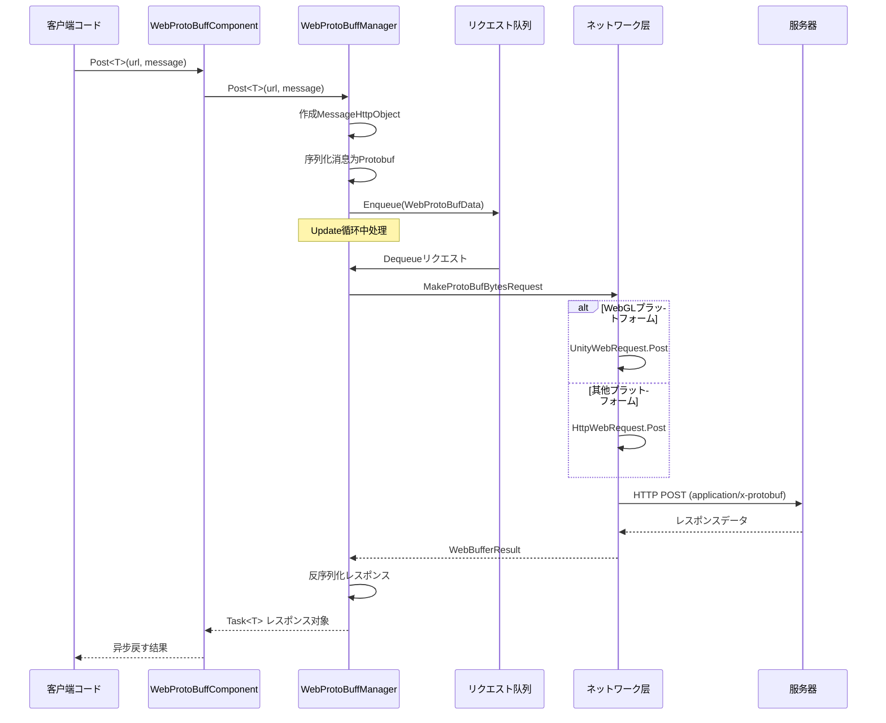

# IWebProtoBuffManager

WebProtoBuffManager インターフェースた Web リクエストの Protobuf ネットワーク， HTTP POST リクエストのとサポート。

## 

`IWebProtoBuffManager` は GameFrameX Web ProtoBuff モジュールのコアインターフェース，にづく Protocol Buffer の HTTP ネットワークリクエスト。インターフェース GameFramework のモジュール，たのネットワークリクエスト。

****：インターフェースたネットワークリクエストの，たのメソッドに Protobuf タイプのレスポンス。をじてたリクエストの，サポート WebGL とプラットフォームの。

## アーキテクチャ

```mermaid
graph TD
    subgraph Client["客户端层"]
        WebProtoBuffComponent["WebProtoBuffComponent<br/>コンポーネント包装器"]
    end

    subgraph Manager["管理层"]
        IWebProtoBuffManager["IWebProtoBuffManager<br/>インターフェース定义"]
        WebProtoBuffManager["WebProtoBuffManager<br///>实现クラス"]
    end

    subgraph Data["データ层"]
        MessageObject["MessageObject<br///>消息基クラス"]
        MessageHttpObject["MessageHttpObject<br/>HTTP消息封装"]
        WebProtoBufData["WebProtoBufData<br/>リクエストデータ"]
    end

    subgraph Network["ネットワーク层"]
        Queue["リクエスト队列<br/>m_WaitingProtoBufQueue"]
        SendingList["发送中列表<br/>m_SendingProtoBufList"]
        UnityWebRequest["UnityWebRequest<br/>WebGLプラットフォーム"]
        HttpWebRequest["HttpWebRequest<br/>其他プラットフォーム"]
    end

    WebProtoBuffComponent -->|呼び出し| IWebProtoBuffManager
    IWebProtoBuffManager <|--|实现| WebProtoBuffManager
    WebProtoBuffManager -->|序列化/反序列化| MessageObject
    WebProtoBuffManager -->|管理| WebProtoBufData
    WebProtoBuffManager -->|入队| Queue
    WebProtoBuffManager -->|发送| SendingList
    WebProtoBuffManager -->|プラットフォーム判断| UnityWebRequest
    WebProtoBuffManager -->|プラットフォーム判断| HttpWebRequest
```

### コンポーネント

| コンポーネント |  |  |
|------|------|------|
| WebProtoBuffComponent | コンポーネント | Unity コンポーネント， IWebProtoBuffManager の |
| IWebProtoBuffManager | インターフェース |  Protobuf ネットワークリクエストのコア API |
| WebProtoBuffManager | クラス | ，むとプラットフォーム |
| MessageObject | クラス |  Protobuf のタイプ |
| MessageHttpObject | HTTP  | む ID、UniqueId、Body の |

## コアフロー



### リクエストフロー

1. **リクエスト**：びし `Post<T>` メソッド， URL と
2. ****： `MessageHttpObject`，む ID との Body
3. ****：リクエスト， Update 
4. **ネットワーク**：プラットフォーム `UnityWebRequest`（WebGL） `HttpWebRequest`（プラットフォーム）
5. **レスポンス**：レスポンス，の Protobuf す

## インターフェース

### `Post<T>(string url, MessageObject message): Task<T>`

 Protobuf の POST リクエスト，タイプのレスポンス。

****：メソッドに `ENABLE_GAME_FRAME_X_WEB_PROTOBUF_NETWORK` 。

**パラメータ：**
- `url` (string): の URL 
- `message` (MessageObject): の Protobuf ， MessageObject

**パラメータ：**
- `T`: すのデータタイプ， MessageObject  IResponseMessage インターフェース

**す：** `Task<T>` - ，たむのレスポンスデータ

**コード：**

```csharp
// 来自 Runtime/Web/WebProtoBuffManager.ProtoBuf.cs#L178-L201
public async Task<T> Post<T>(string url, MessageObject message) where T : MessageObject, IResponseMessage
{
    DebugSendLog(message);
    var webBufferResult = await PostInner(url, message);
    if (webBufferResult.IsNotNull())
    {
        var messageObjectHttp = SerializerHelper.Deserialize<MessageHttpObject>(webBufferResult.Result);
        if (messageObjectHttp.IsNotNull() && messageObjectHttp.Id != default)
        {
            var messageType = ProtoMessageIdHandler.GetRespTypeById(messageObjectHttp.Id);
            if (messageType != typeof(T))
            {
                Log.Error($"Response message type is invalid. Expected '{typeof(T).FullName}', actual '{messageType.FullName}'.");
                return default;
            }

            var messageObject = SerializerHelper.Deserialize<T>(messageObjectHttp.Body);
            DebugReceiveLog(messageObject);
            return messageObject;
        }
    }

    return default;
}
```
> Source: [WebProtoBuffManager.ProtoBuf.cs](https://github.com/GameFrameX/com.gameframex.unity.web.protobuff/blob/main/Runtime/Web/WebProtoBuffManager.ProtoBuf.cs#L178-L201)

### `Timeout: float`

 POST リクエストの（：）。

**プロパティタイプ：** `float`

**デフォルト：** `5f` (5)

**：** リクエストの，の `RequestTimeout` プロパティの `TimeSpan` 。

**コード：**

```csharp
// 来自 Runtime/Web/WebProtoBuffManager.cs#L41-L49
public float Timeout
{
    get { return m_Timeout; }
    set
    {
        m_Timeout = value;
        RequestTimeout = TimeSpan.FromSeconds(value);
    }
}
```
> Source: [WebProtoBuffManager.cs](https://github.com/GameFrameX/com.gameframex.unity.web.protobuff/blob/main/Runtime/Web/WebProtoBuffManager.cs#L41-L49)

## プロパティリファレンス

| プロパティ | タイプ | デフォルト |  |
|------|------|--------|------|
| Timeout | float | 5f | リクエスト（） |
| MaxConnectionPerServer | int | 8 | の |
| RequestTimeout | TimeSpan | 5 | のリクエスト |

## 

### 

をじて WebProtoBuffComponent  Protobuf リクエスト：

```csharp
// 定义リクエスト消息
public class LoginRequest : MessageObject
{
    public string Username { get; set; }
    public string Password { get; set; }
}

// 定义レスポンス消息
public class LoginResponse : MessageObject, IResponseMessage
{
    public int ErrorCode { get; set; }
    public string Token { get; set; }
}

// 发送リクエスト
var webComponent = UnityEngine.GameObject.FindObjectOfType<WebProtoBuffComponent>();
var request = new LoginRequest { Username = "user", Password = "pass" };
LoginResponse response = await webComponent.Post<LoginResponse>("http://example.com/api/login", request);
```
> Source: [WebProtoBuffComponent.cs](https://github.com/GameFrameX/com.gameframex.unity.web.protobuff/blob/main/Runtime/Web/WebProtoBuffComponent.cs#L105-L108)

### 

```csharp
// 設定超时时间为 10 秒
var webComponent = UnityEngine.GameObject.FindObjectOfType<WebProtoBuffComponent>();
webComponent.Timeout = 10f;
```

### 

WebProtoBuffManager リクエスト，デフォルト 8：

```csharp
// を通じてマネージャー設定最大接続数
var manager = GameFrameworkEntry.GetModule<IWebProtoBuffManager>();
// MaxConnectionPerServer プロパティに实现クラス中可见
if (manager is WebProtoBuffManager webManager)
{
    webManager.MaxConnectionPerServer = 16;
}
```

## プラットフォーム

### WebGL プラットフォーム

に WebGL プラットフォーム， Unity の `UnityWebRequest` ネットワークリクエスト：

```csharp
// 来自 Runtime/Web/WebProtoBuffManager.ProtoBuf.cs#L87-L116
UnityEngine.Networking.UnityWebRequest unityWebRequest;
if (webData.IsGet)
{
    unityWebRequest = UnityEngine.Networking.UnityWebRequest.Get(webData.URL);
}
else
{
    unityWebRequest = UnityEngine.Networking.UnityWebRequest.Post(webData.URL, string.Empty);
}

unityWebRequest.timeout = (int)RequestTimeout.TotalSeconds;
unityWebRequest.SetRequestHeader("Content-Type", ProtoBufContentType);
byte[] postData = webData.SendData;
unityWebRequest.uploadHandler = new UnityEngine.Networking.UploadHandlerRaw(postData);
```
> Source: [WebProtoBuffManager.ProtoBuf.cs](https://github.com/GameFrameX/com.gameframex.unity.web.protobuff/blob/main/Runtime/Web/WebProtoBuffManager.ProtoBuf.cs#L87-L116)

### プラットフォーム

に WebGL プラットフォーム， .NET の `HttpWebRequest`：

```csharp
// 来自 Runtime/Web/WebProtoBuffManager.ProtoBuf.cs#L118-L164
HttpWebRequest request = WebRequest.CreateHttp(webData.URL);
request.Method = webData.IsGet ? WebRequestMethods.Http.Get : WebRequestMethods.Http.Post;
request.Timeout = (int)RequestTimeout.TotalMilliseconds;
request.ContentType = ProtoBufContentType;
byte[] postData = webData.SendData;
request.ContentLength = postData.Length;
using (Stream requestStream = request.GetRequestStream())
{
    await requestStream.WriteAsync(postData, 0, postData.Length);
}
```
> Source: [WebProtoBuffManager.ProtoBuf.cs](https://github.com/GameFrameX/com.gameframex.unity.web.protobuff/blob/main/Runtime/Web/WebProtoBuffManager.ProtoBuf.cs#L118-L164)

## コンパイル

 `Post<T>` メソッドコンパイル：

|  |  |
|--------|------|
| ENABLE_GAME_FRAME_X_WEB_PROTOBUF_NETWORK |  Protobuf ネットワーク |

に Unity の **Player Settings** → **Scripting Define Symbols** の Protobuf ネットワーク。

## リンク

- [WebProtoBuffComponent](./5-api-reference.webprotobuffcomponent) - Unity コンポーネント
- [コンポーネント](./6-configuration.component-config) - オプション
- [コンパイル](./6-configuration.compile-defines) - 
- [クイックスタート](./3-getting-started.quick-start) - クイックスタートガイド
