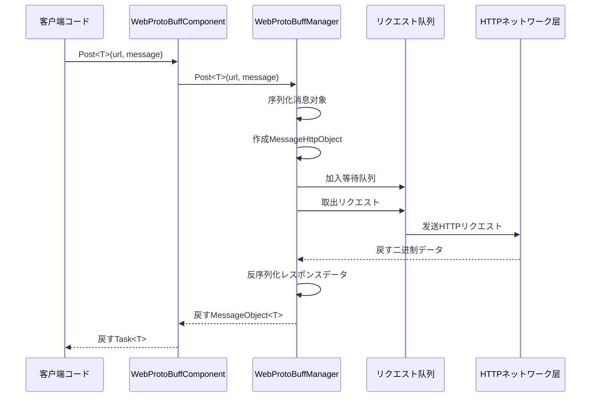
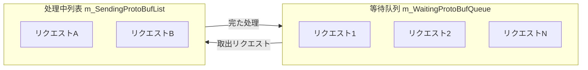

# WebProtoBuffComponent

WebProtoBuffComponent は GameFrameX フレームワークのネットワークリクエストコンポーネント，ににづく Protocol Buffer（ProtoBuf）の HTTP POST リクエスト。たの ProtoBuf と，サポートリクエストと。

## 

WebProtoBuffComponent  GameFrameworkComponent，は Unity Game Framework  ProtoBuf ネットワークのコアコンポーネント。コンポーネントた HTTP リクエストの，たの `Post<T>` メソッドに ProtoBuf のリクエストレスポンス。

**：**
-  ProtoBuf ネットワークリクエストの
- リクエストのとレスポンスの
- リクエスト
- リクエスト

**シーン：**
- と ProtoBuf のデータ
- /のネットワーク
- Unity WebGL プラットフォームのネットワークリクエスト

## アーキテクチャ

```mermaid
flowchart TD
    subgraph Client["客户端层"]
        GameObject[Unity GameObject]
    end

    subgraph Component["コンポーネント层"]
        WebProtoBuff[WebProtoBuffComponent]
    end

    subgraph Manager["管理层"]
        IWebProtoBuff[IWebProtoBuffManager]
        WebProtoBuffMgr[WebProtoBuffManager]
    end

    subgraph Data["データ层"]
        MessageObject[MessageObject]
        IResponse[IResponseMessage]
        WebProtoBufData[WebProtoBufData]
    end

    subgraph Network["ネットワーク层"]
        UnityWeb[UnityWebRequest<br/>WebGLプラットフォーム]
        HttpWeb[HttpWebRequest<br/>其他プラットフォーム]
    end

    GameObject --> WebProtoBuff
    WebProtoBuff --> IWebProtoBuff
    IWebProtoBuff <|.. WebProtoBuffMgr
    WebProtoBuffMgr --> MessageObject
    WebProtoBuffMgr --> IResponse
    WebProtoBuffMgr --> WebProtoBufData
    WebProtoBufData --> UnityWeb
    WebProtoBufData --> HttpWeb
```

**アーキテクチャ：**
- **コンポーネント（WebProtoBuffComponent）**：Unity コンポーネント，マネージャー API
- **（IWebProtoBuffManager/WebProtoBuffManager）**：リクエストの、/
- **データ**：リクエストとレスポンスのデータ
- **ネットワーク**：プラットフォームの HTTP リクエスト（WebGL  UnityWebRequest，プラットフォーム HttpWebRequest）

## コアフロー



**フロー：**
1. びし `Post<T>` メソッドリクエスト
2. コンポーネントリクエストマネージャー
3. マネージャー ProtoBuf 
4.  HTTP リクエスト
5. Update リクエスト
6. レスポンス
7. すタイプの

## API リファレンス

### プロパティ

#### `Timeout`

```csharp
public float Timeout { get; set; }
```

リクエスト（：）。リクエストた。

**デフォルト：** 5f

**：**
```csharp
var component = gameObject.GetComponent<WebProtoBuffComponent>();
component.Timeout = 10f; // 設定10秒超时
```

> Source: [WebProtoBuffComponent.cs](https://github.com/GameFrameX/com.gameframex.unity.web.protobuff/blob/main/Runtime/Web/WebProtoBuffComponent.cs#L67-L71)

---

### メソッド

#### `Post<T>`

```csharp
public Task<T> Post<T>(string url, GameFrameX.Network.Runtime.MessageObject message) 
    where T : GameFrameX.Network.Runtime.MessageObject, GameFrameX.Network.Runtime.IResponseMessage
```

 POST リクエスト，にと Protocol Buffer 。

**パラメータ：**
- `url` (string): の URL 
- `message` (MessageObject): の Protocol Buffer ， MessageObject

**す：** Task<T> - ，たむの ProtoBuf レスポンスデータ

**タイプパラメータ：**
- `T`: すのデータタイプ， MessageObject  IResponseMessage インターフェース

**：** に `ENABLE_GAME_FRAME_X_WEB_PROTOBUF_NETWORK` 

**：**
```csharp
// 定义リクエスト消息
[ProtoContract]
public class LoginRequest : MessageObject
{
    [ProtoMember(1)]
    public string Username { get; set; }
    
    [ProtoMember(2)]
    public string Password { get; set; }
}

// 定义レスポンス消息
[ProtoContract]
public class LoginResponse : MessageObject, IResponseMessage
{
    [ProtoMember(1)]
    public bool Success { get; set; }
    
    [ProtoMember(2)]
    public string Token { get; set; }
}

// 发送リクエスト
var request = new LoginRequest 
{ 
    Username = "user", 
    Password = "password" 
};

var response = await webComponent.Post<LoginResponse>("http://api.example.com/login", request);
if (response?.Success == true)
{
    Debug.Log($"登录成功，Token: {response.Token}");
}
```

> Source: [WebProtoBuffComponent.cs](https://github.com/GameFrameX/com.gameframex.unity.web.protobuff/blob/main/Runtime/Web/WebProtoBuffComponent.cs#L105-L108)

---

### メソッド

#### `Awake`

```csharp
protected override void Awake()
```

コンポーネントメソッド。にゲームオブジェクトロードびし，に Web マネージャー。

> Source: [WebProtoBuffComponent.cs](https://github.com/GameFrameX/com.gameframex.unity.web.protobuff/blob/main/Runtime/Web/WebProtoBuffComponent.cs#L77-L90)

---

## 

### リクエスト

WebProtoBuffManager リクエスト：



- **m_WaitingProtoBufQueue**: のリクエスト（ 256）
- **m_SendingProtoBufList**: にのリクエスト（ 16）

**：**
```csharp
// 当处理中リクエスト数小于最大接続数时，从等待队列取出リクエスト
if (m_SendingProtoBufList.Count < MaxConnectionPerServer)
{
    if (m_WaitingProtoBufQueue.Count > 0)
    {
        var webProtoBufData = m_WaitingProtoBufQueue.Dequeue();
        MakeProtoBufBytesRequest(webProtoBufData);
        m_SendingProtoBufList.Add(webProtoBufData);
    }
}
```

> Source: [WebProtoBuffManager.ProtoBuf.cs](https://github.com/GameFrameX/com.gameframex.unity.web.protobuff/blob/main/Runtime/Web/WebProtoBuffManager.ProtoBuf.cs#L39-L55)

### プラットフォーム

コンポーネントプラットフォームの HTTP ：

| プラットフォーム | HTTP  |  |
|------|-----------|------|
| WebGL | UnityWebRequest | ， Unity の API |
| プラットフォーム | HttpWebRequest | の .NET HttpWebRequest サポート |

**WebGL ：**
```csharp
#if UNITY_WEBGL
UnityEngine.Networking.UnityWebRequest unityWebRequest = UnityEngine.Networking.UnityWebRequest.Post(url, string.Empty);
unityWebRequest.timeout = (int)RequestTimeout.TotalSeconds;
unityWebRequest.SetRequestHeader("Content-Type", ProtoBufContentType);
byte[] postData = webData.SendData;
unityWebRequest.uploadHandler = new UnityEngine.Networking.UploadHandlerRaw(postData);
```

> Source: [WebProtoBuffManager.ProtoBuf.cs](https://github.com/GameFrameX/com.gameframex.unity.web.protobuff/blob/main/Runtime/Web/WebProtoBuffManager.ProtoBuf.cs#L87-L116)

### ProtoBuf フロー

1.  MessageObject
2. をじて ProtoMessageIdHandler  ID
3.  MessageHttpObject （む ID、UniqueId、Body）
4.  SerializerHelper 
5.  HTTP リクエスト

**レスポンス：**
1. すのデータ
2.  MessageHttpObject
3.  ID とタイプ
4.  Body タイプ T

> Source: [WebProtoBuffManager.ProtoBuf.cs](https://github.com/GameFrameX/com.gameframex.unity.web.protobuff/blob/main/Runtime/Web/WebProtoBuffManager.ProtoBuf.cs#L178-L201)

---

## リンク

- [IWebProtoBuffManager](./5-api-reference.iwebprotobuffmanager) - Web ProtoBuff マネージャーインターフェース
- [コンポーネント](./6-configuration.component-config) - WebProtoBuffComponent 
- [コンパイル](./6-configuration.compile-defines) - ENABLE_GAME_FRAME_X_WEB_PROTOBUF_NETWORK 
- [プラットフォーム](./7-platforms.platform-info) - プラットフォームサポート
- [クイックスタート](./3-getting-started.quick-start) - クイックスタート
