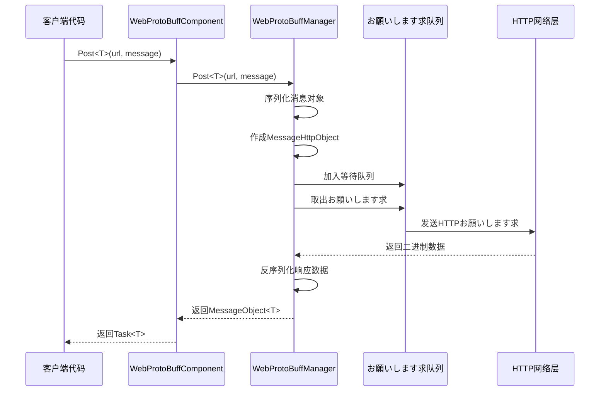
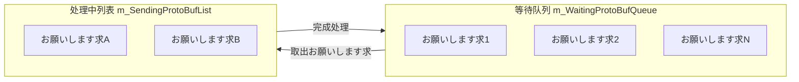

# WebProtoBuffComponent

WebProtoBuffComponent 是 GameFrameX フレームワーク的网络お願いします求コンポーネント，专门に使用处理基づく Protocol Buffer（ProtoBuf）的 HTTP POST お願いします求。它提供します完整的 ProtoBuf 消息序列化与反序列化機能，サポート异步お願いします求处理和超时控制。

## 概要

WebProtoBuffComponent を継承 GameFrameworkComponent，是 Unity Game Framework 中处理 ProtoBuf 网络通信的コアコンポーネント。该コンポーネント封装了 HTTP お願いします求的底层実装，提供します简洁的 `Post<T>` メソッドに使用发送 ProtoBuf 格式的お願いします求并接收响应。

**主要职责：**
- 管理 ProtoBuf 网络お願いします求的生命周期
- 处理お願いします求消息的序列化和响应消息的反序列化
- 提供异步お願いします求处理能力
- 控制お願いします求超时时间

**使用シーン：**
- 与后端服务器进行 ProtoBuf 格式的数据交互
- 必要高效序列化/反序列化的网络通信
- Unity WebGL 平台的网络お願いします求

## 架构

```mermaid
flowchart TD
    subgraph Client["客户端层"]
        GameObject[Unity GameObject]
    end

    subgraph Component["コンポーネント层"]
        WebProtoBuff[WebProtoBuffComponent]
    end

    subgraph Manager["管理层"]
        IWebProtoBuff[IWebProtoBuffManager]
        WebProtoBuffMgr[WebProtoBuffManager]
    end

    subgraph Data["数据层"]
        MessageObject[MessageObject]
        IResponse[IResponseMessage]
        WebProtoBufData[WebProtoBufData]
    end

    subgraph Network["网络层"]
        UnityWeb[UnityWebRequest<br/>WebGL平台]
        HttpWeb[HttpWebRequest<br/>其他平台]
    end

    GameObject --> WebProtoBuff
    WebProtoBuff --> IWebProtoBuff
    IWebProtoBuff <|.. WebProtoBuffMgr
    WebProtoBuffMgr --> MessageObject
    WebProtoBuffMgr --> IResponse
    WebProtoBuffMgr --> WebProtoBufData
    WebProtoBufData --> UnityWeb
    WebProtoBufData --> HttpWeb
```

**架构説明：**
- **コンポーネント层（WebProtoBuffComponent）**：Unity コンポーネント，负责初期化管理器并暴露公共 API
- **管理层（IWebProtoBuffManager/WebProtoBuffManager）**：実装お願いします求的队列管理、序列化/反序列化处理
- **数据层**：定义お願いします求和响应的数据结构
- **网络层**：に基づいて平台选择不同的 HTTP お願いします求実装（WebGL 使用 UnityWebRequest，其他平台使用 HttpWebRequest）

## コアフロー



**フロー説明：**
1. 客户端呼び出し `Post<T>` メソッド发起お願いします求
2. コンポーネント将お願いします求传递给管理器
3. 管理器将消息对象序列化为 ProtoBuf 格式
4. 作成 HTTP 包装对象并加入お願いします求队列
5. Update 循环从队列中取出お願いします求并发送
6. 接收响应后进行反序列化
7. 返回泛型クラス型的消息对象

## API 参考

### プロパティ

#### `Timeout`

```csharp
public float Timeout { get; set; }
```

取得或設定お願いします求超时时间（单位：秒）。当お願いします求超过此时间未完成时会自动终止。

**默认值：** 5f

**示例：**
```csharp
var component = gameObject.GetComponent<WebProtoBuffComponent>();
component.Timeout = 10f; // 設定10秒超时
```

> Source: [WebProtoBuffComponent.cs](https://github.com/GameFrameX/com.gameframex.unity.web.protobuff/blob/main/Runtime/Web/WebProtoBuffComponent.cs#L67-L71)

---

### メソッド

#### `Post<T>`

```csharp
public Task<T> Post<T>(string url, GameFrameX.Network.Runtime.MessageObject message) 
    where T : GameFrameX.Network.Runtime.MessageObject, GameFrameX.Network.Runtime.IResponseMessage
```

发送 POST お願いします求，に使用发送和接收 Protocol Buffer 消息。

**参数：**
- `url` (string): 目标服务器的 URL 地址
- `message` (MessageObject): 要发送的 Protocol Buffer 消息对象，必須を継承 MessageObject

**返回：** Task<T> - 异步任务，完成时包含从服务器接收到的 ProtoBuf 响应数据

**クラス型参数：**
- `T`: 返回的数据クラス型，必須を継承 MessageObject 并且実装 IResponseMessage インターフェース

**使用条件：** 仅在启用 `ENABLE_GAME_FRAME_X_WEB_PROTOBUF_NETWORK` 宏定义时可用

**示例：**
```csharp
// 定义お願いします求消息
[ProtoContract]
public class LoginRequest : MessageObject
{
    [ProtoMember(1)]
    public string Username { get; set; }
    
    [ProtoMember(2)]
    public string Password { get; set; }
}

// 定义响应消息
[ProtoContract]
public class LoginResponse : MessageObject, IResponseMessage
{
    [ProtoMember(1)]
    public bool Success { get; set; }
    
    [ProtoMember(2)]
    public string Token { get; set; }
}

// 发送お願いします求
var request = new LoginRequest 
{ 
    Username = "user", 
    Password = "password" 
};

var response = await webComponent.Post<LoginResponse>("http://api.example.com/login", request);
if (response?.Success == true)
{
    Debug.Log($"登录成功，Token: {response.Token}");
}
```

> Source: [WebProtoBuffComponent.cs](https://github.com/GameFrameX/com.gameframex.unity.web.protobuff/blob/main/Runtime/Web/WebProtoBuffComponent.cs#L105-L108)

---

### 内部メソッド

#### `Awake`

```csharp
protected override void Awake()
```

コンポーネント初期化メソッド。在ゲーム对象加载时呼び出し，に使用初期化 Web 管理器并設定超时时间。

> Source: [WebProtoBuffComponent.cs](https://github.com/GameFrameX/com.gameframex.unity.web.protobuff/blob/main/Runtime/Web/WebProtoBuffComponent.cs#L77-L90)

---

## 内部実装详解

### お願いします求队列管理

WebProtoBuffManager 使用两个队列管理お願いします求：



- **m_WaitingProtoBufQueue**: 存储等待处理的お願いします求（初始容量 256）
- **m_SendingProtoBufList**: 存储正在处理的お願いします求（初始容量 16）

**处理逻辑：**
```csharp
// 当处理中お願いします求数小于最大连接数时，从等待队列取出お願いします求
if (m_SendingProtoBufList.Count < MaxConnectionPerServer)
{
    if (m_WaitingProtoBufQueue.Count > 0)
    {
        var webProtoBufData = m_WaitingProtoBufQueue.Dequeue();
        MakeProtoBufBytesRequest(webProtoBufData);
        m_SendingProtoBufList.Add(webProtoBufData);
    }
}
```

> Source: [WebProtoBuffManager.ProtoBuf.cs](https://github.com/GameFrameX/com.gameframex.unity.web.protobuff/blob/main/Runtime/Web/WebProtoBuffManager.ProtoBuf.cs#L39-L55)

### 平台差异化处理

コンポーネントに基づいて不同平台使用不同的 HTTP 実装：

| 平台 | HTTP 実装 | 特点 |
|------|-----------|------|
| WebGL | UnityWebRequest | 浏览器安全限制，使用 Unity 的异步 API |
| 其他平台 | HttpWebRequest | 完整的 .NET HttpWebRequest サポート |

**WebGL 実装：**
```csharp
#if UNITY_WEBGL
UnityEngine.Networking.UnityWebRequest unityWebRequest = UnityEngine.Networking.UnityWebRequest.Post(url, string.Empty);
unityWebRequest.timeout = (int)RequestTimeout.TotalSeconds;
unityWebRequest.SetRequestHeader("Content-Type", ProtoBufContentType);
byte[] postData = webData.SendData;
unityWebRequest.uploadHandler = new UnityEngine.Networking.UploadHandlerRaw(postData);
```

> Source: [WebProtoBuffManager.ProtoBuf.cs](https://github.com/GameFrameX/com.gameframex.unity.web.protobuff/blob/main/Runtime/Web/WebProtoBuffManager.ProtoBuf.cs#L87-L116)

### ProtoBuf 序列化フロー

1. 客户端传入 MessageObject
2. を通じて ProtoMessageIdHandler 取得消息 ID
3. 作成 MessageHttpObject 包装对象（包含 ID、UniqueId、Body）
4. 使用 SerializerHelper 序列化整个对象为字节数组
5. 发送 HTTP お願いします求

**响应处理：**
1. 接收服务器返回的二进制数据
2. 反序列化为 MessageHttpObject
3. 验证消息 ID 与预期クラス型匹配
4. 反序列化 Body 为目标クラス型 T

> Source: [WebProtoBuffManager.ProtoBuf.cs](https://github.com/GameFrameX/com.gameframex.unity.web.protobuff/blob/main/Runtime/Web/WebProtoBuffManager.ProtoBuf.cs#L178-L201)

---

## 関連リンク

- [IWebProtoBuffManager](./5-api-reference.iwebprotobuffmanager) - Web ProtoBuff 管理器インターフェース
- [コンポーネント配置](./6-configuration.component-config) - WebProtoBuffComponent 配置説明
- [编译宏定义](./6-configuration.compile-defines) - ENABLE_GAME_FRAME_X_WEB_PROTOBUF_NETWORK 宏定义説明
- [平台説明](./7-platforms.platform-info) - 平台サポート説明
- [快速入门](./3-getting-started.quick-start) - 快速开始使用
