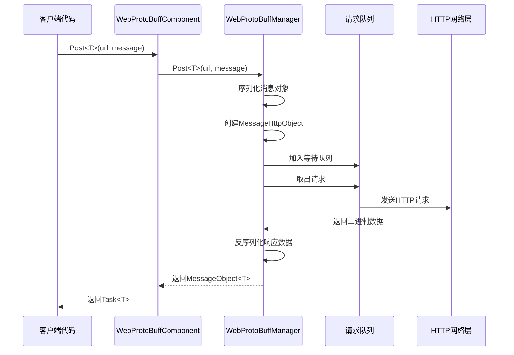
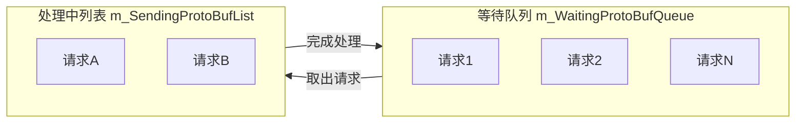

# WebProtoBuffComponent

WebProtoBuffComponent 是 GameFrameX フレームワーク的网络请求コンポーネント，专门用于処理基于 Protocol Buffer（ProtoBuf）的 HTTP POST 请求。它提供します完全な的 ProtoBuf メッセージシリアライズ与反シリアライズ機能，サポート异步请求処理和超时控制。

## 概要

WebProtoBuffComponent 継承自 GameFrameworkComponent，是 Unity Game Framework 中処理 ProtoBuf 网络通信的コアコンポーネント。该コンポーネントカプセル化了 HTTP 请求的底层実装，提供しますシンプル的 `Post<T>` メソッド用于发送 ProtoBuf フォーマット的请求并受信响应。

**主な职责：**
- 管理 ProtoBuf 网络请求的ライフサイクル
- 処理请求メッセージ的シリアライズ和响应メッセージ的反シリアライズ
- 提供异步请求処理能力
- 控制请求超时时间

**使用シーン：**
- 与后端服务器进行 ProtoBuf フォーマット的数据交互
- 〜する必要があります効率的シリアライズ/反シリアライズ的网络通信
- Unity WebGL プラットフォーム的网络请求

## アーキテクチャ

```mermaid
flowchart TD
    subgraph Client["客户端层"]
        GameObject[Unity GameObject]
    end

    subgraph Component["组件层"]
        WebProtoBuff[WebProtoBuffComponent]
    end

    subgraph Manager["管理层"]
        IWebProtoBuff[IWebProtoBuffManager]
        WebProtoBuffMgr[WebProtoBuffManager]
    end

    subgraph Data["数据层"]
        MessageObject[MessageObject]
        IResponse[IResponseMessage]
        WebProtoBufData[WebProtoBufData]
    end

    subgraph Network["网络层"]
        UnityWeb[UnityWebRequest<br/>WebGL平台]
        HttpWeb[HttpWebRequest<br/>其他平台]
    end

    GameObject --> WebProtoBuff
    WebProtoBuff --> IWebProtoBuff
    IWebProtoBuff <|.. WebProtoBuffMgr
    WebProtoBuffMgr --> MessageObject
    WebProtoBuffMgr --> IResponse
    WebProtoBuffMgr --> WebProtoBufData
    WebProtoBufData --> UnityWeb
    WebProtoBufData --> HttpWeb
```

**アーキテクチャ説明：**
- **コンポーネント層（WebProtoBuffComponent）**：Unity コンポーネント，负责初期化マネージャー并暴露公共 API
- **管理层（IWebProtoBuffManager/WebProtoBuffManager）**：実装请求的队列管理、シリアライズ/反シリアライズ処理
- **数据层**：定義请求和响应的数据结构
- **网络层**：根据プラットフォーム选择不同的 HTTP 请求実装（WebGL 使用 UnityWebRequest，其他プラットフォーム使用 HttpWebRequest）

## コアフロー



**フロー説明：**
1. 客户端呼び出し `Post<T>` メソッド发起请求
2. コンポーネント将请求传递给マネージャー
3. マネージャー将メッセージ对象シリアライズ为 ProtoBuf フォーマット
4. 作成 HTTP パッケージ装对象并加入请求队列
5. Update 循环从队列中取出请求并发送
6. 受信响应后进行反シリアライズ
7. 返すジェネリックタイプ的メッセージ对象

## API リファレンス

### プロパティ

#### `Timeout`

```csharp
public float Timeout { get; set; }
```

取得或設定请求超时时间（单位：秒）。当请求超过此时间未完成时会自动终止。

**デフォルト值：** 5f

**例：**
```csharp
var component = gameObject.GetComponent<WebProtoBuffComponent>();
component.Timeout = 10f; // 设置10秒超时
```

> Source: [WebProtoBuffComponent.cs](https://github.com/GameFrameX/com.gameframex.unity.web.protobuff/blob/main/Runtime/Web/WebProtoBuffComponent.cs#L67-L71)

---

### メソッド

#### `Post<T>`

```csharp
public Task<T> Post<T>(string url, GameFrameX.Network.Runtime.MessageObject message) 
    where T : GameFrameX.Network.Runtime.MessageObject, GameFrameX.Network.Runtime.IResponseMessage
```

发送 POST 请求，用于发送和受信 Protocol Buffer メッセージ。

**パラメータ：**
- `url` (string): 目标服务器的 URL 地址
- `message` (MessageObject): 要发送的 Protocol Buffer メッセージ对象，〜しなければなりません継承自 MessageObject

**返す：** Task<T> - 异步任务，完成时パッケージ含从服务器受信到的 ProtoBuf 响应数据

**タイプパラメータ：**
- `T`: 返す的数据タイプ，〜しなければなりません継承自 MessageObject かつ実装 IResponseMessage インターフェース

**使用条件：** 仅在启用 `ENABLE_GAME_FRAME_X_WEB_PROTOBUF_NETWORK` 宏定義时可用

**例：**
```csharp
// 定义请求消息
[ProtoContract]
public class LoginRequest : MessageObject
{
    [ProtoMember(1)]
    public string Username { get; set; }
    
    [ProtoMember(2)]
    public string Password { get; set; }
}

// 定义响应消息
[ProtoContract]
public class LoginResponse : MessageObject, IResponseMessage
{
    [ProtoMember(1)]
    public bool Success { get; set; }
    
    [ProtoMember(2)]
    public string Token { get; set; }
}

// 发送请求
var request = new LoginRequest 
{ 
    Username = "user", 
    Password = "password" 
};

var response = await webComponent.Post<LoginResponse>("http://api.example.com/login", request);
if (response?.Success == true)
{
    Debug.Log($"登录成功，Token: {response.Token}");
}
```

> Source: [WebProtoBuffComponent.cs](https://github.com/GameFrameX/com.gameframex.unity.web.protobuff/blob/main/Runtime/Web/WebProtoBuffComponent.cs#L105-L108)

---

### 内部メソッド

#### `Awake`

```csharp
protected override void Awake()
```

コンポーネント初期化メソッド。在游戏对象ロード时呼び出し，用于初期化 Web マネージャー并設定超时时间。

> Source: [WebProtoBuffComponent.cs](https://github.com/GameFrameX/com.gameframex.unity.web.protobuff/blob/main/Runtime/Web/WebProtoBuffComponent.cs#L77-L90)

---

## 内部実装详解

### 请求队列管理

WebProtoBuffManager 使用两个队列管理请求：



- **m_WaitingProtoBufQueue**: 存储等待処理的请求（初始容量 256）
- **m_SendingProtoBufList**: 存储〜中処理的请求（初始容量 16）

**処理逻辑：**
```csharp
// 当处理中请求数小于最大连接数时，从等待队列取出请求
if (m_SendingProtoBufList.Count < MaxConnectionPerServer)
{
    if (m_WaitingProtoBufQueue.Count > 0)
    {
        var webProtoBufData = m_WaitingProtoBufQueue.Dequeue();
        MakeProtoBufBytesRequest(webProtoBufData);
        m_SendingProtoBufList.Add(webProtoBufData);
    }
}
```

> Source: [WebProtoBuffManager.ProtoBuf.cs](https://github.com/GameFrameX/com.gameframex.unity.web.protobuff/blob/main/Runtime/Web/WebProtoBuffManager.ProtoBuf.cs#L39-L55)

### プラットフォーム差异化処理

コンポーネント根据不同プラットフォーム使用不同的 HTTP 実装：

| プラットフォーム | HTTP 実装 | 特点 |
|------|-----------|------|
| WebGL | UnityWebRequest | 浏览器安全限制，使用 Unity 的异步 API |
| 其他プラットフォーム | HttpWebRequest | 完全な的 .NET HttpWebRequest サポート |

**WebGL 実装：**
```csharp
#if UNITY_WEBGL
UnityEngine.Networking.UnityWebRequest unityWebRequest = UnityEngine.Networking.UnityWebRequest.Post(url, string.Empty);
unityWebRequest.timeout = (int)RequestTimeout.TotalSeconds;
unityWebRequest.SetRequestHeader("Content-Type", ProtoBufContentType);
byte[] postData = webData.SendData;
unityWebRequest.uploadHandler = new UnityEngine.Networking.UploadHandlerRaw(postData);
```

> Source: [WebProtoBuffManager.ProtoBuf.cs](https://github.com/GameFrameX/com.gameframex.unity.web.protobuff/blob/main/Runtime/Web/WebProtoBuffManager.ProtoBuf.cs#L87-L116)

### ProtoBuf シリアライズフロー

1. 客户端传入 MessageObject
2. 通过 ProtoMessageIdHandler 取得メッセージ ID
3. 作成 MessageHttpObject パッケージ装对象（パッケージ含 ID、UniqueId、Body）
4. 使用 SerializerHelper シリアライズ整个对象为字节数组
5. 发送 HTTP 请求

**响应処理：**
1. 受信服务器返す的二进制数据
2. 反シリアライズ为 MessageHttpObject
3. 検証メッセージ ID 与预期タイプ匹配
4. 反シリアライズ Body 为目标タイプ T

> Source: [WebProtoBuffManager.ProtoBuf.cs](https://github.com/GameFrameX/com.gameframex.unity.web.protobuff/blob/main/Runtime/Web/WebProtoBuffManager.ProtoBuf.cs#L178-L201)

---

## 関連リンク

- [IWebProtoBuffManager](./5-api-reference.iwebprotobuffmanager) - Web ProtoBuff マネージャーインターフェース
- [コンポーネント設定](./6-configuration.component-config) - WebProtoBuffComponent 設定説明
- [コンパイル宏定義](./6-configuration.compile-defines) - ENABLE_GAME_FRAME_X_WEB_PROTOBUF_NETWORK 宏定義説明
- [プラットフォーム説明](./7-platforms.platform-info) - プラットフォームサポート説明
- [快速入门](./3-getting-started.quick-start) - 快速开始使用
