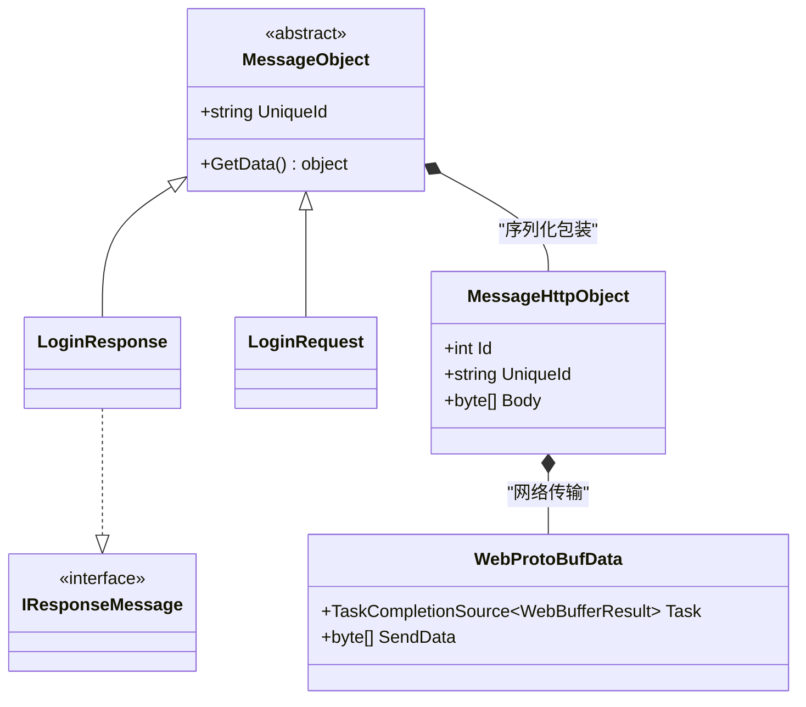
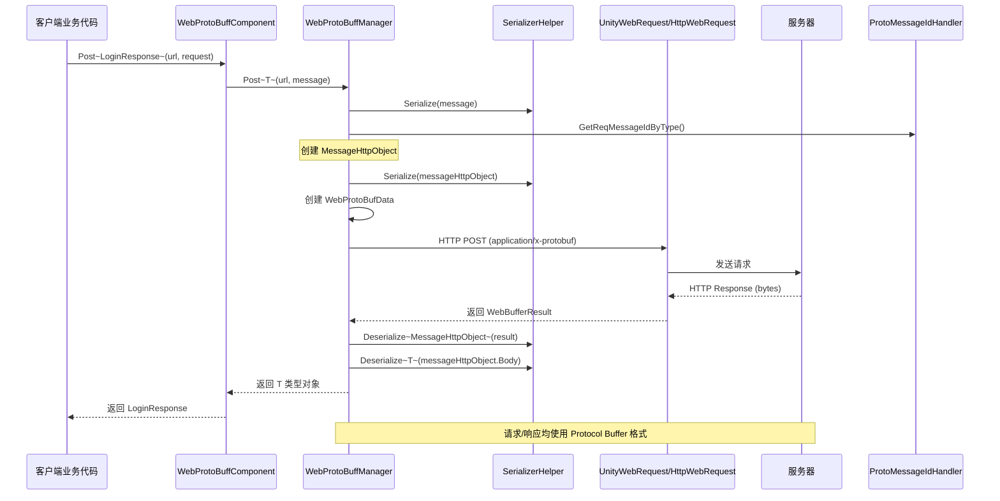

# メッセージ定義

このドキュメント介绍 GameFrameX Web ProtoBuff プラグイン中的メッセージ定義机制，含みますメッセージ基底クラス、HTTP メッセージパッケージ装器および Protocol Buffer メッセージ的结构定義。

## 概要

Web ProtoBuff プラグイン基于 **protobuf-net** 库実装 Protocol Buffer メッセージ的シリアライズ和反シリアライズ。メッセージ系统采用分层設計：

- **基本层**：`MessageObject` - 所有メッセージ的基底クラス
- **传输层**：`MessageHttpObject` - HTTP 传输的メッセージパッケージ装器
- **应用层**：ユーザー自定義的业务メッセージ类

这种設計実装了业务逻辑与网络传输的解耦，使得開発者〜できます专注于业务メッセージ的定義，而无需关心底层的网络通信细节。

## メッセージアーキテクチャ



### コアコンポーネント説明

| コンポーネント | 名前空間 | 説明 |
|------|----------|------|
| `MessageObject` | GameFrameX.Network.Runtime | 所有 ProtoBuf メッセージ的抽象基底クラス |
| `IResponseMessage` | GameFrameX.Network.Runtime | 响应メッセージインターフェース，标识メッセージタイプ为响应 |
| `MessageHttpObject` | GameFrameX.Network.Runtime | HTTP 传输パッケージ装器，パッケージ含メッセージ ID 和メッセージ体 |
| `WebProtoBufData` | GameFrameX.Web.ProtoBuff.Runtime | 内部请求数据类，管理请求队列 |

## メッセージシリアライズフロー



### フロー説明

1. **メッセージ作成**：客户端作成継承自 `MessageObject` 的请求メッセージ对象
2. **メッセージパッケージ装**：将业务メッセージシリアライズ为字节数组，并パッケージ装到 `MessageHttpObject` 中
3. **メッセージ ID**：通过 `ProtoMessageIdHandler` 取得メッセージタイプ对应的唯一 ID
4. **网络传输**：使用 HTTP POST メソッド，Content-Type 設定为 `application/x-protobuf`
5. **响应処理**：服务器返す的数据先反シリアライズ为 `MessageHttpObject`，再从中提取业务响应メッセージ

## メッセージ定義例

### 定義请求メッセージ

请求メッセージ〜する必要があります継承自 `MessageObject` 基底クラス，并使用 `ProtoContract` 和 `ProtoMember` 特性标记：

```csharp
using ProtoBuf;
using GameFrameX.Network.Runtime;

[ProtoContract]
public class LoginRequest : MessageObject
{
    [ProtoMember(1)]
    public string Username { get; set; }
    
    [ProtoMember(2)]
    public string Password { get; set; }
    
    [ProtoMember(3)]
    public string DeviceId { get; set; }
}
```
> Source: [README.md](https://github.com/GameFrameX/com.gameframex.unity.web.protobuff/blob/main/README.md#L66-L77)

### 定義响应メッセージ

响应メッセージ除了継承 `MessageObject` 外，还〜する必要があります実装 `IResponseMessage` インターフェース：

```csharp
using ProtoBuf;
using GameFrameX.Network.Runtime;

[ProtoMember(1)]
public bool Success { get; set; }

[ProtoMember(2)]
public string Token { get; set; }

[ProtoMember(3)]
public string Message { get; set; }
}
```
> Source: [README.md](https://github.com/GameFrameX/com.gameframex.unity.web.protobuff/blob/main/README.md#L79-L88)

### 完全な使用例

```csharp
using UnityEngine;
using GameFrameX.Web.ProtoBuff.Runtime;

public class LoginController : MonoBehaviour
{
    public WebProtoBuffComponent WebComponent;

    private async void Start()
    {
        var request = new LoginRequest 
        { 
            Username = "user", 
            Password = "password" 
        };
        
        string url = "http://api.example.com/login";

        try
        {
            // 发送请求并等待结果
            LoginResponse response = await WebComponent.Post<LoginResponse>(url, request);
            
            if (response != null)
            {
                Debug.Log($"Login Result: {response.Success}, Token: {response.Token}");
            }
        }
        catch (System.Exception e)
        {
            Debug.LogError($"Request Failed: {e.Message}");
        }
    }
}
```
> Source: [README.md](https://github.com/GameFrameX/com.gameframex.unity.web.protobuff/blob/main/README.md#L98-L127)

## ProtoBuf 特性説明

### 常用特性

| 特性 | 作用 | 注意事项 |
|------|------|----------|
| `[ProtoContract]` | 标记类为 ProtoBuf シリアライズ目标 | 〜しなければなりません追加在类声明上方 |
| `[ProtoMember(n)]` | 标记プロパティ为シリアライズ成员，n 为フィールド编号 | 编号〜しなければなりません唯一，お勧め从 1 开始连续编号 |
| `[ProtoIgnore]` | 标记プロパティ不参与シリアライズ | 用于不〜する必要があります网络传输的プロパティ |

### メッセージ設計原则

1. **フィールド编号唯一性**：每个 `[ProtoMember]` 的编号〜しなければなりません在类内唯一
2. **编号连续性**：お勧め使用从 1 开始的连续编号，便于拡張
3. **タイプ兼容性**：フィールドタイプ变更后〜する必要があります保持向后兼容
4. **命名规范**：使用 PascalCase 命名プロパティ，ProtoBuf 会自动转换

## HTTP メッセージパッケージ装

`MessageHttpObject` 是用于 HTTP 传输的メッセージパッケージ装类，其结构如下：

```csharp
public class MessageHttpObject
{
    /// <summary>
    /// 消息类型 ID，用于标识消息种类
    /// </summary>
    public int Id { get; set; }
    
    /// <summary>
    /// 消息唯一标识，用于请求/响应配对
    /// </summary>
    public string UniqueId { get; set; }
    
    /// <summary>
    /// 消息体字节数组，包含实际业务数据
    /// </summary>
    public byte[] Body { get; set; }
}
```

在发送请求时，プラグイン执行以下シリアライズステップ：

```csharp
// 来自 WebProtoBuffManager.ProtoBuf.cs
var id = ProtoMessageIdHandler.GetReqMessageIdByType(message.GetType());
MessageHttpObject messageHttpObject = new MessageHttpObject
{
    Id = id,
    UniqueId = message.UniqueId,
    Body = SerializerHelper.Serialize(message),
};
var sendData = SerializerHelper.Serialize(messageHttpObject);
```
> Source: [Runtime/Web/WebProtoBuffManager.ProtoBuf.cs#L214-L221](https://github.com/GameFrameX/com.gameframex.unity.web.protobuff/blob/main/Runtime/Web/WebProtoBuffManager.ProtoBuf.cs#L214-L221)

## 関連リンク

- [コンポーネントアーキテクチャ](./4-core-concepts.architecture) - 理解する WebProtoBuffComponent 的アーキテクチャ設計
- [快速入门](./3-getting-started.quick-start) - 开始使用 Web ProtoBuff コンポーネント
- [API リファレンス - WebProtoBuffComponent](./5-api-reference.webprotobuffcomponent) - コンポーネント完全な API ドキュメント
- [API リファレンス - IWebProtoBuffManager](./5-api-reference.iwebprotobuffmanager) - マネージャーインターフェースドキュメント
- [コンパイル宏定義](./6-configuration.compile-defines) - 如何启用 ProtoBuf 网络機能
