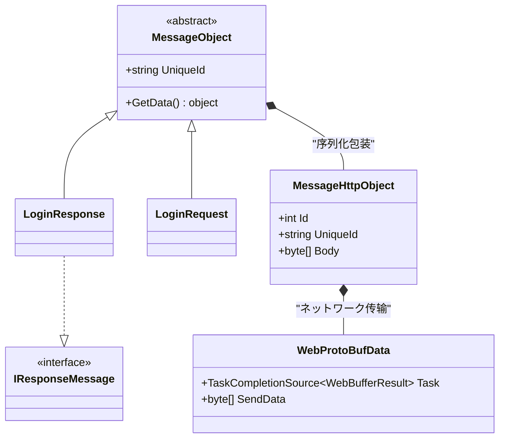
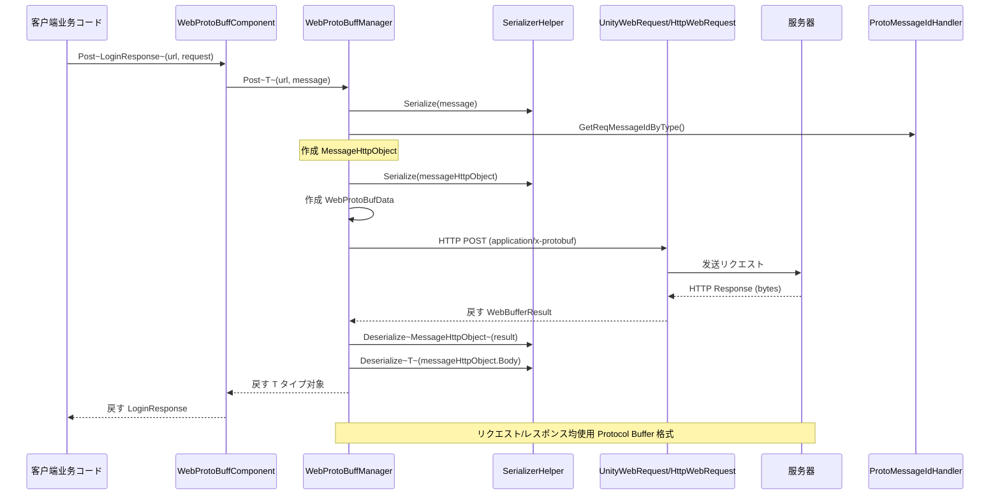

# 

ドキュメント GameFrameX Web ProtoBuff の，クラス、HTTP  Protocol Buffer の。

## 

Web ProtoBuff にづく **protobuf-net**  Protocol Buffer のと。：

- ****：`MessageObject` - のクラス
- ****：`MessageHttpObject` - HTTP の
- ****：カスタマイズのクラス

たとネットワークの，の，のネットワーク。

## アーキテクチャ



### コアコンポーネント

| コンポーネント |  |  |
|------|----------|------|
| `MessageObject` | GameFrameX.Network.Runtime |  ProtoBuf のクラス |
| `IResponseMessage` | GameFrameX.Network.Runtime | レスポンスインターフェース，タイプレスポンス |
| `MessageHttpObject` | GameFrameX.Network.Runtime | HTTP ，む ID と |
| `WebProtoBufData` | GameFrameX.Web.ProtoBuff.Runtime | リクエストデータクラス，リクエスト |

## フロー



### フロー

1. ****： `MessageObject` のリクエスト
2. ****：， `MessageHttpObject` 
3. ** ID**：をじて `ProtoMessageIdHandler` タイプの ID
4. **ネットワーク**： HTTP POST メソッド，Content-Type  `application/x-protobuf`
5. **レスポンス**：すのデータ `MessageHttpObject`，レスポンス

## 

### リクエスト

リクエスト `MessageObject` クラス， `ProtoContract` と `ProtoMember` ：

```csharp
using ProtoBuf;
using GameFrameX.Network.Runtime;

[ProtoContract]
public class LoginRequest : MessageObject
{
    [ProtoMember(1)]
    public string Username { get; set; }
    
    [ProtoMember(2)]
    public string Password { get; set; }
    
    [ProtoMember(3)]
    public string DeviceId { get; set; }
}
```
> Source: [README.md](https://github.com/GameFrameX/com.gameframex.unity.web.protobuff/blob/main/README.md#L66-L77)

### レスポンス

レスポンスた `MessageObject` ， `IResponseMessage` インターフェース：

```csharp
using ProtoBuf;
using GameFrameX.Network.Runtime;

[ProtoMember(1)]
public bool Success { get; set; }

[ProtoMember(2)]
public string Token { get; set; }

[ProtoMember(3)]
public string Message { get; set; }
}
```
> Source: [README.md](https://github.com/GameFrameX/com.gameframex.unity.web.protobuff/blob/main/README.md#L79-L88)

### 

```csharp
using UnityEngine;
using GameFrameX.Web.ProtoBuff.Runtime;

public class LoginController : MonoBehaviour
{
    public WebProtoBuffComponent WebComponent;

    private async void Start()
    {
        var request = new LoginRequest 
        { 
            Username = "user", 
            Password = "password" 
        };
        
        string url = "http://api.example.com/login";

        try
        {
            // 发送リクエスト并等待结果
            LoginResponse response = await WebComponent.Post<LoginResponse>(url, request);
            
            if (response != null)
            {
                Debug.Log($"Login Result: {response.Success}, Token: {response.Token}");
            }
        }
        catch (System.Exception e)
        {
            Debug.LogError($"Request Failed: {e.Message}");
        }
    }
}
```
> Source: [README.md](https://github.com/GameFrameX/com.gameframex.unity.web.protobuff/blob/main/README.md#L98-L127)

## ProtoBuf 

### 

|  |  |  |
|------|------|----------|
| `[ProtoContract]` | クラス ProtoBuf  | にクラス |
| `[ProtoMember(n)]` | プロパティ，n  | ， 1  |
| `[ProtoIgnore]` | プロパティと | にネットワークのプロパティ |

### 

1. ****： `[ProtoMember]` のにクラス
2. ****： 1 の，
3. **タイプ**：タイプ
4. ****： PascalCase プロパティ，ProtoBuf 

## HTTP 

`MessageHttpObject` はに HTTP のクラス，：

```csharp
public class MessageHttpObject
{
    /// <summary>
    /// 消息タイプ ID，に使用标识消息种クラス
    /// </summary>
    public int Id { get; set; }
    
    /// <summary>
    /// 消息唯一标识，に使用リクエスト/レスポンス配对
    /// </summary>
    public string UniqueId { get; set; }
    
    /// <summary>
    /// 消息体字节数组，含む实际业务データ
    /// </summary>
    public byte[] Body { get; set; }
}
```

にリクエスト，ステップ：

```csharp
// 来自 WebProtoBuffManager.ProtoBuf.cs
var id = ProtoMessageIdHandler.GetReqMessageIdByType(message.GetType());
MessageHttpObject messageHttpObject = new MessageHttpObject
{
    Id = id,
    UniqueId = message.UniqueId,
    Body = SerializerHelper.Serialize(message),
};
var sendData = SerializerHelper.Serialize(messageHttpObject);
```
> Source: [Runtime/Web/WebProtoBuffManager.ProtoBuf.cs#L214-L221](https://github.com/GameFrameX/com.gameframex.unity.web.protobuff/blob/main/Runtime/Web/WebProtoBuffManager.ProtoBuf.cs#L214-L221)

## リンク

- [コンポーネントアーキテクチャ](./4-core-concepts.architecture) - た WebProtoBuffComponent のアーキテクチャ
- [クイックスタート](./3-getting-started.quick-start) -  Web ProtoBuff コンポーネント
- [API リファレンス - WebProtoBuffComponent](./5-api-reference.webprotobuffcomponent) - コンポーネント API ドキュメント
- [API リファレンス - IWebProtoBuffManager](./5-api-reference.iwebprotobuffmanager) - マネージャーインターフェースドキュメント
- [コンパイル](./6-configuration.compile-defines) -  ProtoBuf ネットワーク
