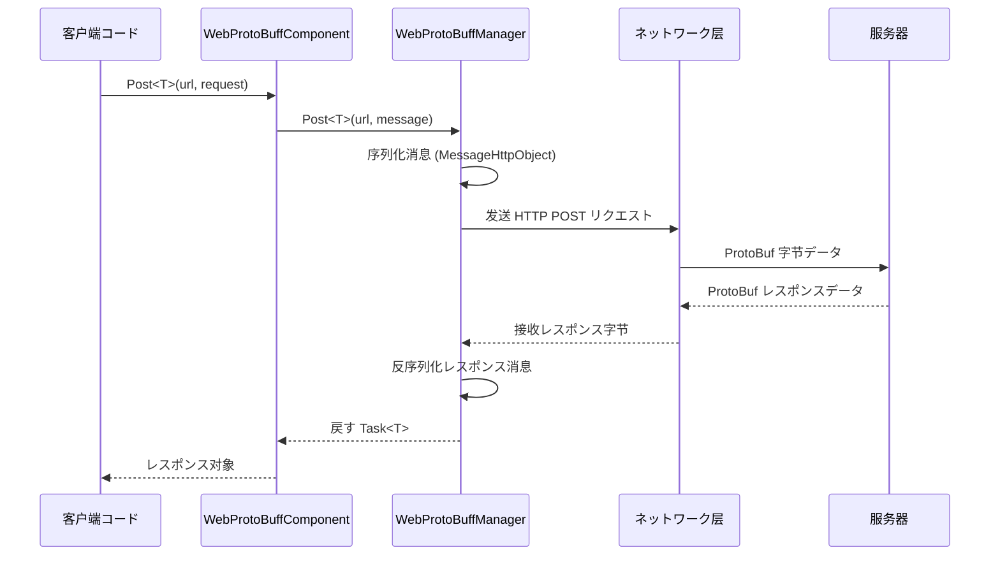

# 

 Web ProtoBuff の，コア。

## 

Web ProtoBuff コンポーネントはにづく GameFrameX フレームワークのネットワークリクエストモジュール，ににづく Protocol Buffer の HTTP POST リクエスト。コンポーネントコア：

- **ProtoBuf **：データ
- **リクエスト**：にづく Task<T> の API，サポート async/await 
- **プラットフォームサポート**： Unity WebGL プラットフォーム
- ****：リクエスト

## フロー

フローチャートた WebProtoBuffComponent リクエストのフロー：



## 

に Web ProtoBuff ，リクエストとレスポンスの ProtoBuf タイプ。

### リクエスト

```csharp
using ProtoBuf;
using GameFrameX.Network.Runtime;

[ProtoContract]
public class LoginRequest : MessageObject
{
    [ProtoMember(1)]
    public string Username { get; set; }
    
    [ProtoMember(2)]
    public string Password { get; set; }
}
```
> Source: [README.md](https://github.com/GameFrameX/com.gameframex.unity.web.protobuff/blob/main/README.md#L65-L77)

### レスポンス

```csharp
using ProtoBuf;
using GameFrameX.Network.Runtime;

[ProtoContract]
public class LoginResponse : MessageObject, IResponseMessage
{
    [ProtoMember(1)]
    public bool Success { get; set; }
    
    [ProtoMember(2)]
    public string Token { get; set; }
}
```
> Source: [README.md](https://github.com/GameFrameX/com.gameframex.unity.web.protobuff/blob/main/README.md#L79-L88)

**：**
-  `[ProtoContract]` プロパティクラス ProtoBuf 
-  `[ProtoMember(N)]` プロパティのプロパティ
- リクエスト `MessageObject`
- レスポンス `MessageObject`  `IResponseMessage` インターフェース

## リクエスト

### 

はに Unity  WebProtoBuffComponent リクエストの：

```csharp
using UnityEngine;
using GameFrameX.Web.ProtoBuff.Runtime;

public class LoginController : MonoBehaviour
{
    public WebProtoBuffComponent WebComponent;

    private async void Start()
    {
        var request = new LoginRequest 
        { 
            Username = "user", 
            Password = "password" 
        };
        
        string url = "http://api.example.com/login";

        try
        {
            // 发送リクエスト并等待结果
            LoginResponse response = await WebComponent.Post<LoginResponse>(url, request);
            
            if (response != null)
            {
                Debug.Log($"Login Result: {response.Success}, Token: {response.Token}");
            }
        }
        catch (System.Exception e)
        {
            Debug.LogError($"Request Failed: {e.Message}");
        }
    }
}
```
> Source: [README.md](https://github.com/GameFrameX/com.gameframex.unity.web.protobuff/blob/main/README.md#L94-L128)

### コンポーネント

に Unity ，WebProtoBuffComponent ゲームフレームワークコンポーネント。をじて：

```csharp
// 方式1：を通じて场景中のコンポーネント引用（必要に Inspector 中設定）
public WebProtoBuffComponent webProtoBuffComponent;

// 方式2：を通じてフレームワーク获取
var webComponent = UnityGameFramework.Runtime.GameEntry.GetComponent<WebProtoBuffComponent>();
```

### 

をじてコンポーネントの Timeout プロパティリクエスト（：）：

```csharp
// 設定超时为 10 秒
webProtoBuffComponent.Timeout = 10f;
```
> Source: [WebProtoBuffComponent.cs](https://github.com/GameFrameX/com.gameframex.unity.web.protobuff/blob/main/Runtime/Web/WebProtoBuffComponent.cs#L67-L71)

## 

### コンパイル

 ProtoBuff ネットワークに Unity コンパイル。 **Edit > Project Settings > Player**，に **Scripting Define Symbols** ：

```
ENABLE_GAME_FRAME_X_WEB_PROTOBUF_NETWORK
```

> ****：はオプションの。，Post<T> メソッド，コンポーネント。

をじてファイル，プロジェクト `com.gameframex.unity.network` 。

## データ

### リクエストデータ

のリクエストデータ `MessageHttpObject` ：

```csharp
MessageHttpObject messageHttpObject = new MessageHttpObject
{
    Id = messageId,           // 消息タイプ标识
    UniqueId = uniqueId,      // 唯一リクエスト标识
    Body = serializedBody    // 序列化后の消息体
};
```
> Source: [WebProtoBuffManager.ProtoBuf.cs](https://github.com/GameFrameX/com.gameframex.unity.web.protobuff/blob/main/Runtime/Web/WebProtoBuffManager.ProtoBuf.cs#L214-L221)

### HTTP リクエスト

- **Content-Type**: `application/x-protobuf`
- **リクエストメソッド**: POST
- ****: をじて RequestTimeout プロパティ

## エラー

に，エラー：

```csharp
try
{
    var response = await WebComponent.Post<LoginResponse>(url, request);
    
    if (response == null)
    {
        Debug.LogWarning("Response is null - server may be unreachable");
        return;
    }
    
    // 处理业务逻辑
}
catch (TimeoutException e)
{
    Debug.LogError($"Request timeout: {e.Message}");
}
catch (WebException e)
{
    Debug.LogError($"Network error: {e.Status} - {e.Message}");
}
catch (System.Exception e)
{
    Debug.LogError($"Unexpected error: {e.Message}");
}
```

## デバッグログ

サポートとのデバッグログ，デバッグ：

- **ログ**： `ENABLE_GAMEFRAMEX_WEB_SEND_LOG` 
- **ログ**： `ENABLE_GAMEFRAMEX_WEB_RECEIVE_LOG` 

ログ：
```
发送消息 ID:[1001,uuid123,LoginRequest] 消息内容:{...}
接收消息 ID:[1001,uuid123,LoginResponse] 消息内容:{...}
```
> Source: [WebProtoBuffManager.ProtoBuf.cs](https://github.com/GameFrameX/com.gameframex.unity.web.protobuff/blob/main/Runtime/Web/WebProtoBuffManager.ProtoBuf.cs#L227-L241)

## リンク

- [クイックスタート](../3-getting-started.quick-start) - たクイックスタートステップ
- [コンポーネントアーキテクチャ](../4-core-concepts.architecture) - たアーキテクチャ
- [](../4-core-concepts.message-definition) - ProtoBuf 
- [API リファレンス - WebProtoBuffComponent](../5-api-reference.webprotobuffcomponent) -  API ドキュメント
- [コンパイル](../6-configuration.compile-defines) - コンパイルオプション
